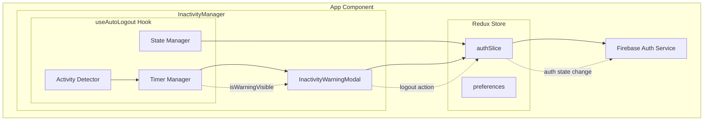
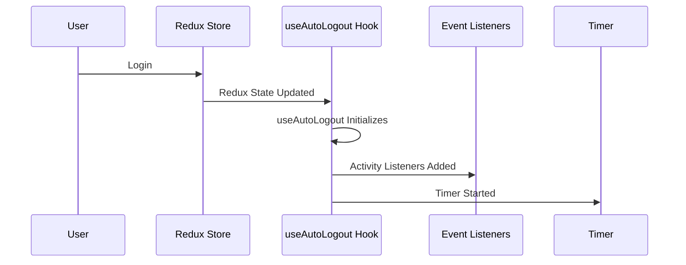
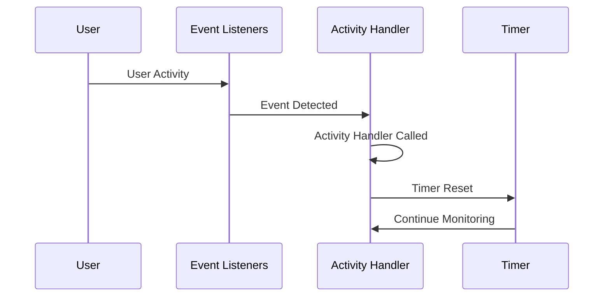
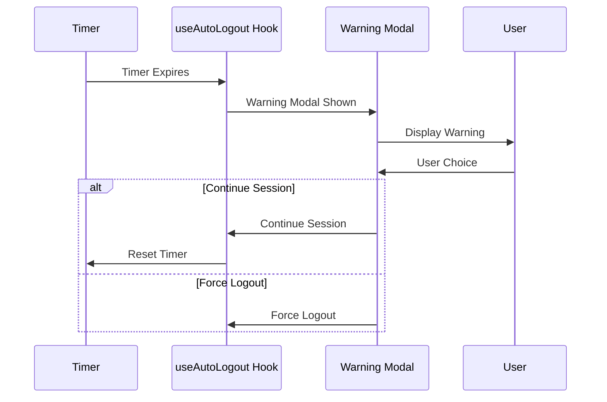
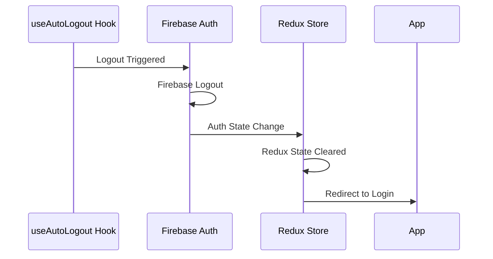
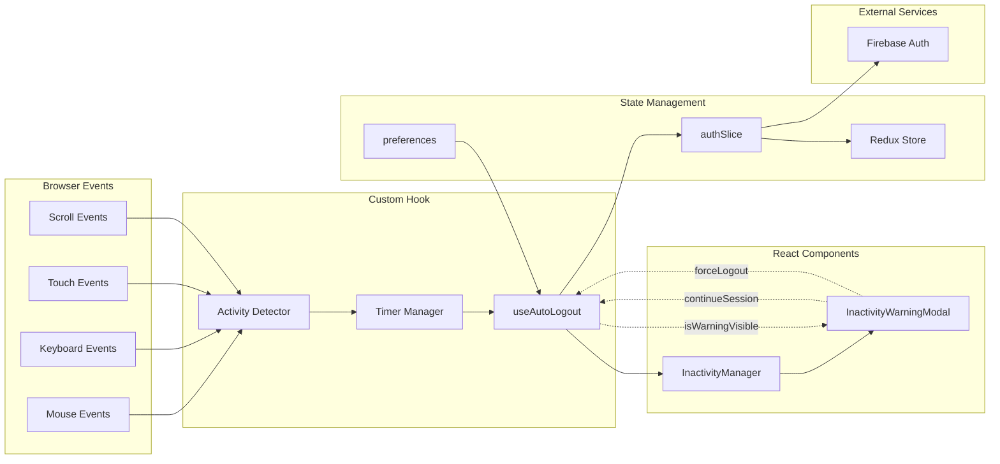
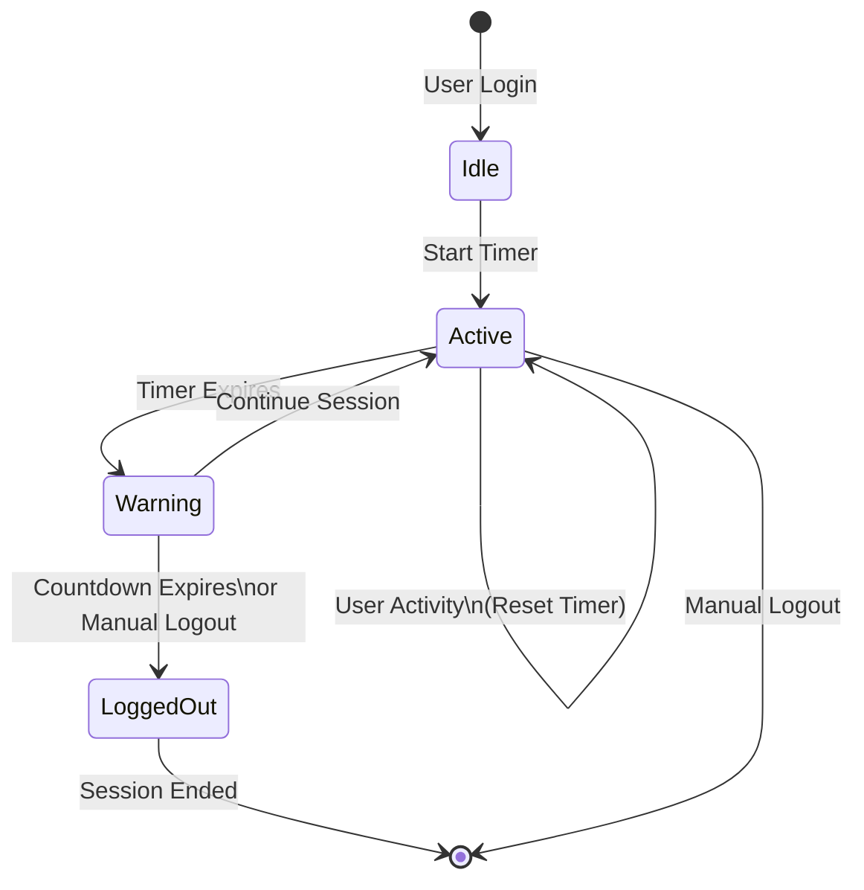
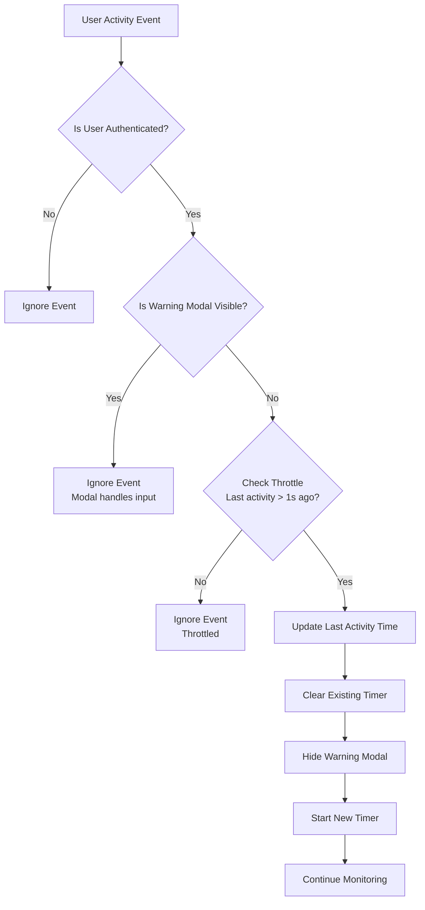

# Auto Logout System Design - React Password Manager

## Table of Contents

1. [System Overview](#system-overview)
2. [Architecture Components](#architecture-components)
3. [Data Flow](#data-flow)
4. [Component Breakdown](#component-breakdown)
5. [State Management](#state-management)
6. [Timer Management Strategy](#timer-management-strategy)
7. [Activity Detection](#activity-detection)
8. [Security Considerations](#security-considerations)
9. [Performance Optimization](#performance-optimization)
10. [Edge Cases & Error Handling](#edge-cases--error-handling)
11. [Implementation Walkthrough](#implementation-walkthrough)
12. [Testing Strategy](#testing-strategy)

---

## System Overview

The auto logout functionality is a security feature that automatically logs out users after a period of inactivity. This prevents unauthorized access to sensitive password data when users leave their devices unattended.

### Key Requirements

- **Security**: Automatically logout inactive users to protect sensitive data
- **User Experience**: Provide warning before logout with option to continue session
- **Configurability**: Allow users to set custom timeout values
- **Reliability**: Handle edge cases like tab switching, network issues, and browser events
- **Performance**: Minimal impact on application performance

### High-Level Architecture



---

## Architecture Components

### 1. Core Hook: `useAutoLogout`

**Responsibility**: Central logic for inactivity detection and timer management

### 2. UI Component: `InactivityWarningModal`

**Responsibility**: User interface for warning dialog and countdown

### 3. Manager Component: `InactivityManager`

**Responsibility**: Integration layer between hook and UI

### 4. State Management: Redux `authSlice`

**Responsibility**: User authentication state and preferences

### 5. External Service: Firebase Auth

**Responsibility**: User session management and logout operations

---

## Data Flow

### 1. Initialization Flow



### 2. Activity Detection Flow



### 3. Warning Flow



### 4. Logout Flow



---

## Component Breakdown

### Component Interaction Overview



### useAutoLogout Hook

#### Purpose

Central hook that manages all auto-logout logic including:

- Timer management
- Activity detection
- Warning state management
- Integration with Redux store

#### Key Features

- **Single Timer Strategy**: Uses one timer for simplicity and reliability
- **Activity Throttling**: Prevents excessive timer resets (1-second throttle)
- **State-Aware**: Respects authentication status and warning visibility
- **Event Cleanup**: Proper cleanup of event listeners and timers

#### API

```typescript
interface UseAutoLogoutReturn {
  isWarningVisible: boolean; // Whether warning modal should be shown
  continueSession: () => void; // Function to reset timer and continue
  forceLogout: () => void; // Function to immediately logout
}
```

#### Internal State

```typescript
- inactivityTimerRef: Timer reference for cleanup
- lastActivityRef: Timestamp of last detected activity
- isWarningVisible: Local state for modal visibility
```

### InactivityWarningModal Component

#### Purpose

UI component that displays the warning dialog with countdown timer

#### Features

- **Independent Countdown**: Manages its own 30-second countdown
- **Auto-logout**: Automatically calls logout when countdown reaches zero
- **Accessible UI**: Screen reader friendly with proper ARIA labels
- **Keyboard Support**: ESC key support for continuing session

#### Props Interface

```typescript
interface InactivityWarningModalProps {
  isOpen: boolean; // Control modal visibility
  onContinueSession: () => void; // Callback to continue session
  onLogout: () => void; // Callback to force logout
}
```

### InactivityManager Component

#### Purpose

Integration component that connects the hook with the UI

#### Responsibilities

- Instantiates the `useAutoLogout` hook
- Passes hook state to the modal component
- Provides clean separation of concerns

---

## State Management

### Redux authSlice Structure

```typescript
interface AuthState {
  user: UserProfile | null;
  isAuthenticated: boolean;
  preferences: {
    autoLockTimeout: number; // Timeout in minutes
    // ... other preferences
  };
  // ... other auth fields
}
```

### Key Selectors

- `selectIsAuthenticated`: Used to determine if auto-logout should be active
- `selectPreferences`: Used to get timeout configuration

### Key Actions

- `logout`: Clears user state and triggers app-wide logout
- `updateAutoLockTimeout`: Updates timeout preference

---

## Timer Management Strategy

### Single Timer Approach

Instead of multiple nested timers, the system uses a single timer strategy:

```typescript
// Single timer for main inactivity detection
inactivityTimerRef.current = setTimeout(() => {
  showWarningDialog();
}, inactivityTimeoutMs - warningTimeoutMs);
```

#### Benefits

- **Simplicity**: Easier to debug and maintain
- **Reliability**: Fewer race conditions
- **Performance**: Lower resource usage

#### Timer Lifecycle



1. **Start**: When user logs in or activity is detected
2. **Reset**: On user activity (with throttling)
3. **Expire**: Shows warning dialog
4. **Clear**: On logout or component unmount

### Activity Detection

#### Activity Detection Flow



#### Monitored Events

```typescript
const activityEvents = [
  "mousedown",
  "mousemove",
  "keypress",
  "scroll",
  "touchstart",
  "click",
];
```

#### Activity Throttling

```typescript
// Prevent excessive timer resets
if (now - lastActivityRef.current > 1000) {
  resetInactivityTimer();
}
```

#### Activity Disabling

Activity detection is disabled when warning modal is visible to prevent accidental timer resets.

---

## Security Considerations

### Logout Process

1. **Clear Timers**: Stop all running timers
2. **Firebase Logout**: Sign out from Firebase Auth
3. **Redux Cleanup**: Clear user state
4. **Local Storage**: Clear sensitive data (vault keys, etc.)

### Session Security

- **Automatic Cleanup**: All timers are cleared on logout
- **Memory Safety**: Event listeners are properly removed
- **State Isolation**: No sensitive data persists after logout

### Attack Prevention

- **Timing Attacks**: Consistent timing for all operations
- **Memory Leaks**: Proper cleanup prevents information disclosure
- **Session Fixation**: Complete session reset on logout

---

## Performance Optimization

### Event Listener Optimization

```typescript
// Use passive listeners for better scroll performance
document.addEventListener(event, handleActivity, { passive: true });
```

### Memory Management

- **Ref-based Timers**: Use refs to avoid stale closures
- **Conditional Listeners**: Only add listeners when authenticated
- **Proper Cleanup**: Remove listeners in useEffect cleanup

### Throttling Strategy

- **Activity Throttling**: 1-second minimum between timer resets
- **State Checks**: Early returns for irrelevant states
- **Conditional Rendering**: Modal only renders when needed

---

## Edge Cases & Error Handling

### Browser Tab Management

```typescript
// Handle tab visibility changes
const handleVisibilityChange = () => {
  if (!document.hidden && isAuthenticated && !isWarningVisible) {
    resetInactivityTimer();
  }
};
```

### Preference Updates

```typescript
// Restart timer when timeout preference changes
useEffect(() => {
  if (isAuthenticated && !isWarningVisible) {
    resetInactivityTimer();
  }
}, [preferences.autoLockTimeout]);
```

### Error Recovery

- **Fallback Logout**: Modal has its own countdown as backup
- **State Validation**: Check authentication status before operations
- **Graceful Degradation**: System works even if some features fail

### Network Issues

- **Offline Behavior**: Timer continues running offline
- **Reconnection**: No special handling needed (Firebase handles this)
- **Timeout Errors**: Logout proceeds regardless of network state

---

## Implementation Walkthrough

### Step 1: Hook Initialization

```typescript
export const useAutoLogout = (): UseAutoLogoutReturn => {
  const dispatch = useDispatch();
  const preferences = useSelector(selectPreferences);
  const isAuthenticated = useSelector(selectIsAuthenticated);

  // Initialize state and refs
  const [isWarningVisible, setIsWarningVisible] = useState(false);
  const inactivityTimerRef = useRef<number | null>(null);
  const lastActivityRef = useRef<number>(Date.now());
};
```

### Step 2: Timer Management Functions

```typescript
// Clear timer utility
const clearInactivityTimer = useCallback(() => {
  if (inactivityTimerRef.current) {
    clearTimeout(inactivityTimerRef.current);
    inactivityTimerRef.current = null;
  }
}, []);

// Reset timer on activity
const resetInactivityTimer = useCallback(() => {
  if (!isAuthenticated) return;

  lastActivityRef.current = Date.now();
  clearInactivityTimer();
  setIsWarningVisible(false);

  // Set main timer
  inactivityTimerRef.current = setTimeout(() => {
    showWarningDialog();
  }, inactivityTimeoutMs - warningTimeoutMs);
}, [isAuthenticated, inactivityTimeoutMs, warningTimeoutMs]);
```

### Step 3: Activity Detection Setup

```typescript
useEffect(() => {
  if (!isAuthenticated || isWarningVisible) return;

  const activityEvents = [
    "mousedown",
    "mousemove",
    "keypress",
    "scroll",
    "touchstart",
    "click",
  ];

  activityEvents.forEach((event) => {
    document.addEventListener(event, handleActivity, { passive: true });
  });

  resetInactivityTimer();

  return () => {
    activityEvents.forEach((event) => {
      document.removeEventListener(event, handleActivity);
    });
    clearInactivityTimer();
  };
}, [isAuthenticated, isWarningVisible, handleActivity, resetInactivityTimer]);
```

### Step 4: Warning Modal Integration

```typescript
const InactivityManager: React.FC = () => {
  const { isWarningVisible, continueSession, forceLogout } = useAutoLogout();

  return (
    <InactivityWarningModal
      isOpen={isWarningVisible}
      onContinueSession={continueSession}
      onLogout={forceLogout}
    />
  );
};
```

### Step 5: App Integration

```typescript
function App() {
  return (
    <Provider store={store}>
      <Router>
        <Routes>{/* Your app routes */}</Routes>
        <InactivityManager />
      </Router>
    </Provider>
  );
}
```

---

## Testing Strategy

### Unit Tests

- **Hook Logic**: Test timer management and state changes
- **Component Rendering**: Test modal display and interactions
- **Event Handling**: Test activity detection and callbacks

### Integration Tests

- **User Flows**: Test complete login → inactivity → warning → logout flow
- **Cross-Component**: Test activity detection across different pages
- **State Management**: Test Redux integration

### End-to-End Tests

- **Real Browser**: Test actual timing and user interactions
- **Multiple Tabs**: Test tab switching behavior
- **Mobile Devices**: Test touch events and mobile-specific behaviors

### Performance Tests

- **Memory Leaks**: Monitor memory usage over time
- **Event Listener**: Verify proper cleanup
- **Timer Accuracy**: Test timing precision

---

## Configuration & Customization

### Default Settings

```typescript
const defaultPreferences = {
  autoLockTimeout: 1, // 1 minute
  warningTimeout: 30, // 30 seconds
};
```

### Customization Options

- **Timeout Duration**: Configurable from 0.1 to 1440 minutes
- **Warning Period**: Fixed at 30 seconds for consistency
- **Activity Events**: Easily extensible event list
- **UI Styling**: Customizable modal appearance

### Environment Considerations

- **Development**: Longer timeouts for testing
- **Production**: Security-focused shorter timeouts
- **Mobile**: Touch-optimized event detection

---

## Future Enhancements

### Potential Improvements

1. **Smart Detection**: Distinguish between meaningful activity and mouse jitter
2. **Progressive Warnings**: Multiple warning stages (e.g., 5 min, 1 min, 30 sec)
3. **Activity Analytics**: Track user activity patterns
4. **Background Sync**: Sync timeout settings across devices
5. **Biometric Re-auth**: Option to re-authenticate instead of full logout

### Scalability Considerations

- **Multiple Windows**: Coordinate timers across browser windows
- **Server-side Validation**: Validate session timeout on backend
- **Real-time Updates**: WebSocket-based activity coordination

---
