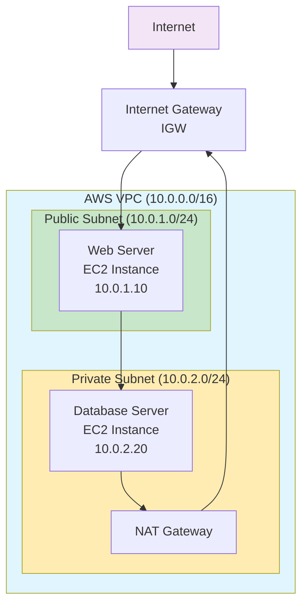
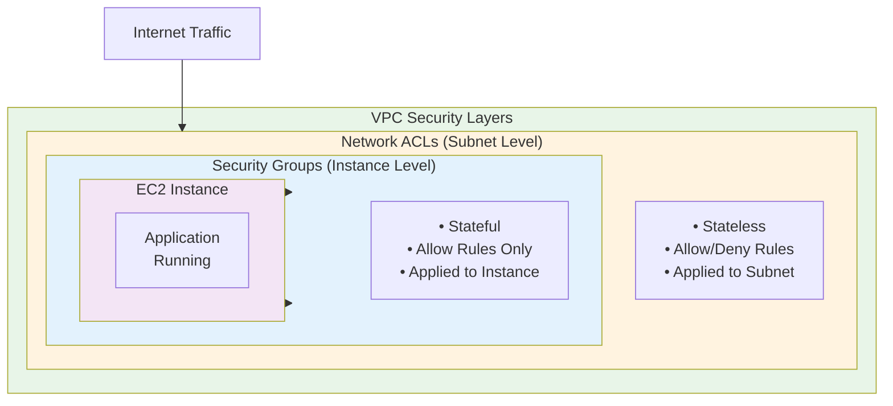
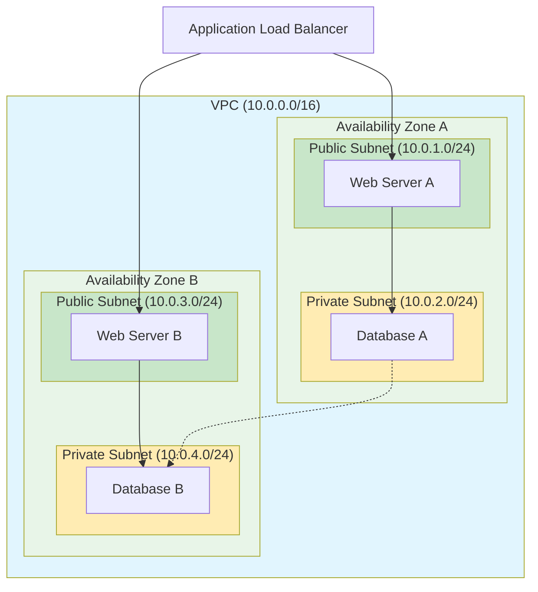
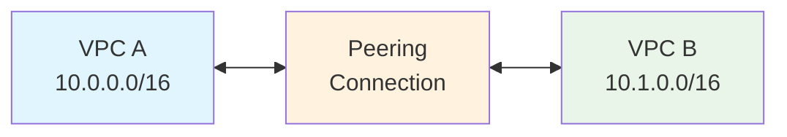
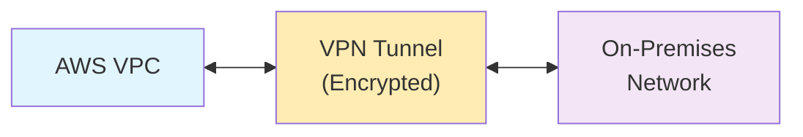
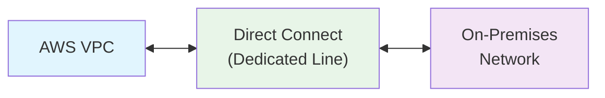
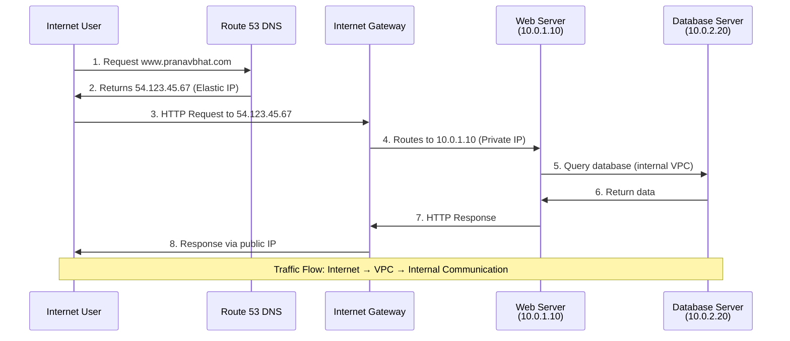
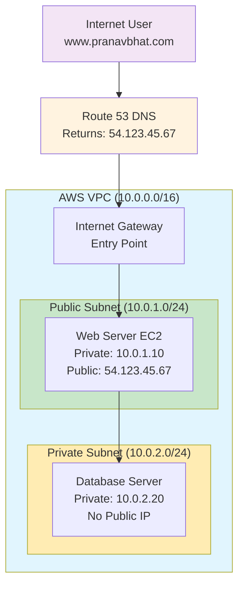

# AWS VPC (Virtual Private Cloud) Explanation

## What is AWS VPC?

**AWS VPC** is a virtual network dedicated to your AWS account. It's logically isolated from other virtual networks in the AWS Cloud, giving you complete control over your virtual networking environment including:

- **IP address ranges** (CIDR blocks)
- **Subnets** creation
- **Route tables** configuration  
- **Network gateways** setup

Think of VPC as your own **private data center in the cloud** where you can launch AWS resources in a virtual network that you define.

## Core VPC Architecture Diagram



## Key VPC Components

### 1. **Subnets**
- **Public Subnet**: Has direct route to Internet Gateway
- **Private Subnet**: No direct internet access, uses NAT for outbound traffic

### 2. **Internet Gateway (IGW)**
- Provides internet access to public subnets
- Horizontally scaled, redundant, and highly available

### 3. **NAT Gateway/Instance**
- Allows private subnet resources to access internet
- Prevents inbound internet connections

### 4. **Route Tables**
- Control traffic routing within VPC
- Each subnet must be associated with a route table

## VPC Security Layers Diagram



## Multi-AZ VPC Architecture



## VPC Connectivity Options

### 1. **VPC Peering**



### 2. **VPN Gateway**



### 3. **Direct Connect**



## Common VPC Use Cases

### **1. Web Application Architecture**
- **Public subnet**: Web servers, load balancers
- **Private subnet**: Application servers, databases
- **Security**: Multi-layered protection

### **2. Hybrid Cloud Setup**
- Connect on-premises infrastructure to AWS
- Extend existing network to cloud
- Maintain consistent security policies

### **3. Multi-Tier Applications**
- **Presentation tier**: Public subnet
- **Application tier**: Private subnet  
- **Database tier**: Private subnet with restricted access

## Practical Example: Internet Access Flow

### Scenario: User accessing www.pranavbhat.com





### Step-by-Step Traffic Flow:

**1. DNS Resolution**
```
User types: www.pranavbhat.com
Route 53 DNS responds: 54.123.45.67 (Elastic IP)
```

**2. Internet Gateway Processing**
```
Request: Internet → IGW → VPC
- IGW receives traffic destined for 54.123.45.67
- IGW translates public IP to private IP (10.0.1.10)
- Routes traffic to correct subnet based on route table
```

**3. Route Table Decision**
```
Destination: 10.0.1.10
Route Table Entry: 10.0.1.0/24 → Local (Public Subnet)
Action: Forward to Public Subnet
```

**4. Security Group Check**
```
Inbound Rules for Web Server:
- HTTP (Port 80): 0.0.0.0/0 ✅ ALLOW
- HTTPS (Port 443): 0.0.0.0/0 ✅ ALLOW
- SSH (Port 22): 203.0.113.0/24 ✅ ALLOW (Admin IP only)
```

**5. Web Server Processing**
```
EC2 Instance (10.0.1.10) receives request:
- Processes HTTP/HTTPS request
- May need to query database in private subnet
- Generates response
```

**6. Database Communication (Internal)**
```
Web Server → Database Server:
- Source: 10.0.1.10 (Public Subnet)
- Destination: 10.0.2.20 (Private Subnet)
- Route: Local VPC routing (no IGW needed)
- Security Group: Allow MySQL (3306) from web servers only
```

**7. Response Flow**
```
Database → Web Server → IGW → Internet → User
- Response follows reverse path
- IGW translates private IP back to public IP
- User receives website content
```

### Security Layers in Action:

**Network ACL (Subnet Level)**
```
Public Subnet NACL:
- Inbound: HTTP/HTTPS from 0.0.0.0/0 ✅
- Outbound: All traffic ✅

Private Subnet NACL:
- Inbound: MySQL from 10.0.1.0/24 ✅
- Outbound: MySQL responses ✅
```

**Security Groups (Instance Level)**
```
Web Server SG:
- Inbound: Port 80,443 from 0.0.0.0/0
- Outbound: Port 3306 to Database SG

Database Server SG:
- Inbound: Port 3306 from Web Server SG only
- Outbound: Responses to Web Server SG
```

## Best Practices

- **Use multiple AZs** for high availability
- **Implement least privilege** access with security groups
- **Monitor traffic** with VPC Flow Logs
- **Plan CIDR blocks** carefully to avoid conflicts
- **Use private subnets** for sensitive resources