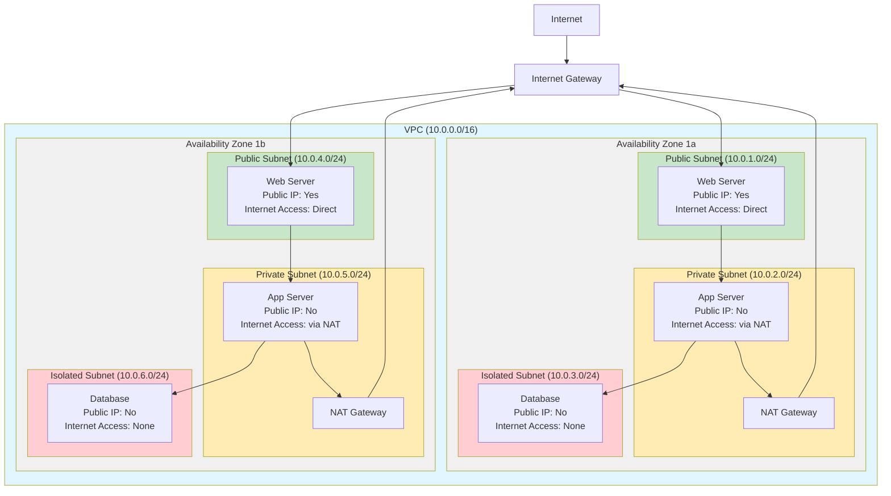
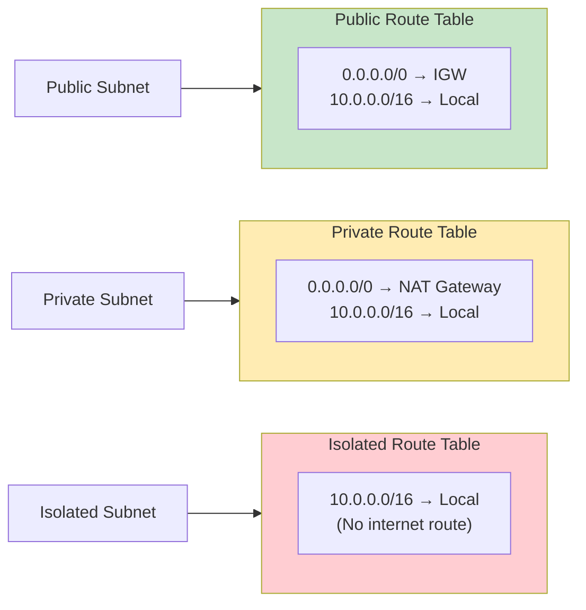
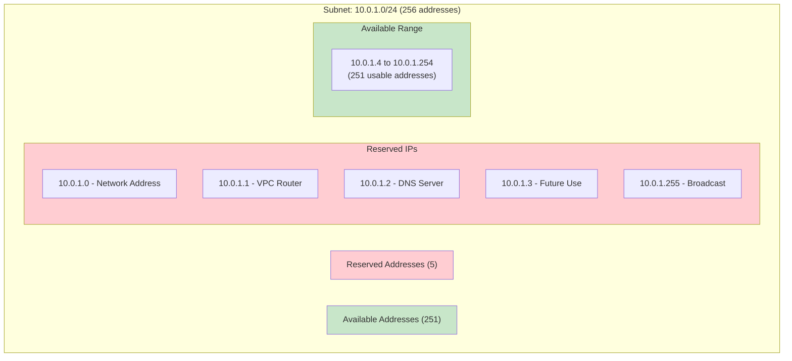
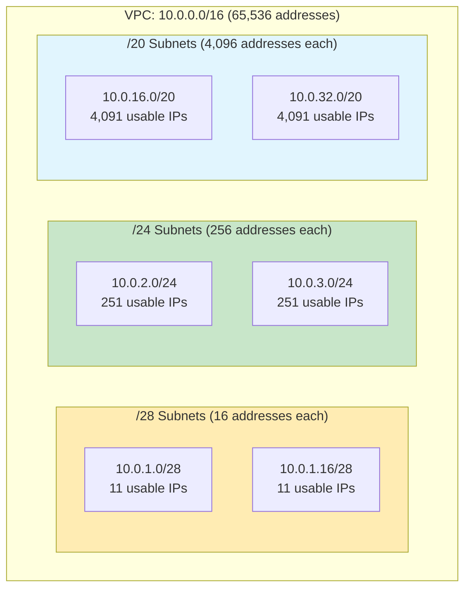
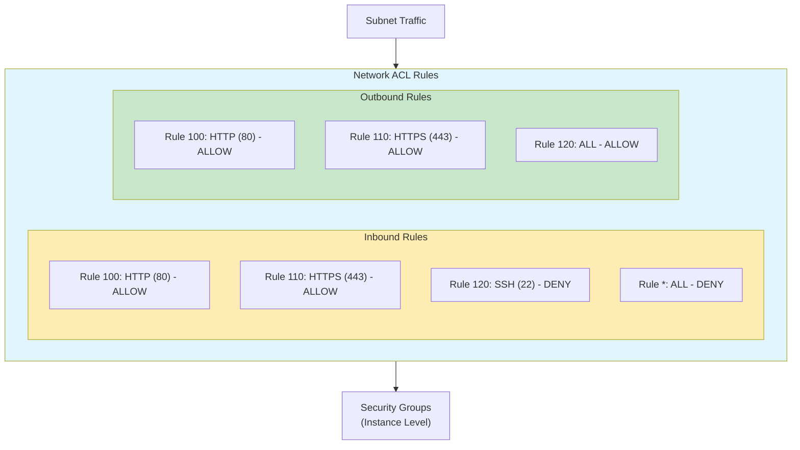
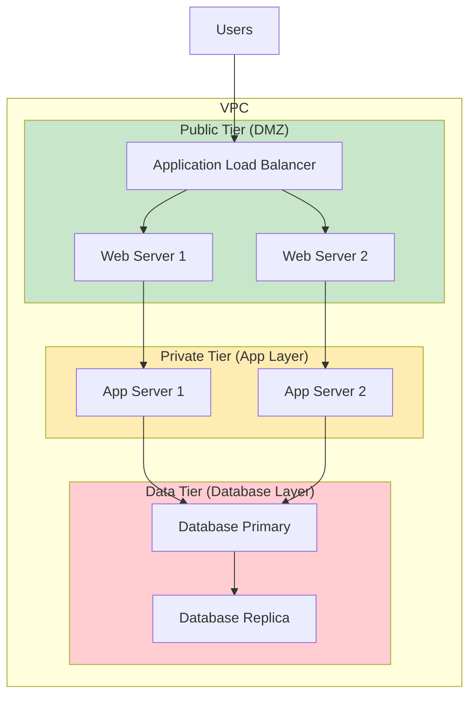

# AWS VPC Subnets

## What is a Subnet?

A **subnet** (subnetwork) is a logical subdivision of your VPC's IP address range. It's a way to segment your VPC into smaller, more manageable network segments where you can place AWS resources like EC2 instances, RDS databases, and load balancers.

## Key Subnet Concepts

### **CIDR Blocks**
- Each subnet has its own **CIDR block** (subset of VPC CIDR)
- Must be within the VPC's CIDR range
- Cannot overlap with other subnets in the same VPC

### **Availability Zone Mapping**
- Each subnet exists in **exactly one Availability Zone**
- Cannot span multiple AZs
- Resources in subnet inherit the AZ placement

## Subnet Types

### 1. **Public Subnet**
- Has a **route to Internet Gateway** (IGW)
- Resources can have **public IP addresses**
- **Direct internet access** for inbound/outbound traffic

### 2. **Private Subnet**
- **No direct route** to Internet Gateway
- Resources typically have **only private IP addresses**
- Uses **NAT Gateway/Instance** for outbound internet access

### 3. **Isolated Subnet**
- **No internet access** at all (no NAT)
- Completely **isolated** from internet
- Used for highly sensitive resources

## Subnet Architecture Diagram

## Subnet Routing

### Route Tables
Each subnet must be **associated with a route table** that controls traffic routing:

## Subnet IP Address Management

### **Reserved IP Addresses**
AWS reserves **5 IP addresses** in each subnet:

## Subnet Sizing Examples

### Common CIDR Block Sizes

## Subnet Security

### Network ACLs (Subnet Level)

## Subnet Best Practices

### **1. Multi-AZ Design**
- Deploy subnets across **multiple AZs** for high availability
- Use **consistent CIDR planning** across AZs

### **2. Subnet Sizing**
- Plan for **future growth** when choosing CIDR blocks
- Consider **reserved IP addresses** (5 per subnet)
- Use **/24** for most workloads (251 usable IPs)

### **3. Security Layering**
- **Public subnets**: Only for internet-facing resources
- **Private subnets**: For application servers and internal services
- **Isolated subnets**: For databases and sensitive data

### **4. Route Table Management**
- Use **separate route tables** for different subnet types
- Keep routing **simple and predictable**
- Document route table associations

## Common Subnet Patterns

### **Three-Tier Architecture**

## Subnet Troubleshooting

### **Common Issues**

1. **No Internet Access**
   - Check route table has IGW route (public) or NAT route (private)
   - Verify security group allows traffic
   - Confirm NACL permits traffic

2. **IP Address Exhaustion**
   - Monitor subnet utilization
   - Consider larger CIDR blocks
   - Clean up unused resources

3. **Cross-AZ Communication Issues**
   - Verify security groups allow inter-subnet traffic
   - Check NACL rules for cross-subnet communication
   - Confirm route tables have local VPC routes

### **Monitoring and Metrics**
- Use **VPC Flow Logs** to track subnet traffic
- Monitor **IP address utilization**
- Set up **CloudWatch alarms** for network metrics

## Summary

Subnets are fundamental building blocks of VPC architecture that provide:

- **Network segmentation** within your VPC
- **Availability Zone placement** for resources  
- **Traffic control** through routing and security
- **Scalable IP address management**
- **Security boundaries** for different application tiers

Proper subnet design is crucial for building secure, scalable, and highly available AWS architectures.