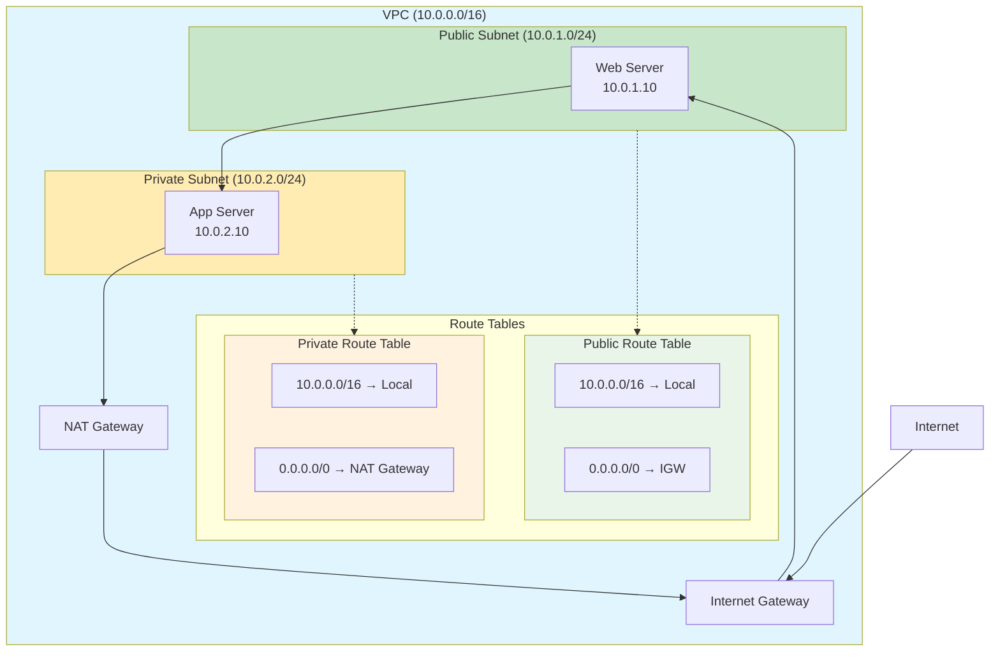
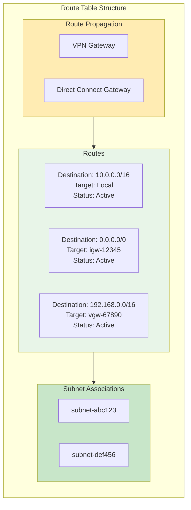
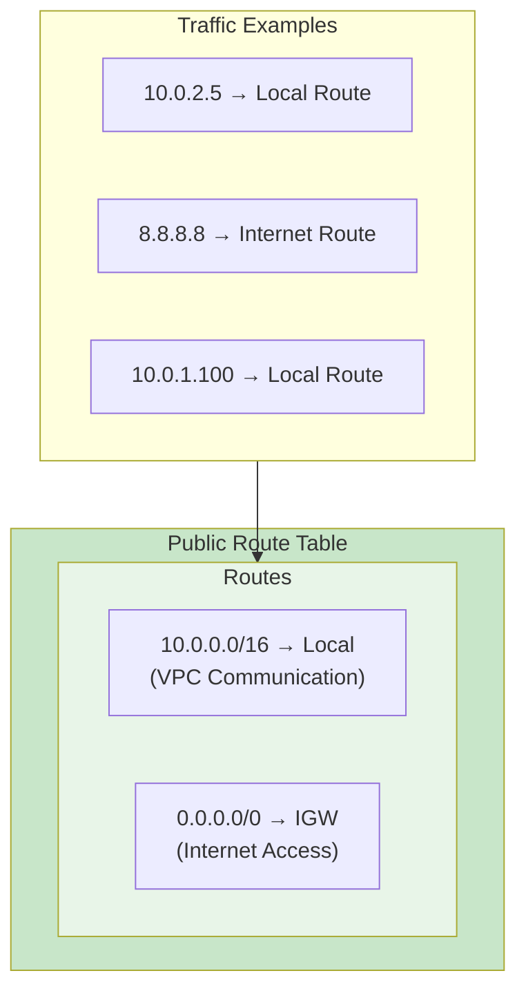
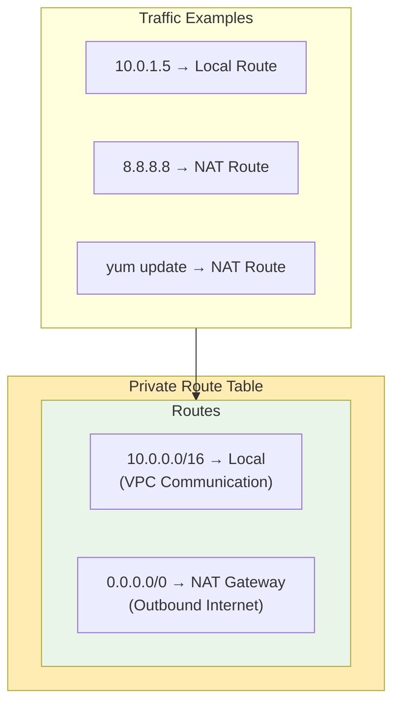
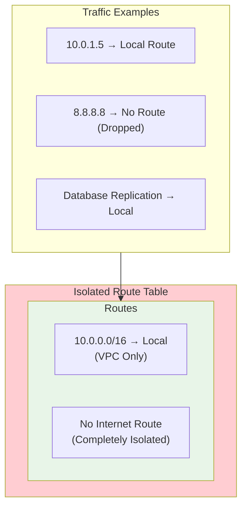
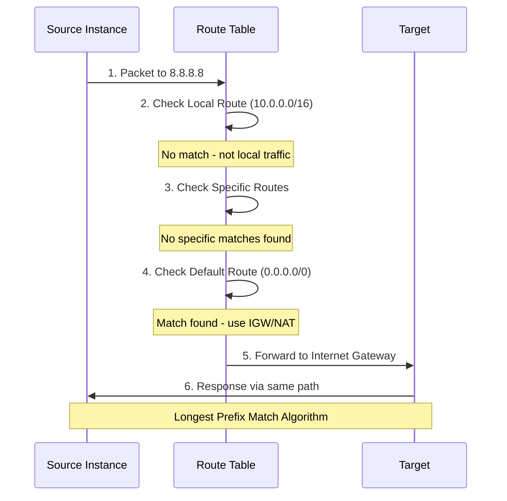
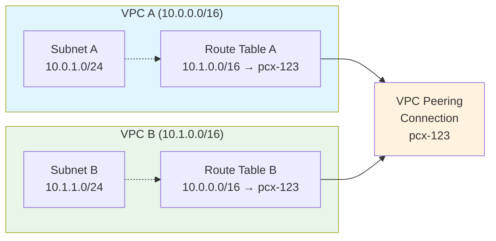
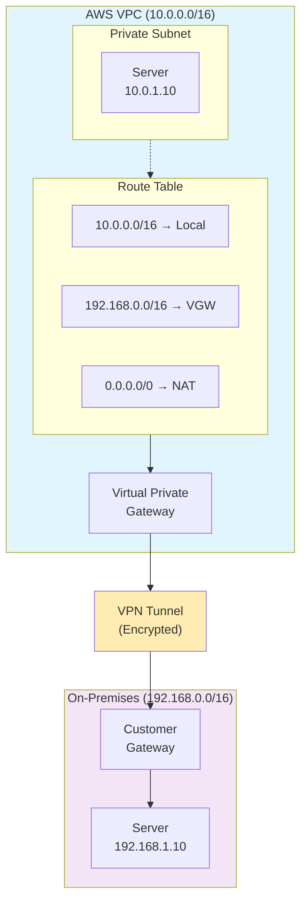
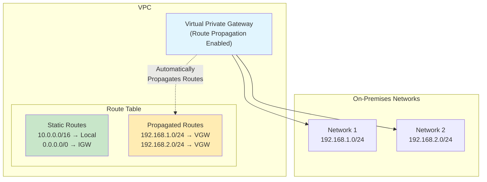
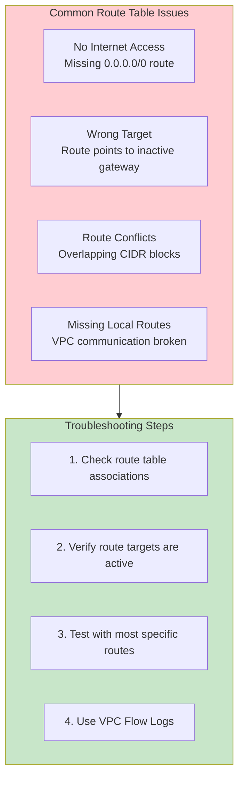

# AWS VPC Route Tables

## What is a Route Table?

A **Route Table** is a set of rules (called routes) that determines where network traffic from your subnet or gateway is directed. Think of it as a **GPS for your network traffic** - it tells packets which path to take to reach their destination.

## Key Route Table Concepts

### **Routes**
- Each route specifies a **destination** (CIDR block) and a **target** (where to send traffic)
- Routes are evaluated in order of **most specific to least specific**
- **Longest prefix match** wins when multiple routes could apply

### **Route Priority**
1. **Local routes** (VPC CIDR) - highest priority
2. **Most specific routes** (smaller CIDR blocks)
3. **Least specific routes** (larger CIDR blocks)
4. **Default route** (0.0.0.0/0) - lowest priority

## Route Table Architecture



## Route Table Types

### 1. **Main Route Table**
- **Default route table** created with every VPC
- **Automatically associated** with subnets that don't have explicit associations
- **Cannot be deleted** but can be modified

### 2. **Custom Route Tables**
- **User-created** route tables for specific requirements
- **Explicitly associated** with subnets
- **Can be deleted** when no longer needed

### 3. **Gateway Route Tables**
- Associated with **Internet Gateways** or **Virtual Private Gateways**
- Controls traffic **entering the VPC**
- Used for **advanced routing scenarios**

## Route Table Components



## Common Route Patterns

### **Public Subnet Route Table**



### **Private Subnet Route Table**



### **Isolated Subnet Route Table**



## Route Resolution Process



## Advanced Routing Scenarios

### **VPC Peering Routes**



### **VPN Connection Routes**



## Route Propagation

### **Automatic Route Learning**



## Route Table Best Practices

### **1. Naming and Organization**
- Use **descriptive names** (e.g., "Public-RT-Web", "Private-RT-App")
- **Tag route tables** with environment, purpose, and owner
- **Document route purposes** in descriptions

### **2. Security Considerations**
- **Principle of least privilege** - only necessary routes
- **Avoid overly broad routes** (0.0.0.0/0 to wrong targets)
- **Regular route audits** for unused or incorrect routes

### **3. High Availability**
- **Multiple AZ routing** for redundancy
- **NAT Gateway per AZ** for private subnets
- **Monitor route table health** and dependencies

### **4. Route Management**
- **Separate route tables** for different tiers
- **Use route propagation** for dynamic environments
- **Version control** route table changes

## Troubleshooting Route Tables

### **Common Issues**



### **Diagnostic Commands**

```bash
# Check route table associations
aws ec2 describe-route-tables --route-table-ids rtb-12345678

# Verify subnet associations
aws ec2 describe-subnets --subnet-ids subnet-12345678

# Test connectivity
ping 8.8.8.8
traceroute 8.8.8.8

# Check security groups and NACLs
aws ec2 describe-security-groups --group-ids sg-12345678
```

## Route Table Limits

### **AWS Limits**
- **200 route tables** per VPC
- **50 routes** per route table
- **1 route table** per subnet association
- **Propagated routes** count toward the 50-route limit

### **Performance Considerations**
- **Route lookup** is very fast (hardware-accelerated)
- **More specific routes** are preferred
- **Route changes** take effect immediately

## Summary

Route Tables are the **traffic control system** of your VPC:

- **Direct network traffic** based on destination IP
- **Enable internet access** through IGW routes
- **Provide VPC connectivity** through local routes
- **Support hybrid connectivity** via VPN/Direct Connect
- **Operate at subnet level** with automatic association
- **Use longest prefix matching** for route selection

Proper route table design is essential for **secure, efficient, and reliable** network connectivity in AWS VPC environments.