# AWS Internet Gateway (IGW)

## What is an Internet Gateway?

An **Internet Gateway (IGW)** is a horizontally scaled, redundant, and highly available VPC component that allows communication between your VPC and the internet. It serves as the **bridge between your private AWS network and the public internet**.

## Key Internet Gateway Concepts

### **Core Functions**
- **Bidirectional internet access** for VPC resources
- **NAT (Network Address Translation)** between private and public IP addresses
- **Route target** for internet-bound traffic (0.0.0.0/0)
- **Stateless gateway** - no connection tracking

### **High Availability**
- **Horizontally scaled** across multiple Availability Zones
- **Redundant by design** - no single point of failure
- **Managed by AWS** - no maintenance required
- **99.99% availability** SLA

## Internet Gateway Architecture


## How Internet Gateway Works

### **NAT Translation Process**

```mermaid
sequenceDiagram
    participant Internet as Internet User
    participant IGW as Internet Gateway
    participant EC2 as EC2 Instance<br/>(10.0.1.10)
    
    Note over Internet,EC2: Inbound Traffic Flow
    Internet->>IGW: 1. Request to 54.123.45.67
    IGW->>IGW: 2. NAT Translation<br/>54.123.45.67 → 10.0.1.10
    IGW->>EC2: 3. Forward to private IP
    
    Note over Internet,EC2: Outbound Traffic Flow
    EC2->>IGW: 4. Response from 10.0.1.10
    IGW->>IGW: 5. NAT Translation<br/>10.0.1.10 → 54.123.45.67
    IGW->>Internet: 6. Response from 54.123.45.67
    
    Note over Internet,EC2: Stateless - No Connection Tracking
```



### **IP Address Translation**


## Internet Gateway vs NAT Gateway

```mermaid
graph TB
    subgraph Comparison["IGW vs NAT Gateway Comparison"]
        subgraph IGW_Features["Internet Gateway (IGW)"]
            IGW1["✅ Bidirectional internet access"]
            IGW2["✅ 1:1 NAT translation"]
            IGW3["✅ Stateless operation"]
            IGW4["✅ Supports inbound connections"]
            IGW5["✅ No bandwidth limits"]
            IGW6["✅ No additional cost"]
        end
        
        subgraph NAT_Features["NAT Gateway"]
            NAT1["❌ Outbound internet only"]
            NAT2["✅ Many:1 NAT translation"]
            NAT3["✅ Stateful operation"]
            NAT4["❌ No inbound connections"]
            NAT5["⚠️ Bandwidth limits (45 Gbps)"]
            NAT6["💰 Hourly + data charges"]
        end
    end
    
    style IGW_Features fill:#c8e6c9
    style NAT_Features fill:#ffecb3
```



## Internet Gateway Requirements

### **Prerequisites for Internet Access**


## Internet Gateway Lifecycle

### **Attachment States**


## Common Internet Gateway Patterns

### **1. Web Application Architecture**


### **2. Hybrid Cloud Connectivity**


## Internet Gateway Security

### **Security Considerations**

```mermaid
graph TB
    subgraph SecurityLayers["Security Layers"]
        subgraph IGWLevel["Internet Gateway Level"]
            IGWSec["• No built-in firewall<br/>• Stateless NAT only<br/>• Relies on other controls"]
        end
        
        subgraph RouteLevel["Route Table Level"]
            RouteSec["• Controls which subnets<br/>• Can reach internet<br/>• 0.0.0.0/0 route required"]
        end
        
        subgraph NACLLevel["Network ACL Level"]
            NACLSec["• Subnet-level firewall<br/>• Stateless rules<br/>• Allow/Deny traffic"]
        end
        
        subgraph SGLevel["Security Group Level"]
            SGSec["• Instance-level firewall<br/>• Stateful rules<br/>• Allow rules only"]
        end
    end
    
    IGWLevel --> RouteLevel
    RouteLevel --> NACLLevel
    NACLLevel --> SGLevel
    
    style IGWLevel fill:#ffcdd2
    style RouteLevel fill:#fff3e0
    style NACLLevel fill:#ffecb3
    style SGLevel fill:#c8e6c9
```



### **Best Security Practices**

```mermaid
graph LR
    subgraph Practices["IGW Security Best Practices"]
        Practice1["🔒 Minimize Public IPs<br/>Only assign when necessary"]
        Practice2["🛡️ Use Security Groups<br/>Restrict inbound access"]
        Practice3["🔍 Monitor Traffic<br/>VPC Flow Logs + CloudTrail"]
        Practice4["🚫 Avoid 0.0.0.0/0<br/>In security group rules"]
        Practice5["🔄 Regular Audits<br/>Review public resources"]
    end
    
    style Practices fill:#e1f5fe
```



## Internet Gateway Troubleshooting

### **Common Issues and Solutions**

```mermaid
graph TB
    subgraph Issues["Common IGW Issues"]
        Issue1["No Internet Access<br/>❌ Can't reach internet"]
        Issue2["Partial Connectivity<br/>⚠️ Some traffic blocked"]
        Issue3["Slow Performance<br/>🐌 High latency"]
        Issue4["Security Concerns<br/>🚨 Unwanted exposure"]
    end
    
    subgraph Solutions["Troubleshooting Steps"]
        Sol1["1. Check IGW attachment<br/>2. Verify route table<br/>3. Confirm public IP"]
        Sol2["1. Review security groups<br/>2. Check NACLs<br/>3. Verify protocols/ports"]
        Sol3["1. Check instance size<br/>2. Monitor network metrics<br/>3. Consider placement groups"]
        Sol4["1. Audit public IPs<br/>2. Tighten security groups<br/>3. Use WAF/Shield"]
    end
    
    Issue1 --> Sol1
    Issue2 --> Sol2
    Issue3 --> Sol3
    Issue4 --> Sol4
    
    style Issues fill:#ffcdd2
    style Solutions fill:#c8e6c9
```



### **Diagnostic Commands**

```bash
# Check IGW attachment
aws ec2 describe-internet-gateways --filters "Name=attachment.vpc-id,Values=vpc-12345678"

# Verify route tables
aws ec2 describe-route-tables --filters "Name=vpc-id,Values=vpc-12345678"

# Check public IP assignments
aws ec2 describe-instances --filters "Name=vpc-id,Values=vpc-12345678"

# Test connectivity
curl -I http://checkip.amazonaws.com/
ping 8.8.8.8
traceroute 8.8.8.8

# Check security groups
aws ec2 describe-security-groups --filters "Name=vpc-id,Values=vpc-12345678"
```

## Internet Gateway Limits and Costs

### **AWS Limits**
- **1 Internet Gateway** per VPC
- **No bandwidth limits** (scales automatically)
- **No connection limits**
- **No additional latency**

### **Cost Structure**
- **Internet Gateway**: **FREE** (no hourly charges)
- **Data Transfer OUT**: Charged per GB
- **Data Transfer IN**: **FREE**
- **Elastic IPs**: $0.005/hour when not attached

## Internet Gateway vs Alternatives

```mermaid
graph TB
    subgraph Alternatives["Internet Connectivity Options"]
        subgraph IGW_Option["Internet Gateway"]
            IGW_Pro["✅ Bidirectional access<br/>✅ No additional cost<br/>✅ High performance<br/>✅ Highly available"]
            IGW_Con["❌ Requires public IPs<br/>❌ Direct internet exposure"]
        end
        
        subgraph NAT_Option["NAT Gateway"]
            NAT_Pro["✅ Outbound only<br/>✅ No public IPs needed<br/>✅ Managed service"]
            NAT_Con["❌ Additional cost<br/>❌ No inbound access<br/>❌ Bandwidth limits"]
        end
        
        subgraph VPN_Option["VPN Connection"]
            VPN_Pro["✅ Encrypted tunnel<br/>✅ Hybrid connectivity<br/>✅ Private routing"]
            VPN_Con["❌ Complex setup<br/>❌ Bandwidth limits<br/>❌ Additional cost"]
        end
    end
    
    style IGW_Option fill:#c8e6c9
    style NAT_Option fill:#ffecb3
    style VPN_Option fill:#e1f5fe
```



## Summary

Internet Gateway is the **primary internet connectivity solution** for AWS VPC:

### **Key Characteristics**
- **Horizontally scaled** and **highly available**
- **Stateless 1:1 NAT** translation
- **Bidirectional** internet connectivity
- **No additional cost** for the gateway itself
- **Single IGW per VPC** limitation

### **Essential for**
- **Public-facing applications** (web servers, APIs)
- **Load balancers** requiring internet access
- **Bastion hosts** for secure access
- **NAT Gateways** for private subnet internet access

### **Security Model**
- **No built-in firewall** - relies on Security Groups and NACLs
- **Requires public IP addresses** for inbound connectivity
- **Route table configuration** determines accessibility
- **Defense in depth** approach recommended

Internet Gateway is the **foundation of internet connectivity** in AWS VPC, enabling secure and scalable internet access for your cloud resources.