# Egress-only Internet Gateways (EIGW)

## Overview

An **Egress-only Internet Gateway** is a VPC component that allows **outbound IPv6 communication** from your VPC to the internet while **preventing inbound connections** from the internet to your instances. It's specifically designed for IPv6 traffic and provides a secure way for IPv6-enabled resources to access the internet without being directly accessible from the internet.

## Key Characteristics

- **IPv6 Only**: Works exclusively with IPv6 traffic
- **Outbound Only**: Allows egress (outbound) traffic but blocks ingress (inbound) traffic
- **Stateful**: Tracks connection state to allow return traffic for established connections
- **VPC-level Component**: Attached at the VPC level, not subnet level

## Architecture Diagram

```mermaid
graph TD
    Internet["🌐 Internet (IPv6)"]
    EIGW["🚪 Egress-only Internet Gateway<br/>(EIGW)"]
    VPC["☁️ VPC<br/>2001:db8::/56"]
    SubnetA["🔒 Private Subnet A<br/>2001:db8:1::/64"]
    SubnetB["🔒 Private Subnet B<br/>2001:db8:2::/64"]
    EC2["💻 EC2 Instance<br/>(IPv6)"]
    RDS["🗄️ RDS Instance<br/>(IPv6)"]
    
    Internet -.->|"❌ Inbound Blocked"| EIGW
    EIGW -->|"✅ Outbound Allowed"| Internet
    EIGW <--> VPC
    VPC --> SubnetA
    VPC --> SubnetB
    SubnetA --> EC2
    SubnetB --> RDS
    
    classDef internetClass fill:#e1f5fe,stroke:#01579b,stroke-width:2px
    classDef eigwClass fill:#f3e5f5,stroke:#4a148c,stroke-width:2px
    classDef vpcClass fill:#e8f5e8,stroke:#1b5e20,stroke-width:2px
    classDef subnetClass fill:#fff3e0,stroke:#e65100,stroke-width:2px
    classDef instanceClass fill:#fce4ec,stroke:#880e4f,stroke-width:2px
    
    class Internet internetClass
    class EIGW eigwClass
    class VPC vpcClass
    class SubnetA,SubnetB subnetClass
    class EC2,RDS instanceClass
```



## Traffic Flow Diagrams

### Outbound Traffic (Allowed)

```mermaid
sequenceDiagram
    participant EC2 as 💻 EC2 Instance<br/>(IPv6)
    participant EIGW as 🚪 EIGW
    participant Internet as 🌐 Internet<br/>(IPv6)
    
    Note over EC2,Internet: Outbound Connection Flow
    EC2->>+EIGW: 1. IPv6 Request<br/>(e.g., HTTPS to API)
    EIGW->>+Internet: 2. Forward Request
    Internet-->>-EIGW: 3. Response
    EIGW-->>-EC2: 4. Return Response
    
    Note over EC2,Internet: ✅ Stateful - Return traffic allowed
```



### Inbound Traffic (Blocked)


## Comparison with Other Gateway Types

| Feature | Internet Gateway | NAT Gateway | Egress-only Internet Gateway |
|---------|------------------|-------------|------------------------------|
| **IP Version** | IPv4 & IPv6 | IPv4 only | IPv6 only |
| **Inbound Traffic** | ✓ Allowed | ✗ Blocked | ✗ Blocked |
| **Outbound Traffic** | ✓ Allowed | ✓ Allowed | ✓ Allowed |
| **Public IP Required** | Yes | Yes (for NAT) | No |
| **Stateful** | No | Yes | Yes |
| **Use Case** | Public resources | Private IPv4 egress | Private IPv6 egress |

## Configuration Steps

### 1. Create Egress-only Internet Gateway

```bash
# AWS CLI command
aws ec2 create-egress-only-internet-gateway \
    --vpc-id vpc-12345678 \
    --region us-west-2
```

### 2. Update Route Tables

```text
┌─────────────────────────────────────────────────────────────────┐
│                    Route Table Configuration                     │
├─────────────────────────────────────────────────────────────────┤
│ Destination          │ Target                                   │
├─────────────────────────────────────────────────────────────────┤
│ ::/0                 │ eigw-12345678 (Egress-only IGW)         │
│ 2001:db8::/32        │ local                                    │
└─────────────────────────────────────────────────────────────────┘
```

### 3. Security Group Configuration

```text
Outbound Rules:
┌─────────────────────────────────────────────────────────────────┐
│ Type    │ Protocol │ Port Range │ Destination    │ Description   │
├─────────────────────────────────────────────────────────────────┤
│ HTTPS   │ TCP      │ 443        │ ::/0           │ Web traffic   │
│ HTTP    │ TCP      │ 80         │ ::/0           │ Web traffic   │
│ Custom  │ TCP      │ 1024-65535 │ ::/0           │ Return traffic│
└─────────────────────────────────────────────────────────────────┘

Inbound Rules:
┌─────────────────────────────────────────────────────────────────┐
│ Type    │ Protocol │ Port Range │ Source         │ Description   │
├─────────────────────────────────────────────────────────────────┤
│ SSH     │ TCP      │ 22         │ 2001:db8::/32  │ Internal SSH  │
│ Custom  │ TCP      │ 8080       │ 2001:db8::/32  │ App traffic   │
└─────────────────────────────────────────────────────────────────┘
```

## Use Cases

### 1. **Software Updates and Patches**

- EC2 instances need to download security updates
- Database instances requiring software patches
- Container images pulling from external registries

### 2. **API Calls to External Services**

- Calling third-party APIs (payment, authentication)
- Sending notifications (email, SMS services)
- Data synchronization with external systems

### 3. **Backup and Monitoring**

- Uploading backups to external storage
- Sending metrics to monitoring services
- Log forwarding to external log aggregators

## Complete Network Architecture Example

```mermaid
graph TB
    Internet["🌐 Internet (IPv6)"]
    EIGW["🚪 Egress-only Internet Gateway<br/>eigw-12345678"]
    
    subgraph VPC ["☁️ VPC - 2001:db8::/56"]
        subgraph SubnetA ["🔒 Private Subnet A<br/>2001:db8:1::/64"]
            WebServer["🌐 Web Server<br/>(IPv6 Only)<br/><br/>• Updates<br/>• API calls<br/>• Monitoring"]
        end
        
        subgraph SubnetB ["🔒 Private Subnet B<br/>2001:db8:2::/64"]
            Database["🗄️ Database<br/>(IPv6 Only)<br/><br/>• Backups<br/>• Monitoring<br/>• Patches"]
        end
        
        subgraph RouteTable ["🗺️ Route Table (Private Subnets)"]
            Routes["🔄 Routes:<br/>::/0 → eigw-12345678<br/>2001:db8::/56 → local"]
        end
    end
    
    Internet -.->|"❌ Inbound Blocked"| EIGW
    EIGW -->|"✅ Outbound Allowed"| Internet
    EIGW <--> VPC
    
    WebServer -.->|"🔄 Routed via"| RouteTable
    Database -.->|"🔄 Routed via"| RouteTable
    RouteTable -.-> EIGW
    
    classDef internetClass fill:#e1f5fe,stroke:#01579b,stroke-width:2px
    classDef eigwClass fill:#f3e5f5,stroke:#4a148c,stroke-width:2px
    classDef vpcClass fill:#e8f5e8,stroke:#1b5e20,stroke-width:2px
    classDef subnetClass fill:#fff3e0,stroke:#e65100,stroke-width:2px
    classDef instanceClass fill:#fce4ec,stroke:#880e4f,stroke-width:2px
    classDef routeClass fill:#f1f8e9,stroke:#33691e,stroke-width:2px
    
    class Internet internetClass
    class EIGW eigwClass
    class VPC vpcClass
    class SubnetA,SubnetB subnetClass
    class WebServer,Database instanceClass
    class RouteTable,Routes routeClass
```



## Best Practices

### 1. **Security Groups**

- Configure restrictive outbound rules
- Only allow necessary protocols and ports
- Use specific IPv6 CIDR blocks when possible

### 2. **Route Table Management**

- Create dedicated route tables for EIGW subnets
- Avoid mixing EIGW and IGW routes in same table
- Document route table purposes clearly

### 3. **Monitoring**

- Enable VPC Flow Logs for traffic analysis
- Monitor egress traffic patterns
- Set up CloudWatch alarms for unusual traffic

### 4. **Cost Optimization**

- EIGW has no hourly charges (unlike NAT Gateway)
- Monitor data transfer costs
- Consider traffic patterns when designing architecture

## Limitations

1. **IPv6 Only**: Cannot handle IPv4 traffic
2. **No Inbound Access**: Cannot receive connections from internet
3. **Regional**: Must be in same region as VPC
4. **Route Table Dependency**: Requires proper route table configuration

## Troubleshooting Common Issues

### Issue 1: No Internet Connectivity

```text
Check:
1. Route table has ::/0 → eigw-xxxxx
2. Security group allows outbound traffic
3. Instance has IPv6 address assigned
4. VPC has IPv6 CIDR block
```

### Issue 2: Partial Connectivity

```text
Check:
1. Security group outbound rules
2. NACLs (if custom ones are used)
3. Application-level firewall rules
4. DNS resolution (IPv6 AAAA records)
```

## Summary

Egress-only Internet Gateways provide a secure way to enable outbound IPv6 connectivity while maintaining security by blocking inbound connections. They're ideal for:

- **Private resources** that need internet access
- **IPv6-only environments** requiring egress connectivity  
- **Security-conscious architectures** preventing inbound exposure
- **Cost-effective solutions** (no hourly charges like NAT Gateway)

The stateful nature ensures return traffic works properly while maintaining the security boundary against unsolicited inbound connections.