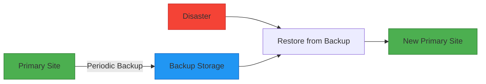
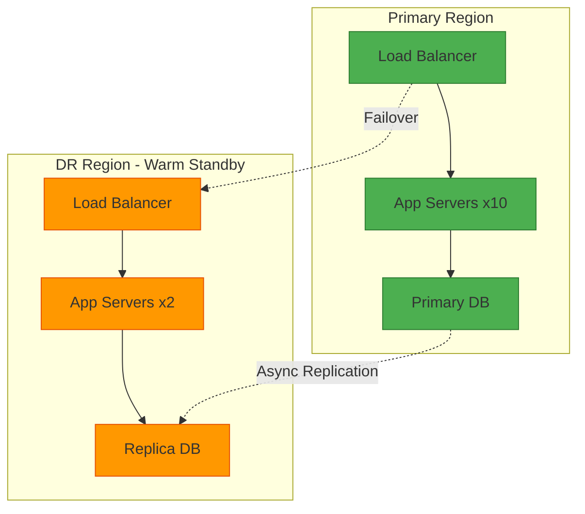
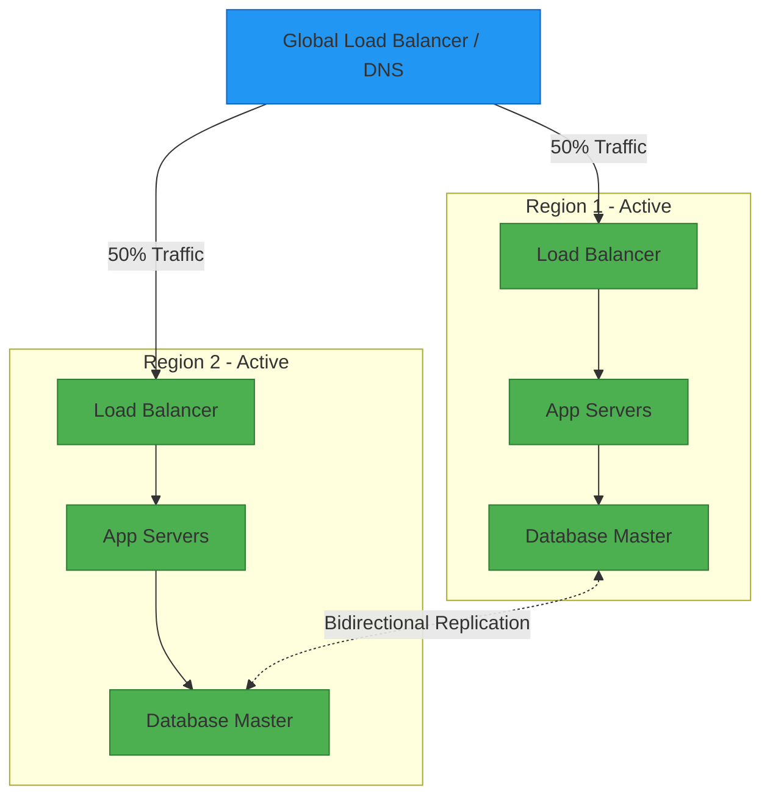

# Disaster Recovery (DR) for System Design Interviews

## 📋 Table of Contents

1. [Disaster Recovery Fundamentals](#disaster-recovery-fundamentals)
2. [Key Metrics: RTO & RPO](#key-metrics-rto--rpo)
3. [DR Strategies & Patterns](#dr-strategies--patterns)
4. [Backup Strategies](#backup-strategies)
5. [Multi-Region Architecture](#multi-region-architecture)
6. [DR Testing & Validation](#dr-testing--validation)
7. [Common Interview Questions](#common-interview-questions)
8. [Real-World Examples](#real-world-examples)

---

## 🔧 Disaster Recovery Fundamentals

### What is Disaster Recovery?

**Disaster Recovery (DR)** is a set of policies, tools, and procedures to enable the recovery or continuation of vital technology infrastructure and systems following a natural or human-induced disaster.

### Types of Disasters

**Natural Disasters:**
- Earthquakes, floods, hurricanes, fires
- Power outages, natural catastrophes

**Technical Disasters:**
- Hardware failures (server, storage, network)
- Software bugs, corrupted databases
- Network outages, DNS failures

**Human-Induced Disasters:**
- Cyberattacks (ransomware, DDoS)
- Accidental data deletion
- Configuration errors, deployment failures
- Insider threats

### Why DR Matters in System Design

- **Business Continuity:** Minimize downtime and revenue loss
- **Data Protection:** Prevent permanent data loss
- **Compliance:** Meet regulatory requirements (GDPR, HIPAA, SOC 2)
- **Customer Trust:** Maintain service reliability and SLAs
- **Competitive Advantage:** Faster recovery than competitors

---

## 📊 Key Metrics: RTO & RPO

### Recovery Time Objective (RTO)

**Definition:** Maximum acceptable time that a system can be down after a disaster.

- **Example:** "Our system must be back online within 4 hours"
- **Impact:** Determines DR strategy complexity and cost
- **Trade-off:** Lower RTO = Higher cost and complexity

```
Disaster Occurs → Detection → Failover → System Restored
|<------------------- RTO ------------------->|
```

### Recovery Point Objective (RPO)

**Definition:** Maximum acceptable amount of data loss measured in time.

- **Example:** "We can tolerate losing up to 15 minutes of data"
- **Impact:** Determines backup frequency and replication strategy
- **Trade-off:** Lower RPO = More frequent backups/replication

```
Last Backup → Disaster Occurs → Recovery Point
|<-------- RPO -------->|
         (Data Loss Window)
```

### RTO vs RPO Comparison

| Metric | Question | Example Values | Cost Impact |
|--------|----------|----------------|-------------|
| **RTO** | How long can we be down? | Minutes to hours | Lower RTO = Higher cost |
| **RPO** | How much data can we lose? | Seconds to hours | Lower RPO = Higher cost |

### Common RTO/RPO Tiers

**Tier 1 (Mission Critical):**
- RTO: < 1 hour
- RPO: < 5 minutes
- Strategy: Active-Active, synchronous replication
- Cost: Very High

**Tier 2 (Business Critical):**
- RTO: 1-4 hours
- RPO: 15-60 minutes
- Strategy: Active-Passive, asynchronous replication
- Cost: High

**Tier 3 (Important):**
- RTO: 4-24 hours
- RPO: 1-4 hours
- Strategy: Backup & Restore
- Cost: Medium

**Tier 4 (Non-Critical):**
- RTO: 24-72 hours
- RPO: 24 hours
- Strategy: Periodic backups
- Cost: Low

---

## 🛡️ DR Strategies & Patterns

### 1. Backup & Restore (Pilot Light)

**Description:** Regular backups stored offsite; restore when disaster occurs.

**Characteristics:**
- Highest RTO (hours to days)
- Highest RPO (hours)
- Lowest cost
- Manual intervention required

**Use Cases:**
- Non-critical systems
- Development/test environments
- Archival data



### 2. Pilot Light

**Description:** Minimal version of environment always running; scale up during disaster.

**Characteristics:**
- RTO: 1-4 hours
- RPO: Minutes to hours
- Medium cost
- Core services always running

**Components Always Running:**
- Database replicas (read-only)
- Core infrastructure (VPC, subnets)
- Minimal compute instances

**Use Cases:**
- Business-critical applications
- E-commerce platforms
- SaaS applications

### 3. Warm Standby

**Description:** Scaled-down but fully functional version running in DR site.

**Characteristics:**
- RTO: Minutes to 1 hour
- RPO: Minutes
- Medium-high cost
- Reduced capacity always running

**Setup:**
- All services running at reduced capacity
- Database replication active
- Can handle some production traffic
- Quick scale-up during disaster

**Use Cases:**
- Financial services
- Healthcare systems
- Enterprise applications



### 4. Hot Standby (Active-Passive)

**Description:** Fully provisioned DR site ready to take over immediately.

**Characteristics:**
- RTO: < 1 hour
- RPO: < 5 minutes
- High cost
- Instant failover capability

**Setup:**
- Full capacity in DR region
- Continuous data replication
- Automated failover
- Regular DR drills

**Use Cases:**
- Banking systems
- Payment processing
- Critical infrastructure

### 5. Active-Active (Multi-Site)

**Description:** Multiple sites actively serving traffic simultaneously.

**Characteristics:**
- RTO: Near-zero (automatic failover)
- RPO: Near-zero (synchronous replication)
- Highest cost
- No failover needed

**Setup:**
- Traffic distributed across regions
- Multi-master database replication
- Global load balancing
- Conflict resolution strategies

**Use Cases:**
- Global applications (Netflix, Google)
- 24/7 services
- Zero-downtime requirements



---

## 💾 Backup Strategies

### Backup Types

**1. Full Backup**
- Complete copy of all data
- Longest backup time
- Fastest restore
- Highest storage cost

**2. Incremental Backup**
- Only changed data since last backup (any type)
- Fastest backup time
- Slower restore (need full + all incrementals)
- Lowest storage cost

**3. Differential Backup**
- Changed data since last full backup
- Medium backup time
- Medium restore time (need full + last differential)
- Medium storage cost

### Backup Strategy Comparison

```
Day 1: Full Backup (100 GB)
Day 2: Incremental (5 GB changed)
Day 3: Incremental (3 GB changed)
Day 4: Incremental (7 GB changed)

Restore on Day 4:
- Full: Restore 100 GB
- Incremental: Restore 100 + 5 + 3 + 7 = 115 GB (4 operations)
- Differential: Restore 100 + 15 GB (2 operations)
```

### 3-2-1 Backup Rule

**Best Practice for Data Protection:**

- **3** copies of data (1 primary + 2 backups)
- **2** different media types (disk + tape, or disk + cloud)
- **1** copy offsite (different geographic location)

### Backup Frequency Guidelines

| Data Type | Backup Frequency | Retention |
|-----------|------------------|-----------|
| Critical transactional data | Continuous (CDC) | 30-90 days |
| User data | Hourly/Daily | 30 days |
| Configuration | On change | 90 days |
| Logs | Daily | 7-30 days |
| Archives | Weekly/Monthly | Years |

---

## 🌍 Multi-Region Architecture

### Geographic Distribution

**Primary Region Selection:**
- Close to majority of users
- Regulatory compliance requirements
- Cost considerations

**DR Region Selection:**
- Sufficient distance from primary (>500 miles)
- Different availability zones
- Different power grids
- Different network providers

### Data Replication Strategies

**Synchronous Replication:**
- Write acknowledged only after both sites confirm
- Zero data loss (RPO = 0)
- Higher latency
- Limited distance (<100 miles typically)

**Asynchronous Replication:**
- Write acknowledged immediately
- Minimal data loss (RPO = seconds to minutes)
- Lower latency
- Unlimited distance

**Semi-Synchronous:**
- Hybrid approach
- At least one replica confirms
- Balance of performance and durability

### Cross-Region Considerations

**Networking:**
- VPN or dedicated connections (AWS Direct Connect, Azure ExpressRoute)
- Cross-region bandwidth costs
- Latency impact on replication

**Data Residency:**
- GDPR, data sovereignty laws
- Encryption in transit and at rest
- Compliance certifications per region

**Consistency:**
- Eventual consistency vs strong consistency
- Conflict resolution (last-write-wins, vector clocks)
- Multi-master replication challenges

---

## 🧪 DR Testing & Validation

### Why Test DR Plans?

- Validate RTO/RPO targets
- Identify gaps in procedures
- Train staff on failover process
- Meet compliance requirements
- Build confidence

### Types of DR Tests

**1. Tabletop Exercise**
- Walk through DR plan on paper
- No actual failover
- Frequency: Quarterly
- Duration: 2-4 hours

**2. Simulation Test**
- Test specific components
- Partial failover
- Frequency: Quarterly
- Duration: 4-8 hours

**3. Full Failover Test**
- Complete failover to DR site
- Production traffic switched
- Frequency: Annually
- Duration: 1-2 days

**4. Chaos Engineering**
- Inject failures randomly
- Test resilience continuously
- Tools: Chaos Monkey, Gremlin
- Frequency: Continuous

### DR Testing Checklist

**Pre-Test:**
- [ ] Document current state
- [ ] Notify stakeholders
- [ ] Schedule maintenance window
- [ ] Prepare rollback plan
- [ ] Verify backups are current

**During Test:**
- [ ] Monitor RTO/RPO metrics
- [ ] Document all steps taken
- [ ] Track issues and gaps
- [ ] Test communication channels
- [ ] Verify data integrity

**Post-Test:**
- [ ] Conduct retrospective
- [ ] Update DR documentation
- [ ] Fix identified issues
- [ ] Report results to leadership
- [ ] Schedule next test

---

## ❓ Common Interview Questions

### Q1: "Design a DR strategy for a payment processing system with 99.99% uptime SLA"

**Answer:**
- **Requirements:** RTO < 5 minutes, RPO < 1 minute
- **Strategy:** Active-Active multi-region
- **Architecture:**
  - Global load balancer (Route53, Cloudflare)
  - Application deployed in 3+ regions
  - Database: Multi-master replication (Aurora Global, CockroachDB)
  - Synchronous replication within region, async across regions
  - Automated health checks and failover
- **Cost:** High, but necessary for SLA
- **Testing:** Monthly failover drills, chaos engineering

### Q2: "How would you handle a complete AWS region failure?"

**Answer:**
1. **Detection:** CloudWatch alarms, health checks fail
2. **Automated Response:**
   - DNS failover to secondary region (Route53 health checks)
   - Application traffic redirected
   - Database promoted to primary (if active-passive)
3. **Manual Validation:**
   - Verify data integrity
   - Check application functionality
   - Monitor error rates
4. **Communication:**
   - Update status page
   - Notify customers
   - Internal incident response
5. **Recovery:**
   - Once primary region restored, sync data
   - Gradual traffic shift back
   - Post-mortem analysis

### Q3: "What's the difference between High Availability and Disaster Recovery?"

**Answer:**

| Aspect | High Availability (HA) | Disaster Recovery (DR) |
|--------|------------------------|------------------------|
| **Goal** | Minimize downtime | Recover from catastrophic failure |
| **Scope** | Within same region/datacenter | Cross-region/datacenter |
| **Failure Type** | Component failures | Site-wide disasters |
| **RTO** | Seconds to minutes | Minutes to hours |
| **Cost** | Medium | High |
| **Example** | Load balancer + multiple servers | Multi-region replication |

**Both are needed:** HA handles common failures, DR handles rare catastrophic events.

### Q4: "How do you prioritize which systems get the best DR strategy?"

**Answer:**
**Business Impact Analysis (BIA):**

1. **Classify Systems:**
   - Revenue impact (direct payment systems)
   - Customer impact (user-facing services)
   - Regulatory requirements (financial data)
   - Dependencies (authentication, databases)

2. **Assign Tiers:**
   - Tier 1 (Critical): Active-Active, RTO < 1 hour
   - Tier 2 (Important): Warm Standby, RTO < 4 hours
   - Tier 3 (Standard): Pilot Light, RTO < 24 hours
   - Tier 4 (Low): Backup & Restore, RTO < 72 hours

3. **Cost-Benefit Analysis:**
   - Calculate downtime cost per hour
   - Compare to DR implementation cost
   - Justify investment to leadership

### Q5: "How do you ensure backups are actually restorable?"

**Answer:**
**Backup Validation Strategy:**

1. **Automated Testing:**
   - Restore to test environment weekly
   - Run integrity checks (checksums)
   - Automated smoke tests on restored data

2. **Monitoring:**
   - Backup success/failure alerts
   - Backup size anomaly detection
   - Backup age monitoring

3. **Documentation:**
   - Restore procedures documented
   - Runbooks for different scenarios
   - Regular procedure reviews

4. **Compliance:**
   - Audit logs of backup operations
   - Retention policy enforcement
   - Encryption verification

---

## 🏢 Real-World Examples

### Netflix

**Strategy:** Active-Active across 3 AWS regions

**Key Features:**
- Chaos Monkey randomly terminates instances
- Simian Army tests various failure scenarios
- Automated failover with no human intervention
- RTO: < 1 minute, RPO: Near-zero

**Lesson:** Continuous testing builds resilience

### GitLab (2017 Incident)

**Incident:** Accidental deletion of production database

**Impact:**
- 6 hours of downtime
- Lost 300 GB of data (6 hours of user activity)
- 5 backup methods failed

**Lessons Learned:**
- Test restore procedures regularly
- Verify backups are actually working
- Implement multiple independent backup systems
- Document and practice recovery procedures

### AWS S3 Outage (2017)

**Incident:** Typo in command took down S3 in us-east-1

**Impact:**
- 4 hours of degraded service
- Affected thousands of websites and services
- Cascading failures across AWS services

**Lessons Learned:**
- Multi-region architecture is essential
- Don't rely on single region
- Implement circuit breakers
- Have fallback mechanisms

---

## ✅ Quick Summary (What to Memorize)

**Key Concepts:**
- **RTO:** How long can you be down?
- **RPO:** How much data can you lose?
- **3-2-1 Rule:** 3 copies, 2 media types, 1 offsite

**DR Strategies (Cost → Capability):**
1. Backup & Restore (cheapest, slowest)
2. Pilot Light
3. Warm Standby
4. Hot Standby
5. Active-Active (most expensive, fastest)

**Critical Actions:**
- Test DR plans regularly
- Automate failover where possible
- Document everything
- Monitor backup health
- Practice, practice, practice

**Interview Tips:**
- Always ask about RTO/RPO requirements
- Consider cost vs. business impact
- Mention testing and validation
- Discuss trade-offs explicitly
- Think about data consistency

---
