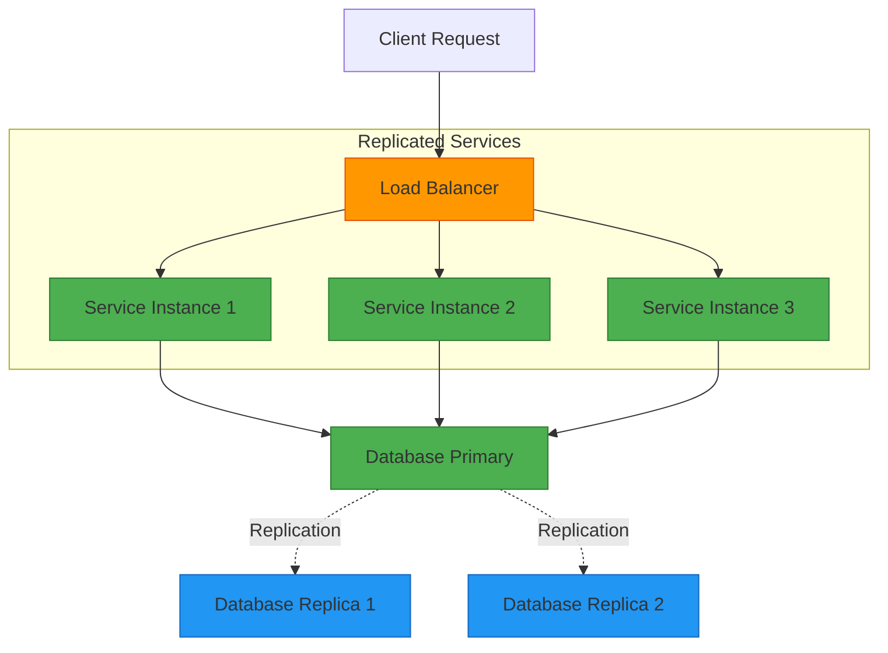
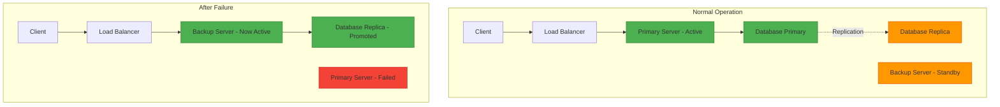
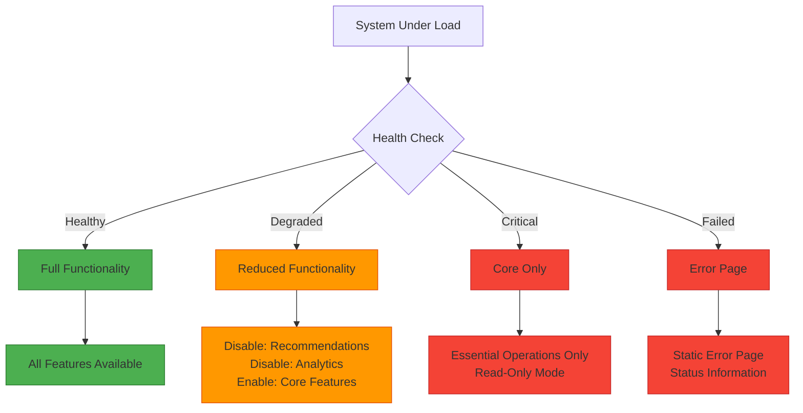
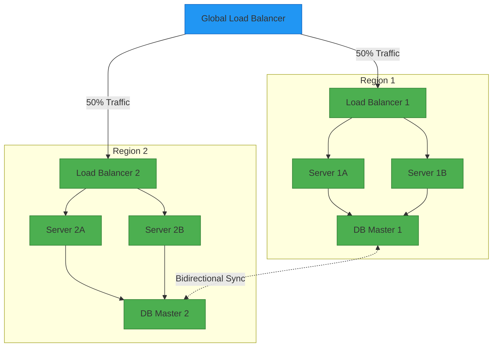
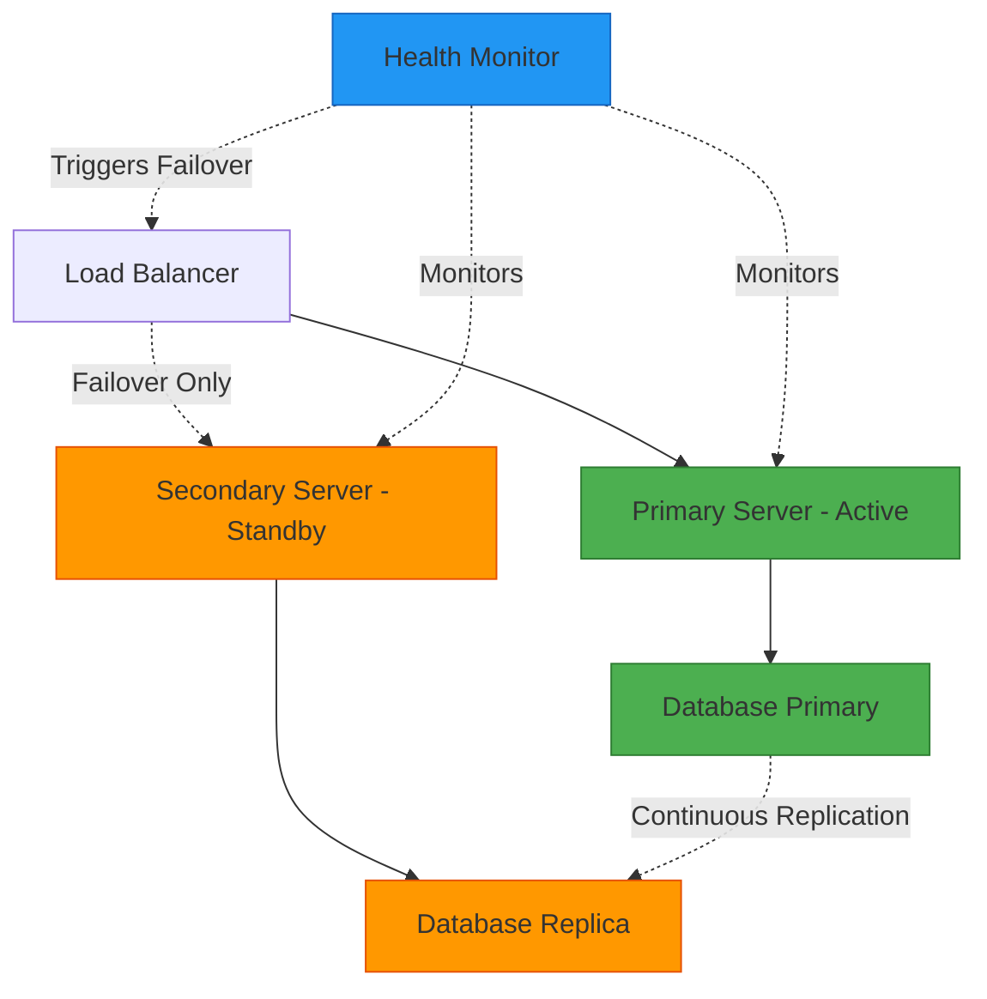
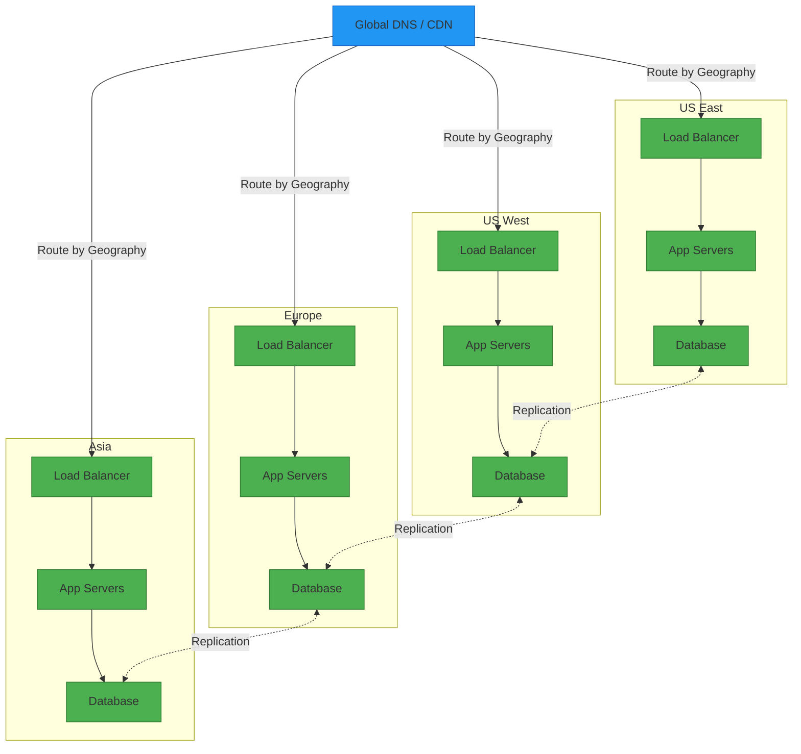
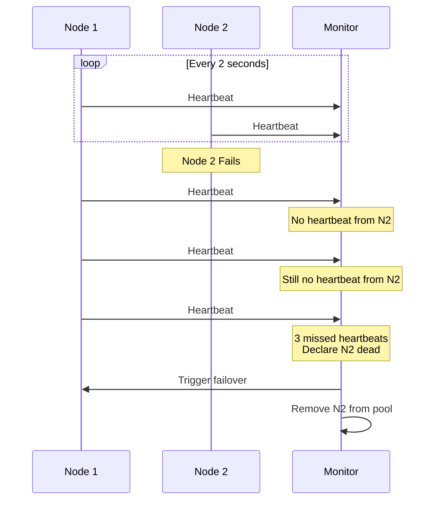
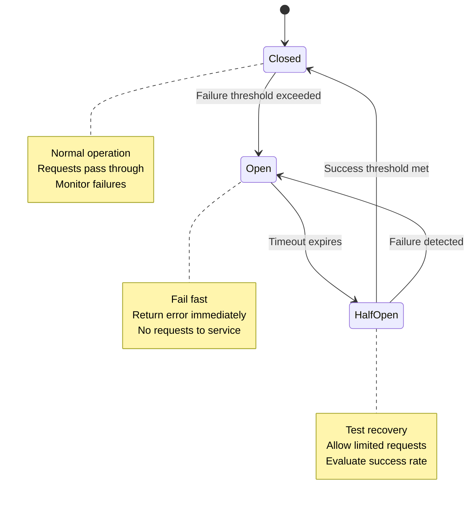
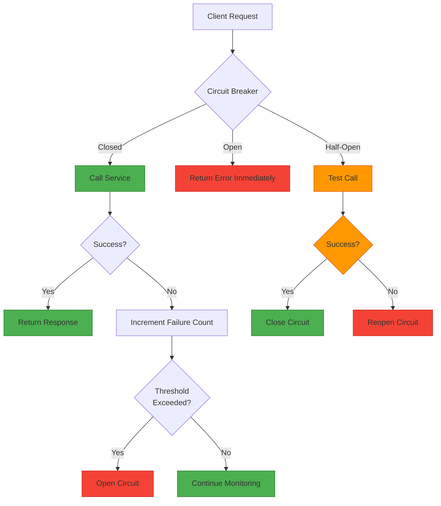
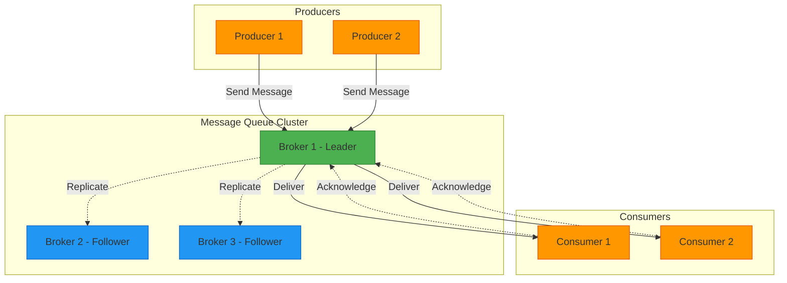

# Fault Tolerance for System Design Interviews

## 📋 Table of Contents

1. [Fault Tolerance Fundamentals](#fault-tolerance-fundamentals)
2. [Types of Failures](#types-of-failures)
3. [Fault Tolerance Techniques](#fault-tolerance-techniques)
4. [Redundancy Patterns](#redundancy-patterns)
5. [Failure Detection & Recovery](#failure-detection--recovery)
6. [Circuit Breaker Pattern](#circuit-breaker-pattern)
7. [Common Interview Questions](#common-interview-questions)
8. [Real-World Examples](#real-world-examples)

---

## 🔧 Fault Tolerance Fundamentals

### What is Fault Tolerance?

**Fault Tolerance** is the ability of a system to continue operating properly in the event of the failure of one or more of its components. It ensures that the system remains available and functional even when parts of it fail.

### Key Principles

**Redundancy:**
- Multiple instances of critical components
- No single point of failure (SPOF)
- Backup systems ready to take over

**Isolation:**
- Failures contained to specific components
- Prevents cascading failures
- Bulkhead pattern implementation

**Detection:**
- Continuous health monitoring
- Quick failure identification
- Automated alerting

**Recovery:**
- Automatic failover mechanisms
- Self-healing capabilities
- Graceful degradation

### Why Fault Tolerance Matters

- **Availability:** Keep services running 24/7
- **Reliability:** Maintain consistent performance
- **User Experience:** Prevent service disruptions
- **Business Continuity:** Avoid revenue loss
- **SLA Compliance:** Meet uptime guarantees (99.9%, 99.99%)

### Fault Tolerance vs High Availability

| Aspect | Fault Tolerance | High Availability |
|--------|----------------|-------------------|
| **Goal** | Continue operating despite failures | Minimize downtime |
| **Approach** | Redundancy + automatic failover | Multiple instances + load balancing |
| **Failure Handling** | Transparent to users | Brief interruption possible |
| **Cost** | Higher (duplicate resources) | Medium (shared resources) |
| **Example** | RAID arrays, active-active systems | Load balanced web servers |

---

## 🚨 Types of Failures

### Hardware Failures

**Server Failures:**
- CPU, memory, motherboard failures
- Power supply issues
- Disk crashes

**Network Failures:**
- Switch/router failures
- Cable cuts
- Network congestion

**Storage Failures:**
- Disk failures
- Storage controller issues
- Corruption

**Mitigation:**
- Hardware redundancy (RAID, multiple servers)
- Regular hardware health monitoring
- Predictive maintenance

### Software Failures

**Application Bugs:**
- Memory leaks
- Deadlocks
- Null pointer exceptions
- Race conditions

**Configuration Errors:**
- Wrong settings
- Incompatible versions
- Missing dependencies

**Resource Exhaustion:**
- Out of memory
- Thread pool exhaustion
- Connection pool depletion

**Mitigation:**
- Thorough testing (unit, integration, load)
- Code reviews and static analysis
- Resource limits and monitoring
- Graceful degradation

### Network Failures

**Partition:**
- Network split (split-brain)
- Loss of connectivity between nodes
- CAP theorem implications

**Latency:**
- Slow network responses
- Timeout issues
- Degraded performance

**Packet Loss:**
- Data corruption
- Incomplete messages
- Retransmission overhead

**Mitigation:**
- Retry mechanisms with exponential backoff
- Timeout configurations
- Network redundancy (multiple paths)
- Circuit breakers

### Human Errors

**Operational Mistakes:**
- Accidental deletions
- Wrong commands executed
- Deployment errors

**Configuration Changes:**
- Incorrect settings
- Breaking changes
- Rollback issues

**Mitigation:**
- Automation and infrastructure as code
- Change management processes
- Canary deployments
- Easy rollback mechanisms

---

## 🛡️ Fault Tolerance Techniques

### 1. Replication

**Description:** Maintain multiple copies of data or services across different nodes.

**Types:**
- **Active Replication:** All replicas process requests
- **Passive Replication:** Primary processes, backups standby
- **State Machine Replication:** All replicas execute same operations

**Benefits:**
- Data durability
- Read scalability
- Fault tolerance

**Challenges:**
- Consistency management
- Synchronization overhead
- Conflict resolution



### 2. Checkpointing

**Description:** Periodically save system state to enable recovery from last known good state.

**Types:**
- **Coordinated Checkpointing:** All processes checkpoint together
- **Uncoordinated Checkpointing:** Processes checkpoint independently
- **Communication-Induced Checkpointing:** Hybrid approach

**Use Cases:**
- Long-running computations
- Batch processing
- Stateful services

**Implementation:**
- Save state to persistent storage
- Include timestamp and version
- Cleanup old checkpoints

### 3. Failover

**Description:** Automatically switch to backup system when primary fails.

**Types:**

**Hot Failover:**
- Backup is running and synchronized
- Instant switchover
- No data loss
- High cost

**Warm Failover:**
- Backup is running but not fully synchronized
- Quick switchover (seconds to minutes)
- Minimal data loss
- Medium cost

**Cold Failover:**
- Backup needs to be started
- Slower switchover (minutes to hours)
- Possible data loss
- Low cost



### 4. Retry Mechanisms

**Description:** Automatically retry failed operations with intelligent backoff.

**Strategies:**

**Immediate Retry:**
- Retry immediately after failure
- Good for transient network glitches
- Risk of overwhelming failing service

**Fixed Delay:**
- Wait fixed time between retries
- Simple to implement
- May not be optimal

**Exponential Backoff:**
- Increase delay exponentially (1s, 2s, 4s, 8s)
- Prevents overwhelming service
- Industry standard

**Exponential Backoff with Jitter:**
- Add randomness to delay
- Prevents thundering herd
- Best practice

**Implementation Guidelines:**
```
Max Retries: 3-5 attempts
Initial Delay: 100ms - 1s
Max Delay: 30s - 60s
Jitter: ±25% of delay
Idempotency: Required for safe retries
```

### 5. Graceful Degradation

**Description:** Reduce functionality instead of complete failure when resources are limited.

**Strategies:**

**Feature Toggling:**
- Disable non-critical features
- Maintain core functionality
- Example: Disable recommendations, keep checkout

**Quality Reduction:**
- Lower quality of service
- Example: Reduce image quality, limit search results

**Read-Only Mode:**
- Allow reads, block writes
- Useful during database issues
- Prevents data corruption

**Cached Responses:**
- Serve stale data
- Better than no data
- Add staleness indicator



---

## 🔄 Redundancy Patterns

### 1. Active-Active (N+N Redundancy)

**Description:** All instances actively handle requests simultaneously.

**Characteristics:**
- Load distributed across all instances
- No wasted resources
- Maximum utilization
- Complex consistency management

**Use Cases:**
- Web servers
- Stateless services
- Read-heavy workloads

**Pros:**
- ✅ High resource utilization
- ✅ Load balancing built-in
- ✅ Horizontal scalability

**Cons:**
- ❌ Complex state management
- ❌ Consistency challenges
- ❌ Potential conflicts



### 2. Active-Passive (N+1 Redundancy)

**Description:** Primary instance handles requests, backup stands by for failover.

**Characteristics:**
- One active, others standby
- Simple consistency model
- Resource overhead
- Failover delay

**Use Cases:**
- Databases (primary-replica)
- Stateful services
- Legacy applications

**Pros:**
- ✅ Simple to implement
- ✅ Strong consistency
- ✅ Clear primary

**Cons:**
- ❌ Wasted standby resources
- ❌ Failover time required
- ❌ No load distribution



### 3. N+M Redundancy

**Description:** N active instances with M spare instances for redundancy.

**Example:** 3+2 means 3 active, 2 spare

**Characteristics:**
- Balance between cost and reliability
- Spares can cover multiple failures
- Common in hardware systems

**Use Cases:**
- Data centers
- Server clusters
- Storage systems

**Calculation:**
```
Availability = 1 - (probability of > M failures out of N+M)

Example: 3+2 configuration
- Can tolerate 2 simultaneous failures
- Better than 3+1 but cheaper than 3+3
```

### 4. Geographic Redundancy

**Description:** Replicate across different geographic locations.

**Benefits:**
- Disaster recovery
- Reduced latency (serve from nearest location)
- Regulatory compliance

**Challenges:**
- Network latency between regions
- Data consistency
- Higher cost



---

## 🔍 Failure Detection & Recovery

### Health Checks

**Types:**

**Shallow Health Check:**
- Simple ping or HTTP 200 response
- Fast (< 100ms)
- Doesn't verify dependencies
- Good for basic liveness

**Deep Health Check:**
- Verify database connectivity
- Check external dependencies
- Validate critical functionality
- Slower but more accurate

**Passive Health Check:**
- Monitor actual request success/failure
- No additional overhead
- Real-world accuracy
- Used by load balancers

**Implementation:**
```
Endpoint: /health or /healthz
Frequency: Every 5-30 seconds
Timeout: 1-5 seconds
Failure Threshold: 2-3 consecutive failures
Success Threshold: 2 consecutive successes
```

### Heartbeat Mechanism

**Description:** Periodic signals sent between nodes to indicate liveness.

**Implementation:**
- Node sends heartbeat every N seconds
- If heartbeat missed for M intervals, node considered dead
- Typical values: N=1-5s, M=3-5

**Use Cases:**
- Distributed systems
- Cluster management
- Leader election



### Failure Detection Patterns

**Timeout-Based:**
- Set timeout for operations
- If timeout exceeded, consider failed
- Simple but may have false positives

**Threshold-Based:**
- Track error rate
- If error rate > threshold, mark unhealthy
- Example: > 5% error rate

**Trend-Based:**
- Monitor metrics over time
- Detect degradation patterns
- Predictive failure detection

### Recovery Strategies

**Automatic Recovery:**
- Restart failed process
- Failover to backup
- Self-healing systems
- No human intervention

**Manual Recovery:**
- Human investigation required
- Complex failure scenarios
- Data integrity concerns
- Compliance requirements

**Hybrid Recovery:**
- Automatic for known failures
- Manual for unknown failures
- Escalation policies
- Best of both worlds

---

## ⚡ Circuit Breaker Pattern

### What is a Circuit Breaker?

**Description:** Prevents cascading failures by stopping requests to failing services.

**Analogy:** Like electrical circuit breaker - stops flow when problem detected.

### Circuit Breaker States



### State Details

**Closed State (Normal):**
- All requests pass through
- Monitor failure rate
- If failures exceed threshold → Open

**Open State (Failing):**
- Immediately return error
- Don't call failing service
- After timeout → Half-Open

**Half-Open State (Testing):**
- Allow limited test requests
- If successful → Closed
- If failed → Open

### Configuration Parameters

```
Failure Threshold: 50% error rate or 5 consecutive failures
Timeout: 30-60 seconds (time in Open state)
Success Threshold: 2-3 successful requests in Half-Open
Request Volume Threshold: Minimum 20 requests before evaluation
```

### Implementation Example



### Benefits

- **Prevent Cascading Failures:** Stop calling failing service
- **Fast Failure:** Return error immediately, don't wait for timeout
- **Automatic Recovery:** Test service recovery automatically
- **Resource Protection:** Prevent thread/connection exhaustion
- **Monitoring:** Clear signal of service health

### Use Cases

- Microservices communication
- External API calls
- Database connections
- Third-party integrations

---

## ❓ Common Interview Questions

### Q1: "Design a fault-tolerant system for an e-commerce checkout service"

**Answer:**

**Requirements Analysis:**
- Critical path: Payment processing
- High availability needed (99.99%)
- Data consistency crucial
- Low latency required

**Architecture:**

1. **Service Layer:**
   - Active-Active deployment across 3 availability zones
   - Load balancer with health checks
   - Stateless application servers
   - Auto-scaling based on load

2. **Database Layer:**
   - Primary-Replica setup (1 primary, 2 replicas)
   - Synchronous replication to 1 replica (strong consistency)
   - Asynchronous to 2nd replica (read scaling)
   - Automatic failover with health checks

3. **Payment Processing:**
   - Idempotent payment operations
   - Retry with exponential backoff
   - Circuit breaker for payment gateway
   - Transaction logging for reconciliation

4. **Failure Handling:**
   - If payment gateway down: Circuit breaker opens, queue orders
   - If database primary fails: Promote replica automatically
   - If AZ fails: Route traffic to other AZs
   - If all fails: Graceful degradation (show maintenance page)

**Trade-offs:**
- Cost: Higher due to redundancy
- Complexity: More components to manage
- Consistency: Some replication lag acceptable for reads
- Latency: Synchronous replication adds ~5-10ms

### Q2: "How would you handle a split-brain scenario in a distributed database?"

**Answer:**

**Problem:** Network partition causes two nodes to both think they're primary.

**Solutions:**

1. **Quorum-Based Approach:**
   - Require majority (N/2 + 1) for writes
   - Partition with minority becomes read-only
   - Example: 5 nodes, need 3 for quorum
   - Used by: Cassandra, MongoDB, Consul

2. **Fencing:**
   - Use external coordinator (ZooKeeper, etcd)
   - Acquire lock before becoming primary
   - Only one can hold lock
   - Prevents dual primary

3. **STONITH (Shoot The Other Node In The Head):**
   - Forcibly shut down suspected failed node
   - Aggressive but prevents split-brain
   - Used in critical systems

4. **Witness Node:**
   - Third node acts as tie-breaker
   - Doesn't store data, just votes
   - Cheap way to achieve quorum

**Best Practice:**
- Use odd number of nodes (3, 5, 7)
- Implement fencing mechanisms
- Monitor for split-brain conditions
- Have automated recovery procedures

### Q3: "Explain the difference between fail-fast and fail-safe strategies"

**Answer:**

| Aspect | Fail-Fast | Fail-Safe |
|--------|-----------|-----------|
| **Philosophy** | Detect and report errors immediately | Continue operating despite errors |
| **Behavior** | Stop execution on error | Attempt recovery or degradation |
| **Use Case** | Data integrity critical | Availability critical |
| **Example** | Database transaction rollback | Serve cached data when DB down |
| **Pros** | Prevents corruption, clear errors | Better availability, user experience |
| **Cons** | Service interruption | May serve stale/incorrect data |

**When to Use:**

**Fail-Fast:**
- Financial transactions
- Data mutations
- Critical operations
- Development/testing

**Fail-Safe:**
- Read operations
- Content delivery
- Non-critical features
- User-facing services

**Hybrid Approach:**
- Fail-fast for writes
- Fail-safe for reads
- Best of both worlds

### Q4: "How do you test fault tolerance in a system?"

**Answer:**

**Testing Strategies:**

1. **Chaos Engineering:**
   - Randomly inject failures in production
   - Tools: Chaos Monkey, Gremlin, Chaos Toolkit
   - Start small, increase scope gradually
   - Example: Randomly terminate instances

2. **Fault Injection Testing:**
   - Deliberately introduce failures
   - Test specific scenarios
   - Controlled environment
   - Examples:
     - Kill processes
     - Introduce network latency
     - Fill disk space
     - Corrupt data

3. **Load Testing with Failures:**
   - Combine load testing with fault injection
   - Test system under stress + failures
   - Tools: Gatling, JMeter + Chaos tools
   - Validates real-world scenarios

4. **Game Days:**
   - Scheduled failure simulation exercises
   - Entire team participates
   - Practice incident response
   - Document learnings

**Test Scenarios:**
- Single node failure
- Multiple simultaneous failures
- Network partition
- Cascading failures
- Resource exhaustion
- Slow dependencies

**Metrics to Track:**
- Recovery time
- Data loss (if any)
- Error rates during failure
- User impact
- Alert effectiveness

### Q5: "Design a fault-tolerant message queue system"

**Answer:**

**Requirements:**
- No message loss
- At-least-once delivery
- High throughput
- Fault tolerance

**Architecture:**

1. **Queue Brokers:**
   - 3+ broker nodes (odd number)
   - Leader election (Raft/Paxos)
   - Replicate messages across brokers
   - Quorum writes for durability

2. **Message Persistence:**
   - Write to disk before acknowledging
   - Replicate to N brokers (N=3 typical)
   - Acknowledge after quorum writes
   - Periodic checkpointing

3. **Producer Handling:**
   - Producer retries on failure
   - Idempotent message IDs
   - Acknowledgment from broker
   - Timeout and retry logic

4. **Consumer Handling:**
   - Consumer acknowledges after processing
   - Message redelivery if no ack
   - Dead letter queue for failed messages
   - Consumer group for load distribution

5. **Failure Scenarios:**

**Broker Failure:**
- Leader election if leader fails
- Redirect to new leader
- No message loss (replicated)

**Producer Failure:**
- Message may not be sent
- Producer retries on restart
- Idempotency prevents duplicates

**Consumer Failure:**
- Message not acknowledged
- Redelivered to another consumer
- At-least-once delivery guaranteed

**Network Partition:**
- Quorum-based writes
- Partition with minority read-only
- Prevents split-brain



---

## 🏢 Real-World Examples

### Amazon S3

**Fault Tolerance Features:**
- 99.999999999% (11 nines) durability
- Automatically replicates across 3+ AZs
- Checksums for data integrity
- Versioning for accidental deletes
- Cross-region replication

**Techniques:**
- Erasure coding for storage efficiency
- Automatic healing of corrupted data
- Multiple copies in different failure domains
- Continuous background verification

**Lesson:** Over-engineering durability pays off for storage systems

### Netflix

**Fault Tolerance Strategy:**
- Chaos Monkey: Randomly terminates instances
- Chaos Kong: Simulates entire region failure
- Latency Monkey: Introduces artificial delays
- Conformity Monkey: Shuts down non-compliant instances

**Architecture:**
- Stateless microservices
- Circuit breakers for all service calls
- Fallbacks for every dependency
- Aggressive timeouts (1-2 seconds)

**Results:**
- Can lose entire AWS region without outage
- Automatic recovery from most failures
- Continuous testing builds confidence

**Lesson:** Continuous chaos testing builds resilient systems

### Google Spanner

**Fault Tolerance Features:**
- Synchronous replication across regions
- Paxos consensus for consistency
- Automatic failover
- Global distribution

**Techniques:**
- 5 replicas per data shard
- Quorum reads and writes
- TrueTime API for global consistency
- Automatic re-replication on failure

**Trade-offs:**
- Higher latency (cross-region sync)
- Complex implementation
- Higher cost
- Strong consistency guarantee

**Lesson:** Can achieve strong consistency with fault tolerance, but at a cost

### GitHub (2018 Incident)

**Incident:** Network partition between US East and West coast

**Impact:**
- 24 hours of degraded service
- Some data inconsistency
- Manual intervention required

**Root Cause:**
- Split-brain in MySQL cluster
- Both sides accepted writes
- Conflicting data

**Lessons Learned:**
- Improved fencing mechanisms
- Better monitoring for split-brain
- Automated detection and recovery
- Regular DR drills

**Lesson:** Even well-designed systems can fail; testing is crucial

---

## ✅ Quick Summary (What to Memorize)

**Key Concepts:**
- **Fault Tolerance:** Continue operating despite failures
- **Redundancy:** No single point of failure
- **Failover:** Automatic switch to backup
- **Circuit Breaker:** Prevent cascading failures

**Fault Tolerance Techniques:**
1. **Replication:** Multiple copies of data/services
2. **Checkpointing:** Save state periodically
3. **Failover:** Switch to backup automatically
4. **Retry:** Exponential backoff with jitter
5. **Graceful Degradation:** Reduce functionality, not fail completely

**Redundancy Patterns:**
- **Active-Active:** All instances serve traffic
- **Active-Passive:** Primary serves, backup standby
- **N+M:** N active, M spare
- **Geographic:** Across multiple regions

**Circuit Breaker States:**
- **Closed:** Normal operation
- **Open:** Fail fast, don't call service
- **Half-Open:** Test if service recovered

**Testing:**
- Chaos engineering
- Fault injection
- Game days
- Load testing with failures

**Interview Tips:**
- Always ask about failure scenarios
- Discuss trade-offs (cost, complexity, consistency)
- Mention specific techniques (circuit breaker, retry, replication)
- Consider cascading failures
- Think about monitoring and alerting
- Discuss testing strategies

**Common Failure Scenarios to Address:**
- Single node failure
- Network partition
- Cascading failures
- Resource exhaustion
- Data center outage
- Slow dependencies

---
