# Horizontal Scaling for System Design Interviews

## 📋 Table of Contents

1. [Horizontal Scaling Fundamentals](#horizontal-scaling-fundamentals)
2. [When to Use Horizontal Scaling](#when-to-use-horizontal-scaling)
3. [Load Balancing Strategies](#load-balancing-strategies)
4. [Stateless vs Stateful Architecture](#stateless-vs-stateful-architecture)
5. [Data Partitioning & Sharding](#data-partitioning--sharding)
6. [Challenges & Solutions](#challenges--solutions)
7. [Common Interview Questions](#common-interview-questions)
8. [Real-World Examples](#real-world-examples)

---

## 🔧 Horizontal Scaling Fundamentals

### What is Horizontal Scaling?

**Horizontal Scaling (Scale Out)** is the process of adding more machines/nodes to your system to handle increased load. Instead of making a single machine more powerful, you distribute the workload across multiple machines.

**Key Concept:** More machines = More capacity

### Core Principles

**Distribution:**
- Workload spread across multiple nodes
- Each node handles a portion of requests
- Parallel processing capability

**Redundancy:**
- Multiple nodes provide fault tolerance
- No single point of failure
- High availability built-in

**Elasticity:**
- Add/remove nodes dynamically
- Scale based on demand
- Pay for what you use (cloud)

**Linear Scalability:**
- Ideally: 2x nodes = 2x capacity
- Reality: Diminishing returns due to coordination overhead

### Why Horizontal Scaling?

**Advantages:**
- ✅ **Unlimited Growth:** Keep adding nodes as needed
- ✅ **Fault Tolerance:** One node failure doesn't bring down system
- ✅ **Cost-Effective:** Use commodity hardware
- ✅ **High Availability:** Redundancy built-in
- ✅ **Geographic Distribution:** Nodes in different regions

**Disadvantages:**
- ❌ **Complexity:** More moving parts to manage
- ❌ **Data Consistency:** Harder to maintain across nodes
- ❌ **Network Overhead:** Communication between nodes
- ❌ **Coordination Cost:** Distributed consensus is expensive

### Horizontal vs Vertical Scaling

| Aspect | Horizontal Scaling | Vertical Scaling |
|--------|-------------------|------------------|
| **Approach** | Add more machines | Add more power to existing machine |
| **Scalability Limit** | Nearly unlimited | Hardware limits (CPU, RAM max) |
| **Cost** | Linear, commodity hardware | Exponential, specialized hardware |
| **Complexity** | High (distributed systems) | Low (single machine) |
| **Downtime** | Zero (add nodes live) | Required (upgrade hardware) |
| **Fault Tolerance** | High (redundancy) | Low (single point of failure) |
| **Use Case** | Web servers, microservices | Databases, legacy apps |


---

## 📊 When to Use Horizontal Scaling

### Ideal Scenarios

**Web Applications:**
- Stateless HTTP servers
- API gateways
- Microservices architecture
- Content delivery

**Read-Heavy Workloads:**
- Social media feeds
- News websites
- E-commerce product catalogs
- Search engines

**Distributed Processing:**
- Big data analytics (Hadoop, Spark)
- Video encoding
- Machine learning training
- Batch processing

**Global Applications:**
- Multi-region deployment
- Low latency requirements
- Geographic redundancy
- CDN-like services

### When NOT to Use Horizontal Scaling

**Tightly Coupled Systems:**
- Monolithic applications with shared state
- Complex transactions requiring ACID guarantees
- Real-time systems with strict consistency

**Small Scale:**
- Low traffic applications
- Development/testing environments
- Cost of complexity > benefit

**Data-Intensive Single Operations:**
- Large in-memory computations
- Single-threaded workloads
- Operations requiring full dataset

---

## ⚖️ Load Balancing Strategies

### What is Load Balancing?

**Load Balancer** distributes incoming requests across multiple servers to ensure no single server is overwhelmed.

### Load Balancing Algorithms

#### 1. Round Robin

**Description:** Distribute requests sequentially to each server in rotation.

**How it works:**
- Request 1 → Server A
- Request 2 → Server B
- Request 3 → Server C
- Request 4 → Server A (repeat)

**Pros:**
- ✅ Simple to implement
- ✅ Fair distribution
- ✅ No server state needed

**Cons:**
- ❌ Ignores server load
- ❌ Ignores server capacity
- ❌ No session affinity

**Use Case:** Stateless applications with uniform requests

#### 2. Weighted Round Robin

**Description:** Assign weights to servers based on capacity; more powerful servers get more requests.

**Example:**
- Server A (weight=3): Gets 3 requests
- Server B (weight=2): Gets 2 requests
- Server C (weight=1): Gets 1 request

**Use Case:** Heterogeneous server capacities

#### 3. Least Connections

**Description:** Send request to server with fewest active connections.

**How it works:**
- Track active connections per server
- Route new request to server with minimum connections
- Update connection count

**Pros:**
- ✅ Better load distribution
- ✅ Adapts to varying request durations
- ✅ Prevents overload

**Cons:**
- ❌ Requires connection tracking
- ❌ More complex

**Use Case:** Long-lived connections, varying request times

#### 4. Least Response Time

**Description:** Route to server with fastest response time and fewest connections.

**Metrics:**
- Average response time
- Current active connections
- Combine both for decision

**Use Case:** Performance-critical applications

#### 5. IP Hash / Session Affinity

**Description:** Hash client IP to determine server; same client always goes to same server.

**How it works:**
```
server_index = hash(client_ip) % number_of_servers
```

**Pros:**
- ✅ Session persistence
- ✅ Cache locality
- ✅ Stateful applications

**Cons:**
- ❌ Uneven distribution
- ❌ Server failure disrupts sessions
- ❌ Not truly stateless

**Use Case:** Shopping carts, user sessions

```mermaid
graph TB
    A[Client Requests] --> B[Load Balancer]
    
    B -->|Round Robin| C[Server 1]
    B -->|Round Robin| D[Server 2]
    B -->|Round Robin| E[Server 3]
    
    B -->|Least Connections| F[Server 1<br/>5 connections]
    B -->|Least Connections| G[Server 2<br/>3 connections ✓]
    B -->|Least Connections| H[Server 3<br/>7 connections]
    
    B -->|IP Hash| I[Server 1<br/>Client A]
    B -->|IP Hash| J[Server 2<br/>Client B]
    B -->|IP Hash| K[Server 3<br/>Client C]
    
    classDef lb fill:#FF9800,stroke:#E65100
    classDef server fill:#4CAF50,stroke:#2E7D32
    classDef selected fill:#2196F3,stroke:#1565C0
    class B lb
    class C,D,E,F,H,I,J,K server
    class G selected
```



### Load Balancer Types

**Layer 4 (Transport Layer):**
- Routes based on IP and port
- Fast, low overhead
- No content inspection
- Example: TCP/UDP load balancing

**Layer 7 (Application Layer):**
- Routes based on HTTP headers, cookies, URL path
- Content-aware routing
- SSL termination
- Example: Route /api/* to API servers, /images/* to CDN

**Hardware vs Software:**
- **Hardware:** F5, Citrix NetScaler (expensive, high performance)
- **Software:** Nginx, HAProxy, AWS ELB (flexible, cost-effective)

---

## 🔄 Stateless vs Stateful Architecture

### Stateless Architecture

**Definition:** Each request contains all information needed; server doesn't store client state.

**Characteristics:**
- No session data on server
- Any server can handle any request
- Perfect for horizontal scaling
- Session data in client (JWT) or external store (Redis)

**Example:**
```
Request: GET /user/profile
Headers: Authorization: Bearer <JWT_TOKEN>
Server: Decode token, fetch data, return response
No server-side session storage
```

**Advantages:**
- ✅ Easy to scale horizontally
- ✅ No session replication needed
- ✅ Server failure doesn't lose state
- ✅ Simple load balancing

**Disadvantages:**
- ❌ Larger request size (token in each request)
- ❌ Token validation overhead
- ❌ Limited session data size


### Stateful Architecture

**Definition:** Server maintains client state between requests.

**Characteristics:**
- Session data stored on server
- Client must return to same server (sticky sessions)
- Harder to scale horizontally
- Session replication needed for HA

**Example:**
```
Request 1: Login → Server stores session in memory
Request 2: Add to cart → Server updates session
Request 3: Checkout → Server reads session
```

**Advantages:**
- ✅ Smaller request size
- ✅ Faster (no token validation)
- ✅ More session data capacity
- ✅ Simpler client logic

**Disadvantages:**
- ❌ Sticky sessions required
- ❌ Session replication overhead
- ❌ Server failure loses sessions
- ❌ Harder to scale

### Making Stateful Apps Stateless

**1. External Session Store:**
- Store sessions in Redis/Memcached
- All servers access shared session store
- Enables stateless architecture

**2. Client-Side Sessions:**
- Use JWT tokens
- Store session data in token
- Server validates token signature

**3. Database-Backed Sessions:**
- Store sessions in database
- Slower but persistent
- Good for long-lived sessions


---

## 🗂️ Data Partitioning & Sharding

### Why Partition Data?

**Problem:** Single database can't handle all data or traffic.

**Solution:** Split data across multiple databases (shards).

### Sharding Strategies

#### 1. Hash-Based Sharding

**Description:** Hash shard key to determine shard.

**Algorithm:**
```
shard_id = hash(user_id) % number_of_shards
```

**Pros:**
- ✅ Even distribution
- ✅ Simple to implement
- ✅ No hotspots

**Cons:**
- ❌ Adding shards requires rehashing (rebalancing)
- ❌ Range queries difficult

#### 2. Range-Based Sharding

**Description:** Assign ranges of shard key to shards.

**Example:**
```
Shard 1: user_id 1-1M
Shard 2: user_id 1M-2M
Shard 3: user_id 2M-3M
```

**Pros:**
- ✅ Range queries efficient
- ✅ Easy to add shards
- ✅ Predictable

**Cons:**
- ❌ Hotspots (new users on latest shard)
- ❌ Uneven distribution

#### 3. Geographic Sharding

**Description:** Shard by geographic location.

**Example:**
```
Shard 1: US users
Shard 2: EU users
Shard 3: Asia users
```

**Pros:**
- ✅ Low latency (data close to users)
- ✅ Regulatory compliance
- ✅ Natural partitioning

**Cons:**
- ❌ Uneven distribution
- ❌ Cross-region queries expensive


### Consistent Hashing

**Problem:** Adding/removing shards with simple hash causes massive data movement.

**Solution:** Consistent hashing minimizes data movement.

**How it works:**
1. Hash both servers and keys to a ring (0-2^32)
2. Key goes to next server clockwise on ring
3. Adding server only affects adjacent keys
4. Virtual nodes for better distribution

**Benefits:**
- Only K/N keys move when adding/removing server (K=keys, N=servers)
- Simple hash: All keys rehashed

**Use Case:** Distributed caches (Memcached, Redis Cluster), CDNs

---

## 🚧 Challenges & Solutions

### 1. Data Consistency

**Challenge:** Keeping data consistent across multiple nodes.

**Solutions:**
- **Eventual Consistency:** Accept temporary inconsistency, data converges over time
- **Strong Consistency:** Use distributed consensus (Paxos, Raft)
- **CAP Theorem:** Choose 2 of 3 (Consistency, Availability, Partition Tolerance)

### 2. Session Management

**Challenge:** User sessions in distributed environment.

**Solutions:**
- **External Session Store:** Redis, Memcached (best practice)
- **Stateless with JWT:** Token-based authentication
- **Sticky Sessions:** Route user to same server (limits scalability)

### 3. Distributed Caching

**Challenge:** Cache invalidation across nodes.

**Solutions:**
- **Cache-Aside Pattern:** Application manages cache
- **Write-Through Cache:** Write to cache and DB simultaneously
- **TTL-based expiration:** Time-based invalidation

---

## ❓ Common Interview Questions

### Q1: "Design a horizontally scalable URL shortener service"

**Answer:**

**Architecture:**

1. **Application Layer:** Stateless web servers behind load balancer, auto-scaling
2. **URL Generation:** Base62 encoding, distributed ID generator (Snowflake)
3. **Database:** Shard by hash(short_url), replicas for read scaling
4. **Caching:** Redis for hot URLs, cache-aside pattern, 24h TTL

**Read Flow:** Check cache → Cache miss → Query shard → Update cache → Redirect

**Write Flow:** Generate unique ID → Base62 encode → Write to shard → Return

### Q2: "When would you choose horizontal over vertical scaling?"

**Choose Horizontal When:**
- High availability required (redundancy)
- Unlimited growth potential
- Geographic distribution needed
- Stateless workloads

**Choose Vertical When:**
- Simplicity needed
- Tight coupling (monolithic apps)
- Small to medium scale
- Immediate solution required

**Best Practice:** Start vertical, move to horizontal as you grow

---

## 🏢 Real-World Examples

### Netflix

**Scale:** 200M+ subscribers, billions of requests/day

**Strategy:**
- 1000+ microservices, each scales independently
- Auto-scaling based on demand
- Multi-region active-active
- EVCache distributed caching

**Lesson:** Extreme horizontal scaling enables global resilience

### Facebook/Meta

**Scale:** 3B+ users, trillions of posts

**Strategy:**
- MySQL sharded by user_id (thousands of shards)
- Massive Memcached deployment
- TAO distributed cache
- Hybrid fan-out for feeds

**Lesson:** Sharding + caching enables massive scale

### Amazon

**Scale:** Millions of products, millions of transactions/day

**Strategy:**
- Service-oriented architecture
- DynamoDB with automatic sharding
- Independent service scaling
- Microservices with two-pizza teams

**Lesson:** Service-oriented architecture enables independent scaling

---

## ✅ Quick Summary

**Key Concepts:**
- **Horizontal Scaling:** Add more machines (scale out)
- **Stateless:** Each request independent, any server can handle
- **Load Balancing:** Distribute requests across servers
- **Sharding:** Split data across databases

**Load Balancing Algorithms:**
- **Round Robin:** Sequential distribution
- **Least Connections:** Route to least busy server
- **IP Hash:** Same client → same server

**Sharding Strategies:**
- **Hash-Based:** Even distribution, hard to rebalance
- **Range-Based:** Easy to add shards, hotspots possible
- **Geographic:** Low latency, regulatory compliance
- **Consistent Hashing:** Minimal data movement

**Stateless Architecture:**
- No server-side sessions
- JWT tokens or external session store
- Perfect for horizontal scaling

**When to Use:**
- ✅ High availability needed
- ✅ Unlimited growth expected
- ✅ Stateless workloads
- ✅ Geographic distribution

**Interview Tips:**
- Always discuss load balancing strategy
- Mention stateless architecture
- Consider data sharding approach
- Discuss consistency trade-offs
- Think about session management

---
