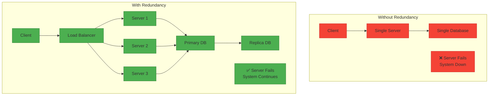
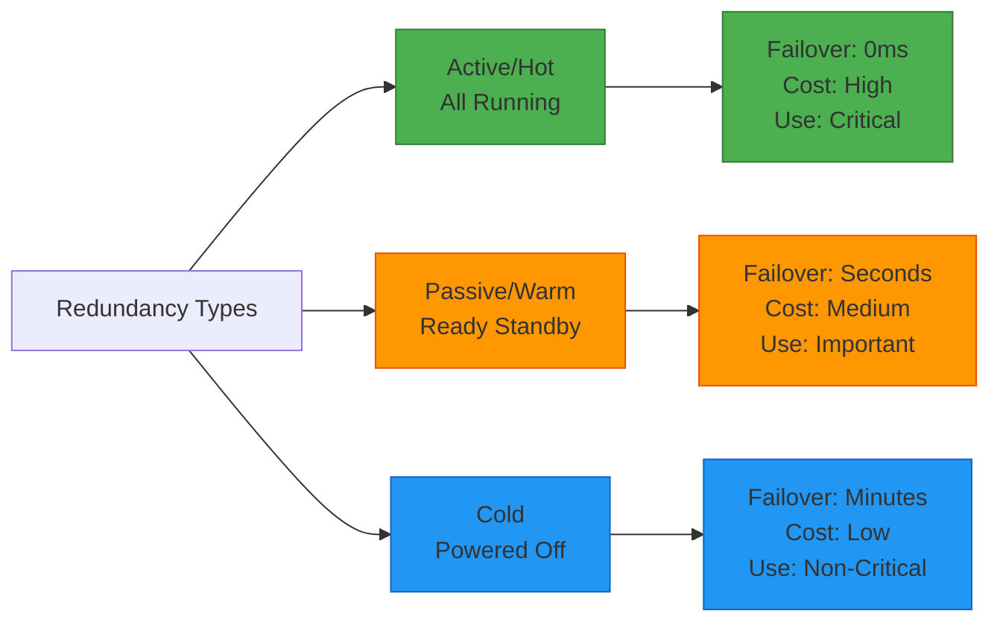
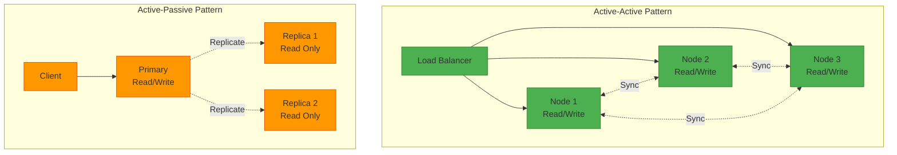
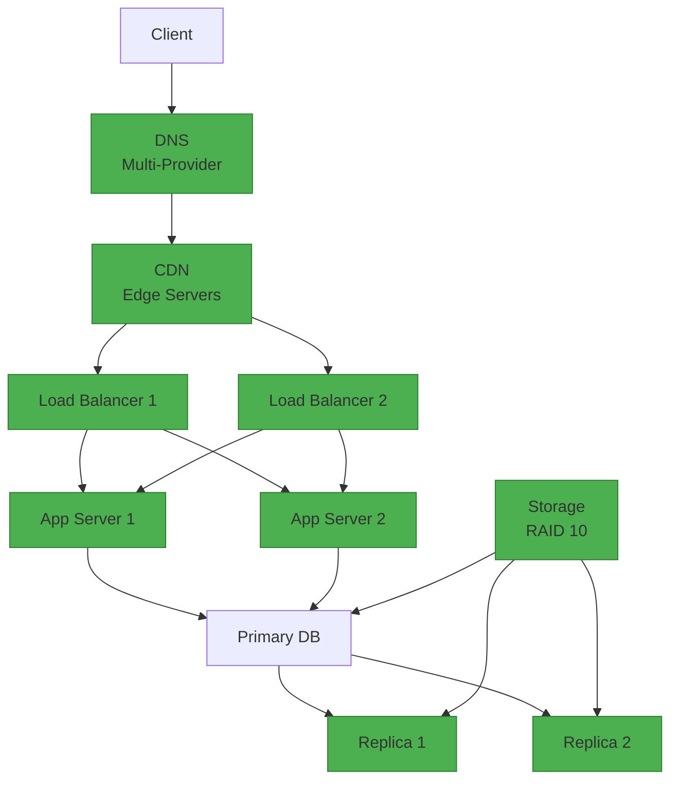

# Redundancy for System Design Interviews

## 📋 Table of Contents

1. [Redundancy Fundamentals](#redundancy-fundamentals)
2. [Types of Redundancy](#types-of-redundancy)
3. [Redundancy Patterns](#redundancy-patterns)
4. [Implementation Strategies](#implementation-strategies)
5. [Data Redundancy](#data-redundancy)
6. [Network Redundancy](#network-redundancy)
7. [Common Interview Questions](#common-interview-questions)
8. [Real-World Examples](#real-world-examples)

---

## 🔧 Redundancy Fundamentals

### What is Redundancy?

**Redundancy** is the duplication of critical components or functions of a system with the intention of increasing reliability, availability, and fault tolerance. It ensures that if one component fails, another can take over seamlessly.

**Key Concept:** Backup everything critical = No single point of failure

### Core Principles

**Duplication:**
- Multiple copies of components
- Backup systems ready to take over
- Eliminate single points of failure

**Availability:**
- System remains operational during failures
- Minimal downtime
- Continuous service delivery

**Fault Tolerance:**
- System continues functioning despite failures
- Graceful degradation
- Automatic failover

**Trade-offs:**
- Cost vs reliability
- Complexity vs simplicity
- Performance vs redundancy

### Why Redundancy?

**Advantages:**
- ✅ **High Availability:** 99.99%+ uptime possible
- ✅ **Fault Tolerance:** Survive component failures
- ✅ **No Single Point of Failure:** Multiple backups
- ✅ **Disaster Recovery:** Quick recovery from failures
- ✅ **Load Distribution:** Spread traffic across replicas
- ✅ **Maintenance Without Downtime:** Update one while others serve

**Disadvantages:**
- ❌ **Increased Cost:** More hardware/infrastructure
- ❌ **Complexity:** More components to manage
- ❌ **Data Consistency:** Keeping replicas in sync
- ❌ **Network Overhead:** Replication traffic
- ❌ **Storage Cost:** Multiple copies of data



### Availability Calculation

**Single Component:**
```
Availability = Uptime / (Uptime + Downtime)
Example: 99.9% = 8.76 hours downtime/year
```

**Redundant Components (Parallel):**
```
Combined Availability = 1 - (1 - A₁) × (1 - A₂)
Example: Two 99.9% components = 99.9999% (5.26 minutes/year)
```

**Availability Tiers:**

| Availability | Downtime/Year | Downtime/Month | Downtime/Week |
|--------------|---------------|----------------|---------------|
| 99% (Two 9s) | 3.65 days | 7.31 hours | 1.68 hours |
| 99.9% (Three 9s) | 8.77 hours | 43.83 minutes | 10.08 minutes |
| 99.99% (Four 9s) | 52.60 minutes | 4.38 minutes | 1.01 minutes |
| 99.999% (Five 9s) | 5.26 minutes | 26.30 seconds | 6.05 seconds |
| 99.9999% (Six 9s) | 31.56 seconds | 2.63 seconds | 0.61 seconds |

---

## 🔄 Types of Redundancy

### 1. Active Redundancy (Hot Standby)

**Description:** All redundant components are active and processing requests simultaneously.

**Characteristics:**
- All replicas handle traffic
- Load balanced across all nodes
- Immediate failover (no delay)
- Maximum resource utilization

**Example:**
```
Load Balancer → Server 1 (Active)
             → Server 2 (Active)
             → Server 3 (Active)
All servers processing requests
```

**Pros:**
- ✅ Zero failover time
- ✅ Better resource utilization
- ✅ Load distribution
- ✅ Higher throughput

**Cons:**
- ❌ More expensive (all resources active)
- ❌ Complex synchronization
- ❌ Higher operational cost

**Use Case:** High-traffic systems, critical services, web servers

### 2. Passive Redundancy (Warm Standby)

**Description:** Backup components are ready but not actively processing requests until primary fails.

**Characteristics:**
- Primary handles all traffic
- Standby ready to take over
- Quick but not instant failover
- Standby may lag slightly behind primary

**Example:**
```
Primary Server (Active) → Processing requests
Standby Server (Warm)   → Ready, syncing data
On failure: Standby becomes primary
```

**Pros:**
- ✅ Lower cost than active
- ✅ Quick failover (seconds)
- ✅ Simpler than active-active
- ✅ Resource efficient

**Cons:**
- ❌ Brief downtime during failover
- ❌ Standby resources underutilized
- ❌ Potential data lag

**Use Case:** Databases, stateful applications, cost-sensitive systems

### 3. Cold Standby

**Description:** Backup components are offline and must be started when primary fails.

**Characteristics:**
- Backup is powered off
- Manual or automated startup required
- Longer failover time (minutes)
- Lowest cost option

**Example:**
```
Primary Server (Active) → Processing requests
Backup Server (Off)     → Powered down
On failure: Start backup, restore data, switch traffic
```

**Pros:**
- ✅ Lowest cost
- ✅ Simplest setup
- ✅ Good for non-critical systems

**Cons:**
- ❌ Long failover time (minutes to hours)
- ❌ Potential data loss
- ❌ Manual intervention may be needed

**Use Case:** Non-critical systems, backup/archive, disaster recovery



---

## 🎯 Redundancy Patterns

### 1. Active-Active (Multi-Master)

**Description:** Multiple nodes actively handle requests simultaneously, all are equal.

**Architecture:**
```
Client → Load Balancer → Node 1 (Read/Write)
                      → Node 2 (Read/Write)
                      → Node 3 (Read/Write)
```

**Characteristics:**
- All nodes accept reads and writes
- Bi-directional replication
- No single master
- Complex conflict resolution

**Pros:**
- ✅ Maximum availability
- ✅ Best resource utilization
- ✅ Load distribution
- ✅ No failover needed

**Cons:**
- ❌ Complex consistency management
- ❌ Conflict resolution needed
- ❌ Higher complexity

**Use Case:** Distributed databases (Cassandra, DynamoDB), global applications

### 2. Active-Passive (Master-Slave)

**Description:** One primary node handles requests, others are backups.

**Architecture:**
```
Client → Primary (Active) → Handles all writes
         Replica 1 (Passive) → Standby, reads only
         Replica 2 (Passive) → Standby, reads only
```

**Characteristics:**
- Single primary for writes
- Replicas for reads (optional)
- One-way replication
- Automatic failover

**Pros:**
- ✅ Simpler consistency
- ✅ Easier to implement
- ✅ Clear data flow
- ✅ No conflicts

**Cons:**
- ❌ Primary is bottleneck
- ❌ Underutilized replicas
- ❌ Failover delay

**Use Case:** Traditional databases (MySQL, PostgreSQL), file systems

### 3. N+1 Redundancy

**Description:** N components needed, plus 1 backup for any failure.

**Example:**
```
Need 3 servers for capacity
Deploy 4 servers (3+1)
Any 1 can fail, system continues
```

**Calculation:**
```
Capacity needed: 100%
Each server: 33.33%
Deploy 4 servers: 133% capacity
Failure tolerance: 1 server
```

**Pros:**
- ✅ Cost-effective
- ✅ Handles single failure
- ✅ Good balance

**Cons:**
- ❌ Only 1 failure tolerated
- ❌ Multiple failures = downtime

**Use Case:** Web servers, application servers, load balancers

### 4. N+M Redundancy

**Description:** N components needed, plus M backups for multiple failures.

**Example:**
```
Need 5 servers for capacity
Deploy 7 servers (5+2)
Any 2 can fail, system continues
```

**Calculation:**
```
Capacity needed: 100%
Each server: 20%
Deploy 7 servers: 140% capacity
Failure tolerance: 2 servers
```

**Pros:**
- ✅ Handles multiple failures
- ✅ Higher availability
- ✅ Better for critical systems

**Cons:**
- ❌ Higher cost
- ❌ More resources

**Use Case:** Critical infrastructure, financial systems, healthcare

### 5. Geographic Redundancy (Multi-Region)

**Description:** Replicas in different geographic locations.

**Architecture:**
```
US-East Region:  Primary + Replicas
US-West Region:  Replicas
EU Region:       Replicas
Asia Region:     Replicas
```

**Pros:**
- ✅ Disaster recovery
- ✅ Low latency (users → nearest region)
- ✅ Regulatory compliance
- ✅ Survives regional outages

**Cons:**
- ❌ Expensive
- ❌ Complex synchronization
- ❌ Network latency between regions

**Use Case:** Global applications, disaster recovery, CDNs



---

## 🛠️ Implementation Strategies

### 1. Application Layer Redundancy

**Load Balancers:**
- Multiple load balancers (HAProxy, Nginx)
- Health checks and automatic failover
- DNS-based failover
- Anycast routing

**Web Servers:**
- Stateless application servers
- Auto-scaling groups
- Multiple availability zones
- Container orchestration (Kubernetes)

**Example Architecture:**
```
DNS → Load Balancer 1 (Active)
   → Load Balancer 2 (Standby)
   
Load Balancer → Web Server 1
             → Web Server 2
             → Web Server 3
             → Web Server N (Auto-scale)
```

### 2. Database Layer Redundancy

**Replication Types:**

**Synchronous Replication:**
- Write to primary and replica simultaneously
- Strong consistency
- Higher latency
- Use: Financial transactions, critical data

**Asynchronous Replication:**
- Write to primary, replicate later
- Eventual consistency
- Lower latency
- Use: Social media, analytics

**Semi-Synchronous Replication:**
- Wait for at least one replica
- Balance between consistency and performance
- Use: Most production systems

**Database Patterns:**

**Master-Slave:**
```
Primary (Write) → Replica 1 (Read)
               → Replica 2 (Read)
               → Replica 3 (Read)
```

**Master-Master:**
```
Master 1 ←→ Master 2
Both accept writes
Conflict resolution needed
```

**Sharding with Replication:**
```
Shard 1: Primary + 2 Replicas
Shard 2: Primary + 2 Replicas
Shard 3: Primary + 2 Replicas
```

### 3. Storage Layer Redundancy

**RAID (Redundant Array of Independent Disks):**

**RAID 1 (Mirroring):**
- Duplicate data on 2+ disks
- 50% storage efficiency
- Fast reads, same write speed
- Survives 1 disk failure

**RAID 5 (Striping with Parity):**
- Data + parity across 3+ disks
- 67-94% storage efficiency
- Good read performance
- Survives 1 disk failure

**RAID 6 (Double Parity):**
- Data + 2 parity blocks
- 50-88% storage efficiency
- Survives 2 disk failures

**RAID 10 (1+0):**
- Mirroring + Striping
- 50% storage efficiency
- Best performance
- Survives multiple disk failures

**Cloud Storage:**
- S3: 99.999999999% durability (11 9s)
- Multiple copies across availability zones
- Automatic replication
- Versioning and lifecycle policies

### 4. Network Layer Redundancy

**Multiple Network Paths:**
- Redundant switches
- Multiple ISPs
- BGP routing for failover
- VRRP/HSRP for gateway redundancy

**DNS Redundancy:**
- Multiple DNS servers
- Anycast DNS
- Health-based routing
- Failover to backup IPs

**CDN (Content Delivery Network):**
- Distributed edge servers
- Automatic failover
- Geographic redundancy
- DDoS protection



---

## 💾 Data Redundancy

### 1. Database Replication

**Replication Lag:**
- Time between write on primary and availability on replica
- Synchronous: 0 lag, higher latency
- Asynchronous: Some lag, lower latency

**Handling Replication Lag:**
- Read from primary for critical reads
- Use read replicas for analytics
- Implement retry logic
- Monitor lag metrics

### 2. Backup Strategies

**3-2-1 Backup Rule:**
- **3** copies of data
- **2** different media types
- **1** copy offsite

**Backup Types:**

**Full Backup:**
- Complete copy of all data
- Slowest, most storage
- Simplest recovery

**Incremental Backup:**
- Only changed data since last backup
- Fastest, least storage
- Complex recovery (need all incrementals)

**Differential Backup:**
- Changed data since last full backup
- Medium speed/storage
- Easier recovery (full + last differential)

**Backup Schedule Example:**
```
Sunday:    Full backup
Monday:    Incremental
Tuesday:   Incremental
Wednesday: Incremental
Thursday:  Incremental
Friday:    Incremental
Saturday:  Incremental
```

### 3. Data Consistency Models

**Strong Consistency:**
- All replicas see same data immediately
- Slower writes
- Use: Banking, inventory

**Eventual Consistency:**
- Replicas converge over time
- Faster writes
- Use: Social media, caching

**Causal Consistency:**
- Related operations in order
- Balance between strong and eventual
- Use: Collaborative editing

---

## 🌐 Network Redundancy

### 1. Load Balancer Redundancy

**Active-Active Load Balancers:**
```
DNS Round Robin → LB1 (Active)
               → LB2 (Active)
Both handle traffic
```

**Active-Passive Load Balancers:**
```
Virtual IP → LB1 (Primary)
          → LB2 (Standby)
VRRP/Keepalived for failover
```

### 2. Network Path Redundancy

**Multiple ISPs:**
- Primary ISP
- Secondary ISP
- BGP for automatic failover
- Cost vs reliability trade-off

**Redundant Switches:**
- Core switches in pairs
- Spanning Tree Protocol (STP)
- Link aggregation (LACP)
- No single point of failure

### 3. DNS Redundancy

**Multiple DNS Providers:**
- Primary: Route53
- Secondary: Cloudflare
- Automatic failover
- Different infrastructure

**Health Checks:**
- Monitor endpoint health
- Automatic DNS updates
- Remove unhealthy endpoints
- Geo-routing to healthy regions

---

## ❓ Common Interview Questions

### Q1: "How do you design a highly available system with 99.99% uptime?"

**Answer:**

**Target: 99.99% = 52.6 minutes downtime/year**

**Architecture:**

1. **Application Layer:**
   - Multiple web servers (N+2 redundancy)
   - Load balancer with health checks
   - Auto-scaling based on demand
   - Stateless design

2. **Database Layer:**
   - Primary-replica setup (1 primary, 2+ replicas)
   - Automatic failover (30-60 seconds)
   - Read replicas for scaling
   - Regular backups

3. **Network Layer:**
   - Multiple availability zones
   - Redundant load balancers
   - CDN for static content
   - DDoS protection

4. **Monitoring:**
   - Health checks every 10 seconds
   - Automated alerting
   - Automatic failover
   - Incident response plan

**Calculation:**
```
Load Balancer: 99.99%
Web Servers (3 of 4): 99.999%
Database (primary + replica): 99.99%
Network: 99.99%

Combined: ~99.97% (close to target)
```

### Q2: "What's the difference between active-active and active-passive redundancy?"

**Answer:**

**Active-Active:**
- All nodes handle traffic simultaneously
- Load distributed across all nodes
- Zero failover time
- Complex: need conflict resolution
- Higher cost: all resources active
- Example: Cassandra, DynamoDB

**Active-Passive:**
- One primary, others standby
- Primary handles all traffic
- Brief failover time (seconds)
- Simpler: no conflicts
- Lower cost: standby resources idle
- Example: MySQL replication, PostgreSQL

**When to Use:**

**Active-Active:**
- Need maximum availability
- Can handle eventual consistency
- High traffic requiring load distribution
- Budget for higher costs

**Active-Passive:**
- Need strong consistency
- Lower traffic
- Cost-sensitive
- Simpler operations preferred

### Q3: "How do you handle database failover?"

**Answer:**

**Automatic Failover Process:**

1. **Detection (10-30 seconds):**
   - Health checks fail
   - Heartbeat timeout
   - Connection errors

2. **Decision (5-10 seconds):**
   - Verify primary is down
   - Select best replica (least lag, healthiest)
   - Consensus among monitors

3. **Promotion (10-30 seconds):**
   - Promote replica to primary
   - Update DNS/connection strings
   - Redirect traffic

4. **Recovery (ongoing):**
   - Fix old primary
   - Sync data
   - Add back as replica

**Total Failover Time: 30-90 seconds**

**Minimize Downtime:**
- Use connection pooling with retry
- Implement circuit breakers
- Cache frequently accessed data
- Have monitoring and alerts
- Practice failover regularly

**Tools:**
- MySQL: MHA, Orchestrator
- PostgreSQL: Patroni, repmgr
- Cloud: AWS RDS Multi-AZ, Azure SQL

### Q4: "Design redundancy for a global application"

**Answer:**

**Multi-Region Architecture:**

**Regions:**
```
US-East:  Primary + 2 Replicas
US-West:  Primary + 2 Replicas
EU:       Primary + 2 Replicas
Asia:     Primary + 2 Replicas
```

**Components:**

1. **DNS/CDN:**
   - GeoDNS routes users to nearest region
   - CDN caches static content
   - Health-based routing

2. **Application:**
   - Stateless servers in each region
   - Auto-scaling per region
   - Shared session store (Redis Global)

3. **Database:**
   - Multi-master or active-active
   - Cross-region replication
   - Conflict resolution strategy
   - Local reads, global writes

4. **Data Consistency:**
   - Eventual consistency acceptable
   - Use CRDTs for conflict-free updates
   - Version vectors for ordering
   - Last-write-wins for simple cases

**Failover Strategy:**
- Region failure: DNS redirects to next closest
- Database failure: Promote local replica
- Network partition: Serve from local cache

**Trade-offs:**
- Higher cost (multiple regions)
- Complex synchronization
- Network latency between regions
- Regulatory compliance (data residency)

### Q5: "How do you calculate redundancy requirements?"

**Answer:**

**Factors to Consider:**

1. **Availability Target:**
   ```
   99.9%  = 8.76 hours/year downtime
   99.99% = 52.6 minutes/year downtime
   ```

2. **Component Reliability:**
   ```
   Server MTBF: 50,000 hours (~5.7 years)
   Disk MTBF: 100,000 hours (~11.4 years)
   Network: 99.9% availability
   ```

3. **Capacity Planning:**
   ```
   Peak load: 10,000 RPS
   Per server: 1,000 RPS
   Needed: 10 servers
   N+2 redundancy: 12 servers
   ```

4. **Cost Analysis:**
   ```
   Server cost: $100/month
   12 servers: $1,200/month
   vs
   Downtime cost: $10,000/hour
   Break-even: 7.2 minutes downtime/month
   ```

**Formula for N+M:**
```
Total servers = (Capacity needed / Per server capacity) + M
M = Number of failures to tolerate

Example:
Need 100,000 RPS
Each server: 10,000 RPS
Base: 10 servers
Tolerate 2 failures: 10 + 2 = 12 servers
```

**Recommendation:**
- Critical systems: N+2 or N+M (M≥2)
- Important systems: N+1
- Non-critical: N (no redundancy)
- Always consider cost vs availability

---

## 🏢 Real-World Examples

### Netflix

**Redundancy Strategy:**

**Application:**
- 1000+ microservices
- Multiple instances per service
- Auto-scaling across 3 AWS regions
- Chaos engineering (Chaos Monkey)

**Data:**
- Cassandra (multi-datacenter)
- EVCache (distributed caching)
- S3 for video storage (11 9s durability)

**Network:**
- Multiple CDN providers
- Open Connect (own CDN)
- Redundant load balancers

**Lesson:** Extreme redundancy + chaos testing = 99.99% availability

### Amazon

**Redundancy Strategy:**

**Availability Zones:**
- Each region has 3+ AZs
- AZs are physically separate
- Low-latency connections between AZs
- Services span multiple AZs

**Services:**
- DynamoDB: 3 copies across AZs
- S3: 99.999999999% durability
- ELB: Redundant load balancers
- Route53: Anycast DNS (100% SLA)

**Lesson:** Infrastructure-level redundancy enables customer reliability

### Google

**Redundancy Strategy:**

**Global Infrastructure:**
- 30+ regions worldwide
- 90+ availability zones
- Private global network
- Anycast routing

**Data:**
- Spanner: Global distributed database
- Bigtable: Multi-region replication
- GCS: Geo-redundant storage

**Network:**
- Multiple subsea cables
- Edge PoPs worldwide
- Load balancing across regions

**Lesson:** Global redundancy + private network = low latency + high availability

---

## ✅ Quick Summary

**Key Concepts:**
- **Redundancy:** Duplicate critical components to eliminate single points of failure
- **Availability:** Uptime percentage (99.9%, 99.99%, 99.999%)
- **Failover:** Automatic switch to backup when primary fails
- **Replication:** Keep multiple copies of data synchronized

**Types:**
- **Active (Hot):** All components running, zero failover time
- **Passive (Warm):** Standby ready, seconds failover time
- **Cold:** Powered off, minutes failover time

**Patterns:**
- **Active-Active:** All nodes handle traffic, complex consistency
- **Active-Passive:** Primary + standby, simpler, brief downtime
- **N+1:** Minimum redundancy, tolerate 1 failure
- **N+M:** Higher redundancy, tolerate M failures
- **Geographic:** Multi-region, disaster recovery

**Implementation:**
- **Application:** Load balancers, auto-scaling, stateless design
- **Database:** Replication, automatic failover, backups
- **Storage:** RAID, cloud storage, multi-region
- **Network:** Multiple paths, DNS redundancy, CDN

**Trade-offs:**
- Cost vs availability
- Consistency vs performance
- Complexity vs simplicity
- Resource utilization vs redundancy

**Interview Tips:**
- Always calculate availability requirements
- Mention specific redundancy patterns
- Discuss failover mechanisms
- Consider geographic redundancy
- Balance cost with reliability
- Think about data consistency
- Plan for monitoring and alerts

**Best Practices:**
- Eliminate single points of failure
- Use N+1 minimum, N+2 for critical systems
- Implement health checks and automatic failover
- Test failover regularly (chaos engineering)
- Monitor replication lag
- Have backup and recovery procedures
- Consider multi-region for global apps
- Balance cost with availability needs

---
