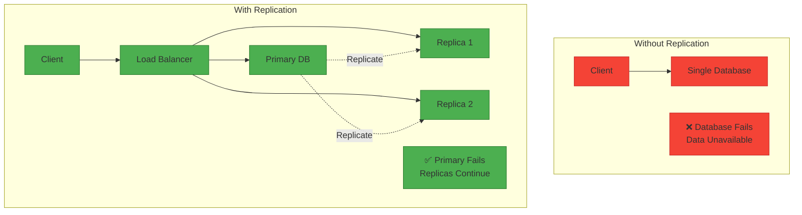
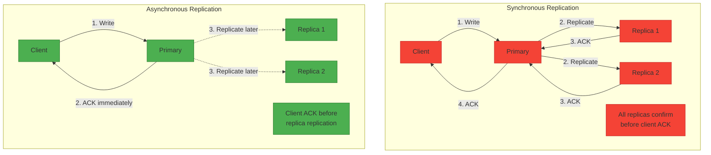
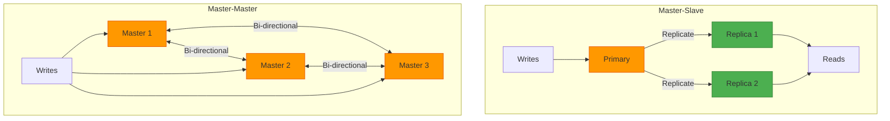
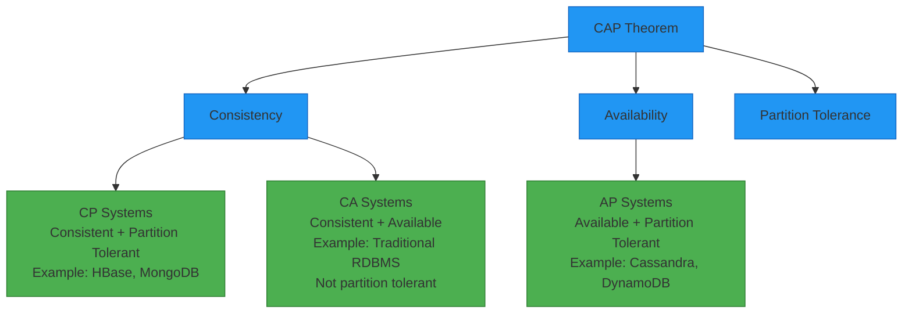
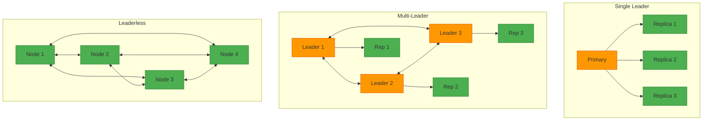

# Replication for System Design Interviews

## 📋 Table of Contents

1. [Replication Fundamentals](#replication-fundamentals)
2. [Types of Replication](#types-of-replication)
3. [Replication Strategies](#replication-strategies)
4. [Consistency Models](#consistency-models)
5. [Conflict Resolution](#conflict-resolution)
6. [Replication Topologies](#replication-topologies)
7. [Common Interview Questions](#common-interview-questions)
8. [Real-World Examples](#real-world-examples)

---

## 🔧 Replication Fundamentals

### What is Replication?

**Replication** is the process of copying and maintaining database objects (data, tables, schemas) in multiple database servers to ensure data availability, reliability, fault tolerance, and improved performance. Each copy is called a **replica**.

**Key Concept:** Multiple copies of data = Higher availability + Better performance

### Core Principles

**Data Duplication:**
- Maintain multiple copies of same data
- Each replica can serve read/write requests
- Copies distributed across servers/regions

**Synchronization:**
- Keep replicas consistent
- Propagate changes across all copies
- Handle conflicts when they occur

**Availability:**
- System remains operational if one replica fails
- No single point of failure
- Continuous data access

**Performance:**
- Distribute read load across replicas
- Reduce latency (serve from nearest replica)
- Scale read capacity horizontally

### Why Replication?

**Advantages:**
- ✅ **High Availability:** Data accessible even if servers fail
- ✅ **Fault Tolerance:** System survives hardware failures
- ✅ **Read Scalability:** Distribute reads across replicas
- ✅ **Low Latency:** Serve data from geographically closer replicas
- ✅ **Disaster Recovery:** Backup copies in different locations
- ✅ **Load Distribution:** Balance traffic across multiple servers

**Disadvantages:**
- ❌ **Complexity:** Managing multiple copies is complex
- ❌ **Consistency Challenges:** Keeping replicas in sync
- ❌ **Storage Cost:** Multiple copies require more storage
- ❌ **Network Overhead:** Replication traffic consumes bandwidth
- ❌ **Write Performance:** Writes may be slower (sync to replicas)
- ❌ **Conflict Resolution:** Handling concurrent updates



### Replication vs Backup

| Aspect | Replication | Backup |
|--------|-------------|--------|
| **Purpose** | High availability, performance | Disaster recovery |
| **Frequency** | Continuous, real-time | Periodic (hourly, daily) |
| **Access** | Always online, queryable | Offline, restore needed |
| **Latency** | Milliseconds to seconds | Hours to days |
| **Use Case** | Failover, read scaling | Data loss recovery |
| **Cost** | Higher (always running) | Lower (storage only) |
| **Recovery Time** | Seconds | Minutes to hours |

---

## 🔄 Types of Replication

### 1. Synchronous Replication

**Description:** Write operation completes only after data is written to primary AND all replicas.

**How it works:**
```
1. Client sends write to primary
2. Primary writes to its storage
3. Primary sends data to all replicas
4. Replicas write to their storage
5. Replicas acknowledge to primary
6. Primary acknowledges to client
```

**Characteristics:**
- Strong consistency guaranteed
- All replicas have same data at all times
- Higher write latency
- Blocks until all replicas confirm

**Pros:**
- ✅ Zero data loss (all replicas have latest data)
- ✅ Strong consistency
- ✅ Immediate failover (any replica can become primary)
- ✅ No replication lag

**Cons:**
- ❌ Slower writes (wait for all replicas)
- ❌ Availability issues (if replica is down, writes block)
- ❌ Network latency affects performance
- ❌ Not suitable for geo-distributed systems

**Use Case:** Financial transactions, banking, inventory management, critical data

### 2. Asynchronous Replication

**Description:** Write operation completes after data is written to primary only; replicas updated later.

**How it works:**
```
1. Client sends write to primary
2. Primary writes to its storage
3. Primary acknowledges to client immediately
4. Primary sends data to replicas asynchronously
5. Replicas write when they receive data
```

**Characteristics:**
- Eventual consistency
- Replication lag exists
- Lower write latency
- Non-blocking writes

**Pros:**
- ✅ Fast writes (don't wait for replicas)
- ✅ High availability (replica failures don't block writes)
- ✅ Works well for geo-distributed systems
- ✅ Better performance

**Cons:**
- ❌ Potential data loss (if primary fails before replication)
- ❌ Replication lag (replicas may be behind)
- ❌ Stale reads possible
- ❌ Complex conflict resolution

**Use Case:** Social media, analytics, caching, non-critical data, read-heavy workloads

### 3. Semi-Synchronous Replication

**Description:** Write completes after data is written to primary and at least ONE replica.

**How it works:**
```
1. Client sends write to primary
2. Primary writes to its storage
3. Primary sends data to all replicas
4. Wait for at least 1 replica to acknowledge
5. Primary acknowledges to client
6. Other replicas updated asynchronously
```

**Characteristics:**
- Balance between sync and async
- At least one replica has latest data
- Moderate write latency
- Reduced data loss risk

**Pros:**
- ✅ Better performance than full sync
- ✅ Reduced data loss (at least 1 replica has data)
- ✅ Good balance of consistency and performance
- ✅ More available than full sync

**Cons:**
- ❌ Still some replication lag on other replicas
- ❌ Slightly slower than async
- ❌ Potential for stale reads on lagging replicas

**Use Case:** Most production databases (MySQL, PostgreSQL), e-commerce, SaaS applications



### Comparison Table

| Aspect | Synchronous | Semi-Synchronous | Asynchronous |
|--------|-------------|------------------|--------------|
| **Write Latency** | High | Medium | Low |
| **Data Loss Risk** | None | Minimal | Possible |
| **Consistency** | Strong | Strong (1 replica) | Eventual |
| **Availability** | Lower | Medium | Higher |
| **Replication Lag** | None | Minimal | Yes |
| **Performance** | Slowest | Medium | Fastest |
| **Use Case** | Critical data | Production DBs | Analytics, social |

---

## 🎯 Replication Strategies

### 1. Master-Slave (Primary-Replica)

**Description:** One primary node handles writes, multiple replicas handle reads.

**Architecture:**
```
Client Writes → Primary (Master)
                    ↓ Replicate
        ┌───────────┼───────────┐
        ↓           ↓           ↓
    Replica 1   Replica 2   Replica 3
        ↑           ↑           ↑
Client Reads ← Load Balancer ← Client Reads
```

**Characteristics:**
- Single source of truth (primary)
- One-way replication (primary → replicas)
- Replicas are read-only
- Automatic or manual failover

**Pros:**
- ✅ Simple to understand and implement
- ✅ Clear data flow
- ✅ Read scalability (add more replicas)
- ✅ No write conflicts

**Cons:**
- ❌ Primary is write bottleneck
- ❌ Single point of failure (until failover)
- ❌ Failover requires promotion
- ❌ Replicas may lag behind

**Use Case:** MySQL, PostgreSQL, MongoDB, Redis

### 2. Master-Master (Multi-Master)

**Description:** Multiple nodes can accept writes simultaneously.

**Architecture:**
```
Master 1 ←→ Master 2 ←→ Master 3
   ↕           ↕           ↕
Clients     Clients     Clients
```

**Characteristics:**
- Bi-directional replication
- All nodes accept writes
- Conflict resolution needed
- No single point of failure

**Pros:**
- ✅ High availability (no single master)
- ✅ Write scalability
- ✅ Geographic distribution
- ✅ No failover needed

**Cons:**
- ❌ Complex conflict resolution
- ❌ Consistency challenges
- ❌ Network partitions problematic
- ❌ Harder to implement

**Use Case:** Cassandra, DynamoDB, CouchDB, distributed systems

### 3. Peer-to-Peer Replication

**Description:** All nodes are equal, any can accept reads/writes.

**Characteristics:**
- No master/slave distinction
- Gossip protocol for replication
- Eventually consistent
- Highly available

**Pros:**
- ✅ Maximum availability
- ✅ No single point of failure
- ✅ Self-healing
- ✅ Scales horizontally

**Cons:**
- ❌ Complex consistency
- ❌ Conflict resolution needed
- ❌ Higher network overhead

**Use Case:** Cassandra, Riak, distributed file systems

### 4. Chain Replication

**Description:** Data flows through a chain of replicas.

**Architecture:**
```
Client Write → Head → Node 2 → Node 3 → Tail → Client ACK
```

**Characteristics:**
- Linear replication chain
- Head handles writes
- Tail handles reads
- Strong consistency

**Pros:**
- ✅ Strong consistency
- ✅ Simple protocol
- ✅ Good for read-heavy workloads

**Cons:**
- ❌ Higher write latency (through chain)
- ❌ Head/tail are critical points

**Use Case:** Distributed storage systems, HDFS



---

## 🔀 Consistency Models

### 1. Strong Consistency

**Definition:** All replicas see the same data at the same time. Reads always return the most recent write.

**Guarantees:**
- Linearizability
- All clients see same order of operations
- No stale reads

**Implementation:**
- Synchronous replication
- Distributed consensus (Paxos, Raft)
- Two-phase commit

**Trade-offs:**
- ✅ Simple reasoning about data
- ✅ No conflicts
- ❌ Higher latency
- ❌ Lower availability

**Use Case:** Banking, financial transactions, inventory

### 2. Eventual Consistency

**Definition:** Replicas will eventually converge to same value if no new updates are made.

**Guarantees:**
- Eventually all replicas have same data
- Temporary inconsistencies allowed
- High availability

**Implementation:**
- Asynchronous replication
- Gossip protocols
- Conflict resolution strategies

**Trade-offs:**
- ✅ High availability
- ✅ Low latency
- ✅ Partition tolerant
- ❌ Stale reads possible
- ❌ Conflicts need resolution

**Use Case:** Social media, caching, DNS, CDN

### 3. Causal Consistency

**Definition:** Operations that are causally related are seen in the same order by all replicas.

**Example:**
```
User A posts: "Hello"
User B replies: "Hi there"
All users see post before reply (causal order)
```

**Guarantees:**
- Causally related operations ordered
- Concurrent operations may be reordered
- Stronger than eventual, weaker than strong

**Use Case:** Collaborative editing, social networks, messaging

### 4. Read-Your-Writes Consistency

**Definition:** A client always sees its own writes.

**Guarantees:**
- Client sees effects of its own updates
- Other clients may see stale data
- Session-based consistency

**Implementation:**
- Read from primary after write
- Session tokens
- Sticky sessions

**Use Case:** User profiles, settings, personalization

### CAP Theorem

**Consistency, Availability, Partition Tolerance - Pick 2**



---

## ⚔️ Conflict Resolution

### When Conflicts Occur

**Scenarios:**
- Concurrent writes to same data
- Network partitions
- Multi-master replication
- Offline-first applications

### Resolution Strategies

### 1. Last Write Wins (LWW)

**Description:** Use timestamp to determine winner.

**Algorithm:**
```
if timestamp(write_A) > timestamp(write_B):
    keep write_A
else:
    keep write_B
```

**Pros:**
- ✅ Simple to implement
- ✅ Always resolves conflicts
- ✅ No manual intervention

**Cons:**
- ❌ Data loss (losing write discarded)
- ❌ Clock synchronization issues
- ❌ Not suitable for all use cases

**Use Case:** Caching, session data, non-critical updates

### 2. Version Vectors

**Description:** Track causality using version numbers per replica.

**How it works:**
```
Replica A: [A:1, B:0, C:0]
Replica B: [A:1, B:1, C:0]
Can determine which is newer or if concurrent
```

**Pros:**
- ✅ Detects concurrent writes
- ✅ No clock dependency
- ✅ Accurate causality tracking

**Cons:**
- ❌ More complex
- ❌ Storage overhead

**Use Case:** Distributed databases, collaborative systems

### 3. CRDTs (Conflict-Free Replicated Data Types)

**Description:** Data structures that automatically resolve conflicts.

**Types:**
- **G-Counter:** Grow-only counter
- **PN-Counter:** Positive-negative counter
- **G-Set:** Grow-only set
- **OR-Set:** Observed-remove set

**Example:**
```
Counter CRDT:
Replica A increments: +1
Replica B increments: +1
Merge: 2 (no conflict)
```

**Pros:**
- ✅ Automatic conflict resolution
- ✅ No coordination needed
- ✅ Always converge

**Cons:**
- ❌ Limited operations
- ❌ Memory overhead

**Use Case:** Collaborative editing, distributed counters

### 4. Application-Level Resolution

**Description:** Application decides how to resolve conflicts.

**Strategies:**
- Merge changes (collaborative editing)
- User chooses (Dropbox conflict files)
- Custom business logic

**Example:**
```
Shopping cart conflict:
User adds item A on device 1
User adds item B on device 2
Resolution: Merge both items
```

**Pros:**
- ✅ Flexible
- ✅ Business logic aware
- ✅ No data loss

**Cons:**
- ❌ Complex to implement
- ❌ Application-specific

**Use Case:** E-commerce, collaborative apps

---

## 🌐 Replication Topologies

### 1. Single Leader (Primary-Replica)

**Structure:**
```
        Primary
       /   |   \
      /    |    \
  Rep1   Rep2   Rep3
```

**Characteristics:**
- One primary, multiple replicas
- All writes go to primary
- Reads from any replica
- Simple and common

### 2. Multi-Leader

**Structure:**
```
Leader1 ←→ Leader2 ←→ Leader3
   ↓          ↓          ↓
Replicas   Replicas   Replicas
```

**Characteristics:**
- Multiple primaries
- Each leader has replicas
- Leaders sync with each other
- Geographic distribution

### 3. Leaderless (Peer-to-Peer)

**Structure:**
```
Node1 ←→ Node2
  ↕  ⤫    ⤫  ↕
Node3 ←→ Node4
```

**Characteristics:**
- No designated leader
- All nodes equal
- Quorum-based reads/writes
- High availability

### 4. Tree/Hierarchical

**Structure:**
```
      Root
     /    \
  Child1  Child2
   /  \    /  \
 L1  L2  L3  L4
```

**Characteristics:**
- Hierarchical structure
- Parent-child replication
- Reduces load on root
- Used in CDNs



---

## ❓ Common Interview Questions

### Q1: "Explain the difference between synchronous and asynchronous replication"

**Answer:**

**Synchronous Replication:**
- Write completes only after ALL replicas acknowledge
- Strong consistency guaranteed
- Higher write latency (wait for replicas)
- Risk: If replica is down, writes block
- Use: Financial systems, critical data

**Asynchronous Replication:**
- Write completes immediately on primary
- Replicas updated later
- Lower write latency
- Risk: Data loss if primary fails before replication
- Use: Social media, analytics, non-critical data

**Example:**
```
Synchronous:
Client → Primary → Wait for Replicas → ACK Client (100ms)

Asynchronous:
Client → Primary → ACK Client (10ms) → Replicate Later
```

**Trade-off:** Consistency vs Performance/Availability

### Q2: "How do you handle replication lag?"

**Answer:**

**What is Replication Lag:**
- Time between write on primary and availability on replica
- Common in asynchronous replication
- Can range from milliseconds to minutes

**Strategies to Handle:**

**1. Monitor Lag:**
```sql
-- MySQL example
SHOW SLAVE STATUS\G
Seconds_Behind_Master: 5
```

**2. Read from Primary for Critical Data:**
```python
if critical_read:
    read_from_primary()
else:
    read_from_replica()
```

**3. Read-Your-Writes Consistency:**
- After write, read from primary
- Or use session tokens to track writes

**4. Eventual Consistency UI:**
- Show "Updating..." message
- Retry reads
- Optimistic UI updates

**5. Semi-Synchronous Replication:**
- Wait for at least one replica
- Balance between sync and async

**6. Monitoring and Alerts:**
- Alert if lag > threshold
- Auto-failover if lag too high

### Q3: "Design a replication strategy for a global application"

**Answer:**

**Requirements:**
- Users in US, Europe, Asia
- Low latency for all regions
- High availability
- Data consistency

**Architecture:**

**1. Multi-Region Deployment:**
```
US Region:     Primary + 2 Replicas
EU Region:     Primary + 2 Replicas  
Asia Region:   Primary + 2 Replicas
```

**2. Replication Strategy:**
- **Within Region:** Synchronous replication (strong consistency)
- **Cross-Region:** Asynchronous replication (eventual consistency)

**3. Write Strategy:**
- Writes go to nearest region's primary
- Asynchronously replicate to other regions
- Use conflict resolution (LWW or CRDTs)

**4. Read Strategy:**
- Reads from nearest region
- Accept eventual consistency
- Critical reads from primary

**5. Failover:**
- Regional failover: Promote replica to primary (seconds)
- Global failover: Route to another region (DNS update)

**Trade-offs:**
- Lower latency vs Strong consistency
- Higher availability vs Data conflicts
- Cost (multiple regions) vs Performance

**Example Systems:** DynamoDB Global Tables, Cassandra multi-DC, Spanner

### Q4: "How do you resolve write conflicts in multi-master replication?"

**Answer:**

**Conflict Scenarios:**
```
User A (US): Updates price to $100
User B (EU): Updates price to $110
Both write to local masters simultaneously
Conflict!
```

**Resolution Strategies:**

**1. Last Write Wins (LWW):**
```
Compare timestamps:
US write: 10:00:00
EU write: 10:00:05
Winner: EU ($110)
```
- Simple but loses data

**2. Application-Level Merge:**
```
Shopping cart example:
US: Add item A
EU: Add item B
Merge: Cart has both A and B
```
- No data loss, business logic aware

**3. Version Vectors:**
```
Track causality:
If concurrent → Flag for manual resolution
If one is newer → Keep newer version
```

**4. CRDTs:**
```
Use conflict-free data types:
Counter: Both increments merge
Set: Union of both sets
```

**5. User Resolution:**
```
Show both versions to user:
"Conflict detected. Choose version:"
[ ] Version A: $100
[ ] Version B: $110
```

**Best Practice:**
- Design to avoid conflicts (partition data)
- Use CRDTs when possible
- Have clear conflict resolution policy
- Monitor and alert on conflicts

### Q5: "What's the difference between replication and sharding?"

**Answer:**

**Replication:**
- **Purpose:** Availability, fault tolerance, read scaling
- **Data:** Same data on multiple servers
- **Writes:** All replicas get same writes
- **Reads:** Distribute across replicas
- **Consistency:** Need to keep replicas in sync
- **Example:** MySQL primary with 3 replicas

**Sharding:**
- **Purpose:** Write scaling, storage capacity
- **Data:** Different data on each shard
- **Writes:** Each shard handles subset of writes
- **Reads:** Route to correct shard
- **Consistency:** Each shard independent
- **Example:** Users 1-1M on shard1, 1M-2M on shard2

**Combined Approach:**
```
Shard 1: Primary + 2 Replicas (Users 1-1M)
Shard 2: Primary + 2 Replicas (Users 1M-2M)
Shard 3: Primary + 2 Replicas (Users 2M-3M)
```

**When to Use:**
- **Replication:** Read-heavy, need availability
- **Sharding:** Write-heavy, large dataset
- **Both:** Large-scale systems (Facebook, Twitter)

---

## 🏢 Real-World Examples

### MySQL Replication

**Strategy:** Master-Slave (Primary-Replica)

**Setup:**
- 1 Primary (writes)
- Multiple replicas (reads)
- Binary log replication
- Asynchronous or semi-synchronous

**Configuration:**
```sql
-- On Primary
CREATE USER 'repl'@'%' IDENTIFIED BY 'password';
GRANT REPLICATION SLAVE ON *.* TO 'repl'@'%';

-- On Replica
CHANGE MASTER TO
  MASTER_HOST='primary.example.com',
  MASTER_USER='repl',
  MASTER_PASSWORD='password';
START SLAVE;
```

**Use Case:** WordPress, e-commerce, SaaS applications

### PostgreSQL Streaming Replication

**Strategy:** Primary-Standby with WAL shipping

**Features:**
- Streaming replication (real-time)
- Synchronous or asynchronous
- Hot standby (replicas can serve reads)
- Automatic failover (with tools like Patroni)

**Use Case:** Enterprise applications, data warehouses

### MongoDB Replica Sets

**Strategy:** Primary-Secondary with automatic failover

**Features:**
- 1 Primary, multiple secondaries
- Automatic election on primary failure
- Read preference (primary, secondary, nearest)
- Oplog-based replication

**Configuration:**
```javascript
rs.initiate({
  _id: "myReplicaSet",
  members: [
    { _id: 0, host: "mongo1:27017" },
    { _id: 1, host: "mongo2:27017" },
    { _id: 2, host: "mongo3:27017" }
  ]
})
```

**Use Case:** Modern web apps, mobile backends

### Cassandra Multi-Datacenter Replication

**Strategy:** Peer-to-peer, multi-master

**Features:**
- No single point of failure
- Tunable consistency
- Geographic distribution
- Gossip protocol

**Configuration:**
```
CREATE KEYSPACE mykeyspace
WITH replication = {
  'class': 'NetworkTopologyStrategy',
  'DC1': 3,
  'DC2': 3
};
```

**Use Case:** Netflix, Apple, Instagram

### Redis Replication

**Strategy:** Master-Slave with Sentinel for HA

**Features:**
- Asynchronous replication
- Automatic failover (Redis Sentinel)
- Read from replicas
- Fast replication

**Configuration:**
```
# On replica
replicaof master-ip 6379
```

**Use Case:** Caching, session storage, real-time analytics

---

## ✅ Quick Summary

**Key Concepts:**
- **Replication:** Copying data across multiple servers
- **Consistency:** How synchronized replicas are
- **Availability:** System uptime despite failures
- **Partition Tolerance:** Function during network splits

**Types:**
- **Synchronous:** Wait for all replicas, strong consistency, slower
- **Asynchronous:** Don't wait, eventual consistency, faster
- **Semi-Synchronous:** Wait for one replica, balanced

**Strategies:**
- **Master-Slave:** One primary, multiple replicas, simple
- **Master-Master:** Multiple primaries, complex, highly available
- **Peer-to-Peer:** All nodes equal, no SPOF
- **Chain:** Linear replication, strong consistency

**Consistency Models:**
- **Strong:** All see same data, lower availability
- **Eventual:** Eventually consistent, higher availability
- **Causal:** Causally related operations ordered
- **Read-Your-Writes:** See your own updates

**Conflict Resolution:**
- **Last Write Wins:** Timestamp-based, simple, data loss
- **Version Vectors:** Track causality, complex
- **CRDTs:** Automatic resolution, limited operations
- **Application:** Custom logic, flexible

**Trade-offs:**
- Consistency vs Availability vs Partition Tolerance (CAP)
- Latency vs Consistency
- Complexity vs Simplicity
- Cost vs Reliability

**Interview Tips:**
- Understand CAP theorem
- Know sync vs async trade-offs
- Explain replication lag handling
- Discuss conflict resolution strategies
- Consider geographic distribution
- Think about consistency requirements
- Mention real-world examples

**Best Practices:**
- Choose replication type based on requirements
- Monitor replication lag
- Have failover procedures
- Test failover regularly
- Consider multi-region for global apps
- Use semi-synchronous for production
- Implement proper conflict resolution
- Balance consistency with performance

---
