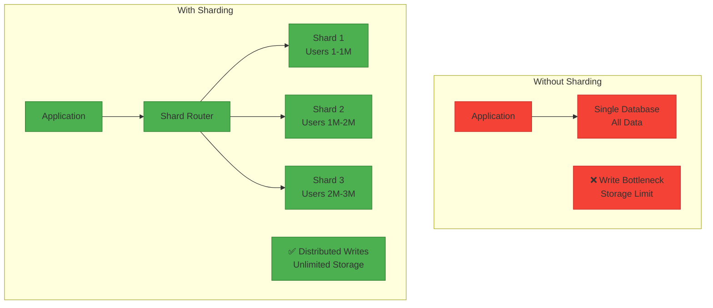
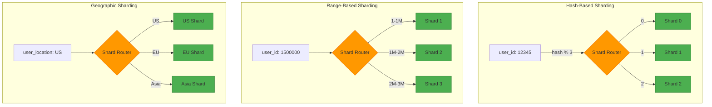

# Sharding for System Design Interviews

## 📋 Table of Contents

1. [Sharding Fundamentals](#sharding-fundamentals)
2. [Sharding Strategies](#sharding-strategies)
3. [Shard Key Selection](#shard-key-selection)
4. [Challenges & Solutions](#challenges--solutions)
5. [Resharding & Rebalancing](#resharding--rebalancing)
6. [Sharding vs Partitioning](#sharding-vs-partitioning)
7. [Common Interview Questions](#common-interview-questions)
8. [Real-World Examples](#real-world-examples)

---

## 🔧 Sharding Fundamentals

### What is Sharding?

**Sharding** is a database architecture pattern that horizontally partitions data across multiple database instances (shards). Each shard contains a subset of the total data, and together they form a complete dataset.

**Key Concept:** Divide data = Distribute load = Scale writes

### Core Principles

**Horizontal Partitioning:**
- Split data by rows across multiple databases
- Each shard has same schema, different data
- Distribute based on shard key

**Data Distribution:**
- Each shard holds subset of data
- No shard contains all data
- Shards are independent

**Write Scalability:**
- Distribute writes across shards
- Each shard handles portion of writes
- Linear scalability (ideally)

**Independence:**
- Shards operate independently
- Failure of one shard doesn't affect others
- Can scale individual shards

### Why Sharding?

**Advantages:**
- ✅ **Write Scalability:** Distribute writes across multiple databases
- ✅ **Storage Capacity:** Store more data than single server can hold
- ✅ **Performance:** Smaller datasets = faster queries
- ✅ **Fault Isolation:** Failure affects only one shard
- ✅ **Geographic Distribution:** Place shards closer to users
- ✅ **Cost-Effective:** Use commodity hardware

**Disadvantages:**
- ❌ **Complexity:** Managing multiple databases is complex
- ❌ **Cross-Shard Queries:** Queries spanning shards are expensive
- ❌ **Rebalancing:** Moving data between shards is difficult
- ❌ **Shard Key Choice:** Wrong key causes hotspots
- ❌ **Transactions:** Cross-shard transactions are complex
- ❌ **Joins:** Cross-shard joins are inefficient



### Sharding vs Replication

| Aspect | Sharding | Replication |
|--------|----------|-------------|
| **Purpose** | Write scaling, storage | Read scaling, availability |
| **Data** | Different data per shard | Same data on all replicas |
| **Writes** | Distributed across shards | All replicas get writes |
| **Reads** | Route to correct shard | Any replica can serve |
| **Scalability** | Horizontal (writes) | Horizontal (reads) |
| **Complexity** | High | Medium |
| **Use Case** | Large datasets, write-heavy | High availability, read-heavy |

**Combined Approach:**
```
Shard 1: Primary + 2 Replicas (Users 1-1M)
Shard 2: Primary + 2 Replicas (Users 1M-2M)
Shard 3: Primary + 2 Replicas (Users 2M-3M)
```

---

## 🎯 Sharding Strategies

### 1. Hash-Based Sharding

**Description:** Use hash function on shard key to determine shard.

**Algorithm:**
```
shard_id = hash(shard_key) % number_of_shards

Example:
user_id = 12345
shard_id = hash(12345) % 4 = 2
Store in Shard 2
```

**Characteristics:**
- Even distribution of data
- Random assignment
- No hotspots (if good hash function)
- Predictable shard location

**Pros:**
- ✅ Uniform data distribution
- ✅ Simple to implement
- ✅ No hotspots
- ✅ Predictable performance

**Cons:**
- ❌ Adding/removing shards requires rehashing
- ❌ Range queries difficult (data scattered)
- ❌ Related data may be on different shards

**Use Case:** User data, session data, evenly distributed workloads

### 2. Range-Based Sharding

**Description:** Assign ranges of shard key values to shards.

**Algorithm:**
```
Shard 1: user_id 1 - 1,000,000
Shard 2: user_id 1,000,001 - 2,000,000
Shard 3: user_id 2,000,001 - 3,000,000

Example:
user_id = 1,500,000 → Shard 2
```

**Characteristics:**
- Data grouped by ranges
- Sequential assignment
- Easy to add new ranges
- Range queries efficient

**Pros:**
- ✅ Range queries efficient (data co-located)
- ✅ Easy to add new shards (new range)
- ✅ Simple to understand
- ✅ Related data together

**Cons:**
- ❌ Hotspots (recent data on one shard)
- ❌ Uneven distribution
- ❌ Sequential writes hit same shard

**Use Case:** Time-series data, logs, ordered data

### 3. Geographic Sharding

**Description:** Shard by geographic location.

**Algorithm:**
```
Shard 1: US users
Shard 2: EU users
Shard 3: Asia users

Example:
user_location = "US" → Shard 1
```

**Characteristics:**
- Data grouped by region
- Shards physically close to users
- Regulatory compliance
- Natural partitioning

**Pros:**
- ✅ Low latency (data near users)
- ✅ Regulatory compliance (data residency)
- ✅ Natural boundaries
- ✅ Fault isolation by region

**Cons:**
- ❌ Uneven distribution (population differences)
- ❌ Cross-region queries expensive
- ❌ Hotspots in popular regions

**Use Case:** Global applications, multi-tenant SaaS, CDN

### 4. Directory-Based Sharding

**Description:** Maintain lookup table mapping keys to shards.

**Algorithm:**
```
Directory/Lookup Table:
user_id 1-1000 → Shard 1
user_id 1001-2000 → Shard 2
user_id 2001-3000 → Shard 1

Flexible mapping, not fixed formula
```

**Characteristics:**
- Flexible mapping
- Lookup required for each query
- Can rebalance without moving data
- Directory is single point of failure

**Pros:**
- ✅ Flexible (can change mapping)
- ✅ Easy rebalancing
- ✅ No rehashing needed
- ✅ Can optimize per shard

**Cons:**
- ❌ Lookup overhead
- ❌ Directory is bottleneck/SPOF
- ❌ Additional complexity

**Use Case:** Dynamic workloads, frequent rebalancing

### 5. Consistent Hashing

**Description:** Hash both keys and shards to a ring, minimizes data movement.

**How it works:**
```
1. Hash shards to ring (0-2^32)
2. Hash keys to ring
3. Key goes to next shard clockwise
4. Use virtual nodes for balance
```

**Characteristics:**
- Minimal data movement when adding/removing shards
- Only K/N keys move (K=keys, N=shards)
- Virtual nodes for better distribution
- Used in distributed systems

**Pros:**
- ✅ Minimal rebalancing
- ✅ Elastic scaling
- ✅ Fault tolerant
- ✅ Decentralized

**Cons:**
- ❌ More complex
- ❌ Virtual nodes overhead
- ❌ Range queries difficult

**Use Case:** Distributed caches (Memcached, Redis), Cassandra, DynamoDB



---

## 🔑 Shard Key Selection

### What is a Shard Key?

**Shard Key** is the field(s) used to determine which shard stores a record.

**Examples:**
- User data: `user_id`
- Orders: `customer_id` or `order_date`
- Logs: `timestamp` or `server_id`
- Multi-tenant: `tenant_id`

### Criteria for Good Shard Key

### 1. High Cardinality

**Definition:** Many distinct values

**Good:** `user_id` (millions of values)  
**Bad:** `country` (only ~200 values)

**Why:** Low cardinality causes hotspots

### 2. Even Distribution

**Definition:** Values spread evenly across shards

**Good:**
```
user_id with hash: Even distribution
Shard 1: 33% of users
Shard 2: 33% of users
Shard 3: 34% of users
```

**Bad:**
```
user_type: 90% regular, 10% premium
Shard 1: 90% of data
Shard 2: 10% of data
```

### 3. Query Pattern Alignment

**Good:**
```
Shard by user_id
Query: SELECT * FROM orders WHERE user_id = 123
Hits single shard
```

**Bad:**
```
Shard by user_id
Query: SELECT * FROM orders WHERE order_date = '2024-01-01'
Hits all shards (scatter-gather)
```

### 4. Immutability

**Good:** `user_id` (never changes)  
**Bad:** `user_country` (user moves, requires data migration)

### Common Shard Keys

**User-Centric:** `user_id`, `email_hash`  
**E-commerce:** `customer_id`, `order_id`, `product_id`  
**Multi-Tenant:** `tenant_id`, `organization_id`  
**Time-Series:** `timestamp`, `(user_id, timestamp)`  
**Social Media:** `user_id`, `post_id`

---

## 🚧 Challenges & Solutions

### 1. Cross-Shard Queries

**Problem:** Query needs data from multiple shards

**Example:**
```sql
-- Sharded by user_id
SELECT * FROM orders WHERE order_date = '2024-01-01'
-- Must query all shards
```

**Solutions:**

**A. Scatter-Gather:**
- Send query to all shards
- Collect and merge results
- Slow but works

**B. Denormalization:**
- Store data in multiple shards
- Faster queries, more storage

**C. Application-Level Joins:**
- Query shards separately
- Join in application code

### 2. Hotspots

**Problem:** One shard gets disproportionate traffic

**Causes:**
- Poor shard key (sequential IDs)
- Celebrity users
- Seasonal data

**Solutions:**

**A. Better Shard Key:**
```
Bad: timestamp (recent data hot)
Good: hash(user_id) (even distribution)
```

**B. Split Hot Shards:**
```
Hot Shard 1 → Split into Shard 1A and Shard 1B
```

**C. Add Randomness:**
```
user_id_with_salt = user_id + random(0-9)
```

**D. Caching:**
- Cache hot data
- Reduce shard load

### 3. Cross-Shard Transactions

**Problem:** Transaction spans multiple shards

**Example:**
```
Transfer money:
Debit from user A (Shard 1)
Credit to user B (Shard 2)
Must be atomic
```

**Solutions:**

**A. Two-Phase Commit (2PC):**
- Phase 1: Prepare (all shards vote)
- Phase 2: Commit (if all voted yes)
- Guarantees atomicity, but slow

**B. Saga Pattern:**
- Execute local transactions
- Compensate on failure
- Eventual consistency

**C. Avoid Cross-Shard Transactions:**
- Keep related data on same shard
- Best solution when possible

### 4. Shard Management

**Challenges:**
- Monitoring multiple databases
- Backup and recovery
- Schema changes
- Performance tuning

**Solutions:**

**Automation:**
- Automated backups, monitoring, failover

**Orchestration Tools:**
- Vitess (MySQL), Citus (PostgreSQL), MongoDB Sharding

**Managed Services:**
- Amazon Aurora, Azure Cosmos DB, Google Spanner

---

## 🔄 Resharding & Rebalancing

### When to Reshard

**Triggers:**
- Shard reaches capacity (storage/performance)
- Uneven distribution (hotspots)
- Adding/removing shards
- Changing shard key

### Resharding Strategies

### 1. Stop-and-Copy

**Process:**
1. Stop writes
2. Copy data to new configuration
3. Update routing
4. Resume writes

**Pros:** Simple, consistent  
**Cons:** Downtime required

### 2. Dual-Write

**Process:**
1. Write to both old and new shards
2. Migrate existing data in background
3. Switch reads to new shards
4. Stop writing to old shards

**Pros:** No downtime  
**Cons:** Complex, temporary inconsistency

### 3. Live Migration

**Process:**
1. Start copying data
2. Track changes during copy
3. Apply changes to new shards
4. Switch traffic atomically

**Pros:** No downtime, consistent  
**Cons:** Very complex

### Consistent Hashing Benefits

**Traditional:** Adding shard requires moving all data  
**Consistent Hashing:** Only K/N data moves

**Example:**
```
4 shards, add 1 shard:
Traditional: Rehash all keys (100% movement)
Consistent: Move 20% of keys (1/5)
```

---

## 🆚 Sharding vs Partitioning

### Terminology

**Partitioning:** Generic term for dividing data  
**Sharding:** Horizontal partitioning across servers

### Types of Partitioning

**Horizontal (Sharding):**
```
Split by rows
Shard 1: Users 1-1M
Shard 2: Users 1M-2M
```

**Vertical:**
```
Split by columns
DB 1: user_id, name, email
DB 2: user_id, address, phone
```

**Functional:**
```
Split by domain
DB 1: Users
DB 2: Orders
DB 3: Products
```

### Comparison

| Aspect | Sharding | Vertical | Functional |
|--------|----------|----------|------------|
| **Split By** | Rows | Columns | Domain |
| **Purpose** | Scale writes | Optimize access | Service isolation |
| **Complexity** | High | Medium | Low |
| **Use Case** | Large datasets | Wide tables | Microservices |

---

## ❓ Common Interview Questions

### Q1: "How do you choose a shard key?"

**Answer:**

**Criteria:**

1. **High Cardinality:** Many distinct values
   - Good: `user_id` (millions)
   - Bad: `country` (hundreds)

2. **Even Distribution:** Avoid hotspots
   - Use hash-based sharding for uniform distribution

3. **Query Pattern:** Most queries should use shard key
   - Avoid cross-shard queries

4. **Immutable:** Shouldn't change
   - Changing requires data migration

**Example Decision (E-commerce Orders):**

**Option 1: `order_id`**
- Pro: High cardinality, even distribution
- Con: Customer queries hit all shards

**Option 2: `customer_id`**
- Pro: Customer queries hit single shard
- Con: Uneven if some customers order more

**Option 3: `(customer_id, order_date)`**
- Pro: Balance isolation and distribution
- Con: More complex

**Choice:** `customer_id` (most queries are customer-centric)

### Q2: "Design sharding for Instagram"

**Answer:**

**Requirements:**
- Billions of users
- Billions of photos
- High write throughput
- Fast reads

**Sharding Strategy:**

**1. User Data:**
```
Shard by: user_id (hash-based)
Shards: 1000 shards
Distribution: Even across all shards
```

**2. Photo Data:**
```
Shard by: user_id (same as user data)
Benefit: User's photos on same shard
Query: "Get user's photos" → Single shard
```

**3. Feed Data:**
```
Shard by: user_id (feed owner)
Benefit: "Get my feed" → Single shard
Challenge: "Post to followers" → Multiple shards
Solution: Fan-out on write (async)
```

**4. Follower/Following:**
```
Shard by: user_id
followers table: Sharded by followee_id
following table: Sharded by follower_id
```

**Architecture:**
```
1000 shards, each with:
- Primary + 2 Replicas
- Users: ~1M users per shard
- Photos: ~10M photos per shard
```

**Scaling:**
- Add more shards as users grow
- Use consistent hashing for minimal data movement
- Cache hot data (celebrity profiles)

### Q3: "How do you handle cross-shard queries?"

**Answer:**

**Problem:**
```sql
-- Sharded by user_id
SELECT * FROM orders 
WHERE order_date BETWEEN '2024-01-01' AND '2024-01-31'
-- Hits all shards
```

**Solutions:**

**1. Scatter-Gather:**
```
1. Send query to all shards in parallel
2. Each shard returns matching rows
3. Application merges and sorts results
4. Return to client

Pros: Works for any query
Cons: Slow, high latency
```

**2. Denormalization:**
```
Store orders in two ways:
- By user_id (for user queries)
- By order_date (for date queries)

Pros: Fast queries
Cons: Duplicate data, sync complexity
```

**3. Secondary Index:**
```
Maintain global index:
order_date → [shard_ids]

Query process:
1. Look up index: Which shards have data?
2. Query only those shards
3. Merge results

Pros: Query fewer shards
Cons: Index maintenance overhead
```

**4. Application-Level Routing:**
```
Application knows data distribution
Routes query to correct shards
Merges results

Pros: Flexible
Cons: Application complexity
```

**Best Practice:**
- Design shard key to minimize cross-shard queries
- Use denormalization for common access patterns
- Cache results of expensive queries

### Q4: "What happens when a shard becomes a hotspot?"

**Answer:**

**Causes:**
1. **Celebrity Problem:** One user has millions of followers
2. **Sequential IDs:** Recent data on one shard
3. **Poor Shard Key:** Uneven distribution
4. **Temporal Patterns:** Black Friday sales spike

**Detection:**
```
Monitor:
- CPU usage per shard
- Query latency per shard
- Storage per shard
- Request rate per shard

Alert if shard > 2x average
```

**Solutions:**

**1. Split Hot Shard:**
```
Before: Shard 1 (Users 1-1M, 80% traffic)
After:  Shard 1A (Users 1-500K, 40% traffic)
        Shard 1B (Users 500K-1M, 40% traffic)
```

**2. Add Randomness:**
```
Celebrity user_id = 12345
Create virtual shards:
12345-0, 12345-1, 12345-2, ... 12345-9

Distribute followers across virtual shards
```

**3. Caching:**
```
Cache celebrity data in Redis/Memcached
Serve from cache, not database
Reduces load on shard
```

**4. Read Replicas:**
```
Add more read replicas to hot shard
Distribute reads across replicas
Primary handles writes only
```

**5. Change Shard Key:**
```
If fundamentally wrong shard key:
- Plan migration to new shard key
- Use dual-write during migration
- Switch over when complete
```

### Q5: "Sharding vs Replication - when to use each?"

**Answer:**

**Sharding:**

**When to Use:**
- Write-heavy workload
- Dataset too large for single server
- Need to scale writes
- Storage capacity limit

**Example:**
```
Twitter: Billions of tweets
Can't fit on single server
Shard by user_id
Each shard: Subset of users
```

**Replication:**

**When to Use:**
- Read-heavy workload
- Need high availability
- Disaster recovery
- Geographic distribution

**Example:**
```
News website: Mostly reads
Replicate to multiple servers
All replicas have same data
Distribute reads across replicas
```

**Combined Approach (Best):**
```
Shard 1: Primary + 2 Replicas
Shard 2: Primary + 2 Replicas
Shard 3: Primary + 2 Replicas

Benefits:
- Sharding: Scale writes, storage
- Replication: Scale reads, availability
```

**Decision Matrix:**

| Scenario | Solution |
|----------|----------|
| Read-heavy, small data | Replication only |
| Write-heavy, large data | Sharding + Replication |
| Need HA, small data | Replication only |
| Large dataset | Sharding + Replication |

---

## 🏢 Real-World Examples

### Instagram

**Sharding Strategy:**

**User Data:**
- Shard by: `user_id` (hash-based)
- 1000+ shards
- PostgreSQL

**Photos:**
- Shard by: `user_id` (co-located with user)
- Store metadata in database
- Store images in S3

**Feed:**
- Shard by: `user_id` (feed owner)
- Fan-out on write to followers
- Cache in Redis

**Lesson:** Co-locate related data on same shard

### Twitter

**Sharding Strategy:**

**Tweets:**
- Shard by: `user_id`
- Each shard: ~1M users
- MySQL clusters

**Timeline:**
- Home timeline: Fan-out on write
- User timeline: Shard by `user_id`
- Celebrity tweets: Fan-out on read

**Followers:**
- Shard by: `user_id`
- Separate shards for followers/following

**Lesson:** Different strategies for different user types

### Uber

**Sharding Strategy:**

**Rides:**
- Shard by: `city` (geographic sharding)
- Each city: Separate shard
- Benefit: Regulatory compliance, low latency

**Users:**
- Shard by: `user_id` (hash-based)
- Global distribution

**Drivers:**
- Shard by: `city` (co-located with rides)
- Real-time location updates

**Lesson:** Geographic sharding for location-based services

### Discord

**Sharding Strategy:**

**Messages:**
- Shard by: `channel_id`
- Each shard: Multiple channels
- Cassandra for storage

**Users:**
- Shard by: `user_id`
- PostgreSQL

**Guilds (Servers):**
- Shard by: `guild_id`
- All guild data on same shard

**Lesson:** Shard by primary access pattern

### MongoDB Sharding

**Built-in Sharding:**

**Features:**
- Automatic sharding
- Range or hash-based
- Automatic balancing
- Config servers for metadata

**Architecture:**
```
mongos (Router)
  ↓
Config Servers (Metadata)
  ↓
Shard 1, Shard 2, Shard 3...
```

**Configuration:**
```javascript
sh.enableSharding("mydb")
sh.shardCollection("mydb.users", { "user_id": "hashed" })
```

**Lesson:** Use managed sharding when possible

---

## ✅ Quick Summary

**Key Concepts:**
- **Sharding:** Horizontal partitioning across multiple servers
- **Shard Key:** Field used to determine shard placement
- **Write Scalability:** Main benefit of sharding
- **Complexity:** Main drawback of sharding

**Sharding Strategies:**
- **Hash-Based:** Even distribution, no range queries
- **Range-Based:** Range queries efficient, hotspots possible
- **Geographic:** Low latency, regulatory compliance
- **Directory-Based:** Flexible, lookup overhead
- **Consistent Hashing:** Minimal rebalancing

**Shard Key Criteria:**
- **High Cardinality:** Many distinct values
- **Even Distribution:** Avoid hotspots
- **Query Alignment:** Most queries use shard key
- **Immutable:** Doesn't change

**Challenges:**
- **Cross-Shard Queries:** Scatter-gather, denormalization
- **Hotspots:** Split shards, caching, randomness
- **Transactions:** 2PC, Saga, avoid when possible
- **Management:** Automation, orchestration tools

**Resharding:**
- **Stop-and-Copy:** Simple, downtime
- **Dual-Write:** No downtime, complex
- **Live Migration:** No downtime, very complex
- **Consistent Hashing:** Minimal data movement

**vs Replication:**
- **Sharding:** Write scaling, storage capacity
- **Replication:** Read scaling, availability
- **Combined:** Best of both worlds

**Interview Tips:**
- Understand shard key selection criteria
- Know different sharding strategies
- Discuss trade-offs (complexity vs scalability)
- Mention cross-shard query challenges
- Consider hotspot mitigation
- Think about resharding strategy
- Compare with replication
- Give real-world examples

**Best Practices:**
- Choose shard key carefully (hard to change)
- Start with fewer shards, add as needed
- Monitor shard distribution and hotspots
- Use consistent hashing for elasticity
- Combine sharding with replication
- Automate shard management
- Test resharding procedures
- Design to minimize cross-shard queries
- Cache hot data
- Use managed sharding services when possible

---
