# Vertical Scaling for System Design Interviews

## 📋 Table of Contents

1. [Vertical Scaling Fundamentals](#vertical-scaling-fundamentals)
2. [When to Use Vertical Scaling](#when-to-use-vertical-scaling)
3. [Hardware Components & Upgrades](#hardware-components--upgrades)
4. [Performance Optimization](#performance-optimization)
5. [Limitations & Constraints](#limitations--constraints)
6. [Vertical vs Horizontal Scaling](#vertical-vs-horizontal-scaling)
7. [Common Interview Questions](#common-interview-questions)
8. [Real-World Examples](#real-world-examples)

---

## 🔧 Vertical Scaling Fundamentals

### What is Vertical Scaling?

**Vertical Scaling (Scale Up)** is the process of adding more power to an existing machine by upgrading its hardware resources (CPU, RAM, disk, network). Instead of adding more machines, you make a single machine more powerful.

**Key Concept:** More power = More capacity

### Core Principles

**Resource Upgrade:**
- Increase CPU cores/speed
- Add more RAM
- Upgrade to faster storage (SSD, NVMe)
- Improve network bandwidth

**Single Machine:**
- All resources on one server
- No distributed system complexity
- Simpler architecture
- Centralized management

**Immediate Impact:**
- Direct performance improvement
- No code changes needed (usually)
- Quick solution to performance issues

### Why Vertical Scaling?

**Advantages:**
- ✅ **Simplicity:** No distributed system complexity
- ✅ **No Code Changes:** Usually works with existing code
- ✅ **Strong Consistency:** Single source of truth
- ✅ **Lower Latency:** No network overhead between components
- ✅ **Easier Debugging:** Single machine to monitor
- ✅ **Cost-Effective (Initially):** Cheaper for small scale

**Disadvantages:**
- ❌ **Hardware Limits:** Can't scale beyond physical limits
- ❌ **Downtime Required:** Need to stop server for upgrades
- ❌ **Single Point of Failure:** No redundancy
- ❌ **Expensive at Scale:** High-end hardware costs exponentially
- ❌ **Limited Flexibility:** Can't scale specific components independently


### Vertical vs Horizontal Scaling

| Aspect | Vertical Scaling | Horizontal Scaling |
|--------|-----------------|-------------------|
| **Approach** | Add more power to existing machine | Add more machines |
| **Scalability Limit** | Hardware limits (CPU, RAM max) | Nearly unlimited |
| **Cost** | Exponential (specialized hardware) | Linear (commodity hardware) |
| **Complexity** | Low (single machine) | High (distributed systems) |
| **Downtime** | Required (upgrade hardware) | Zero (add nodes live) |
| **Fault Tolerance** | Low (single point of failure) | High (redundancy) |
| **Use Case** | Databases, legacy apps | Web servers, microservices |
| **Data Consistency** | Easy (single source) | Complex (distributed) |

---

## 📊 When to Use Vertical Scaling

### Ideal Scenarios

**Database Servers:**
- Relational databases (MySQL, PostgreSQL)
- In-memory databases (Redis, Memcached)
- Complex queries requiring full dataset
- ACID transaction requirements

**Legacy Applications:**
- Monolithic applications
- Applications not designed for distribution
- Tightly coupled systems
- Single-threaded applications

**Development & Testing:**
- Small teams with limited ops expertise
- Proof of concept / MVP
- Internal tools
- Low traffic applications

**Specific Workloads:**
- CPU-intensive computations
- Large in-memory operations
- Applications requiring low latency
- Single-machine optimized software

### When NOT to Use Vertical Scaling

**High Availability Requirements:**
- Need 99.99%+ uptime
- Can't afford single point of failure
- Global user base

**Unlimited Growth:**
- Exponential traffic growth expected
- Don't know maximum capacity needed
- Viral applications

**Cost Constraints:**
- Limited budget
- Need cost-effective scaling
- Variable workload (auto-scaling needed)

**Already at Hardware Limits:**
- Maxed out CPU/RAM
- No more powerful hardware available
- Cost of next upgrade prohibitive

---

## 🖥️ Hardware Components & Upgrades

### 1. CPU (Central Processing Unit)

**What to Upgrade:**
- More cores (4 → 8 → 16 → 32)
- Higher clock speed (2.5GHz → 3.5GHz)
- Better cache (L1, L2, L3)
- Newer architecture (better IPC)

**Impact:**
- Faster request processing
- More concurrent operations
- Better computational performance

**Use Cases:**
- CPU-bound applications
- Complex calculations
- Video encoding
- Machine learning inference

**Cost:** Moderate to high, increases exponentially

### 2. RAM (Memory)

**What to Upgrade:**
- More capacity (16GB → 32GB → 64GB → 128GB+)
- Faster speed (DDR4 → DDR5)
- Lower latency

**Impact:**
- More data in memory
- Faster data access
- Reduced disk I/O
- Better caching

**Use Cases:**
- In-memory databases (Redis, Memcached)
- Large dataset processing
- Caching layers
- Memory-intensive applications

**Cost:** Moderate, relatively linear scaling

### 3. Storage

**What to Upgrade:**
- HDD → SSD → NVMe
- More capacity
- Higher IOPS (Input/Output Operations Per Second)
- RAID configurations

**Impact:**
- Faster read/write operations
- Lower latency
- Better database performance
- Faster application startup

**Performance Comparison:**
```
HDD:     100-200 IOPS,    100-200 MB/s
SATA SSD: 10,000-20,000 IOPS, 500-600 MB/s
NVMe SSD: 100,000+ IOPS,  3,000-7,000 MB/s
```

**Use Cases:**
- Database servers
- Log-heavy applications
- File storage systems
- High I/O workloads

**Cost:** Moderate, NVMe significantly more expensive

### 4. Network

**What to Upgrade:**
- 1 Gbps → 10 Gbps → 25 Gbps → 100 Gbps
- Better network cards (NICs)
- Lower latency connections

**Impact:**
- Higher throughput
- More concurrent connections
- Faster data transfer
- Better for distributed systems

**Use Cases:**
- API servers
- Database replication
- File transfer services
- Video streaming

**Cost:** Moderate to high

```mermaid
graph LR
    A[Upgrade Path] --> B[CPU]
    A --> C[RAM]
    A --> D[Storage]
    A --> E[Network]
    
    B --> B1[4 cores → 16 cores]
    B --> B2[2.5GHz → 3.5GHz]
    
    C --> C1[16GB → 64GB]
    C --> C2[DDR4 → DDR5]
    
    D --> D1[HDD → SSD]
    D --> D2[SATA → NVMe]
    
    E --> E1[1Gbps → 10Gbps]
    E --> E2[Better NIC]
    
    classDef component fill:#4CAF50,stroke:#2E7D32
    classDef upgrade fill:#2196F3,stroke:#1565C0
    class B,C,D,E component
    class B1,B2,C1,C2,D1,D2,E1,E2 upgrade
```



---

## ⚡ Performance Optimization

### Before Scaling Vertically

**Always optimize first before throwing hardware at the problem!**

### 1. Code Optimization

**Identify Bottlenecks:**
- Profile your application
- Find slow queries
- Identify memory leaks
- Optimize algorithms

**Common Optimizations:**
- Use efficient data structures
- Reduce algorithmic complexity (O(n²) → O(n log n))
- Eliminate unnecessary computations
- Implement caching

**Example:**
```
Before: O(n²) nested loop
After: O(n) with hash map
Result: 100x faster without hardware upgrade
```

### 2. Database Optimization

**Query Optimization:**
- Add indexes to frequently queried columns
- Optimize JOIN operations
- Use EXPLAIN to analyze queries
- Avoid SELECT *

**Connection Pooling:**
- Reuse database connections
- Reduce connection overhead
- Configure pool size appropriately

**Caching:**
- Query result caching
- Application-level caching (Redis)
- Database query cache

**Example Impact:**
```
Before: 500ms query time
After indexing: 5ms query time
Result: 100x improvement without hardware
```

### 3. Caching Strategies

**Levels of Caching:**
- **L1 - Application Memory:** Fastest, limited capacity
- **L2 - Redis/Memcached:** Fast, shared across instances
- **L3 - CDN:** For static content
- **L4 - Database Query Cache:** Built-in caching

**Cache Patterns:**
- **Cache-Aside:** Application manages cache
- **Write-Through:** Write to cache and DB simultaneously
- **Write-Behind:** Write to cache, async to DB

### 4. Load Balancing (Even for Vertical)

**Use load balancer even with single server:**
- SSL termination offloading
- Request routing
- Health checks
- Easier to add servers later

---

## 🚧 Limitations & Constraints

### 1. Physical Hardware Limits

**CPU Limits:**
- Maximum cores per socket: ~64-128
- Maximum sockets per server: 2-4
- Practical limit: ~256-512 cores

**RAM Limits:**
- Consumer hardware: 128GB-256GB
- Enterprise hardware: 1TB-6TB
- Extreme systems: 24TB+
- Cost increases exponentially

**Storage Limits:**
- Physical drive bays
- RAID controller limits
- Practical limit: ~100TB per server

### 2. Cost Constraints

**Exponential Cost Curve:**
```
16GB RAM:  $100
32GB RAM:  $200  (2x cost, 2x capacity)
64GB RAM:  $500  (5x cost, 4x capacity)
128GB RAM: $1500 (15x cost, 8x capacity)
```

**High-End Hardware Premium:**
- Enterprise-grade components cost 3-10x more
- Specialized hardware (GPU, TPU) very expensive
- Diminishing returns at high end

### 3. Downtime Requirements

**Upgrade Process:**
1. Schedule maintenance window
2. Stop application
3. Shut down server
4. Install new hardware
5. Boot up and test
6. Resume service

**Typical Downtime:**
- RAM upgrade: 15-30 minutes
- CPU upgrade: 30-60 minutes
- Storage upgrade: 1-4 hours
- Full server replacement: 2-8 hours

**Impact:**
- Lost revenue
- User frustration
- SLA violations
- Competitive disadvantage

### 4. Single Point of Failure

**Risks:**
- Hardware failure takes down entire system
- No redundancy
- No failover capability
- All eggs in one basket

**Mitigation:**
- Regular backups
- Disaster recovery plan
- Monitoring and alerts
- Have spare hardware ready


---

## ❓ Common Interview Questions

### Q1: "When would you choose vertical over horizontal scaling?"

**Answer:**

**Choose Vertical Scaling When:**

1. **Simplicity is Priority:**
   - Small team with limited ops expertise
   - Need quick solution
   - Don't want distributed system complexity

2. **Application Constraints:**
   - Legacy monolithic application
   - Not designed for distribution
   - Requires strong consistency (ACID)
   - Single-threaded workload

3. **Cost-Effective for Current Scale:**
   - Small to medium traffic
   - Predictable load
   - Current hardware not maxed out

4. **Database Servers:**
   - Relational databases benefit from more RAM
   - Complex queries need powerful CPU
   - In-memory operations

**Example:** "For a startup with a PostgreSQL database handling 1000 QPS, I'd start with vertical scaling—upgrade from 16GB to 64GB RAM and add CPU cores. It's simpler, cheaper initially, and the database isn't distributed-ready."

### Q2: "What are the limitations of vertical scaling?"

**Answer:**

**Key Limitations:**

1. **Hardware Ceiling:**
   - Physical limits (max 6TB RAM, 256 cores)
   - Can't scale beyond what hardware allows
   - Eventually hit the wall

2. **Cost Explosion:**
   - Exponential cost curve
   - Doubling capacity may cost 5-10x more
   - Diminishing returns

3. **Downtime:**
   - Must stop service for upgrades
   - Maintenance windows required
   - SLA impact

4. **Single Point of Failure:**
   - No redundancy
   - Hardware failure = complete outage
   - No fault tolerance

5. **Vendor Lock-in:**
   - Specialized hardware
   - Limited options at high end
   - Hard to migrate

**Mitigation:** "Start with vertical scaling for simplicity, but architect for horizontal scaling from day one. Use stateless services, external session stores, and database replication to make transition easier when needed."

### Q3: "Design a scaling strategy for a growing e-commerce application"

**Answer:**

**Phase 1: Small Scale (0-10K users) - Vertical Scaling**

**Architecture:**
- Single powerful server (16 cores, 64GB RAM)
- PostgreSQL database on same server
- Simple monolithic application
- Local caching

**Why:** Simple, cost-effective, easy to manage

**Phase 2: Medium Scale (10K-100K users) - Hybrid**

**Architecture:**
- Separate application and database servers
- Vertical scale database (32 cores, 128GB RAM)
- Horizontal scale application (3-5 servers)
- Redis for session storage
- Load balancer

**Why:** Database benefits from vertical scaling, app layer scales horizontally

**Phase 3: Large Scale (100K+ users) - Horizontal**

**Architecture:**
- Microservices architecture
- Database sharding
- Multiple application servers
- Distributed caching
- CDN for static content
- Multi-region deployment

**Why:** Unlimited growth, high availability, fault tolerance


### Q4: "How do you optimize before scaling vertically?"

**Answer:**

**Optimization Checklist:**

**1. Profile & Identify Bottlenecks:**
- Use APM tools (New Relic, Datadog)
- Identify slow endpoints
- Find memory leaks
- Check CPU/RAM usage patterns

**2. Database Optimization:**
- Add indexes (can give 100x improvement)
- Optimize queries (use EXPLAIN)
- Enable query caching
- Connection pooling
- Denormalize if needed

**3. Application Code:**
- Fix N+1 query problems
- Optimize algorithms (O(n²) → O(n log n))
- Implement caching (Redis)
- Use async processing for heavy tasks
- Lazy loading

**4. Caching Strategy:**
- Cache expensive queries
- Cache API responses
- Use CDN for static assets
- Implement cache warming

**5. Resource Management:**
- Fix memory leaks
- Optimize garbage collection
- Use connection pooling
- Limit concurrent operations

**Example Impact:**
```
Before optimization: 500 RPS, 80% CPU
After optimization: 2000 RPS, 40% CPU
Result: 4x capacity without hardware upgrade
```

**Rule:** "Always optimize first. Vertical scaling should be the last resort after exhausting software optimizations. Often you can get 10x improvement just by adding indexes and fixing slow queries."

### Q5: "Compare vertical scaling for different database types"

**Answer:**

**Relational Databases (MySQL, PostgreSQL):**

**Benefits from Vertical Scaling:**
- ✅ More RAM = larger buffer pool = fewer disk reads
- ✅ More CPU = faster complex queries, joins
- ✅ Faster storage = better write performance
- ✅ Strong consistency maintained

**Limitations:**
- ❌ Eventually hit single-server limits
- ❌ Sharding is complex
- ❌ Replication has lag

**Best Practice:** Vertical scale as far as possible, then read replicas, then sharding

**NoSQL Databases (MongoDB, Cassandra):**

**Designed for Horizontal Scaling:**
- Built-in sharding
- Distributed by design
- Linear scalability
- Automatic rebalancing

**Vertical Scaling:**
- Still beneficial for individual nodes
- More RAM = better caching
- But not the primary scaling strategy

**In-Memory Databases (Redis, Memcached):**

**Heavily Benefits from Vertical Scaling:**
- ✅ All data in RAM
- ✅ More RAM = more data capacity
- ✅ Single-threaded (Redis) benefits from faster CPU
- ✅ Simple architecture

**Limitations:**
- ❌ RAM is expensive
- ❌ Single point of failure
- ❌ Limited by single-server RAM

**Best Practice:** Vertical scale + replication for HA, then clustering/sharding

---

## 🏢 Real-World Examples

### Stack Overflow

**Strategy:** Vertical scaling for database

**Setup:**
- 2 SQL Server machines (primary + replica)
- Each: 1.5TB RAM, 48 cores
- Handles 5000+ queries/second
- Serves 200M+ page views/month

**Why It Works:**
- Database fits in RAM
- Strong consistency needed
- Complex queries benefit from powerful hardware
- Simpler than distributed database

**Lesson:** Vertical scaling can handle massive scale if data fits in RAM

### Reddit (Early Days)

**Strategy:** Started with vertical scaling

**Evolution:**
- Phase 1: Single server (app + DB)
- Phase 2: Separate DB server, vertical scaled
- Phase 3: Added read replicas
- Phase 4: Eventually moved to horizontal scaling

**Lesson:** Start simple with vertical scaling, evolve as needed

### Traditional Enterprises

**Common Pattern:**
- Oracle databases on massive servers
- 6TB+ RAM, 256+ cores
- Millions of dollars per server
- Decades of data on single system

**Why:**
- Legacy applications
- Strong consistency requirements
- Complex transactions
- Vendor support

**Lesson:** Vertical scaling still dominant in enterprise for databases

---

## ✅ Quick Summary

**Key Concepts:**
- **Vertical Scaling:** Add more power to existing machine (scale up)
- **Hardware Upgrades:** CPU, RAM, storage, network
- **Simplicity:** No distributed system complexity
- **Limitations:** Hardware ceiling, cost, downtime, SPOF

**When to Use:**
- ✅ Small to medium scale
- ✅ Legacy/monolithic applications
- ✅ Database servers
- ✅ Need simplicity
- ✅ Strong consistency required

**When NOT to Use:**
- ❌ High availability needed
- ❌ Unlimited growth expected
- ❌ Already at hardware limits
- ❌ Can't afford downtime

**Hardware Upgrade Priority:**
1. **RAM** - Usually best ROI, especially for databases
2. **Storage** - HDD → SSD → NVMe for I/O bound apps
3. **CPU** - For compute-intensive workloads
4. **Network** - For high-throughput applications

**Optimization Before Scaling:**
- Profile and identify bottlenecks
- Add database indexes
- Implement caching
- Optimize queries and code
- Fix memory leaks

**Cost Curve:**
- Linear at low end
- Exponential at high end
- Diminishing returns
- Plan transition to horizontal scaling

**Interview Tips:**
- Always mention optimization first
- Discuss hardware limits
- Compare with horizontal scaling
- Mention downtime requirements
- Consider cost implications
- Think about migration path

**Best Practice:**
- Start with vertical scaling for simplicity
- Optimize before adding hardware
- Plan for horizontal scaling from day one
- Use hybrid approach (vertical for DB, horizontal for app)
- Monitor and measure before/after upgrades

---
