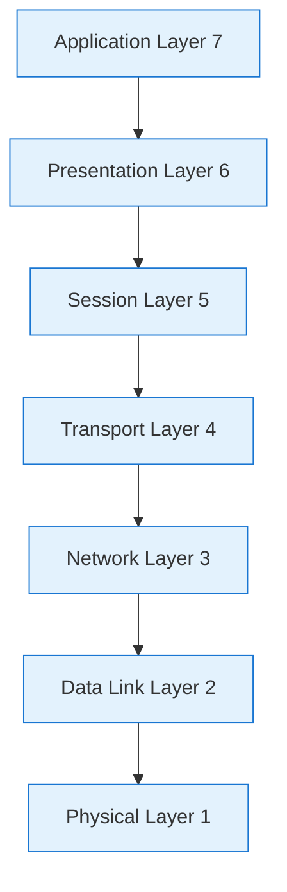

# OSI (Open Systems Interconnection) Model for System Design Interviews

## 📋 Table of Contents

1. [OSI Fundamentals](#osi-fundamentals)
2. [The 7 Layers (Top → Bottom)](#the-7-layers-top-→-bottom)
3. [Layer-by-Layer Responsibilities & Protocols](#layer-by-layer-responsibilities--protocols)
4. [How Data Flows Through the OSI Model (Step-by-Step)](#how-data-flows-through-the-osi-model-step-by-step)
5. [Mapping OSI to TCP/IP Stack](#mapping-osi-to-tcpip-stack)
6. [Common Interview Questions](#common-interview-questions)
7. [Troubleshooting Checklist & Tools](#troubleshooting-checklist--tools)

---

## 🔧 OSI Fundamentals

### What is the OSI Model?

- A conceptual framework that standardizes the functions of a telecommunication or computing system into seven abstraction layers.
- Purpose: Provide common language for describing network interactions and to separate concerns so protocols and implementations can interoperate.
- Analogy: A postal system where each layer is a step in packaging, addressing, transporting, delivering, and interpreting a letter.

### Why it matters in system design

- Helps reason about where failures happen and where to add features (encryption, retries, compression, load balancing).
- Useful during interviews to map requirements (latency, reliability, throughput) to network/OS/kernel/application layers.

---

## 🧱 The 7 Layers (Top → Bottom)

1. Application (Layer 7)
2. Presentation (Layer 6)
3. Session (Layer 5)
4. Transport (Layer 4)
5. Network (Layer 3)
6. Data Link (Layer 2)
7. Physical (Layer 1)



_High-level view of the OSI layers (top = user-facing, bottom = physical media)_

---

## 🧭 Layer-by-Layer Responsibilities & Protocols

### Layer 7 — Application

- Role: Provides network services directly to end-user applications.
- Examples: HTTP(S), FTP, SMTP, DNS (application protocol), SSH, WebSocket.
- Responsibilities: Resource representation, request/response semantics, user-level APIs.
- When to mention in system design: APIs, client/server contracts, content negotiation, authentication endpoints.

### Layer 6 — Presentation

- Role: Translate, encrypt/decrypt, and serialize data for the application layer.
- Examples: TLS/SSL (encryption/handshake happens across 6/7 boundary in practice), data formats like JSON, XML, Protobuf, compression (gzip).
- Responsibilities: Data encoding/decoding, compression, encryption.
- In practice: Modern stacks blur 6 & 7 — JSON over HTTPS is a common example.

### Layer 5 — Session

- Role: Manage sessions and connections between applications (establish, maintain, terminate).
- Examples: TLS session resumption, RPC session state, SMB sessions.
- Responsibilities: Session management, checkpoints, recovery, dialog control.
- In system design: Long-lived connections, session affinity, and connection reuse decisions.

### Layer 4 — Transport

- Role: End-to-end communication and reliability between hosts.
- Protocols: TCP (reliable, ordered), UDP (unreliable, low-latency), QUIC (UDP-based, multiplexed + TLS).
- Responsibilities: Flow control, congestion control, multiplexing (ports), segmentation/reassembly, reliability (retransmit), error detection.
- Design trade-offs: Choose TCP for reliability, UDP/QUIC for low-latency or media streaming; tune timeouts, window sizes, and keepalives.

### Layer 3 — Network

- Role: Host-to-host routing across multiple networks.
- Protocols: IP (IPv4/IPv6), ICMP (diagnostics), routing protocols (BGP, OSPF) live nearby.
- Responsibilities: Logical addressing (IP), routing, fragmentation (rarely used), best-effort delivery.
- In system design: IP addressing, subnets, routing, multi-homing, anycast, and traffic engineering.

### Layer 2 — Data Link

- Role: Node-to-node data transfer on a single link and physical network topology framing.
- Protocols/Technologies: Ethernet (802.3), ARP, VLAN (802.1Q), PPP, Wi-Fi (802.11).
- Responsibilities: MAC addressing, frame delimiting, error detection (CRC), switching, VLAN segregation.
- Design considerations: LAN topology, collision domains, switching performance, VLANs for multi-tenancy.

### Layer 1 — Physical

- Role: Transmit raw bitstreams over a physical medium.
- Examples: Copper cables (Ethernet), fiber optics, wireless radio, electrical/optical signaling.
- Responsibilities: Voltage levels, timing, bit rates, physical connectors, modulation.
- In system design: Link capacity, latency, fiber runs, last-mile constraints, NIC capabilities.

---

## 🔁 How Data Flows Through the OSI Model (Step-by-Step)

### Client → Server request (high level)

1. Application layer (7): Browser builds HTTP request (GET /index)
2. Presentation (6): Request payload encoded (UTF-8, compressed, TLS encrypts)
3. Session (5): TLS session used or HTTP/2 stream established
4. Transport (4): TCP segments the data, adds ports and sequence numbers
5. Network (3): IP packet created with source/destination IP
6. Data Link (2): Ethernet frame added with source/destination MAC
7. Physical (1): Bits transmitted over fiber/wireless

Response follows reverse process at recipient (frames → packets → segments → application data).

```mermaid
flowchart TD
	A[App: HTTP GET /] --> B[Presentation: TLS encrypt / gzip]
	B --> C[Session: TLS session/HTTP2 stream]
	C --> D[Transport: TCP segment (srcPort,dstPort,seq)]
	D --> E[Network: IP packet (srcIP,dstIP)]
	E --> F[Data Link: Ethernet frame (srcMAC,dstMAC)]
	F --> G[Physical: Bits on the wire]

	classDef net fill:#e3f2fd,stroke:#1976d2
	class A,B,C,D,E,F,G net
```

---

## 🔗 Mapping OSI to TCP/IP Stack

- OSI is conceptual; TCP/IP is the dominant practical stack. Mapping commonly used in interviews:

- OSI L7 (Application) → TCP/IP Application (HTTP, DNS, SMTP)
- OSI L6/L5 (Presentation/Session) → Often part of Application (TLS, serialization)
- OSI L4 (Transport) → TCP/IP Transport (TCP, UDP, QUIC)
- OSI L3 (Network) → IP (IPv4/IPv6) + routing (BGP)
- OSI L2 (Data Link) → Ethernet/Wi‑Fi/ARP
- OSI L1 (Physical) → Physical media (fiber, copper, radio)

Why this mapping matters: When designing systems you usually operate at the Application/Transport/Network boundary (L7/L4/L3). Lower layers matter for performance, capacity and failure modes.

---

## ❓ Common Interview Questions

Q1: "Where would you implement retry logic?"

- Answer: Typically at the application layer (L7) for idempotent operations; some transport layer retries are automatic (TCP retransmits). Use exponential backoff and idempotency keys to avoid duplicate side-effects.

Q2: "What layer does TLS live in?"

- Answer: Conceptually TLS is between Application and Transport (Presentation/Session — L6/L5). Practically it’s implemented above TCP (L4) and below application protocols like HTTP.

Q3: "When would you choose UDP over TCP?"

- Answer: Use UDP for low-latency, loss-tolerant traffic (VoIP, real-time gaming, DNS queries, QUIC underlying). If ordering and reliability are required, use TCP or QUIC.

Q4: "How does network partitioning map to OSI layers?"

- Answer: Partitions often show at L3 (routing failures), but can be caused by L1/L2 failures (link down, switch faults). Application-level partition handling (circuit breakers, retries) is necessary.

Q5: "Where to add caching and compression?"

- Answer: Caching is usually at the Application layer (HTTP caches, CDN). Compression can be done at Presentation (gzip) or Application levels depending on control and context.

---

## 🛠️ Troubleshooting Checklist & Tools

Layer-focused checks:

- L7 (Application): Check app logs, HTTP response codes, timeouts, API contracts. Tools: curl, Postman, application logs, APM (Datadog/NewRelic).
- L6 (Presentation): Verify TLS certs, cipher suites, and compression. Tools: openssl s_client, sslyze.
- L5 (Session): Inspect session resumption, connection reuse. Tools: browser devtools, tls session caching logs.
- L4 (Transport): Check TCP/UDP ports, retransmits, window size, latency. Tools: netstat/ss, tcpdump, wireshark, tcptraceroute, iperf.
- L3 (Network): Verify routing, IP addressing, MTU issues, ICMP. Tools: ping, traceroute, bgp looking glass, ip route.
- L2 (Data Link): VLAN membership, ARP tables, switch port states. Tools: arp -a, show mac address-table (switch), Wi‑Fi diagnostics.
- L1 (Physical): Check cables, fiber, SFPs, NIC link lights, signal integrity. Tools: physical inspection, light meters, NIC statistics.

Quick diagnostics flow (example):

1. Can the client ping the server (L3/ICMP)? If not, check routing and firewall.
2. Is TCP port open (L4)? Use tcpdump + netstat to confirm SYNs and responses.
3. Are TLS handshakes succeeding (L6)? Use openssl s_client to inspect certs and cipher negotiation.
4. Is the application responding correctly (L7)? Use curl to inspect HTTP response and headers.

---

## ✅ Quick Summary (what to memorize)

- The OSI model is a seven-layer conceptual stack useful for reasoning about where problems and features belong.
- In practice, Application/Transport/Network are most relevant in system design.
- Protocols to remember: HTTP/TLS (L7/L6), TCP/UDP/QUIC (L4), IP (L3), Ethernet/ARP (L2), fiber/copper/wireless (L1).
- For interviews, map requirements to layers: security (L6), reliability (L4), routing/multi-homing (L3), physical capacity (L1).

---
