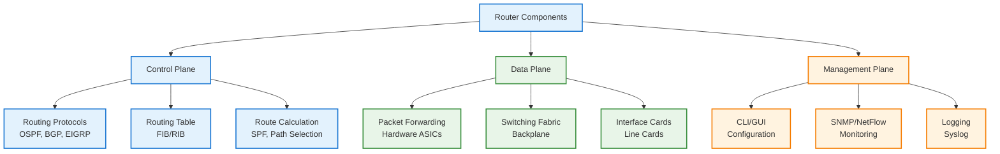
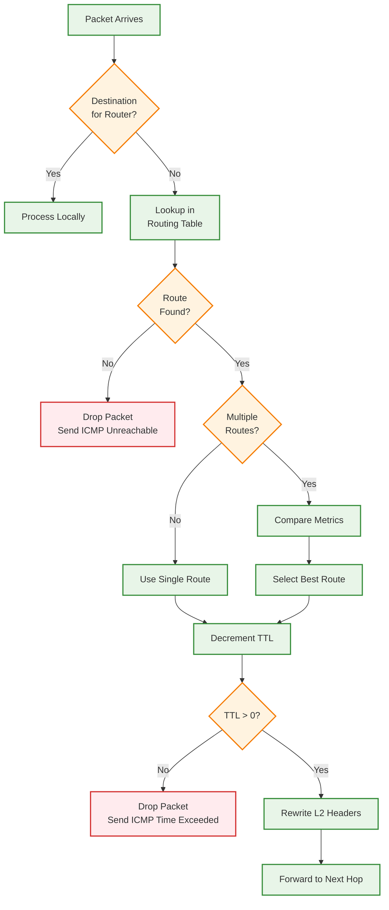
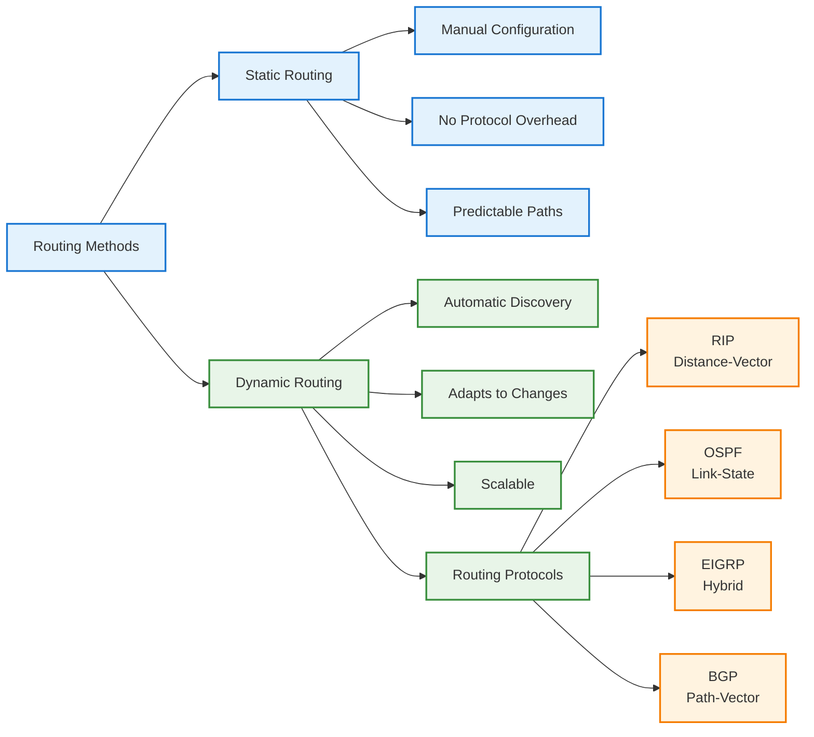
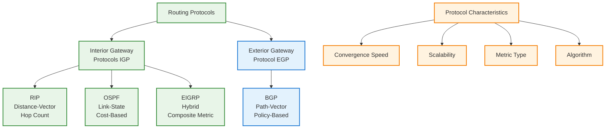
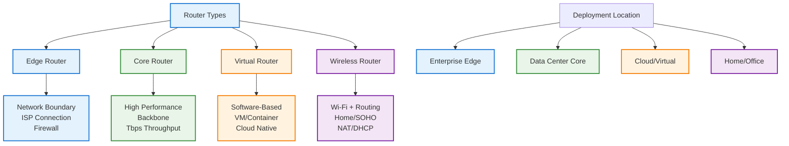
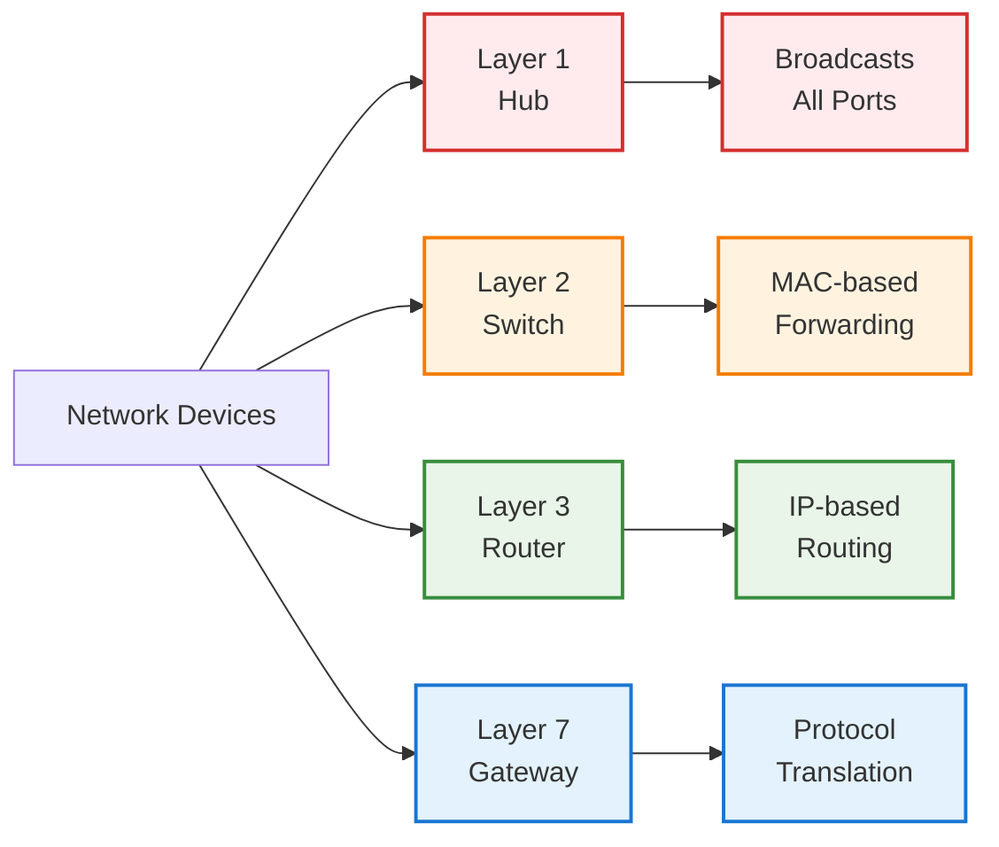
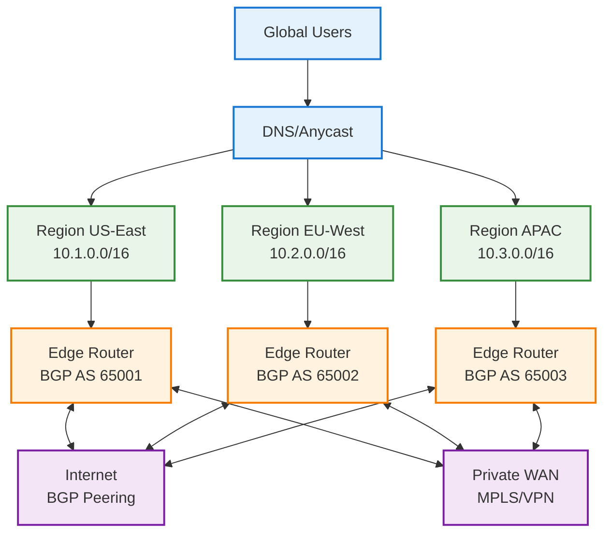
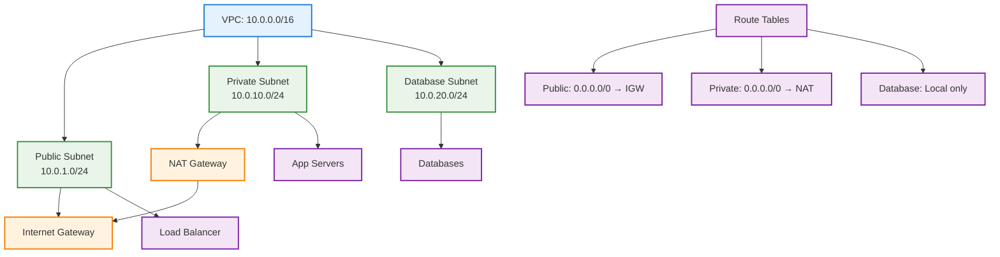
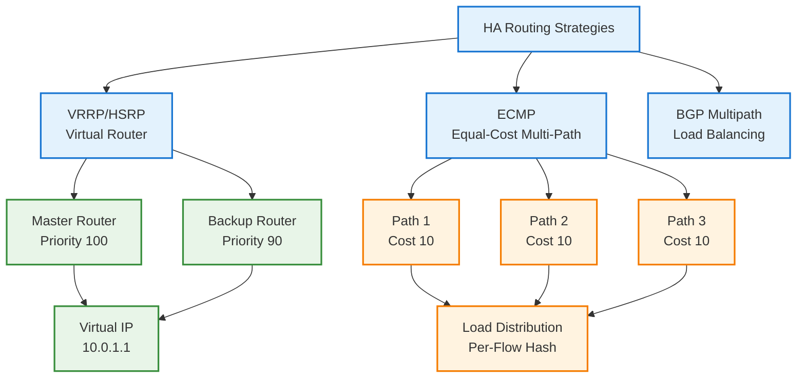
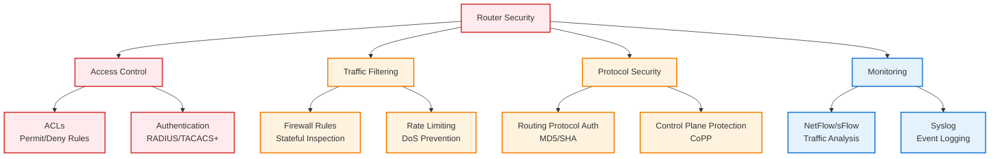

# Router for System Design Interviews

## 📋 Table of Contents

1. [Router Fundamentals](#router-fundamentals)
2. [How Routing Works](#how-routing-works)
3. [Routing Methods](#routing-methods)
4. [Routing Protocols](#routing-protocols)
5. [Router Types](#router-types)
6. [Router vs Other Devices](#router-vs-other-devices)
7. [Routing in System Design](#routing-in-system-design)
8. [Performance and Scaling](#performance-and-scaling)
9. [Security Considerations](#security-considerations)
10. [Common Interview Questions](#common-interview-questions)

---

## 🔧 Router Fundamentals

### What is a Router?

- **Router**: A networking device that forwards data packets between computer networks
- **Purpose**: Intelligent routing decisions based on IP addresses and network topology
- **Analogy**: Post office sorting center that directs mail to the correct destination

### Why Routers Exist

```
Problem: Networks need to communicate with each other
├── LANs are isolated broadcast domains
├── Direct connections between all networks is impractical
├── Need intelligent path selection for efficiency
└── Require traffic control and security boundaries

Solution: Routers connect networks and make forwarding decisions
├── Operate at Layer 3 (Network Layer)
├── Use IP addresses for routing decisions
├── Maintain routing tables for path selection
└── Provide network segmentation and security
```

### Router Architecture Overview



_Router architecture showing control, data, and management planes_

---

## 🔍 How Routing Works

### Packet Forwarding Process



_Routing decision flowchart from packet arrival to forwarding_

### Detailed Routing Steps

```
Step-by-step routing:

1. Packet arrives at router interface
   ├── Router receives packet on ingress interface
   └── Validates packet integrity (checksum)

2. Router examines destination IP address
   ├── Extracts destination IP from packet header
   └── Determines if packet is for router itself or needs forwarding

3. Looks up destination in routing table
   ├── Performs longest prefix match
   ├── Finds best matching route
   └── Checks route validity and reachability

4. Determines best path based on routing metrics
   ├── Evaluates metric/cost if multiple routes exist
   ├── Considers administrative distance
   └── Selects optimal next hop

5. Forwards packet to next hop
   ├── Rewrites Layer 2 headers (MAC addresses)
   ├── Keeps Layer 3 headers mostly intact
   └── Queues packet for transmission

6. Decrements TTL (Time To Live)
   ├── Reduces TTL by 1
   ├── Discards packet if TTL reaches 0
   └── Prevents routing loops

7. Recalculates checksum
   ├── Updates IP header checksum
   └── Ensures packet integrity

8. Sends packet out appropriate interface
   ├── Transmits on egress interface
   └── Updates forwarding statistics
```

### Routing Table Structure

```
Routing Table Entry:
┌──────────────────┬──────────────┬──────────────┬────────┬──────────┐
│ Destination      │ Subnet Mask  │ Next Hop     │ Metric │ Interface│
├──────────────────┼──────────────┼──────────────┼────────┼──────────┤
│ 10.0.0.0         │ 255.255.255.0│ 10.0.1.1     │ 10     │ eth0     │
│ 192.168.1.0      │ 255.255.255.0│ 192.168.1.1  │ 5      │ eth1     │
│ 0.0.0.0          │ 0.0.0.0      │ 203.0.113.1  │ 1      │ eth2     │
└──────────────────┴──────────────┴──────────────┴────────┴──────────┘

Longest Prefix Match:
├── Packet to 10.0.0.50: Matches 10.0.0.0/24 (more specific)
├── Packet to 172.16.5.10: Matches 0.0.0.0/0 (default route)
└── Most specific route wins
```

---

## 🔀 Routing Methods

### Static vs Dynamic Routing



_Comparison of static and dynamic routing approaches_

### 1. Static Routing

```
Definition: Routes manually configured by administrator

Configuration Example:
ip route 192.168.2.0 255.255.255.0 10.0.1.1

Characteristics:
├── Fixed routes that don't change
├── Administrator defines all paths
├── No routing protocol overhead
└── Predictable behavior

Pros:
├── Simple and predictable
├── No routing protocol overhead
├── More secure (no route advertisements)
├── Full control over routing decisions
└── Lower CPU and memory usage

Cons:
├── Not scalable for large networks
├── No automatic failover
├── Manual updates required for topology changes
├── Human error prone
└── Time-consuming to maintain

Use cases:
├── Small networks (<10 routers)
├── Stub networks (single exit point)
├── Default routes to ISP
└── Security-critical environments
```

### 2. Dynamic Routing

```
Definition: Routes learned automatically via routing protocols

Characteristics:
├── Automatic route discovery
├── Adapts to topology changes
├── Routers exchange routing information
└── Convergence after network changes

Pros:
├── Automatic route discovery
├── Adapts to network changes
├── Scalable for large networks
├── Automatic failover
└── Reduced administrative overhead

Cons:
├── More complex configuration
├── Consumes bandwidth and CPU
├── Convergence time during failures
├── Potential for routing loops
└── Security concerns (route injection)

Use cases:
├── Large enterprise networks
├── Service provider networks
├── Data center fabrics
└── Any dynamic topology
```

---

## 📡 Routing Protocols

### Protocol Comparison



_Routing protocol classification and characteristics_

### Protocol Details

```
┌──────────┬──────────────┬─────────┬──────────┬─────────────┬──────────┐
│ Protocol │ Type         │ Metric  │ Algorithm│ Convergence │ Use Case │
├──────────┼──────────────┼─────────┼──────────┼─────────────┼──────────┤
│ RIP      │ Distance-vec │ Hop cnt │ Bellman  │ Slow (min)  │ Small    │
│ OSPF     │ Link-state   │ Cost    │ Dijkstra │ Fast (sec)  │ Enterprise│
│ EIGRP    │ Hybrid       │ Composite│ DUAL    │ Very fast   │ Cisco    │
│ BGP      │ Path-vector  │ Policy  │ Best path│ Slow (min)  │ Internet │
└──────────┴──────────────┴─────────┴──────────┴─────────────┴──────────┘
```

### Routing Metrics

```
Metrics used to determine best path:

├── Hop Count (RIP):
│   └── Number of routers to destination
│       Example: 3 hops better than 5 hops

├── Cost (OSPF):
│   └── Based on bandwidth: Cost = 100,000,000 / bandwidth(bps)
│       Examples:
│       - 1 Gbps link = cost 1
│       - 100 Mbps = cost 10
│       - 10 Mbps = cost 100

├── Bandwidth:
│   └── Link capacity in bps
│       Example: 10 Gbps better than 1 Gbps

├── Delay:
│   └── Time to traverse path
│       Example: 10ms better than 50ms

├── Load:
│   └── Current traffic on path
│       Example: 50% utilized better than 90%

├── Reliability:
│   └── Error rates and uptime
│       Example: 99.99% uptime better than 99%

└── Administrative Distance:
    └── Trustworthiness of routing source
        Connected: 0, Static: 1, EIGRP: 90, OSPF: 110, RIP: 120
```

---

## 🔌 Router Types

### Router Classification



_Different router types based on function and deployment_

### Router vs Other Devices



_OSI layer comparison of network devices_

---

## 🏗️ Routing in System Design

### Multi-Region Architecture



_Multi-region routing architecture with BGP_

### VPC Routing



_VPC routing with public, private, and database subnets_

---

## ⚡ Performance and Scaling

### High Availability Patterns



_High availability routing patterns_

### Scalability Strategies

```
1. Horizontal Scaling:
   ├── Add more routers for redundancy
   ├── Distribute load across multiple routers
   ├── Use ECMP for parallel paths
   └── Example: Multiple edge routers with BGP

2. Vertical Scaling:
   ├── Upgrade to higher-capacity routers
   ├── More powerful CPUs and ASICs
   ├── Increased memory for routing tables
   └── Example: 100 Gbps → 400 Gbps interfaces

3. Route Aggregation:
   ├── Summarize routes to reduce table size
   ├── Use CIDR for address allocation
   ├── Hierarchical addressing scheme
   └── Example: 10.0.0.0/24 + 10.0.1.0/24 → 10.0.0.0/23
```

### Performance Optimization

```
1. Hardware Acceleration:
   ├── ASICs for fast packet processing
   ├── Line-rate forwarding (no software processing)
   ├── Dedicated forwarding engines
   └── Example: Broadcom Trident, Cisco Quantum Flow

2. Route Caching:
   ├── Store frequently used routes in fast memory
   ├── Reduce routing table lookups
   ├── Flow-based forwarding
   └── Example: Cache top 10% of routes = 90% hit rate

3. Routing Table Optimization:
   ├── Minimize routing table size
   ├── Use default routes where possible
   ├── Route aggregation and summarization
   └── Example: 100K routes vs 10K aggregated routes

4. Control Plane Protection:
   ├── Rate limit routing protocol packets
   ├── Separate control and data plane resources
   ├── Prioritize critical routing updates
   └── Prevent control plane overload
```

### Performance Metrics

```
├── Throughput: Packets per second (pps) or bits per second (bps)
│   Example: 1 Mpps, 100 Gbps

├── Latency: Time to forward a packet
│   Example: <1 µs (microsecond) for hardware forwarding

├── Packet Loss: Percentage of dropped packets
│   Example: <0.01% under normal conditions

├── Routing Table Size: Number of routes supported
│   Example: 1M routes (internet full table)

├── Convergence Time: Time to adapt to topology changes
│   Example: OSPF <1s, BGP 30-60s

└── CPU/Memory Usage: Resource utilization
    Example: <50% CPU, 4GB routing table memory
```

---

## 🔐 Security Considerations

### Security Features



_Router security layers and features_

### Access Control Lists (ACLs)

```
Definition: Filter traffic based on rules

ACL Types:
├── Standard ACL: Filter by source IP only
├── Extended ACL: Filter by source/dest IP, port, protocol
└── Named ACL: Descriptive names for easier management

Example Extended ACL:
permit tcp 10.0.0.0/24 any eq 443  # Allow HTTPS from internal
permit tcp 10.0.0.0/24 any eq 80   # Allow HTTP from internal
deny ip any any                     # Deny everything else

Best Practices:
├── Place ACLs close to source (for deny rules)
├── Place ACLs close to destination (for permit rules)
├── Order matters (first match wins)
└── Always end with explicit deny
```

### Routing Protocol Security

```
Authentication Methods:
├── MD5: Legacy, still widely used
├── SHA: More secure than MD5
└── IPsec: Encrypt entire routing protocol traffic

OSPF Authentication:
├── Type 0: No authentication (insecure)
├── Type 1: Plain text (insecure)
└── Type 2: MD5 (recommended minimum)

BGP Security:
├── MD5 authentication for peer sessions
├── Prefix filtering (only accept expected routes)
├── AS path filtering (validate AS path)
└── RPKI (Resource Public Key Infrastructure) for route validation
```

---

## 🔑 Key Concepts

### NAT (Network Address Translation)

```
Integration with Routers:
├── Often implemented in routers
├── Translates private IP addresses to public IPs
├── Conserves public IP address space
└── See [NAT documentation](./nat.md) for details

Types in Routers:
├── Static NAT: 1:1 mapping (servers)
├── Dynamic NAT: Pool-based mapping
└── PAT/NAPT: Many-to-one with ports (most common)

Use Cases:
├── Home routers (PAT)
├── Enterprise edge routers
└── Cloud VPC NAT gateways
```

### Default Gateway

```
Definition: Router that serves as access point to other networks

Function:
├── Destination for packets with unknown routes
├── Critical for internet connectivity
├── Typically first or last IP in subnet

Configuration Example:
Network: 10.0.1.0/24
├── Default Gateway: 10.0.1.1 (router)
├── Hosts: 10.0.1.10 - 10.0.1.254
└── Hosts configure gateway as 10.0.1.1

Redundancy:
├── VRRP/HSRP for virtual gateway IP
├── Automatic failover between routers
└── Transparent to end hosts
```

### Routing Loop Prevention

```
Mechanisms:

1. TTL (Time To Live):
   ├── Packet discarded after hop limit
   ├── Prevents infinite loops
   └── Default: 64 or 128 hops

2. Split Horizon:
   ├── Don't advertise routes back to source
   ├── Used in distance-vector protocols
   └── Prevents routing loops in simple topologies

3. Route Poisoning:
   ├── Mark failed routes as unreachable
   ├── RIP: metric = 16 (infinity)
   └── Advertise poisoned route to neighbors

4. Hold-down Timers:
   ├── Wait before accepting new routes after failure
   ├── Prevents premature convergence
   └── Allows network to stabilize
```

---

## 📊 Additional Use Cases

### Microservices Communication

```
Service Mesh Routing:
├── Service mesh routers (Envoy, Istio, Linkerd)
├── Route requests to appropriate service instances
├── Implement traffic splitting for canary deployments
└── A/B testing and blue-green deployments

Features:
├── Dynamic service discovery
├── Load balancing across instances
├── Circuit breaking and retries
├── Traffic policies (timeouts, retries)
└── Observability and tracing

Example:
api.example.com/v1/* → service-v1 (90%)
api.example.com/v1/* → service-v2 (10% canary)
```

### Load Balancing

```
Router-based Load Balancing:
├── Routers can distribute traffic across multiple servers
├── Use routing metrics to avoid overloaded paths
├── Implement health checks for automatic failover
└── ECMP for equal-cost load distribution

Methods:
├── Round-robin DNS (simple)
├── ECMP routing (network layer)
├── Anycast routing (global distribution)
└── Policy-based routing (advanced)

Example ECMP:
Destination: 10.2.0.0/16
├── Path 1 via Router A (cost 10)
├── Path 2 via Router B (cost 10)
├── Path 3 via Router C (cost 10)
└── Traffic distributed across all three paths
```

### Network Isolation

```
Use Cases:
├── Separate production, staging, and development networks
├── Route traffic between VPCs/VNets
├── Implement security zones with controlled routing
└── Compliance and regulatory requirements

Implementation:
├── VRF (Virtual Routing and Forwarding)
├── Separate routing tables per environment
├── Firewall rules between zones
└── Controlled inter-zone routing

Example:
Production VRF: 10.1.0.0/16
├── No direct access from other environments
├── Controlled access via firewall
└── Separate routing table

Staging VRF: 10.2.0.0/16
├── Isolated from production
└── Can access shared services
```

---

## 🔗 Related Concepts

- **[Gateway](./gateway.md)** - Application-level routing and protocol translation
- **[NAT](./nat.md)** - Address translation in routers
- **[DNS](./dns.md)** - Name resolution before routing
- **[CDN](./cdn.md)** - Content routing and caching
- **[Load Balancer](../load-balancer.md)** - Application-layer traffic distribution

---

## ❓ Common Interview Questions

### Q1. Explain how a router makes forwarding decisions

**Answer:**

```
Router forwarding process:

1. Packet arrives at ingress interface
2. Extract destination IP address from packet header
3. Perform longest prefix match in routing table
4. Select best route based on:
   ├── Most specific prefix (longest match)
   ├── Administrative distance (if multiple protocols)
   └── Metric (if multiple routes from same protocol)
5. Decrement TTL (drop if TTL=0)
6. Rewrite Layer 2 headers (source/dest MAC)
7. Forward packet out egress interface

Example:
Routing table:
├── 10.0.0.0/8 → Router A
├── 10.1.0.0/16 → Router B
└── 10.1.2.0/24 → Router C

Packet to 10.1.2.50:
└── Matches all three, but 10.1.2.0/24 is most specific → Router C
```

### Q2. Static vs Dynamic routing - when to use each?

**Answer:**

```
Static Routing:
Use when:
├── Small network (<10 routers)
├── Stub network (single exit point)
├── Predictable topology
├── Security is critical (no route advertisements)
└── Low resource usage required

Example: Branch office with single ISP connection
Route: 0.0.0.0/0 → ISP Router

Dynamic Routing:
Use when:
├── Large network (>10 routers)
├── Multiple paths available
├── Topology changes frequently
├── Automatic failover needed
└── Scalability required

Example: Data center with 100+ routers running OSPF
```

### Q3. How does BGP differ from OSPF?

**Answer:**

```
┌────────────────┬─────────────────────┬──────────────────────┐
│ Aspect         │ OSPF                │ BGP                  │
├────────────────┼─────────────────────┼──────────────────────┤
│ Scope          │ Interior (IGP)      │ Exterior (EGP)       │
│ Algorithm      │ Link-state (SPF)    │ Path-vector          │
│ Metric         │ Cost (bandwidth)    │ Policy-based         │
│ Convergence    │ Fast (seconds)      │ Slow (minutes)       │
│ Scalability    │ Thousands of routes │ Millions of routes   │
│ Use Case       │ Enterprise network  │ Internet routing     │
│ Protocol       │ IP protocol 89      │ TCP port 179         │
└────────────────┴─────────────────────┴──────────────────────┘

OSPF: Best for internal enterprise routing
BGP: Best for connecting autonomous systems (ISPs, large enterprises)
```

### Q4. Design routing for a multi-region application

**Answer:**

```
Architecture:

Global DNS (Route 53) with latency-based routing
├── US-East: 10.1.0.0/16 (AS 65001)
├── EU-West: 10.2.0.0/16 (AS 65002)
└── APAC: 10.3.0.0/16 (AS 65003)

Each region:
├── Edge routers with BGP peering to ISPs
├── Internal OSPF for intra-region routing
├── VPN/MPLS for inter-region private connectivity
└── Internet backup path via BGP

Routing decisions:
1. User query → DNS returns nearest region IP
2. Traffic enters via edge router
3. Edge router uses BGP for inter-region
4. Internal routing via OSPF
5. Failover: BGP withdraws routes if region fails

Benefits:
├── Low latency (geo-routing)
├── High availability (automatic failover)
├── Load distribution
└── Disaster recovery
```

### Q5. How do you prevent routing loops?

**Answer:**

```
Routing loop prevention mechanisms:

1. TTL (Time To Live):
   ├── Decremented at each hop
   ├── Packet dropped when TTL=0
   └── Prevents infinite loops

2. Split Horizon:
   ├── Don't advertise routes back to source
   └── Used in distance-vector protocols (RIP)

3. Route Poisoning:
   ├── Mark failed routes as unreachable (metric=16 in RIP)
   └── Advertise poisoned route to neighbors

4. Hold-down Timers:
   ├── Wait before accepting new routes after failure
   └── Prevents premature convergence

5. Administrative Distance:
   ├── Prefer more trustworthy routing sources
   └── Connected (0) > Static (1) > EIGRP (90) > OSPF (110)

6. Loop-free algorithms:
   ├── OSPF: SPF algorithm guarantees loop-free
   └── EIGRP: DUAL algorithm ensures loop-free at all times
```

---

> **Note**: Routers are fundamental to network connectivity, enabling intelligent packet forwarding, network segmentation, and traffic management. Understanding routing protocols, metrics, and design patterns is essential for system design interviews.
