# VPC (Virtual Private Cloud) for System Design Interviews

## 📋 Table of Contents

1. [VPC Fundamentals](#vpc-fundamentals)
2. [VPC Core Components](#vpc-core-components)
3. [How VPC Works (Step-by-Step)](#how-vpc-works-step-by-step)
4. [Subnets and IP Addressing](#subnets-and-ip-addressing)
5. [Routing and Gateways](#routing-and-gateways)
6. [VPC Security](#vpc-security)
7. [VPC in System Design](#vpc-in-system-design)
8. [Multi-VPC Architectures](#multi-vpc-architectures)
9. [Cost, Limits, and Trade-offs](#cost-limits-and-trade-offs)
10. [Common Interview Questions](#common-interview-questions)

---

## 🔧 VPC Fundamentals

### What is a VPC?

- **Virtual Private Cloud**: Isolated virtual network in the cloud that you control
- **Purpose**: Secure, isolated environment for cloud resources with custom networking
- **Analogy**: Your own private data center in the cloud

### Why VPCs Exist

```text
Problem: Cloud resources in shared public network
├── No isolation: all resources share same network
├── Security risk: resources accessible from internet
├── No control: cannot customize IP ranges, routing
└── Compliance: regulations require network isolation

Solution: VPC provides isolated network
├── Private IP space: define your own CIDR blocks
├── Network isolation: resources isolated from other accounts
├── Security controls: firewalls, security groups, NACLs
├── Custom routing: control traffic flow
└── Hybrid connectivity: connect to on-premises networks
```

### VPC Architecture Overview

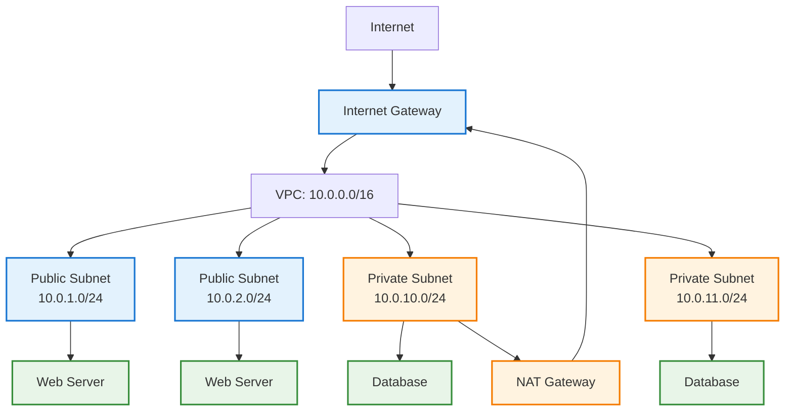

> VPC provides isolated network environment with public and private subnets for different security requirements

---

## 🏗️ VPC Core Components

### 1. CIDR Block (IP Address Range)

```text
Definition: Range of IP addresses for your VPC

Example: 10.0.0.0/16
├── Network: 10.0.0.0
├── Subnet mask: /16 (255.255.0.0)
├── Available IPs: 65,536 addresses (10.0.0.0 - 10.0.255.255)
└── Usable IPs: 65,531 (AWS reserves 5 per subnet)

Common CIDR blocks:
├── 10.0.0.0/16: 65,536 IPs (recommended for large VPCs)
├── 172.31.0.0/16: 65,536 IPs (AWS default VPC)
├── 192.168.0.0/16: 65,536 IPs (common for small VPCs)
└── 10.0.0.0/24: 256 IPs (small VPC)

RFC 1918 private IP ranges:
├── 10.0.0.0/8: 10.0.0.0 - 10.255.255.255
├── 172.16.0.0/12: 172.16.0.0 - 172.31.255.255
└── 192.168.0.0/16: 192.168.0.0 - 192.168.255.255
```

### 2. Subnets

```text
Definition: Subdivision of VPC CIDR block

Types:
├── Public Subnet: Has route to Internet Gateway
├── Private Subnet: No direct internet access
└── VPN-only Subnet: Only accessible via VPN

Example VPC: 10.0.0.0/16
├── Public Subnet 1: 10.0.1.0/24 (256 IPs, AZ-A)
├── Public Subnet 2: 10.0.2.0/24 (256 IPs, AZ-B)
├── Private Subnet 1: 10.0.10.0/24 (256 IPs, AZ-A)
└── Private Subnet 2: 10.0.11.0/24 (256 IPs, AZ-B)

Best practice: Spread subnets across multiple Availability Zones
```

### 3. Internet Gateway (IGW)

```text
Definition: Gateway for internet connectivity

Characteristics:
├── Horizontally scaled, redundant, highly available
├── One IGW per VPC
├── No bandwidth constraints
└── Performs NAT for instances with public IPs

Use case: Allow public subnet resources to access internet
```

### 4. NAT Gateway

```text
Definition: Network Address Translation for private subnets

Purpose: Allow private subnet resources to access internet (outbound only)

Characteristics:
├── Managed service (AWS handles availability)
├── Deployed in public subnet
├── Requires Elastic IP
├── Bandwidth: 5 Gbps, scales to 45 Gbps
└── Cost: $0.045/hour + $0.045/GB processed

Alternative: NAT Instance (self-managed EC2)
├── Cheaper but requires management
├── Single point of failure (unless HA setup)
└── Limited by instance bandwidth
```

### 5. Route Tables

```text
Definition: Rules that determine where network traffic is directed

Components:
├── Destination: CIDR block
├── Target: Where to send traffic (IGW, NAT, VPC peering, etc.)
└── Priority: Most specific route wins

Example: Public Subnet Route Table
├── 10.0.0.0/16 → local (VPC traffic)
└── 0.0.0.0/0 → igw-xxx (internet traffic)

Example: Private Subnet Route Table
├── 10.0.0.0/16 → local (VPC traffic)
└── 0.0.0.0/0 → nat-xxx (internet via NAT)
```

### 6. Security Groups

```text
Definition: Virtual firewall for instances (stateful)

Characteristics:
├── Stateful: return traffic automatically allowed
├── Allow rules only (no deny rules)
├── Applied at instance level
├── Evaluate all rules before deciding
└── Default: deny all inbound, allow all outbound

Example: Web Server Security Group
Inbound:
├── Port 80 (HTTP) from 0.0.0.0/0
├── Port 443 (HTTPS) from 0.0.0.0/0
└── Port 22 (SSH) from 203.0.113.0/24 (admin IPs)

Outbound:
└── All traffic to 0.0.0.0/0
```

### 7. Network ACLs (NACLs)

```text
Definition: Subnet-level firewall (stateless)

Characteristics:
├── Stateless: must allow return traffic explicitly
├── Allow and deny rules
├── Applied at subnet level
├── Rules evaluated in order (lowest number first)
└── Default: allow all inbound and outbound

Example: Public Subnet NACL
Inbound:
├── Rule 100: Allow HTTP (80) from 0.0.0.0/0
├── Rule 110: Allow HTTPS (443) from 0.0.0.0/0
├── Rule 120: Allow SSH (22) from 203.0.113.0/24
├── Rule 130: Allow ephemeral ports (1024-65535) from 0.0.0.0/0
└── Rule *: Deny all

Outbound:
├── Rule 100: Allow all to 0.0.0.0/0
└── Rule *: Deny all
```

### 8. VPC Endpoints

```text
Definition: Private connection to AWS services without internet

Types:

1. Interface Endpoints (PrivateLink):
   ├── Elastic Network Interface (ENI) in subnet
   ├── Uses private IP from VPC
   ├── Supports most AWS services
   └── Cost: $0.01/hour + $0.01/GB

2. Gateway Endpoints:
   ├── Route table entry (no ENI)
   ├── Free
   ├── Only for S3 and DynamoDB
   └── Preferred for S3/DynamoDB access

Benefit: Avoid NAT Gateway costs and improve security
```

---

## 🔍 How VPC Works (Step-by-Step)

### Creating a VPC

```text
Step 1: Define CIDR Block
├── Choose IP range (e.g., 10.0.0.0/16)
├── Ensure no overlap with on-premises networks
└── Consider future growth

Step 2: Create Subnets
├── Divide CIDR into smaller blocks
├── Assign to Availability Zones
├── Designate public vs private
└── Example:
    ├── 10.0.1.0/24 → Public Subnet AZ-A
    ├── 10.0.2.0/24 → Public Subnet AZ-B
    ├── 10.0.10.0/24 → Private Subnet AZ-A
    └── 10.0.11.0/24 → Private Subnet AZ-B

Step 3: Create Internet Gateway
├── Create IGW
└── Attach to VPC

Step 4: Create NAT Gateway
├── Deploy in public subnet
├── Allocate Elastic IP
└── One per AZ for high availability

Step 5: Configure Route Tables
├── Public route table: 0.0.0.0/0 → IGW
├── Private route table: 0.0.0.0/0 → NAT
└── Associate with appropriate subnets

Step 6: Configure Security
├── Create Security Groups
├── Configure NACLs (if needed)
└── Apply to resources
```

### Traffic Flow: Public Subnet

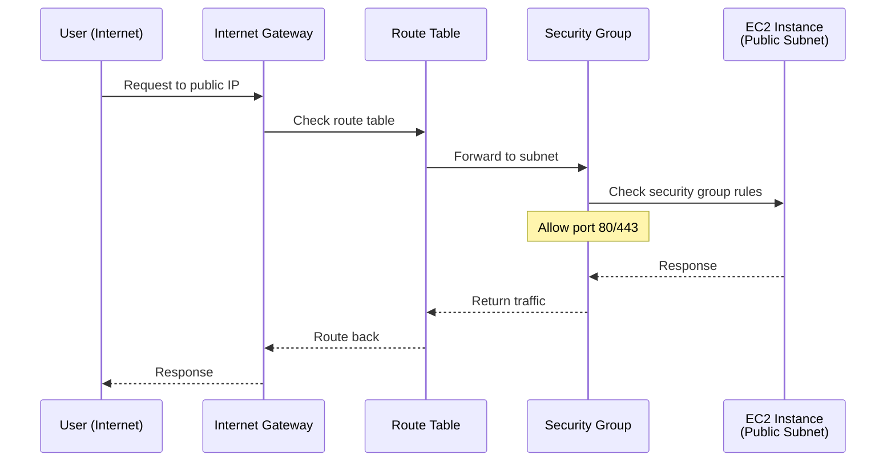

### Traffic Flow: Private Subnet (Outbound)

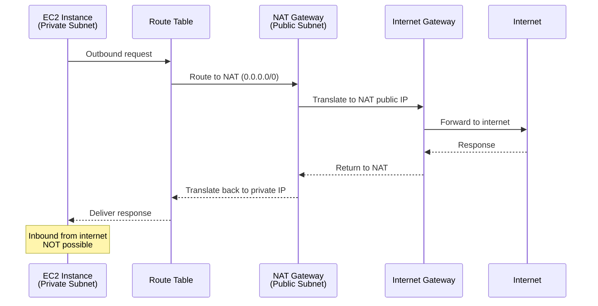

---

## 🌐 Subnets and IP Addressing

### CIDR Notation

```text
Format: IP/prefix
Example: 10.0.0.0/16

Prefix determines subnet mask:
├── /8: 255.0.0.0 (16,777,216 IPs)
├── /16: 255.255.0.0 (65,536 IPs)
├── /24: 255.255.255.0 (256 IPs)
└── /32: 255.255.255.255 (1 IP, host address)

Calculating available IPs:
├── Formula: 2^(32 - prefix)
├── /16: 2^(32-16) = 2^16 = 65,536 IPs
├── /24: 2^(32-24) = 2^8 = 256 IPs
└── AWS reserves 5 IPs per subnet
```

### AWS Reserved IPs (per subnet)

```text
Example subnet: 10.0.1.0/24

Reserved IPs:
├── 10.0.1.0: Network address
├── 10.0.1.1: VPC router
├── 10.0.1.2: DNS server
├── 10.0.1.3: Reserved for future use
└── 10.0.1.255: Broadcast (not used in VPC but reserved)

Usable IPs: 10.0.1.4 - 10.0.1.254 (251 IPs)
```

### Subnet Sizing Strategy

```text
VPC: 10.0.0.0/16 (65,536 IPs)

Option 1: Equal-sized subnets
├── 10.0.0.0/24: Public Subnet 1 (256 IPs)
├── 10.0.1.0/24: Public Subnet 2 (256 IPs)
├── 10.0.2.0/24: Private Subnet 1 (256 IPs)
├── 10.0.3.0/24: Private Subnet 2 (256 IPs)
└── Remaining: 10.0.4.0/16 for future growth

Option 2: Sized by need
├── 10.0.0.0/20: Private Subnet 1 (4,096 IPs for containers)
├── 10.0.16.0/20: Private Subnet 2 (4,096 IPs for containers)
├── 10.0.32.0/24: Public Subnet 1 (256 IPs)
├── 10.0.33.0/24: Public Subnet 2 (256 IPs)
└── Remaining: 10.0.34.0/16 for future

Best practice:
├── Oversize subnets (plan for growth)
├── Use /24 minimum for most subnets
├── Use /20 or larger for container workloads (EKS, ECS)
└── Reserve space for future subnets
```

### Public vs Private Subnets

```text
Public Subnet:
├── Has route to Internet Gateway (0.0.0.0/0 → IGW)
├── Resources can have public IPs
├── Directly accessible from internet (if security allows)
└── Use for: Load balancers, NAT gateways, bastion hosts

Private Subnet:
├── No route to Internet Gateway
├── Route to NAT Gateway for outbound (0.0.0.0/0 → NAT)
├── Not directly accessible from internet
└── Use for: Application servers, databases, internal services

Key difference: Route table, not subnet property
```

---

## 🚦 Routing and Gateways

### Route Table Basics

```text
Route table components:
├── Destination: CIDR block to match
├── Target: Where to send matching traffic
└── Priority: Most specific (longest prefix) wins

Example: VPC 10.0.0.0/16

Main Route Table (default):
├── 10.0.0.0/16 → local (always present, cannot delete)
└── Applies to subnets without explicit association

Public Route Table:
├── 10.0.0.0/16 → local
└── 0.0.0.0/0 → igw-xxx

Private Route Table:
├── 10.0.0.0/16 → local
└── 0.0.0.0/0 → nat-xxx
```

### Internet Gateway (IGW)

```text
Function: Bidirectional internet access for public subnets

Characteristics:
├── Horizontally scaled, redundant, HA by default
├── No bandwidth limits
├── No single point of failure
├── Performs 1:1 NAT for instances with public IPs
└── Free (no hourly or data transfer charges)

Requirements for internet access:
1. Instance in public subnet
2. Public IP or Elastic IP assigned
3. Route table: 0.0.0.0/0 → IGW
4. Security group allows outbound traffic
5. NACL allows outbound traffic
```

### NAT Gateway

```text
Function: Outbound-only internet for private subnets

Deployment:
├── Create in public subnet (needs IGW route)
├── Assign Elastic IP
├── Update private subnet route: 0.0.0.0/0 → NAT
└── One per AZ for high availability

High Availability Setup:
├── NAT Gateway in each AZ
├── Each private subnet routes to NAT in same AZ
└── If AZ fails, only that AZ's private subnets affected

Cost:
├── $0.045/hour per NAT Gateway
├── $0.045/GB data processed
└── Example: 1 NAT, 1 TB/month = $32.40 + $45 = $77.40/month

Cost optimization:
├── Use VPC endpoints for AWS services (free for S3/DynamoDB)
├── Consolidate NAT Gateways (trade-off: availability)
└── Use NAT instance for dev/test (cheaper but less reliable)
```

### VPC Peering

```text
Definition: Private connection between two VPCs

Characteristics:
├── Non-transitive: A↔B and B↔C doesn't mean A↔C
├── No single point of failure
├── No bandwidth bottleneck
├── Supports cross-account and cross-region
└── Requires non-overlapping CIDR blocks

Use case: Connect production and shared services VPCs

Setup:
1. Create peering connection
2. Accept in peer VPC
3. Update route tables in both VPCs
   ├── VPC A: 10.1.0.0/16 → pcx-xxx (to VPC B)
   └── VPC B: 10.0.0.0/16 → pcx-xxx (to VPC A)
4. Update security groups to allow peer VPC CIDR
```

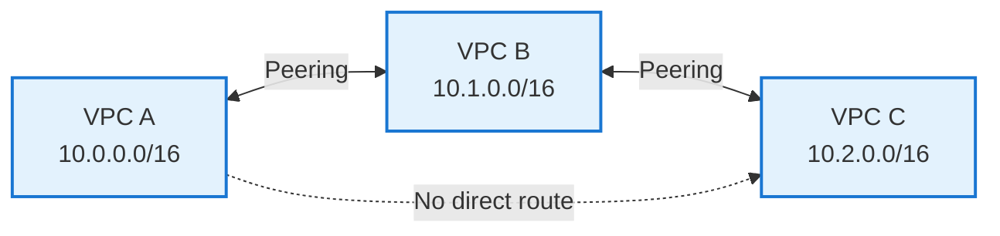

### Transit Gateway

```text
Definition: Hub for connecting multiple VPCs and on-premises networks

Benefits:
├── Transitive routing: A↔Hub↔B means A↔B
├── Centralized management
├── Scales to thousands of VPCs
└── Simplifies network topology

Use case: Connect many VPCs (>5) or hybrid cloud

Cost:
├── $0.05/hour per attachment
├── $0.02/GB data processed
└── Example: 10 VPCs = $36/month + data transfer
```

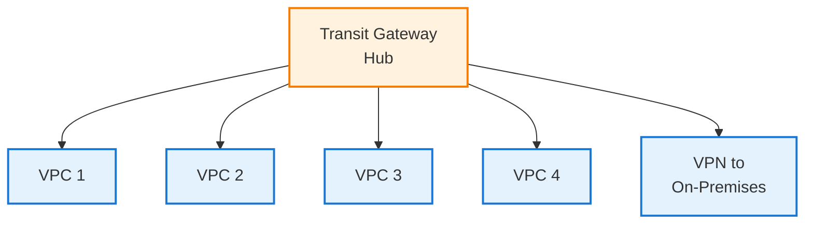

### Transit Gateway Deep Dive

#### Core Concepts

```text
Transit Gateway (TGW) Components:

1. Attachments:
   ├── VPC Attachment: Connect VPC to TGW
   ├── VPN Attachment: Connect on-premises via VPN
   ├── Direct Connect Gateway: Connect via Direct Connect
   ├── Peering Attachment: Connect to TGW in another region
   └── Connect Attachment: SD-WAN integration

2. Route Tables:
   ├── Each attachment associated with route table
   ├── Controls which attachments can communicate
   ├── Enables network segmentation
   └── Default: all attachments can communicate

3. Route Propagation:
   ├── Automatic route learning from attachments
   ├── VPC CIDR blocks automatically propagated
   ├── BGP routes from VPN/Direct Connect
   └── Simplifies route management
```

#### Transit Gateway Architecture Patterns

**Pattern 1: Centralized Egress (Internet Access)**

```text
Problem: Each VPC needs NAT Gateway ($65/month each)
Solution: Centralized egress VPC with shared NAT Gateway

Architecture:
[Spoke VPCs] → Transit Gateway → Egress VPC → NAT Gateway → Internet

Egress VPC:
├── Public Subnet: NAT Gateway
├── Private Subnet: Firewall/inspection (optional)
└── Route: 0.0.0.0/0 → NAT Gateway

Spoke VPCs:
├── Route: 0.0.0.0/0 → Transit Gateway
└── No NAT Gateway needed

Cost savings:
├── Without TGW: 5 VPCs × $65 = $325/month (5 NAT Gateways)
├── With TGW: $36 (TGW) + $65 (1 NAT) = $101/month
└── Savings: $224/month (69% reduction)

Trade-off: Single point of egress (can be HA with multiple NAT Gateways)
```

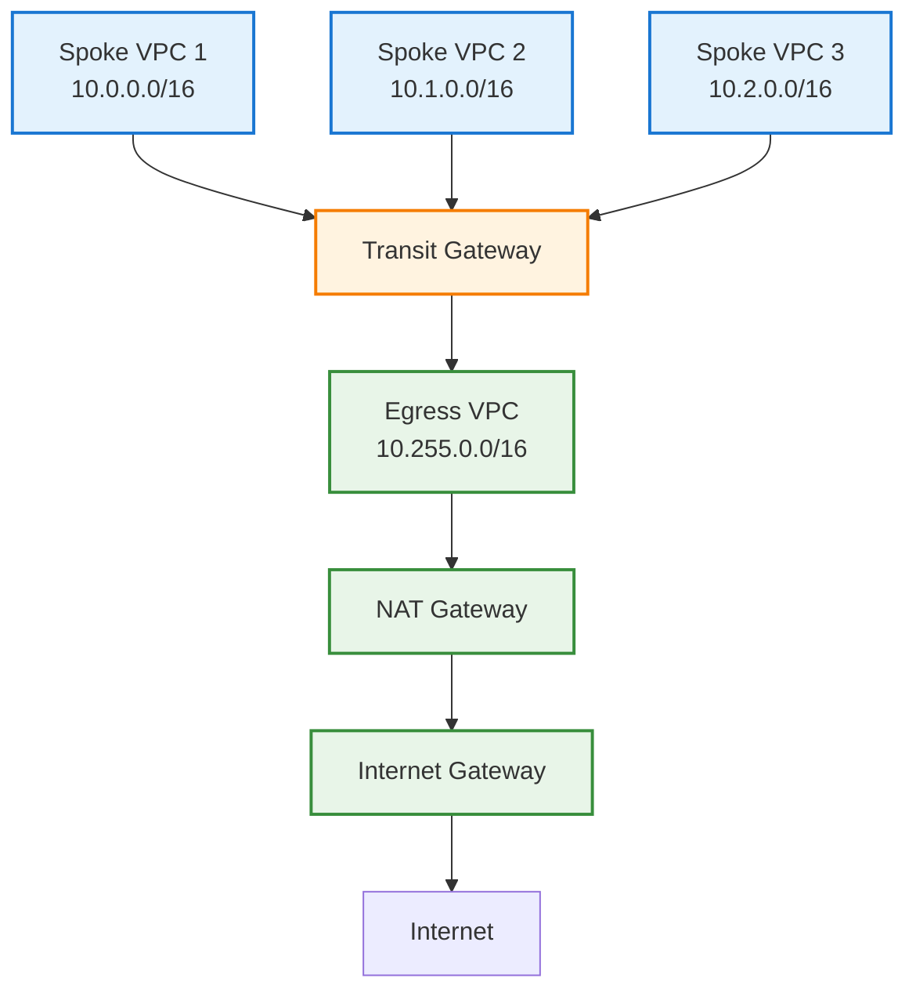

**Pattern 2: Centralized Security (Inspection VPC)**

```text
Problem: Need to inspect all inter-VPC and internet traffic
Solution: Inspection VPC with firewall appliances

Architecture:
[Spoke VPCs] → TGW → Inspection VPC (Firewall) → TGW → Destination

Inspection VPC:
├── Firewall appliances (Palo Alto, Fortinet, AWS Network Firewall)
├── Inspect all traffic (East-West and North-South)
├── IDS/IPS, DLP, threat prevention
└── Centralized logging and monitoring

TGW Route Tables:
├── Spoke Route Table: All traffic → Inspection VPC
├── Inspection Route Table: Inspected traffic → Destination
└── Enforces traffic flow through firewall

Benefits:
├── Centralized security policy
├── Reduced cost (shared firewall)
├── Simplified compliance
└── Visibility into all traffic

Use case: Financial services, healthcare (compliance requirements)
```

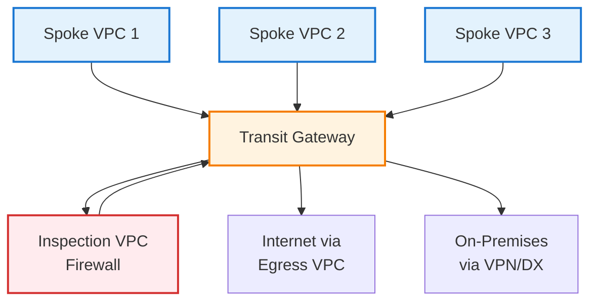

**Pattern 3: Network Segmentation (Isolated Environments)**

```text
Problem: Need to isolate prod, dev, test environments
Solution: Multiple TGW route tables for segmentation

Architecture:
├── Production Route Table: Prod VPCs + Shared Services
├── Development Route Table: Dev VPCs + Shared Services
├── Shared Services Route Table: Can reach all VPCs
└── No direct communication between Prod and Dev

Setup:
1. Create separate route tables per environment
2. Associate VPC attachments with appropriate table
3. Configure route propagation selectively
4. Shared services VPC can reach all (Active Directory, DNS)

Benefits:
├── Network-level isolation
├── Prevent accidental prod access from dev
├── Compliance (separate environments)
└── Flexible routing policies

Example:
├── Prod VPCs: 10.0.0.0/16, 10.1.0.0/16
├── Dev VPCs: 10.10.0.0/16, 10.11.0.0/16
├── Shared: 10.255.0.0/16
└── Prod cannot route to Dev (isolated)
```

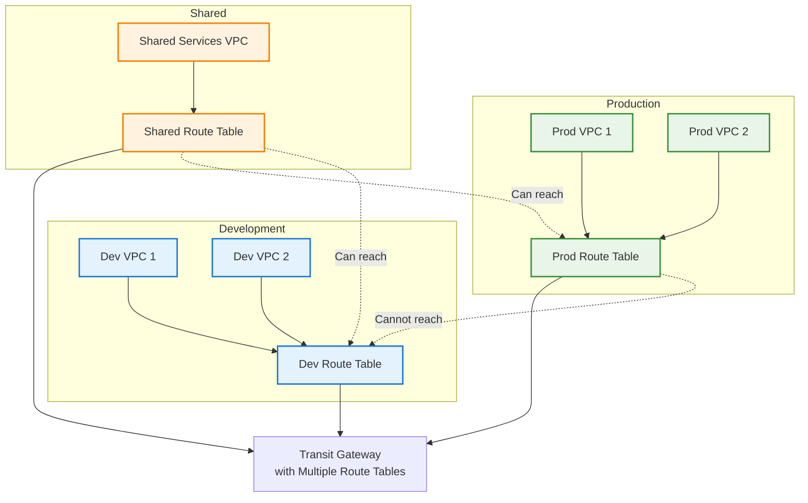

**Pattern 4: Multi-Region with Inter-Region Peering**

```text
Problem: Global application needs low-latency cross-region connectivity
Solution: Transit Gateway peering between regions

Architecture:
Region 1 TGW ↔ Inter-Region Peering ↔ Region 2 TGW

Setup:
1. Create TGW in each region
2. Create peering attachment between TGWs
3. Accept peering in remote region
4. Configure routes in both TGWs
5. Traffic flows privately over AWS backbone

Benefits:
├── Private connectivity (no internet)
├── Low latency (AWS backbone)
├── Encrypted by default
├── No bandwidth limits
└── Transitive routing within each region

Use cases:
├── Multi-region disaster recovery
├── Global applications (low latency)
├── Data replication between regions
└── Compliance (data residency)

Cost:
├── TGW peering attachment: $0.05/hour per side
├── Data transfer: $0.02/GB (inter-region)
└── Example: $72/month + $0.02/GB for 2 regions
```

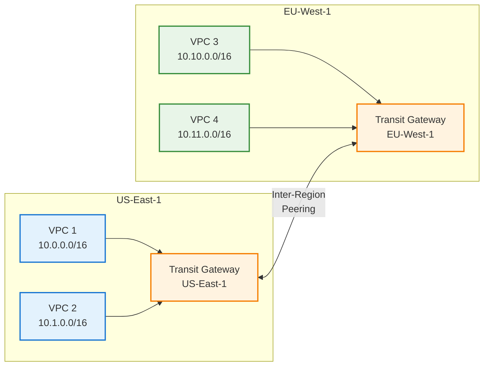

#### Transit Gateway Route Tables

```text
Route Table Types:

1. Association:
   ├── Each attachment associated with one route table
   ├── Determines which routes attachment can use
   └── Example: Prod VPC associated with Prod route table

2. Propagation:
   ├── Routes automatically added to route table
   ├── VPC CIDR blocks propagated from VPC attachments
   ├── BGP routes from VPN/Direct Connect
   └── Simplifies route management

Example Configuration:

Prod Route Table:
├── Associated: Prod VPC 1, Prod VPC 2
├── Propagated: Prod VPC 1 (10.0.0.0/16), Prod VPC 2 (10.1.0.0/16)
├── Static: Shared Services (10.255.0.0/16)
└── Result: Prod VPCs can reach each other and shared services

Dev Route Table:
├── Associated: Dev VPC 1, Dev VPC 2
├── Propagated: Dev VPC 1 (10.10.0.0/16), Dev VPC 2 (10.11.0.0/16)
├── Static: Shared Services (10.255.0.0/16)
└── Result: Dev VPCs can reach each other and shared services (not Prod)
```

#### Transit Gateway Best Practices

```text
Design:
├── Plan CIDR blocks carefully (avoid overlaps)
├── Use separate route tables for segmentation
├── Enable route propagation for automation
├── Document routing policies clearly
└── Use descriptive names for attachments and route tables

Security:
├── Implement network segmentation (prod/dev isolation)
├── Use inspection VPC for traffic filtering
├── Enable VPC Flow Logs on all VPCs
├── Monitor TGW metrics (bytes, packets, packet loss)
└── Use AWS Network Firewall or third-party firewalls

High Availability:
├── TGW is multi-AZ by default (no single point of failure)
├── Use multiple VPN connections for on-premises
├── Implement redundant Direct Connect connections
├── Test failover scenarios regularly
└── Monitor attachment health

Cost Optimization:
├── Consolidate NAT Gateways (centralized egress)
├── Use VPC endpoints for AWS services (avoid TGW data charges)
├── Monitor data transfer costs (largest component)
├── Right-size VPN connections (don't over-provision)
└── Consider TGW vs VPC Peering trade-offs

Monitoring:
├── CloudWatch metrics: BytesIn, BytesOut, PacketLoss
├── VPC Flow Logs: Track traffic patterns
├── AWS Network Manager: Visualize global network
├── Alerts: Packet loss >1%, attachment down
└── Cost monitoring: Track data transfer costs
```

#### Transit Gateway Limits

```text
Soft limits (can be increased):
├── Transit Gateways per region: 5
├── Transit Gateway attachments per TGW: 5,000
├── Routes per TGW route table: 10,000
├── Peering attachments per TGW: 50
└── Bandwidth per VPC attachment: 50 Gbps (burst to 100 Gbps)

Hard limits (cannot be increased):
├── Route tables per TGW: 20
├── Attachments per route table: 5,000
└── CIDR blocks per VPC: 5 (VPC limit, not TGW)

Planning:
├── Request limit increases proactively
├── Monitor attachment count as you scale
├── Plan for future growth (VPCs, regions)
└── Consider multiple TGWs for very large deployments
```

#### When to Use Transit Gateway

```text
Use Transit Gateway when:
├── >5 VPCs need to communicate
├── Need transitive routing (A↔B↔C means A↔C)
├── Hybrid cloud (VPN/Direct Connect to on-premises)
├── Centralized egress/inspection required
├── Multi-region connectivity needed
├── Network segmentation (prod/dev isolation)
└── Simplified management worth the cost

Avoid Transit Gateway when:
├── <5 VPCs (use VPC Peering instead)
├── Simple architecture (single VPC sufficient)
├── Cost-sensitive (TGW adds $36/month for 10 VPCs)
├── No transitive routing needed
└── VPC Peering meets requirements

Cost-benefit analysis:
├── TGW cost: $36/month (10 VPCs) + data transfer
├── VPC Peering cost: Free (45 connections) + data transfer
├── TGW benefit: Simplified management, transitive routing
├── VPC Peering benefit: Lower cost, no additional service
└── Decision: TGW for complexity, Peering for cost
```

---

## 🔒 VPC Security

### Security Groups vs NACLs

```text
┌──────────────────┬────────────────────┬────────────────────┐
│ Aspect           │ Security Groups    │ Network ACLs       │
├──────────────────┼────────────────────┼────────────────────┤
│ Level            │ Instance           │ Subnet             │
│ State            │ Stateful           │ Stateless          │
│ Rules            │ Allow only         │ Allow and Deny     │
│ Rule evaluation  │ All rules          │ Order (number)     │
│ Return traffic   │ Automatic          │ Must allow         │
│ Default          │ Deny all inbound   │ Allow all          │
└──────────────────┴────────────────────┴────────────────────┘
```

### Security Group Best Practices

```text
Principle of Least Privilege:
├── Only allow necessary ports
├── Restrict source IPs (avoid 0.0.0.0/0 for SSH/RDP)
├── Use security group references (not CIDR)
└── Example: DB SG allows only App SG, not 0.0.0.0/0

Layered Security:
├── Web tier: Allow 80/443 from internet
├── App tier: Allow app ports from Web SG only
├── DB tier: Allow DB port from App SG only
└── Management: SSH/RDP from bastion SG only

Security Group Chaining:
Web SG → App SG → DB SG
├── Web SG: Inbound 80/443 from 0.0.0.0/0
├── App SG: Inbound 8080 from Web SG
└── DB SG: Inbound 3306 from App SG

No hardcoded IPs needed!
```

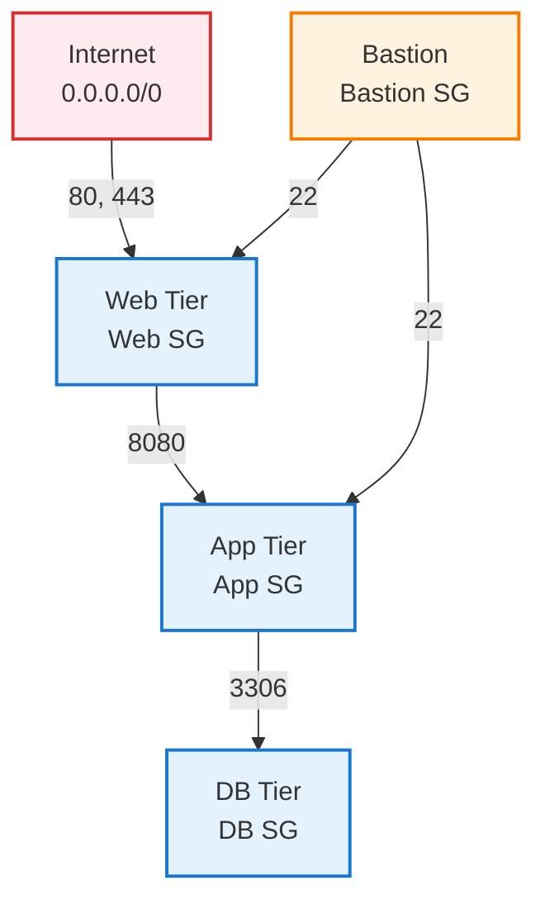

### Network ACL Use Cases

```text
When to use NACLs:
├── Explicit deny rules (block specific IPs)
├── Subnet-level protection (additional layer)
├── Compliance requirements (defense in depth)
└── Block known malicious IPs

Example: Block specific IP range
Inbound Rule 50: Deny all from 203.0.113.0/24
Inbound Rule 100: Allow HTTP from 0.0.0.0/0

Note: Security Groups cannot deny, only NACLs can
```

### VPC Flow Logs

```text
Definition: Capture IP traffic information

Levels:
├── VPC: All ENIs in VPC
├── Subnet: All ENIs in subnet
└── ENI: Specific network interface

Log format:
version account-id interface-id srcaddr dstaddr srcport dstport protocol packets bytes start end action log-status

Example log entry:
2 123456789012 eni-abc123 10.0.1.5 172.217.14.206 49152 443 6 10 5000 1620000000 1620000060 ACCEPT OK

Use cases:
├── Troubleshoot connectivity issues
├── Security analysis (detect anomalies)
├── Compliance auditing
└── Network monitoring

Destination:
├── CloudWatch Logs
├── S3 bucket
└── Kinesis Data Firehose
```

### Bastion Host Pattern

```text
Purpose: Secure access to private subnet resources

Architecture:
Internet → Bastion (Public Subnet) → Private Resources

Setup:
1. Deploy EC2 in public subnet
2. Assign Elastic IP
3. Security Group:
   ├── Inbound: SSH (22) from admin IPs only
   └── Outbound: SSH (22) to private subnet
4. Private resources: Allow SSH from Bastion SG only

Best practices:
├── Use small instance (t3.micro)
├── Harden OS (disable password auth, use key pairs)
├── Enable MFA
├── Audit access (CloudTrail, Session Manager)
└── Consider AWS Systems Manager Session Manager (no bastion needed)

Alternative: AWS Systems Manager Session Manager
├── No bastion host needed
├── No public IP needed
├── No SSH keys needed
├── Audit logs in CloudTrail
└── Preferred for modern architectures
```

---

## 🏗️ VPC in System Design

### Pattern 1: Three-Tier Web Application

```text
Architecture:
Internet → ALB (Public) → App Servers (Private) → RDS (Private)

VPC Design:
├── VPC: 10.0.0.0/16
├── Public Subnets (2 AZs):
│   ├── 10.0.1.0/24 (AZ-A): ALB, NAT Gateway
│   └── 10.0.2.0/24 (AZ-B): ALB, NAT Gateway
├── Private Subnets (2 AZs):
│   ├── 10.0.10.0/24 (AZ-A): App servers
│   └── 10.0.11.0/24 (AZ-B): App servers
└── Database Subnets (2 AZs):
    ├── 10.0.20.0/24 (AZ-A): RDS primary
    └── 10.0.21.0/24 (AZ-B): RDS standby

Security Groups:
├── ALB SG: Allow 80/443 from 0.0.0.0/0
├── App SG: Allow 8080 from ALB SG
└── DB SG: Allow 3306 from App SG

High Availability:
├── Multi-AZ deployment
├── ALB distributes across AZs
├── RDS Multi-AZ for failover
└── NAT Gateway in each AZ
```

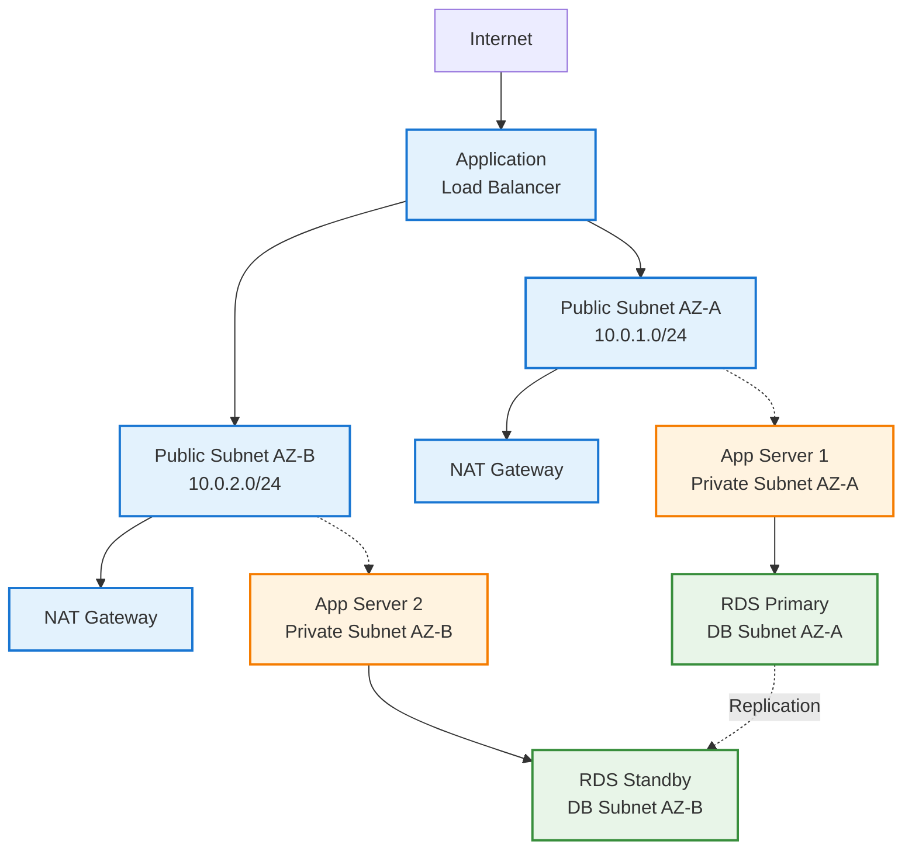

### Pattern 2: Microservices with Service Mesh

```text
Architecture:
API Gateway → Service Mesh (Private) → Microservices (Private)

VPC Design:
├── VPC: 10.0.0.0/16
├── Public Subnets: API Gateway, NAT
├── Private Subnets (large for containers):
│   ├── 10.0.0.0/20 (AZ-A): 4,096 IPs for ECS/EKS
│   └── 10.0.16.0/20 (AZ-B): 4,096 IPs for ECS/EKS
└── Database Subnets: RDS, ElastiCache

Service Discovery:
├── AWS Cloud Map or ECS Service Discovery
├── Internal DNS for service-to-service communication
└── No hardcoded IPs

Security:
├── Each microservice has own security group
├── Service mesh handles mTLS
└── Network policies for pod-to-pod communication
```

### Pattern 3: Hybrid Cloud with VPN/Direct Connect

```text
Architecture:
On-Premises ↔ VPN/Direct Connect ↔ VPC

VPC Design:
├── VPC: 10.0.0.0/16 (no overlap with on-prem)
├── On-Premises: 192.168.0.0/16
├── Virtual Private Gateway attached to VPC
└── Customer Gateway at on-premises

Routing:
├── VPC route table: 192.168.0.0/16 → vgw-xxx
├── On-prem route table: 10.0.0.0/16 → VPN tunnel
└── BGP for dynamic routing (Direct Connect)

Use cases:
├── Gradual cloud migration
├── Burst to cloud for peak capacity
├── Disaster recovery
└── Hybrid applications (cloud + on-prem)

VPN vs Direct Connect:
├── VPN: Encrypted over internet, up to 1.25 Gbps, $0.05/hour
└── Direct Connect: Dedicated connection, up to 100 Gbps, $0.30/hour + port fees
```

### Pattern 4: Multi-Account with Transit Gateway

```text
Architecture:
[Prod VPC, Dev VPC, Shared Services VPC] ↔ Transit Gateway

Use case: Large organization with multiple AWS accounts

Setup:
├── Transit Gateway in central account
├── Share TGW with other accounts (AWS RAM)
├── Each account attaches VPCs to TGW
└── Centralized routing and security

Benefits:
├── Transitive routing between all VPCs
├── Centralized network management
├── Simplified security (firewall in shared VPC)
└── Scales to thousands of VPCs

Example:
├── Prod Account: VPC 10.0.0.0/16
├── Dev Account: VPC 10.1.0.0/16
├── Shared Services: VPC 10.2.0.0/16 (Active Directory, DNS)
└── All communicate via Transit Gateway
```

---

## 🏢 Multi-VPC Architectures

### When to Use Multiple VPCs

```text
Reasons for multiple VPCs:
├── Environment isolation (prod, staging, dev)
├── Organizational boundaries (different teams/business units)
├── Compliance requirements (PCI, HIPAA)
├── Regional deployment (VPC per region)
└── Blast radius limitation (contain security incidents)

Single VPC when:
├── Small organization
├── Simple architecture
├── No strict isolation requirements
└── Cost-sensitive (avoid VPC peering/TGW costs)
```

### VPC Peering vs Transit Gateway

```text
VPC Peering:
├── Use for: 2-5 VPCs
├── Pros: Simple, no additional cost (just data transfer)
├── Cons: Non-transitive, mesh complexity (N*(N-1)/2 connections)
└── Example: 5 VPCs = 10 peering connections

Transit Gateway:
├── Use for: >5 VPCs or need transitive routing
├── Pros: Transitive, centralized, scales to thousands
├── Cons: Cost ($0.05/hour per attachment + $0.02/GB)
└── Example: 10 VPCs = $36/month + data transfer

Cost comparison (10 VPCs):
├── Peering: 45 connections, complex management, free (just data)
└── TGW: 10 attachments, simple, $36/month + data
```

### Hub-and-Spoke with Shared Services

```text
Architecture:
Spoke VPCs → Hub VPC (Shared Services) → On-Premises

Hub VPC contains:
├── Active Directory
├── DNS resolvers
├── Centralized logging
├── Security tools (IDS/IPS)
└── Shared databases

Spoke VPCs:
├── Application workloads
├── Connect to hub via TGW or peering
└── Access shared services via hub

Benefits:
├── Centralized management
├── Reduced duplication
├── Consistent security policies
└── Cost optimization (shared resources)
```

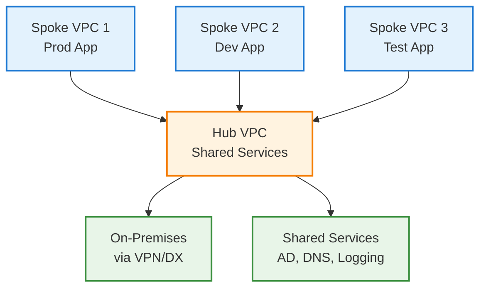

---

## 💰 Cost, Limits, and Trade-offs

### VPC Costs

```text
Free components:
├── VPC itself (no charge)
├── Subnets
├── Route tables
├── Internet Gateway
├── Security Groups
├── NACLs
└── VPC Flow Logs to S3 (only S3 storage cost)

Paid components:
├── NAT Gateway: $0.045/hour + $0.045/GB
├── VPC Endpoints (Interface): $0.01/hour + $0.01/GB
├── VPN Connection: $0.05/hour
├── Transit Gateway: $0.05/hour per attachment + $0.02/GB
├── Direct Connect: Port fees + $0.02-0.30/GB
└── Elastic IPs (if not attached): $0.005/hour

Example monthly costs:
├── 2 NAT Gateways (HA): $65 + data transfer
├── 10 VPC Endpoints: $72 + data transfer
├── Transit Gateway (10 VPCs): $36 + data transfer
└── Total: ~$173/month + data transfer
```

### VPC Limits (AWS)

```text
Soft limits (can be increased):
├── VPCs per region: 5 (default)
├── Subnets per VPC: 200
├── Elastic IPs per region: 5
├── Internet Gateways per region: 5
├── NAT Gateways per AZ: 5
├── Security Groups per VPC: 2,500
├── Rules per Security Group: 60 (inbound + outbound)
├── Security Groups per ENI: 5
└── VPC Peering connections per VPC: 125

Hard limits (cannot be increased):
├── CIDR blocks per VPC: 5
├── Route entries per route table: 50 (non-propagated)
└── Network ACL rules per NACL: 20 (inbound + outbound)

Planning considerations:
├── Plan CIDR blocks carefully (cannot change later)
├── Use /16 VPCs for growth (65,536 IPs)
├── Request limit increases proactively
└── Monitor usage against limits
```

### Trade-offs

```text
Public vs Private Subnets:
├── Public: Direct internet access, simpler, but exposed
├── Private: More secure, but requires NAT (cost, complexity)
└── Recommendation: Private for app/data, public for LB/NAT

NAT Gateway vs NAT Instance:
├── NAT Gateway: Managed, HA, expensive ($65/month for HA)
├── NAT Instance: Self-managed, cheaper, single point of failure
└── Recommendation: NAT Gateway for prod, instance for dev/test

VPC Endpoints vs NAT Gateway:
├── Endpoints: Secure, no NAT cost, but per-service setup
├── NAT: Simple, all internet traffic, but costly
└── Recommendation: Endpoints for S3/DynamoDB, NAT for other

Single VPC vs Multi-VPC:
├── Single: Simple, cheaper, but less isolation
├── Multi: Better isolation, but complex networking
└── Recommendation: Multi-VPC for large orgs, single for small

VPC Peering vs Transit Gateway:
├── Peering: Free (just data), but mesh complexity
├── TGW: Centralized, but $36/month + data for 10 VPCs
└── Recommendation: Peering for <5 VPCs, TGW for >5
```

---

## ❓ Common Interview Questions

### Q1. Explain the difference between Security Groups and NACLs

**Answer:**

```text
Security Groups (Instance-level, Stateful):
├── Applied at instance/ENI level
├── Stateful: return traffic automatically allowed
├── Allow rules only (no deny)
├── Evaluate all rules before deciding
├── Default: deny all inbound, allow all outbound
└── Use for: Instance-level protection

Network ACLs (Subnet-level, Stateless):
├── Applied at subnet level
├── Stateless: must explicitly allow return traffic
├── Allow and deny rules
├── Rules evaluated in order (lowest number first)
├── Default: allow all inbound and outbound
└── Use for: Subnet-level protection, explicit denies

Example: Block specific IP
├── Security Group: Cannot do (no deny rules)
└── NACL: Add deny rule for that IP

Best practice: Use both (defense in depth)
├── NACL: Subnet-level protection, block known bad IPs
└── Security Group: Instance-level, allow only necessary traffic
```

### Q2. Design a VPC for a three-tier web application

**Answer:**

```text
Requirements:
├── High availability (multi-AZ)
├── Secure (private app and DB tiers)
├── Scalable (auto-scaling)
└── Cost-effective

VPC Design:
├── VPC CIDR: 10.0.0.0/16 (65,536 IPs)
├── 2 Availability Zones for HA
└── 6 subnets total (3 tiers × 2 AZs)

Subnets:
Public (Web Tier):
├── 10.0.1.0/24 (AZ-A): Load balancer, NAT Gateway
└── 10.0.2.0/24 (AZ-B): Load balancer, NAT Gateway

Private (App Tier):
├── 10.0.10.0/24 (AZ-A): App servers
└── 10.0.11.0/24 (AZ-B): App servers

Private (DB Tier):
├── 10.0.20.0/24 (AZ-A): RDS primary
└── 10.0.21.0/24 (AZ-B): RDS standby

Components:
├── Internet Gateway for public subnets
├── NAT Gateway in each AZ (HA)
├── Application Load Balancer in public subnets
├── Auto Scaling Group in private app subnets
└── RDS Multi-AZ in DB subnets

Security Groups:
├── ALB SG: Allow 80/443 from 0.0.0.0/0
├── App SG: Allow 8080 from ALB SG
├── DB SG: Allow 3306 from App SG
└── Bastion SG: Allow 22 from admin IPs

Route Tables:
├── Public: 0.0.0.0/0 → IGW
├── Private AZ-A: 0.0.0.0/0 → NAT-A
└── Private AZ-B: 0.0.0.0/0 → NAT-B

Cost: ~$130/month (2 NAT Gateways + data transfer)
```

### Q3. How does a NAT Gateway work? Why is it needed?

**Answer:**

```text
Purpose: Allow private subnet resources to access internet (outbound only)

How it works:
1. Private instance initiates outbound connection
2. Packet routed to NAT Gateway (via route table)
3. NAT Gateway translates private IP to its public IP
4. Packet sent to internet via Internet Gateway
5. Response comes back to NAT Gateway
6. NAT Gateway translates back to private IP
7. Response delivered to private instance

Why needed:
├── Private subnets have no route to Internet Gateway
├── Private instances have no public IPs
├── Still need internet for updates, API calls, etc.
└── NAT provides outbound-only access (security)

Key points:
├── Deployed in public subnet (needs IGW route)
├── Requires Elastic IP
├── Managed by AWS (HA, scaling)
├── Outbound only (inbound from internet not possible)
└── Cost: $0.045/hour + $0.045/GB

High Availability:
├── Deploy NAT Gateway in each AZ
├── Each private subnet routes to NAT in same AZ
└── If AZ fails, only that AZ's private subnets affected

Alternative: VPC Endpoints
├── For AWS services (S3, DynamoDB), use VPC endpoints
├── Avoids NAT Gateway costs
└── More secure (traffic stays in AWS network)
```

### Q4. Explain VPC Peering vs Transit Gateway

**Answer:**

```text
VPC Peering:
├── Point-to-point connection between two VPCs
├── Non-transitive: A↔B and B↔C doesn't mean A↔C
├── Mesh topology for multiple VPCs (N*(N-1)/2 connections)
├── No additional cost (just data transfer)
├── Supports cross-account and cross-region
└── Use for: 2-5 VPCs

Transit Gateway:
├── Hub-and-spoke: central hub connects all VPCs
├── Transitive: A↔Hub↔B means A↔B
├── Star topology (N connections for N VPCs)
├── Cost: $0.05/hour per attachment + $0.02/GB
├── Scales to thousands of VPCs
└── Use for: >5 VPCs or need transitive routing

Example: Connect 10 VPCs
├── Peering: 45 connections (10*9/2), complex, free
└── TGW: 10 connections, simple, $36/month + data

When to use each:
├── Peering: Small number of VPCs, cost-sensitive
├── TGW: Many VPCs, need transitive routing, centralized management
└── TGW: Hybrid cloud (VPN/Direct Connect integration)

Best practice:
├── Start with peering for simple cases
├── Migrate to TGW as you grow
└── Use TGW for hybrid cloud from the start
```

### Q5. How do you secure a VPC?

**Answer:**

```text
Network Isolation:
├── Use private subnets for app and data tiers
├── Only load balancers in public subnets
├── No public IPs on app/DB instances
└── Use NAT Gateway for outbound internet

Security Groups (Instance-level):
├── Principle of least privilege
├── Allow only necessary ports
├── Use SG references instead of CIDR blocks
├── Example: DB SG allows only App SG, not 0.0.0.0/0
└── Layer security: Web SG → App SG → DB SG

Network ACLs (Subnet-level):
├── Additional layer of defense
├── Block known malicious IPs
├── Explicit deny rules
└── Stateless (must allow return traffic)

Access Control:
├── No direct SSH/RDP from internet
├── Use bastion host or AWS Systems Manager Session Manager
├── Bastion in public subnet, allow only from admin IPs
└── Private resources allow SSH only from bastion SG

Monitoring and Logging:
├── Enable VPC Flow Logs (CloudWatch or S3)
├── Monitor for anomalies (unusual traffic patterns)
├── AWS GuardDuty for threat detection
└── CloudTrail for API audit logs

VPC Endpoints:
├── Private connection to AWS services
├── Avoid internet for S3, DynamoDB access
├── More secure (traffic stays in AWS network)
└── Cost savings (avoid NAT Gateway)

Encryption:
├── TLS for data in transit
├── Encryption at rest (EBS, RDS, S3)
└── AWS Certificate Manager for SSL/TLS certs

Compliance:
├── Use AWS Config for compliance checks
├── AWS Security Hub for security posture
└── Regular security audits and penetration testing
```

### Q6. What are VPC Endpoints and when should you use them?

**Answer:**

```text
Definition: Private connection to AWS services without internet

Types:

1. Gateway Endpoints (Free):
   ├── S3 and DynamoDB only
   ├── Route table entry (no ENI)
   ├── No hourly or data transfer charges
   └── Preferred for S3/DynamoDB access

2. Interface Endpoints (PrivateLink):
   ├── Most AWS services (EC2, SNS, SQS, etc.)
   ├── Elastic Network Interface (ENI) in subnet
   ├── Cost: $0.01/hour + $0.01/GB
   └── Uses private IP from VPC

Benefits:
├── Security: Traffic stays in AWS network (no internet)
├── Performance: Lower latency than internet
├── Cost: Avoid NAT Gateway charges
└── Compliance: Data doesn't leave AWS network

When to use:
├── Private subnet needs to access S3/DynamoDB (use Gateway)
├── Private subnet needs other AWS services (use Interface)
├── High data transfer to S3 (save NAT Gateway costs)
└── Compliance requires no internet egress

Example cost savings:
├── Without endpoint: 1 TB to S3 via NAT = $45
├── With Gateway endpoint: 1 TB to S3 = $0
└── Savings: $45/month per TB

Setup:
1. Create VPC endpoint for service
2. Select VPC and subnets
3. Update route table (Gateway) or use DNS (Interface)
4. Update security groups to allow endpoint
```

### Q7. How do you design a multi-region VPC architecture?

**Answer:**

```text
Requirements:
├── High availability across regions
├── Low latency for global users
├── Disaster recovery
└── Data residency compliance

Architecture:

Primary Region (us-east-1):
├── VPC: 10.0.0.0/16
├── Full application stack
└── Primary database

Secondary Region (eu-west-1):
├── VPC: 10.1.0.0/16
├── Full application stack
└── Read replica or standby database

Connectivity:
├── VPC Peering (cross-region)
├── Or Transit Gateway (inter-region peering)
└── Private connectivity between regions

Traffic Routing:
├── Route 53 with geolocation routing
├── Or latency-based routing
├── Health checks for automatic failover
└── CloudFront for static content (global CDN)

Data Replication:
├── RDS cross-region read replicas
├── S3 cross-region replication
├── DynamoDB global tables
└── Application-level replication if needed

Disaster Recovery:
├── Active-Active: Both regions serve traffic
├── Active-Passive: Secondary on standby
├── Pilot Light: Minimal resources, scale up on failover
└── Backup & Restore: Cheapest, slowest recovery

Cost considerations:
├── Cross-region data transfer: $0.02/GB
├── Duplicate infrastructure in both regions
├── RDS cross-region replication costs
└── Trade-off: Cost vs availability/performance

Best practices:
├── Use same VPC CIDR scheme in all regions
├── Automate failover with Route 53 health checks
├── Test failover regularly
└── Consider data residency regulations (GDPR, etc.)
```

### Q8. What's the difference between public and private subnets?

**Answer:**

```text
Key difference: Route table configuration

Public Subnet:
├── Has route to Internet Gateway (0.0.0.0/0 → IGW)
├── Resources can have public IPs
├── Directly accessible from internet (if security allows)
├── Use for: Load balancers, NAT gateways, bastion hosts
└── Example route table:
    ├── 10.0.0.0/16 → local
    └── 0.0.0.0/0 → igw-xxx

Private Subnet:
├── No route to Internet Gateway
├── Route to NAT Gateway for outbound (0.0.0.0/0 → NAT)
├── Not directly accessible from internet
├── Use for: Application servers, databases, internal services
└── Example route table:
    ├── 10.0.0.0/16 → local
    └── 0.0.0.0/0 → nat-xxx

Important notes:
├── Public/private is determined by route table, not subnet property
├── Same subnet can become public by adding IGW route
├── Resources in public subnet still need public IP to be accessible
├── Security groups still control access (subnet type ≠ security)
└── Best practice: Private by default, public only when necessary

Internet access:
├── Public subnet: Direct via Internet Gateway
├── Private subnet: Outbound only via NAT Gateway
└── Private subnet: No inbound from internet (secure)

Cost:
├── Public subnet: Free (IGW has no charge)
├── Private subnet: NAT Gateway cost ($0.045/hour + $0.045/GB)
└── Optimization: Use VPC endpoints for AWS services
```

---