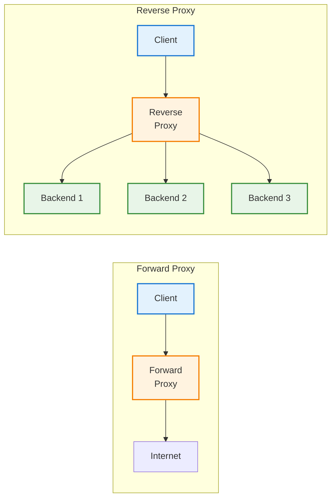
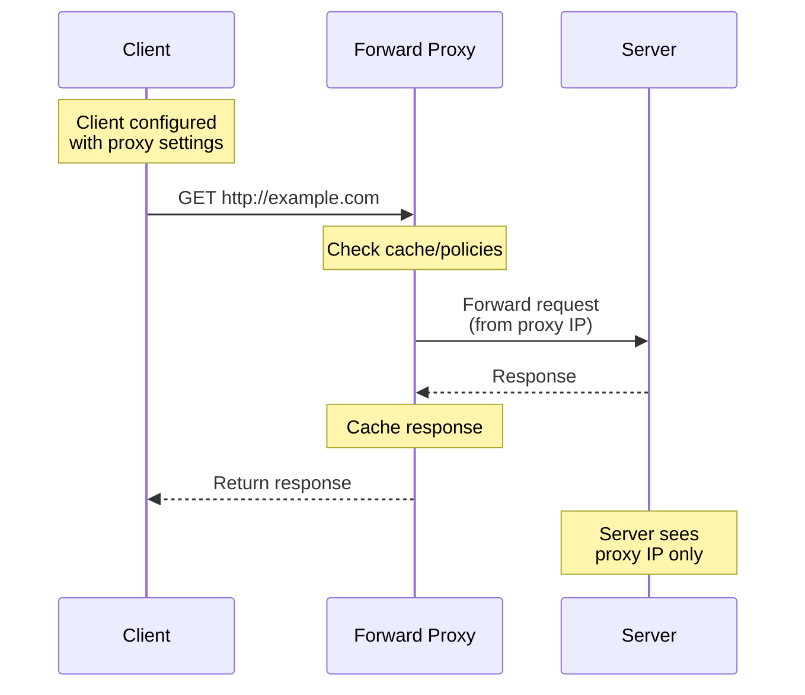
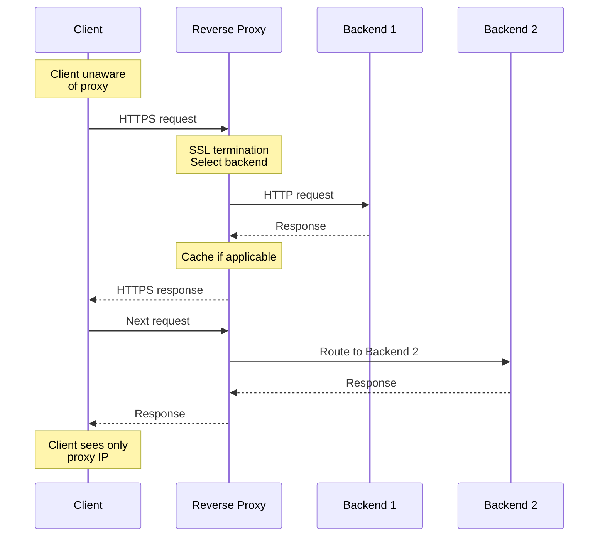
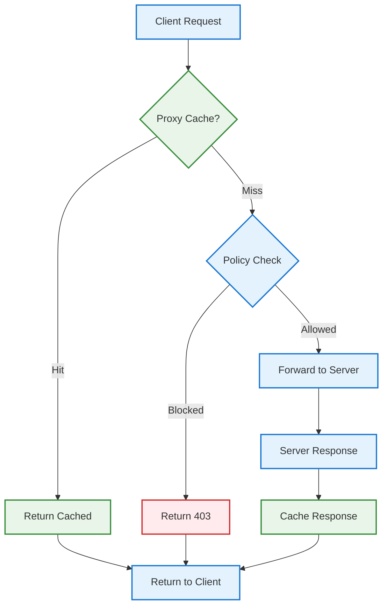
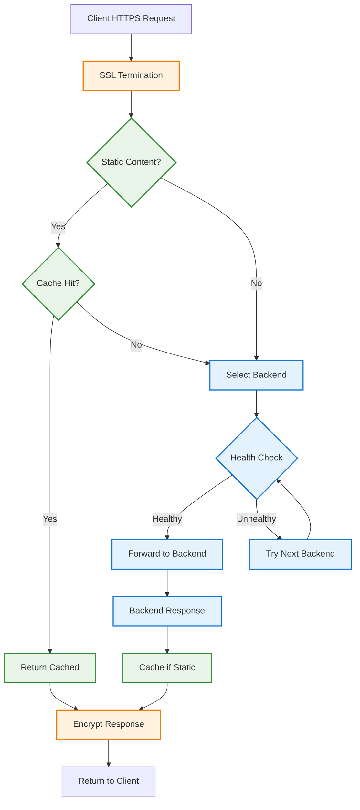
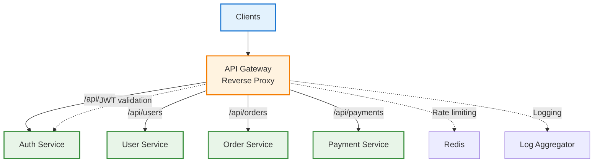
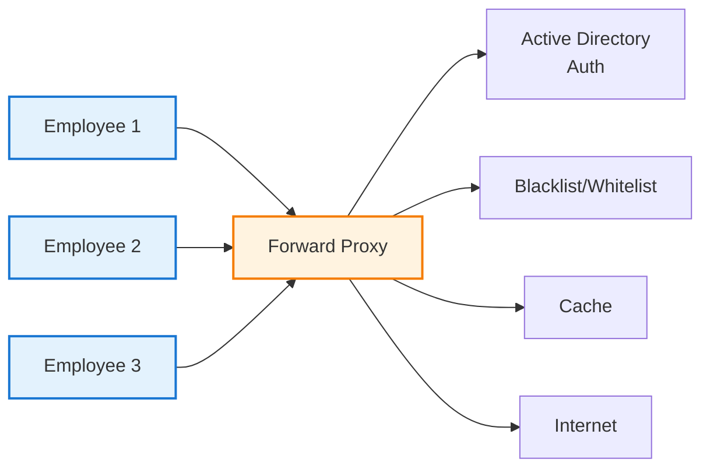
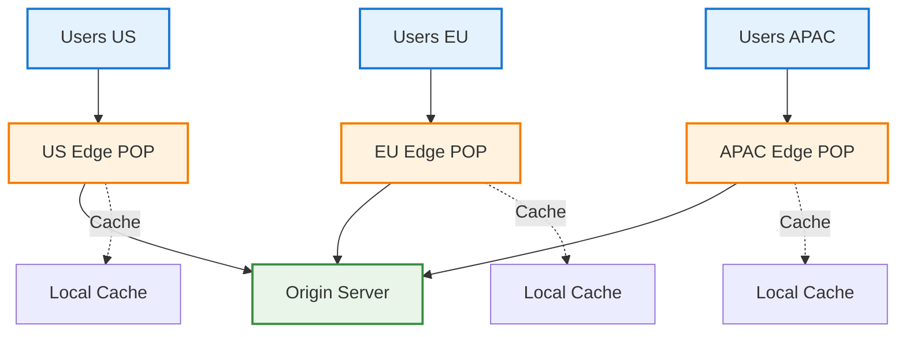
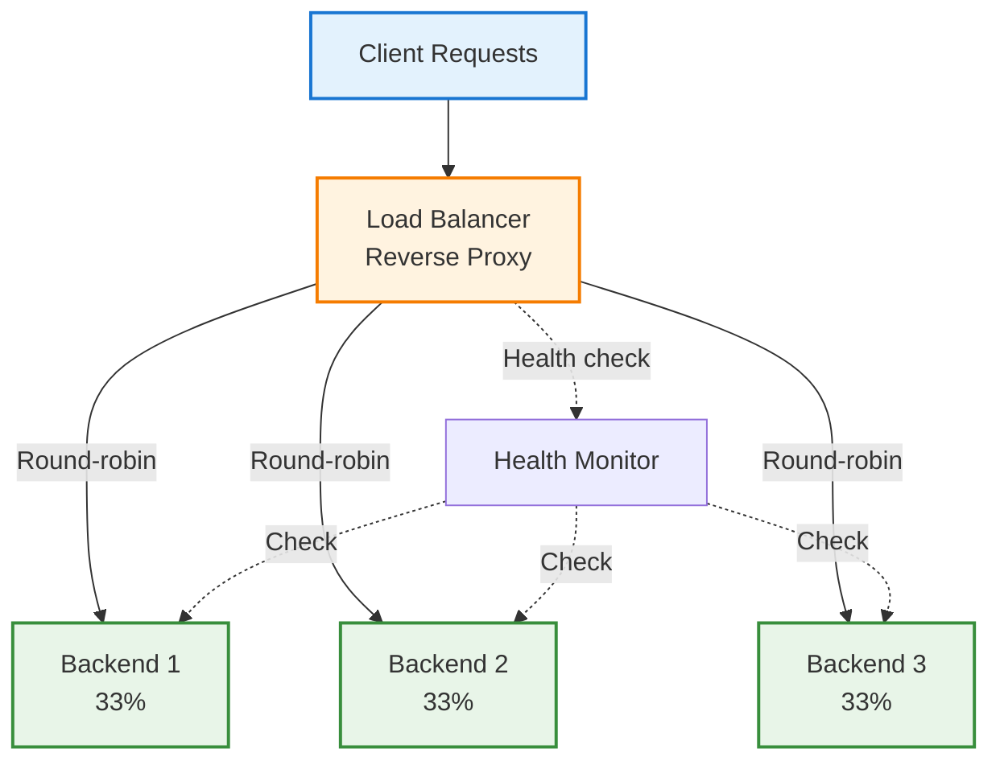
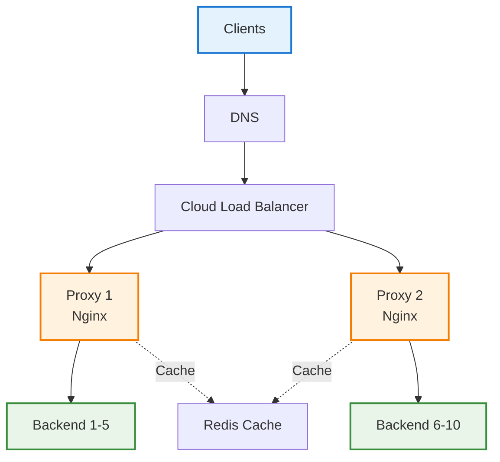

# Proxy Servers for System Design Interviews

## 📋 Table of Contents

1. [Proxy Fundamentals](#proxy-fundamentals)
2. [Forward Proxy vs Reverse Proxy](#forward-proxy-vs-reverse-proxy)
3. [How Proxies Work (Step-by-Step)](#how-proxies-work-step-by-step)
4. [Types of Proxies](#types-of-proxies)
5. [Proxy in System Design](#proxy-in-system-design)
6. [Load Balancing with Proxies](#load-balancing-with-proxies)
7. [Caching and Performance](#caching-and-performance)
8. [Security Considerations](#security-considerations)
9. [Cost, Limits, and Trade-offs](#cost-limits-and-trade-offs)
10. [Common Interview Questions](#common-interview-questions)

---

## 🔧 Proxy Fundamentals

### What is a Proxy?

- **Proxy Server**: An intermediary server that sits between clients and servers, forwarding requests and responses
- **Purpose**: Security, privacy, caching, load balancing, content filtering, access control
- **Analogy**: A receptionist who receives your request and forwards it to the appropriate person

### Why Proxies Exist

```text
Problem: Direct client-server communication has limitations
├── No caching: repeated requests hit origin every time
├── No load distribution: single server overwhelmed
├── Security exposure: backend servers directly accessible
├── No access control: cannot filter or monitor traffic
└── Privacy concerns: client IP exposed to all servers

Solution: Proxy as intermediary
├── Cache responses to reduce backend load
├── Distribute traffic across multiple servers
├── Hide backend infrastructure
├── Filter, monitor, and control traffic
└── Provide anonymity for clients or servers
```

### Proxy Architecture Overview



> Proxies act as intermediaries: forward proxies serve clients, reverse proxies serve servers

---

## 🔀 Forward Proxy vs Reverse Proxy

### Comparison Table

```text
┌─────────────────┬──────────────────────┬──────────────────────┐
│ Aspect          │ Forward Proxy        │ Reverse Proxy        │
├─────────────────┼──────────────────────┼──────────────────────┤
│ Position        │ Client-side          │ Server-side          │
│ Serves          │ Clients              │ Servers              │
│ Client aware?   │ Yes (configured)     │ No (transparent)     │
│ Primary use     │ Privacy, filtering   │ Load balancing, CDN  │
│ Hides           │ Client identity      │ Backend servers      │
│ Examples        │ Squid, VPN           │ Nginx, HAProxy       │
└─────────────────┴──────────────────────┴──────────────────────┘
```

### Forward Proxy (Client-Side)

```text
Definition: Proxy that forwards client requests to the internet

Flow:
Client → Forward Proxy → Internet → Server
       ← Forward Proxy ← Internet ←

Characteristics:
├── Client explicitly configures proxy settings
├── Proxy acts on behalf of clients
├── Server sees proxy IP, not client IP
└── Common in corporate/school networks

Use cases:
├── Privacy: Hide client IP from websites
├── Content filtering: Block malicious/inappropriate sites
├── Bypass restrictions: Access geo-blocked content
├── Caching: Reduce bandwidth usage
└── Monitoring: Track employee internet usage
```



### Reverse Proxy (Server-Side)

```text
Definition: Proxy that forwards requests to backend servers

Flow:
Client → Internet → Reverse Proxy → Backend Servers
       ← Internet ← Reverse Proxy ←

Characteristics:
├── Client unaware of proxy (thinks it's the server)
├── Proxy acts on behalf of servers
├── Client sees proxy IP, not backend IPs
└── Common in web architectures

Use cases:
├── Load balancing: Distribute traffic across backends
├── SSL termination: Offload encryption from backends
├── Caching: Serve static content from proxy
├── Security: Hide backend topology, WAF
└── Compression: Optimize bandwidth
```



---

## 🔍 How Proxies Work (Step-by-Step)

### Forward Proxy Request Flow

```text
Step 1: Client Configuration
├── Client configured with proxy address (e.g., proxy.corp.com:3128)
├── Browser/OS sends all requests to proxy first
└── Client aware of proxy existence

Step 2: Request to Proxy
├── Client: GET http://example.com/page
├── Sent to proxy, not directly to example.com
└── Request includes full URL (not just path)

Step 3: Proxy Processing
├── Check cache: Is response already cached?
├── Check policies: Is this URL allowed?
├── Check authentication: Is user authorized?
└── If all pass, forward to destination

Step 4: Forward to Server
├── Proxy makes request to example.com
├── Server sees proxy IP (e.g., 203.0.113.50)
├── Server unaware of original client
└── Proxy may add X-Forwarded-For header

Step 5: Response Handling
├── Server responds to proxy
├── Proxy caches response (if cacheable)
├── Proxy returns response to client
└── Client receives response
```



### Reverse Proxy Request Flow

```text
Step 1: Client Request
├── Client sends request to public IP (reverse proxy)
├── Client thinks proxy IS the server
├── Example: HTTPS request to example.com (resolves to proxy IP)
└── Client unaware of backend servers

Step 2: SSL Termination
├── Proxy terminates HTTPS connection
├── Decrypts request
├── Offloads SSL processing from backends
└── Can inspect/modify request

Step 3: Load Balancing
├── Proxy selects backend server
├── Algorithms: round-robin, least connections, IP hash
├── Health checks: skip unhealthy backends
└── Session persistence: sticky sessions if needed

Step 4: Forward to Backend
├── Proxy forwards request to selected backend
├── Often HTTP (not HTTPS) to backend
├── Adds headers: X-Forwarded-For, X-Real-IP, X-Forwarded-Proto
└── Backend processes request

Step 5: Response Handling
├── Backend responds to proxy
├── Proxy caches response (if static content)
├── Proxy re-encrypts (HTTPS to client)
└── Client receives response
```



### Headers Added by Proxies

```text
X-Forwarded-For (XFF):
├── Original client IP address
├── Example: X-Forwarded-For: 192.168.1.100
├── Can be chained: X-Forwarded-For: 192.168.1.100, 10.0.0.5
└── Used by backend to identify real client

X-Real-IP:
├── Alternative to X-Forwarded-For (Nginx)
├── Example: X-Real-IP: 192.168.1.100
├── Contains only the original client IP
└── Simpler than XFF (no chain)

X-Forwarded-Proto:
├── Original protocol (http or https)
├── Example: X-Forwarded-Proto: https
├── Backend knows if client used HTTPS
└── Important for redirect logic

X-Forwarded-Host:
├── Original Host header
├── Example: X-Forwarded-Host: example.com
├── Useful when proxy changes Host header
└── Backend can generate correct URLs

Via:
├── Proxy identifier
├── Example: Via: 1.1 proxy.example.com
├── Shows request passed through proxy
└── Can be chained for multiple proxies
```

---

## 🔧 Types of Proxies

### By Protocol

```text
HTTP Proxy:
├── Handles HTTP/HTTPS traffic
├── Layer 7 (application layer)
├── Can inspect and modify requests/responses
├── Can cache content
└── Examples: Squid, Nginx, Apache

SOCKS Proxy:
├── Lower-level (session layer)
├── Protocol-agnostic (HTTP, FTP, SMTP, etc.)
├── Cannot cache or filter content
├── More flexible but less feature-rich
├── SOCKS5 supports authentication and UDP
└── Examples: Dante, SSH tunnel

Transparent Proxy:
├── Intercepts traffic without client configuration
├── Client unaware of proxy existence
├── Often used with firewall/router
├── Can break HTTPS without proper setup
└── Use case: ISP caching, corporate monitoring

SSL/TLS Proxy:
├── Terminates SSL connections
├── Can inspect encrypted traffic (MITM)
├── Re-encrypts to backend
├── Requires trusted certificate
└── Use case: DLP, malware scanning
```

### By Anonymity Level

```text
Transparent Proxy:
├── Reveals client IP to server
├── Headers: X-Forwarded-For with real IP
├── Server knows request came through proxy
└── No anonymity

Anonymous Proxy:
├── Hides client IP from server
├── Identifies itself as proxy (Via header)
├── Server knows it's a proxy but not client IP
└── Partial anonymity

Elite/High Anonymity Proxy:
├── Hides client IP completely
├── Does not identify as proxy
├── No proxy-related headers
├── Appears as regular client to server
└── Full anonymity
```

### By Deployment

```text
Datacenter Proxy:
├── Hosted in data centers
├── Fast and cheap
├── Easily detected and blocked
└── Use case: web scraping (low-risk)

Residential Proxy:
├── Real residential IP addresses
├── Harder to detect and block
├── More expensive
└── Use case: ad verification, sneaker bots

Mobile Proxy:
├── Mobile carrier IP addresses
├── Very hard to block
├── Most expensive
└── Use case: social media automation

Rotating Proxy:
├── Changes IP for each request or time interval
├── Avoids rate limiting and bans
├── Pool of IPs
└── Use case: large-scale web scraping
```

---

## 🏗️ Proxy in System Design

### Common Architecture Patterns

#### Pattern 1: API Gateway (Reverse Proxy)

```text
Use case: Microservices architecture with unified entry point

Architecture:
Internet → API Gateway → [Auth, Users, Orders, Payments]

Responsibilities:
├── Authentication/Authorization (JWT validation)
├── Rate limiting per client/API key
├── Request routing to appropriate service
├── Request/response transformation
├── API versioning (/v1/, /v2/)
├── Circuit breaking and retries
└── Logging and monitoring

Example: Kong, AWS API Gateway, Apigee
```



#### Pattern 2: Corporate Forward Proxy

```text
Use case: Control and monitor employee internet access

Architecture:
Employees → Forward Proxy → Internet

Features:
├── Content filtering (block malicious/inappropriate sites)
├── User authentication (LDAP/AD integration)
├── Bandwidth optimization (cache updates, videos)
├── Malware scanning (inspect downloads)
├── Logging and reporting (compliance)
└── DLP (prevent data exfiltration)

Example: Squid, Zscaler, Cisco WSA
```



#### Pattern 3: CDN as Reverse Proxy

```text
Use case: Global content delivery with low latency

Architecture:
Users → CDN Edge (Reverse Proxy) → Origin Server

Features:
├── Geographic distribution (300+ POPs)
├── Caching static assets (images, CSS, JS, videos)
├── SSL termination at edge
├── DDoS protection
├── Edge compute (serverless functions)
└── Automatic failover

Example: Cloudflare, Fastly, Akamai
```



#### Pattern 4: SSL Termination Proxy

```text
Use case: Offload SSL/TLS processing from application servers

Architecture:
Client (HTTPS) → Proxy (SSL termination) → Backend (HTTP)

Benefits:
├── Reduce CPU load on backends (no encryption overhead)
├── Centralized certificate management
├── Hardware acceleration for SSL (if available)
├── Simplified backend configuration
└── Inspect encrypted traffic (security scanning)

Trade-off: Backend traffic unencrypted (mitigate with VPC)
```

```nginx
# Nginx SSL termination example
server {
    listen 443 ssl http2;
    server_name example.com;

    ssl_certificate /etc/ssl/cert.pem;
    ssl_certificate_key /etc/ssl/key.pem;
    ssl_protocols TLSv1.2 TLSv1.3;
    ssl_ciphers HIGH:!aNULL:!MD5;

    location / {
        proxy_pass http://backend:8080;  # HTTP to backend
        proxy_set_header Host $host;
        proxy_set_header X-Real-IP $remote_addr;
        proxy_set_header X-Forwarded-For $proxy_add_x_forwarded_for;
        proxy_set_header X-Forwarded-Proto $scheme;
    }
}
```

### When to Use Proxies in System Design

```text
Use reverse proxy when:
├── Need load balancing across multiple backends
├── Want to hide backend infrastructure
├── Need SSL termination to offload encryption
├── Want to cache static content
├── Need API gateway for microservices
├── Require WAF or DDoS protection
└── Want zero-downtime deployments

Use forward proxy when:
├── Need to control outbound internet access
├── Want to monitor/log employee browsing
├── Need to cache frequently accessed content
├── Want to filter malicious/inappropriate sites
├── Require user authentication for internet access
└── Need to bypass geo-restrictions (VPN)

Avoid proxies when:
├── Ultra-low latency required (proxy adds hop)
├── End-to-end encryption mandatory (no inspection)
├── Simple architecture with single backend
└── Cost of proxy infrastructure not justified
```

---

## ⚖️ Load Balancing with Proxies

### Load Balancing Algorithms

```text
Round-Robin:
├── Distribute requests evenly in sequence
├── Backend 1 → Backend 2 → Backend 3 → Backend 1...
├── Simple but doesn't consider server load
└── Good for homogeneous backends

Least Connections:
├── Send to server with fewest active connections
├── Better for long-lived connections
├── Considers current load
└── Good for varying request durations

IP Hash (Sticky Sessions):
├── Hash client IP to consistently route to same backend
├── Maintains session affinity
├── User always hits same backend
└── Good for stateful applications

Weighted:
├── Distribute based on server capacity
├── Higher weight = more requests
├── Example: Server 1 (weight=3), Server 2 (weight=1)
└── Good for heterogeneous backends

Least Response Time:
├── Send to server with fastest response
├── Considers both load and performance
├── Requires health check metrics
└── Good for optimizing latency
```



### Health Checks

```text
Active Health Checks:
├── Proxy periodically pings backends
├── HTTP GET to /health endpoint
├── Check interval: 5-30 seconds
├── Fail threshold: 3 consecutive failures
└── Automatically remove unhealthy backends

Passive Health Checks:
├── Monitor actual request/response
├── Mark unhealthy if errors exceed threshold
├── Example: 5 consecutive 500 errors
└── Faster detection than active checks

Health check example:
GET /health HTTP/1.1
Host: backend.example.com

Response:
HTTP/1.1 200 OK
Content-Type: application/json
{"status": "healthy", "uptime": 3600}
```

```nginx
# Nginx health check configuration
upstream backend {
    server backend1:8080 max_fails=3 fail_timeout=30s;
    server backend2:8080 max_fails=3 fail_timeout=30s;
    server backend3:8080 max_fails=3 fail_timeout=30s;
}

server {
    location / {
        proxy_pass http://backend;
        proxy_next_upstream error timeout http_500 http_502 http_503;
    }
}
```

### Session Persistence (Sticky Sessions)

```text
Problem: Stateful apps need requests from same user to hit same backend

Solutions:

1. IP Hash:
   ├── Hash client IP to select backend
   ├── Same IP always routes to same backend
   └── Breaks if client IP changes (mobile, VPN)

2. Cookie-based:
   ├── Proxy sets cookie with backend identifier
   ├── Subsequent requests include cookie
   └── More reliable than IP hash

3. Application-level:
   ├── Store session in shared cache (Redis)
   ├── Any backend can serve any request
   └── Best practice for scalability
```

```nginx
# Cookie-based sticky sessions (Nginx Plus)
upstream backend {
    server backend1:8080;
    server backend2:8080;
    server backend3:8080;
    sticky cookie srv_id expires=1h path=/;
}
```

---

## ⚡ Caching and Performance

### Caching Strategies

```text
1. Time-based (TTL):
   ├── Cache for fixed duration
   ├── Example: Cache-Control: max-age=3600 (1 hour)
   ├── Simple but may serve stale content
   └── Use for: API responses, dynamic pages

2. Event-based (Invalidation):
   ├── Cache until explicit purge
   ├── Requires cache invalidation logic
   └── Use for: User profiles, product pages

3. Stale-while-revalidate:
   ├── Serve stale content while fetching fresh in background
   ├── Cache-Control: max-age=600, stale-while-revalidate=300
   └── Use for: News sites, social feeds

4. Conditional (ETag/Last-Modified):
   ├── Client sends If-None-Match or If-Modified-Since
   ├── Server returns 304 Not Modified if unchanged
   └── Use for: Static assets with versioning
```

### Cache-Control Headers

```text
Response headers (server → proxy → client):

Cache-Control: public, max-age=3600
├── public: cacheable by any proxy
├── max-age=3600: cache for 1 hour
└── Used for: static assets

Cache-Control: private, no-cache
├── private: cacheable only by client browser
├── no-cache: must revalidate with origin
└── Used for: user-specific data

Cache-Control: no-store
├── Do not cache anywhere
└── Used for: sensitive data (passwords, PII)

Cache-Control: s-maxage=7200
├── Proxy cache for 2 hours (overrides max-age)
├── Different TTL for proxy vs browser
└── Used for: shared content with longer proxy cache
```

### Cache Hit Ratio

```text
Metric: (cache hits / total requests) × 100%

Example:
├── Total requests: 1000 req/s
├── Cache hits: 800 req/s
├── Cache misses: 200 req/s
└── Cache hit ratio: 80%

Impact:
├── Without cache: 1000 req/s → backend
├── With 80% hit ratio: 200 req/s → backend
└── 5x reduction in backend load

Improving hit ratio:
├── Increase cache TTL (if acceptable)
├── Normalize cache keys (query param order)
├── Cache more content types
├── Pre-warm cache (populate before traffic)
└── Use stale-while-revalidate
```

### Proxy Configuration Examples

**Nginx caching:**

```nginx
# Cache configuration
proxy_cache_path /var/cache/nginx levels=1:2 keys_zone=my_cache:10m max_size=1g;

server {
    location / {
        proxy_pass http://backend;
        proxy_cache my_cache;
        proxy_cache_valid 200 10m;
        proxy_cache_valid 404 1m;
        proxy_cache_key "$scheme$request_method$host$request_uri";
        
        # Add cache status header
        add_header X-Cache-Status $upstream_cache_status;
    }

    location /static/ {
        proxy_pass http://backend;
        proxy_cache my_cache;
        proxy_cache_valid 200 1d;  # Cache static for 1 day
    }
}
```

**HAProxy load balancing:**

```text
# HAProxy configuration
frontend http_front
    bind *:80
    default_backend http_back

backend http_back
    balance leastconn
    option httpchk GET /health
    server backend1 10.0.1.10:8080 check
    server backend2 10.0.1.11:8080 check
    server backend3 10.0.1.12:8080 check
```

---

## 🔒 Security Considerations

### Forward Proxy Security

```text
Risks:
├── Open proxy: anyone can use it (attack vector)
├── Data leakage: proxy logs contain sensitive info
├── MITM attacks: malicious proxy intercepts traffic
└── Bypass: users circumvent with VPN/Tor

Mitigations:
├── Authentication: require credentials (LDAP, AD)
├── Access control: whitelist allowed clients (IP/subnet)
├── Encryption: HTTPS between client and proxy
├── Logging: monitor for abuse, anomaly detection
└── Rate limiting: prevent proxy abuse
```

### Reverse Proxy Security

```text
Risks:
├── Single point of failure: proxy down = service down
├── DDoS target: proxy is public-facing
├── Header injection: malicious X-Forwarded-For values
└── Backend exposure: misconfig reveals backend IPs

Mitigations:
├── High availability: multiple proxy instances + load balancer
├── DDoS protection: rate limiting, IP blacklisting, Cloudflare
├── Header validation: sanitize all forwarded headers
├── Network isolation: backends in private subnet (VPC)
└── WAF integration: block SQLi, XSS, common attacks
```

### Common Vulnerabilities

```text
1. Open Proxy:
   ├── Proxy accessible without authentication
   ├── Attackers use for anonymity, spam, attacks
   └── Fix: Require authentication, whitelist IPs

2. SSRF (Server-Side Request Forgery):
   ├── Attacker tricks proxy into accessing internal resources
   ├── Example: proxy_pass http://$user_input
   └── Fix: Validate and whitelist backend URLs

3. Cache Poisoning:
   ├── Attacker injects malicious content into cache
   ├── Served to all users until cache expires
   └── Fix: Validate cache keys, sanitize headers

4. Header Injection:
   ├── Attacker manipulates X-Forwarded-For, Host headers
   ├── Can bypass access controls or poison logs
   └── Fix: Sanitize and validate all forwarded headers

5. SSL Stripping:
   ├── Downgrade HTTPS to HTTP
   ├── Transparent proxy intercepts and modifies
   └── Fix: HSTS header, certificate pinning
```

### SSL/TLS Interception

```text
Use case: Inspect encrypted traffic for security (DLP, malware)

How it works:
1. Client initiates HTTPS to proxy
2. Proxy presents its own certificate (signed by corporate CA)
3. Client trusts proxy (corporate CA in trust store)
4. Proxy decrypts, inspects, re-encrypts to backend

Concerns:
├── Privacy: proxy sees all traffic (passwords, personal data)
├── Trust: requires installing corporate CA on devices
├── Breakage: apps with certificate pinning fail
└── Legal: may violate privacy laws

Best practice: Only inspect when necessary; exempt sensitive domains
```

---

## 💰 Cost, Limits, and Trade-offs

### Cost Considerations

```text
Infrastructure costs:
├── Proxy servers: CPU, memory, network bandwidth
├── High availability: multiple instances, load balancer
├── Storage: cache storage (SSD for performance)
├── Bandwidth: ingress/egress data transfer
└── Monitoring: logging, metrics, alerting

Managed proxy services:
├── AWS ALB/NLB: $0.0225/hour + $0.008/LCU
├── Cloudflare: $20-200/month (Pro to Business)
├── Nginx Plus: $2,500-5,000/year per instance
└── Kong Enterprise: $3,000+/year

Cost optimization:
├── Cache aggressively to reduce backend load
├── Use compression to reduce bandwidth
├── Right-size instances (don't over-provision)
└── Consider managed services vs self-hosted
```

### Performance Limits

```text
Nginx (reverse proxy):
├── Connections: 10,000+ concurrent (with tuning)
├── Throughput: 50,000-100,000 req/s (static content)
├── Latency: <1ms overhead (local network)
└── Bottleneck: CPU for SSL, memory for connections

HAProxy:
├── Connections: 100,000+ concurrent
├── Throughput: 100,000+ req/s
├── Latency: <1ms overhead
└── Bottleneck: Network bandwidth, CPU for SSL

Squid (forward proxy):
├── Connections: 10,000+ concurrent
├── Cache size: Limited by disk space
├── Throughput: 10,000-50,000 req/s
└── Bottleneck: Disk I/O for cache, CPU for SSL

Scaling strategies:
├── Vertical: Larger instances (more CPU/memory)
├── Horizontal: Multiple proxy instances + load balancer
├── Geographic: Regional proxies for global traffic
└── Caching: Reduce backend requests
```

### Trade-offs

```text
Reverse Proxy:
├── Pros: Load balancing, caching, security, SSL termination
├── Cons: Added latency, single point of failure, complexity
└── When: Multi-backend, high traffic, need caching/security

Forward Proxy:
├── Pros: Privacy, content filtering, bandwidth savings
├── Cons: Client configuration, potential bottleneck
└── When: Corporate network, need control/monitoring

Transparent Proxy:
├── Pros: No client configuration, invisible to users
├── Cons: Can break HTTPS, harder to debug
└── When: ISP caching, mandatory filtering

Direct Connection (no proxy):
├── Pros: Simplest, lowest latency, no SPOF
├── Cons: No caching, no load balancing, no filtering
└── When: Simple architecture, single backend, low traffic
```

---

## ❓ Common Interview Questions

### Q1. What's the difference between forward proxy and reverse proxy?

**Answer:**

```text
Forward Proxy (client-side):
├── Position: Between clients and internet
├── Purpose: Serve clients (privacy, filtering, caching)
├── Client aware: Yes, explicitly configured
├── Hides: Client identity from servers
├── Example: Corporate proxy, VPN
└── Use case: Employee internet access control

Reverse Proxy (server-side):
├── Position: Between internet and servers
├── Purpose: Serve servers (load balancing, security)
├── Client aware: No, transparent to client
├── Hides: Backend servers from clients
├── Example: Nginx, HAProxy, CDN
└── Use case: Web application load balancing

Key difference: Forward proxy serves clients; reverse proxy serves servers
```

### Q2. Design a reverse proxy for a high-traffic web application

**Answer:**

```text
Requirements:
├── Handle 10,000 req/s
├── High availability (99.99% uptime)
├── SSL termination
├── Caching for static assets
└── Load balancing across 10 backends

Architecture:
Internet → [Proxy 1, Proxy 2] → [Backend 1-10]

Components:

1. Load Balancer Tier (Cloud LB):
   ├── AWS ALB or GCP Load Balancer
   ├── Distributes to proxy instances
   └── Health checks every 5s

2. Proxy Tier (2+ Nginx instances):
   ├── SSL termination (TLSv1.2+)
   ├── Caching (80% hit ratio target)
   ├── Least-connections algorithm
   └── Health checks to backends

3. Backend Tier (10 instances):
   ├── Application servers
   ├── Auto-scaling (CPU >70%)
   └── Graceful shutdown

4. Monitoring:
   ├── Metrics: latency, error rate, cache hit ratio
   ├── Alerts: error >1%, latency >500ms
   └── Logs: ELK stack for aggregation
```



### Q3. How does proxy caching work? When should you cache?

**Answer:**

```text
How it works:
1. Request arrives at proxy
2. Generate cache key (URL + headers)
3. Check if key exists in cache and not expired
4. If hit: return cached response (fast)
5. If miss: forward to backend, cache response, return to client

When to cache:
├── Static assets: images, CSS, JS (cache for days)
├── API responses: GET requests with stable data (minutes)
├── HTML pages: public pages without personalization (minutes)
└── CDN content: videos, downloads (days)

When NOT to cache:
├── Authenticated requests (user-specific data)
├── POST/PUT/DELETE requests (mutations)
├── Real-time data (stock prices, live scores)
└── Sensitive data (PII, financial info)

Cache-Control directives:
├── public, max-age=3600: cache for 1 hour
├── private, no-cache: don't cache in proxy
├── no-store: don't cache anywhere
└── s-maxage=7200: proxy cache for 2 hours (overrides max-age)
```

### Q4. How do you handle SSL/TLS with proxies?

**Answer:**

```text
Three approaches:

1. SSL Termination (most common):
   ├── Client → HTTPS → Proxy → HTTP → Backend
   ├── Proxy decrypts, forwards plaintext to backend
   ├── Benefits: offload SSL, centralized certs, inspect traffic
   └── Trade-off: backend traffic unencrypted (use VPC)

2. SSL Passthrough:
   ├── Client → HTTPS → Proxy → HTTPS → Backend
   ├── Proxy forwards encrypted traffic without decryption
   ├── Benefits: end-to-end encryption
   └── Trade-off: cannot inspect/cache, more backend CPU

3. SSL Bridging:
   ├── Client → HTTPS → Proxy → HTTPS → Backend
   ├── Proxy decrypts, inspects, re-encrypts to backend
   ├── Benefits: inspect traffic + backend encryption
   └── Trade-off: highest CPU overhead

Best practice: SSL termination with backends in private VPC
```

### Q5. What are the load balancing algorithms and when to use each?

**Answer:**

```text
Round-Robin:
├── Distribute evenly in sequence
├── When: Homogeneous backends, stateless apps
└── Limitation: Doesn't consider load

Least Connections:
├── Send to server with fewest active connections
├── When: Long-lived connections, varying request durations
└── Better: Considers current load

IP Hash (Sticky Sessions):
├── Hash client IP to consistently route to same backend
├── When: Stateful apps requiring session affinity
└── Limitation: Breaks if client IP changes

Weighted:
├── Distribute based on server capacity
├── When: Heterogeneous backends (different sizes)
└── Example: Server 1 (weight=3), Server 2 (weight=1)

Least Response Time:
├── Send to server with fastest response
├── When: Optimizing latency, backends with varying performance
└── Requires: Health check metrics

Recommendation: Least connections for most web apps
```

### Q6. How do you ensure high availability for a reverse proxy?

**Answer:**

```text
Strategies:

1. Multiple Proxy Instances:
   ├── Deploy 2+ proxy instances
   ├── Cloud load balancer distributes to proxies
   └── If one fails, others handle traffic

2. Health Checks:
   ├── Active: periodic pings to /health endpoint
   ├── Passive: monitor actual request/response
   └── Automatically remove unhealthy instances

3. Auto-scaling:
   ├── Scale based on CPU/memory/connections
   ├── Horizontal scaling (add more instances)
   └── Handle traffic spikes automatically

4. Geographic Distribution:
   ├── Deploy proxies in multiple regions
   ├── DNS routes to nearest region
   └── Failover to other regions if one fails

5. Graceful Degradation:
   ├── Serve stale cache if backend down
   ├── Circuit breaker pattern
   └── Fallback responses

6. Monitoring and Alerting:
   ├── Track: latency, error rate, throughput
   ├── Alert: error >1%, latency >500ms
   └── On-call rotation for incidents

Target: 99.99% uptime (52 minutes downtime/year)
```

### Q7. What security considerations are important for proxies?

**Answer:**

```text
Forward Proxy Security:
├── Authentication: Require credentials (LDAP, AD)
├── Access control: Whitelist allowed clients
├── Content filtering: Block malicious sites
├── Logging: Monitor for abuse
└── Rate limiting: Prevent proxy abuse

Reverse Proxy Security:
├── DDoS protection: Rate limiting, IP blacklisting
├── WAF integration: Block SQLi, XSS attacks
├── Header validation: Sanitize X-Forwarded-For
├── Network isolation: Backends in private subnet
└── SSL/TLS: Strong ciphers, HSTS header

Common vulnerabilities:
├── Open proxy: Require authentication
├── SSRF: Validate backend URLs
├── Cache poisoning: Validate cache keys
├── Header injection: Sanitize forwarded headers
└── SSL stripping: Enforce HTTPS with HSTS

Best practices:
├── Principle of least privilege
├── Regular security audits
├── Keep software updated
└── Monitor for anomalies
```

### Q8. When would you NOT use a proxy?

**Answer:**

```text
Avoid proxies when:

1. Ultra-low latency required:
   ├── Proxy adds network hop (1-5ms)
   ├── Example: High-frequency trading, gaming
   └── Alternative: Direct connection

2. End-to-end encryption mandatory:
   ├── Cannot inspect traffic
   ├── Example: Healthcare (HIPAA), banking
   └── Alternative: SSL passthrough (limited features)

3. Simple architecture:
   ├── Single backend server
   ├── Low traffic (<100 req/s)
   └── Alternative: Direct connection, simpler

4. Cost not justified:
   ├── Small application with minimal traffic
   ├── Proxy infrastructure adds complexity/cost
   └── Alternative: Managed service (Cloudflare free tier)

5. Stateful protocols:
   ├── Long-lived TCP connections (WebSocket)
   ├── Proxy failover breaks connections
   └── Alternative: Direct connection with DNS failover

Use proxy when benefits (caching, load balancing, security) outweigh costs
```

---
