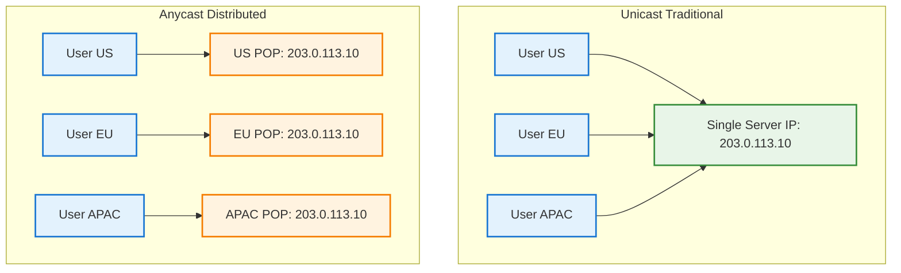
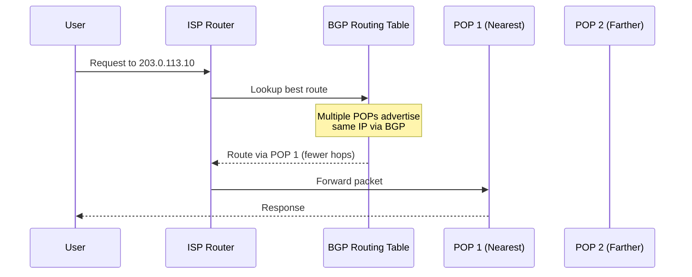
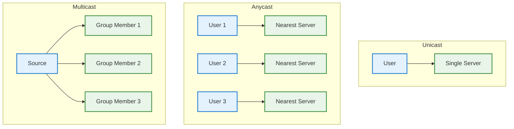
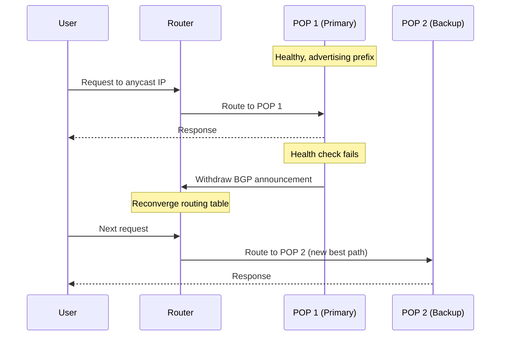
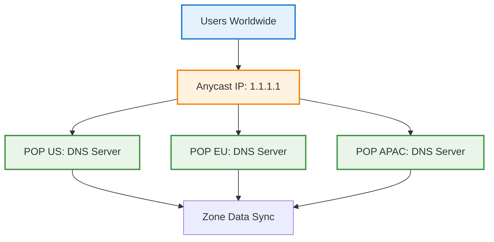

# Anycast

## 📋 Table of Contents

1. [Anycast Fundamentals](#anycast-fundamentals)
2. [How Anycast Works](#how-anycast-works)
3. [Anycast vs Unicast vs Multicast](#anycast-vs-unicast-vs-multicast)
4. [BGP and Routing](#bgp-and-routing)
5. [Use Cases](#use-cases)
6. [Benefits and Trade-offs](#benefits-and-trade-offs)
7. [Implementation Patterns](#implementation-patterns)
8. [Common Interview Questions](#common-interview-questions)

---

## 🔧 Anycast Fundamentals

### What is Anycast?

- **Definition**: A network addressing and routing method where a single IP address is advertised from multiple locations
- **Routing**: Traffic is automatically routed to the nearest/best location based on BGP routing metrics
- **Purpose**: Low latency, high availability, DDoS mitigation, load distribution

### Why Anycast Exists

```text
Problem: Single origin limitations
├── Users far from origin experience high latency
├── Single point of failure for availability
├── DDoS attacks overwhelm single location
└── No automatic geographic load distribution

Solution: Anycast
├── Same IP advertised from multiple POPs globally
├── BGP routes users to nearest/healthiest location
├── Automatic failover if location goes down
└── Distributed attack surface for DDoS absorption
```

### Anycast vs Traditional Routing



> Anycast allows the same IP to be served from multiple locations; routing automatically selects the closest

---

## 🔍 How Anycast Works

### Step-by-Step Flow



### Routing Decision Process

```text
BGP routing metrics (in order of preference):
1. AS Path Length: Fewer autonomous systems = preferred
2. Local Preference: ISP policy-based routing
3. MED (Multi-Exit Discriminator): Hint from destination AS
4. IGP Metric: Internal routing cost
5. BGP Router ID: Tie-breaker

Result: Traffic flows to topologically closest POP
```

### Anycast Advertisement Example

```text
Setup: 3 POPs advertising same IP block

POP US (AS64500):
├── Advertises: 203.0.113.0/24
├── BGP announcement to upstream ISPs
└── Peers with Tier-1 networks

POP EU (AS64501):
├── Advertises: 203.0.113.0/24 (same prefix)
├── BGP announcement to upstream ISPs
└── Peers with Tier-1 networks

POP APAC (AS64502):
├── Advertises: 203.0.113.0/24 (same prefix)
├── BGP announcement to upstream ISPs
└── Peers with Tier-1 networks

Internet routing tables now have 3 paths to 203.0.113.0/24
Each router picks best path based on BGP metrics
```

---

## 🔀 Anycast vs Unicast vs Multicast

```text
┌──────────────┬────────────────────┬─────────────────────┬──────────────────┐
│ Type         │ IP Mapping         │ Routing             │ Use Case         │
├──────────────┼────────────────────┼─────────────────────┼──────────────────┤
│ Unicast      │ 1 IP → 1 host      │ Single destination  │ Normal traffic   │
│ Anycast      │ 1 IP → N hosts     │ Nearest destination │ CDN, DNS, DDoS   │
│ Multicast    │ 1 IP → N hosts     │ All in group        │ Streaming, IPTV  │
│ Broadcast    │ 1 IP → All hosts   │ All in subnet       │ ARP, DHCP        │
└──────────────┴────────────────────┴─────────────────────┴──────────────────┘
```

### Visual Comparison



---

## 🌐 BGP and Routing

### BGP Basics for Anycast

```text
Border Gateway Protocol (BGP):
├── Protocol for exchanging routing information between autonomous systems (AS)
├── Path-vector protocol: advertises reachability and AS path
├── Policy-based: ISPs can prefer/deprioritize routes
└── Slow convergence: route changes take seconds to minutes

Anycast relies on BGP to:
├── Advertise same prefix from multiple locations
├── Let routers pick best path automatically
├── Provide automatic failover (withdraw announcement if POP fails)
└── Enable traffic engineering via AS path prepending
```

### BGP Announcement Example

```text
POP configuration (simplified):

router bgp 64500
  neighbor 192.0.2.1 remote-as 174  # Upstream ISP
  network 203.0.113.0 mask 255.255.255.0
  
Health check integration:
├── Monitor local services (DNS, HTTP)
├── If healthy: announce prefix via BGP
├── If unhealthy: withdraw BGP announcement
└── Traffic automatically reroutes to other POPs
```

### Failover Behavior



---

## 💡 Use Cases

### 1. DNS Root and Authoritative Servers

```text
Why: DNS queries must be fast and resilient
How: Root servers (a.root-servers.net, etc.) use anycast

Example:
├── a.root-servers.net = 198.41.0.4 (anycast)
├── Advertised from 100+ locations globally
├── User queries routed to nearest instance
└── DDoS absorbed across all locations
```

### 2. CDN Edge Servers

```text
Why: Serve content from nearest POP for low latency
How: CDN edge IPs are anycast-enabled

Example:
├── Cloudflare: Anycast IPs for all edge servers
├── User request routed to nearest of 300+ POPs
├── Cache hit served locally; miss fetched from origin
└── Automatic failover if POP fails
```

### 3. DDoS Mitigation

```text
Why: Distribute attack traffic across many locations
How: Anycast spreads volumetric attacks

Without anycast:
├── Attack targets single IP/location
├── Link/server saturated quickly
└── Service unavailable

With anycast:
├── Attack traffic distributed to all POPs
├── Each POP absorbs fraction of total volume
├── Scrubbing applied at each location
└── Service remains available
```

### 4. Global Load Balancing

```text
Why: Distribute users geographically without DNS complexity
How: Anycast routes users to nearest healthy POP

Benefits:
├── No DNS TTL delays (instant routing)
├── Automatic failover without DNS update
├── Latency-optimized by default
└── Simplified architecture (single IP)
```

### 5. Gaming and Real-time Applications

```text
Why: Minimize latency for real-time interactions
How: Game servers use anycast for matchmaking/relay

Example:
├── Player connects to anycast IP
├── Routed to nearest game server POP
├── Sub-50ms latency for most players
└── Automatic reroute if POP fails
```

---

## ⚖️ Benefits and Trade-offs

### Benefits

```text
Latency:
├── Users routed to nearest POP automatically
├── Reduced RTT improves UX and conversion
└── No DNS lookup overhead for geo-routing

Availability:
├── Automatic failover if POP fails (BGP withdrawal)
├── No single point of failure
└── Resilient to regional outages

DDoS Protection:
├── Attack traffic distributed across all POPs
├── Massive aggregate capacity (Tbps+)
└── Localized scrubbing at each POP

Simplicity:
├── Single IP for global service
├── No GeoDNS complexity or TTL delays
└── Transparent to clients
```

### Trade-offs and Limitations

```text
Stateful Protocols:
├── TCP connections may break on failover (new POP)
├── Session state not shared between POPs
└── Workaround: sticky routing, state replication, or stateless design

Asymmetric Routing:
├── Request and response may take different paths
├── Can complicate debugging and monitoring
└── Firewall/NAT issues if paths differ

BGP Convergence Time:
├── Route changes take 30s–3min to propagate globally
├── Not instant failover (but faster than DNS)
└── Health checks must be conservative to avoid flapping

Debugging Complexity:
├── Hard to know which POP served a request
├── Logs/metrics must include POP identifier
└── Traceroute shows only nearest POP

Cost:
├── Requires BGP peering and IP space (typically /24)
├── Multiple POPs and transit costs
└── Not feasible for small deployments
```

---

## 🛠️ Implementation Patterns

### Pattern 1: DNS Anycast (Most Common)

```text
Setup:
├── Advertise DNS server IP (e.g., 1.1.1.1) from all POPs
├── Each POP runs authoritative DNS server
├── Health checks withdraw BGP if DNS fails

Benefits:
├── Fast DNS resolution globally
├── DDoS resilient
└── Standard for root/TLD servers

Example providers: Cloudflare (1.1.1.1), Google (8.8.8.8), Quad9 (9.9.9.9)
```

### Pattern 2: CDN Anycast Edge

```text
Setup:
├── Edge server IPs are anycast-enabled
├── Each POP caches content and runs edge logic
├── Origin shield for cache misses

Benefits:
├── Low latency content delivery
├── Automatic load distribution
└── DDoS absorption

Example: Cloudflare, Fastly, Akamai edge networks
```

### Pattern 3: Anycast + GeoDNS Hybrid

```text
Setup:
├── DNS returns different anycast IPs per region
├── Each anycast IP advertised from regional POPs
├── Combines DNS geo-targeting with anycast benefits

Benefits:
├── Finer control over routing (compliance, cost)
├── Anycast within region for failover
└── GeoDNS for cross-region steering

Use case: Multi-region apps with data residency requirements
```

### Pattern 4: Stateless Services Only

```text
Design principle:
├── Anycast works best for stateless protocols (DNS, HTTP GET)
├── Avoid for stateful (long-lived TCP, WebSockets)
├── Use sticky routing or state replication if needed

Example:
├── API gateway: anycast for stateless REST APIs
├── WebSocket: unicast with GeoDNS for initial connection
└── Database: unicast with regional replicas
```

---

## ❓ Common Interview Questions

### Q1. How does Anycast routing decide which POP to use?

```text
BGP routing metrics determine the path:
1. Shortest AS path (fewest hops between autonomous systems)
2. Local preference (ISP policy)
3. MED and IGP metrics
4. Result: topologically nearest POP, not necessarily geographically nearest

Example: User in NYC might route to Chicago POP if fewer AS hops, even though Miami is closer geographically.
```

### Q2. What happens to TCP connections during Anycast failover?

```text
Problem: TCP is stateful; connection state exists only at one POP

Failover scenario:
├── User connected to POP A (TCP established)
├── POP A fails; BGP withdraws announcement
├── New packets routed to POP B
├── POP B has no connection state → RST or timeout
└── Client must reconnect

Mitigations:
├── Use stateless protocols (HTTP/1.1 with short connections)
├── Client retry logic
├── Sticky routing (consistent hashing on source IP)
└── State replication (expensive, complex)
```

### Q3. Design an Anycast-based global DNS service

```text
Architecture:
├── Advertise 2 anycast IPs (primary, secondary) from all POPs
├── Each POP runs authoritative DNS server with full zone data
├── Health checks: if DNS fails, withdraw BGP announcement
├── Monitoring: track query volume, latency, cache hit per POP
└── DDoS protection: rate limiting, scrubbing at each POP

Diagram:
User → Nearest POP (anycast routing) → DNS server → Response
If POP fails → BGP reconverges → Next nearest POP
```



### Q4. Anycast vs GeoDNS for global load balancing?

```text
Anycast:
├── Pros: Instant routing, automatic failover, no DNS TTL delay, simpler
├── Cons: Stateful protocol issues, BGP complexity, asymmetric routing

GeoDNS:
├── Pros: Works with stateful protocols, fine-grained control, easier debugging
├── Cons: DNS TTL delays, client DNS resolver location != user location

Best practice: Hybrid
├── GeoDNS for regional steering (compliance, cost)
├── Anycast within region for failover and latency
└── Example: GeoDNS returns regional anycast IP
```

### Q5. How do you prevent BGP route hijacking with Anycast?

```text
Threats:
├── Malicious AS advertises your prefix
├── Traffic diverted to attacker
└── MITM or blackhole attack

Mitigations:
├── RPKI (Resource Public Key Infrastructure): cryptographic validation of prefix ownership
├── BGP prefix filtering: only accept announcements from known peers
├── Monitoring: detect unexpected route changes (BGPmon, RIPE RIS)
├── Smaller prefixes: /24 is minimum routable; more specific = preferred by BGP
└── IRR (Internet Routing Registry): document authorized announcements
```

### Q6. What's the minimum IP block size for Anycast?

```text
Answer: /24 (256 IPs) for IPv4

Reason:
├── Most ISPs filter prefixes longer than /24 to reduce routing table size
├── Smaller blocks (/25, /26) won't be globally routable
└── IPv6: /48 is typical minimum

Implication: Anycast requires owning or leasing a /24 block (expensive for small orgs)
```

### Q7. How does Anycast help with DDoS attacks?

```text
Mechanism:
├── Attack traffic distributed across all POPs advertising the anycast IP
├── Each POP absorbs fraction of total volume (e.g., 100 Gbps / 50 POPs = 2 Gbps each)
├── Scrubbing applied locally at each POP
└── Aggregate capacity in Tbps range

Example:
├── Without anycast: 100 Gbps attack saturates single 10 Gbps link → outage
├── With anycast (50 POPs): 2 Gbps per POP, well within capacity → service continues

Limitation: Application-layer (L7) attacks still require WAF/rate limiting at each POP
```

### Q8. Can you use Anycast for databases?

```text
Generally no, due to statefulness:
├── Database connections are long-lived and stateful
├── Anycast failover breaks connections
├── Write consistency issues if multiple POPs accept writes
└── Replication lag and split-brain risks

Alternative:
├── Use unicast IPs for databases
├── GeoDNS for regional read replicas
├── Anycast for stateless query APIs in front of DB
└── Example: Anycast API gateway → regional DB clusters (unicast)
```

---

> Anycast is a powerful tool for low-latency, high-availability services, especially DNS and CDN. Understanding BGP, failover behavior, and stateful protocol limitations is key for system design interviews.
