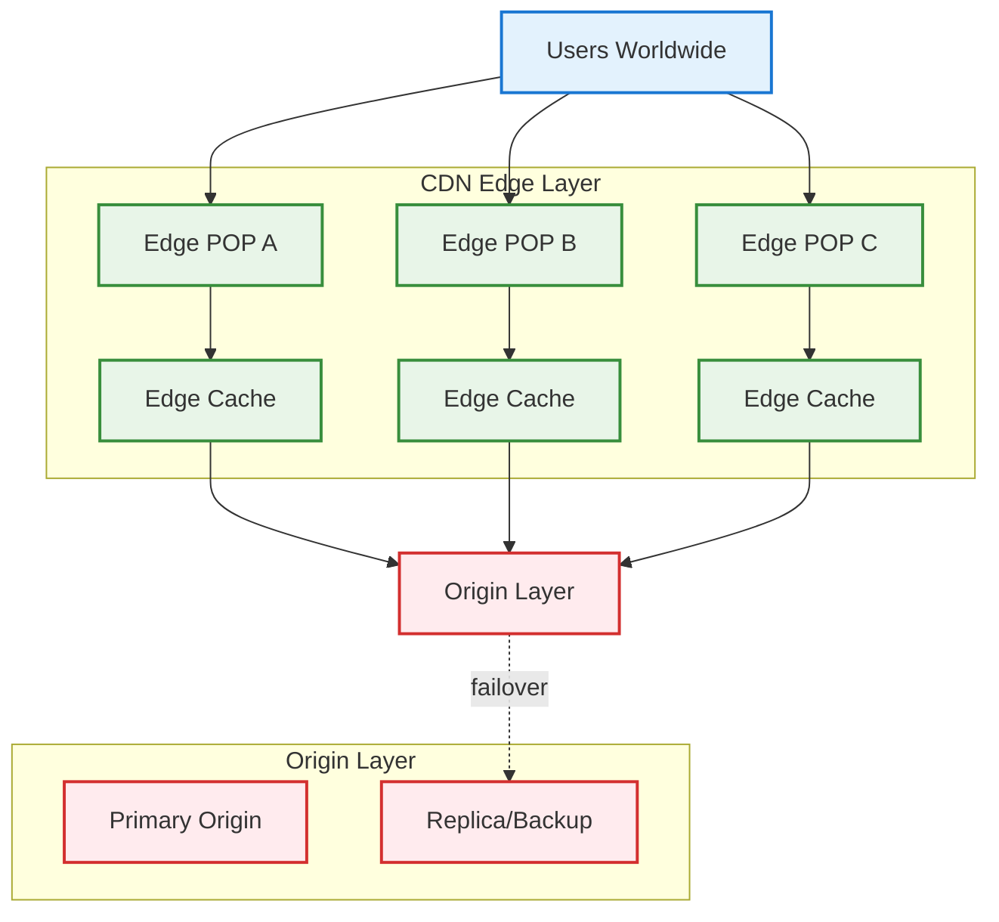
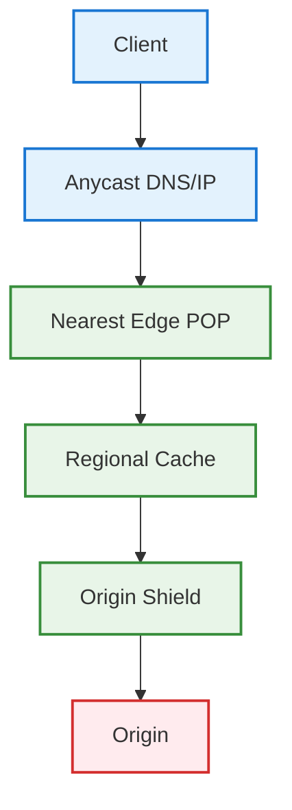
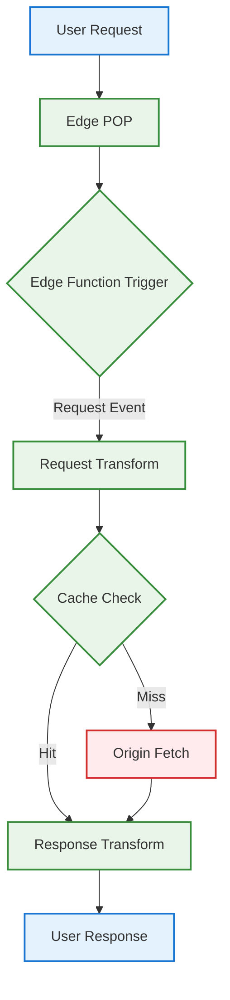
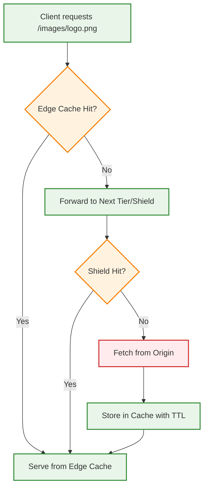
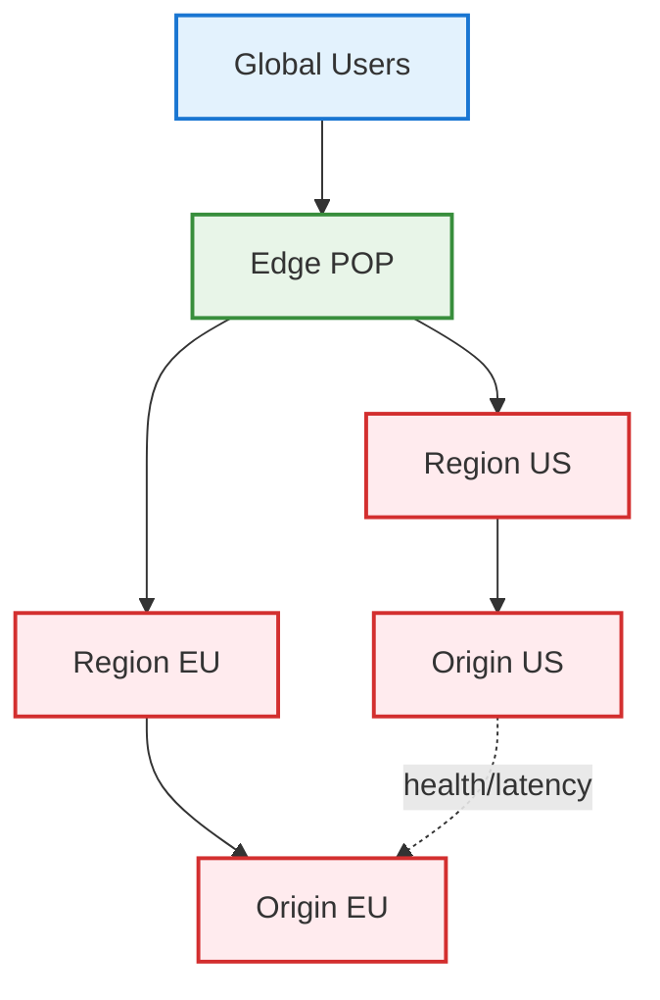
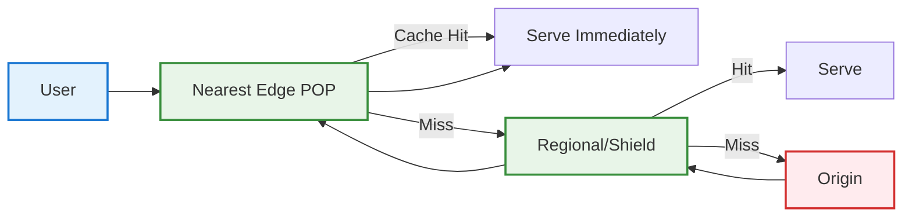
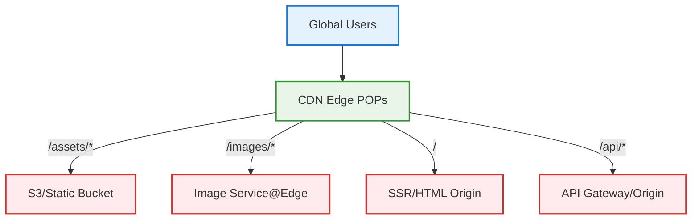
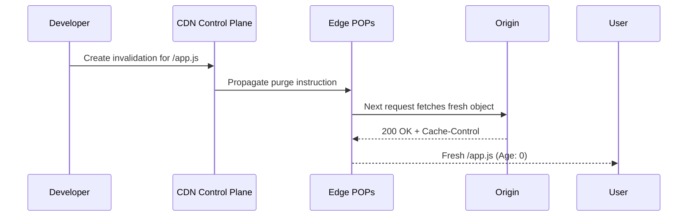
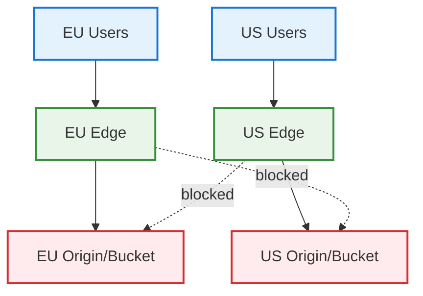
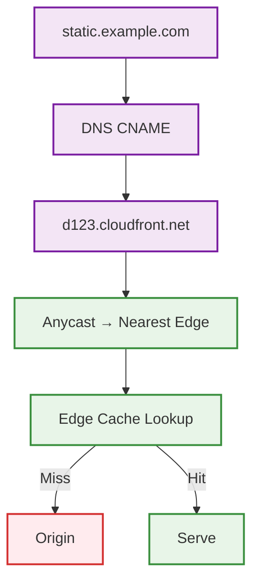

# CDN (Content Delivery Network) for System Design Interviews

## 📋 Table of Contents

1. [CDN Fundamentals](#cdn-fundamentals)
2. [CDN Core Components](#cdn-core-components)
3. [Edge Computing in CDN](#edge-computing-in-cdn)
4. [How CDN Works (Step-by-Step)](#how-cdn-works-step-by-step)
5. [Caching and Invalidation](#caching-and-invalidation)
6. [CDN in System Design](#cdn-in-system-design)
7. [Security & Performance](#security--performance)
8. [Cost, Limits, and Trade-offs](#cost-limits-and-trade-offs)
9. [Common Interview Questions](#common-interview-questions)

---

## 🔧 CDN Fundamentals

### What is a CDN?

- **Content Delivery Network**: A globally distributed network of edge servers that cache and deliver content close to users
- **Purpose**: Reduce latency, offload origin, improve reliability and cost efficiency
- **Analogy**: Local warehouses for your website/app content

### Why CDNs Exist

```text
Problem: High latency and origin overload
├── Users are globally distributed, origin is not
├── Static assets are expensive to serve repeatedly from origin
└── Network congestion and long RTT hurt UX and conversion

Solution: Cache at the edge + smart routing → low latency and resilient delivery
```

### CDN Architecture Overview



> CDN edge POPs cache and serve content, pulling from origin on misses

---

## 🏢 CDN Core Components

### 1. Edge POPs and Caches

- **Edge POPs**: Points of presence near users with compute and cache
- **Cache tiers**: Edge cache → regional cache → origin shield
- **Anycast IPs**: Route users to nearest/healthy edge



### 2. Origins

- **Single/Multi-origin**: S3/static, App servers, Media store
- **Active-active** via geo/latency routing; **active-passive** for DR
- **Origin Shield** reduces thundering herd to origin

### 3. Routing & Policies

- **DNS CNAME to CDN** (e.g., `assets.example.com` → `d123.cloudfront.net`)
- **Geo/latency routing** to closest edge
- **Rules**: Path-based behaviors, header rewrites, compression, redirect

### 4. Edge Compute

- **Edge functions/workers** for auth, A/B testing, redirects, header munging
- **TLS termination** at edge, optional mutual TLS to origin

---

## ⚡ Edge Computing in CDN

### What is Edge Computing?

- **Definition**: Running custom code/logic at CDN edge servers (close to users) instead of at the origin
- **Purpose**: Reduce latency, personalize responses, enforce security, and offload origin processing
- **Execution**: Lightweight functions triggered on request/response events

### Why Edge Computing Matters

```text
Traditional flow:
User → CDN (cache miss) → Origin (run logic) → CDN → User
Latency: RTT(user↔CDN) + RTT(CDN↔origin) + origin processing

Edge compute flow:
User → CDN (run logic at edge) → User
Latency: RTT(user↔CDN) + edge processing (microseconds)

Benefits:
├── Sub-millisecond logic execution near users
├── Reduce origin load (auth, redirects, transforms done at edge)
├── Personalization without origin round-trip
└── Security enforcement (WAF, rate limits, JWT validation) before origin
```

### Edge Computing Architecture



> Edge functions intercept requests/responses to modify headers, redirect, authenticate, or generate content

### Common Edge Computing Use Cases

#### 1. Authentication & Authorization

```text
Use case: Validate JWT tokens at edge before allowing origin access
Benefits: Block unauthorized requests early; reduce origin load

Example flow:
1) User sends request with Authorization: Bearer <token>
2) Edge function validates JWT signature and expiry
3) If valid → forward to origin; if invalid → return 401 immediately
```

```javascript
// Cloudflare Worker / Lambda@Edge example
async function handleRequest(request) {
  const token = request.headers.get('Authorization')?.split(' ')[1];
  
  if (!token || !isValidJWT(token)) {
    return new Response('Unauthorized', { status: 401 });
  }
  
  // Add user context to header for origin
  const modifiedRequest = new Request(request);
  modifiedRequest.headers.set('X-User-ID', extractUserId(token));
  
  return fetch(modifiedRequest);
}
```

#### 2. A/B Testing & Feature Flags

```text
Use case: Route users to different variants without origin involvement
Benefits: Fast experimentation; no origin changes needed

Example:
1) Edge reads cookie/header to determine user cohort
2) Modify request path or headers based on variant
3) Serve from appropriate cache bucket or origin path
```

```javascript
async function handleRequest(request) {
  const variant = getCookie(request, 'ab_test') || assignVariant();
  
  if (variant === 'B') {
    // Rewrite URL to variant B path
    const url = new URL(request.url);
    url.pathname = '/variant-b' + url.pathname;
    return fetch(url);
  }
  
  return fetch(request);
}
```

#### 3. Redirects & URL Rewrites

```text
Use case: Handle redirects, canonical URLs, mobile detection at edge
Benefits: No origin hit; instant redirect; SEO-friendly

Examples:
├── www → non-www (or vice versa)
├── HTTP → HTTPS enforcement
├── Geo-based redirects (EU users → /eu/)
└── Mobile detection → /m/ path
```

```javascript
async function handleRequest(request) {
  const url = new URL(request.url);
  
  // Force HTTPS
  if (url.protocol === 'http:') {
    url.protocol = 'https:';
    return Response.redirect(url.toString(), 301);
  }
  
  // Mobile redirect
  const userAgent = request.headers.get('User-Agent') || '';
  if (/Mobile|Android/i.test(userAgent) && !url.pathname.startsWith('/m/')) {
    url.pathname = '/m' + url.pathname;
    return Response.redirect(url.toString(), 302);
  }
  
  return fetch(request);
}
```

#### 4. Header Manipulation & Security

```text
Use case: Add/remove security headers, CORS, cache control
Benefits: Centralized policy enforcement; no app code changes

Examples:
├── Add security headers (CSP, HSTS, X-Frame-Options)
├── CORS headers for API endpoints
├── Strip sensitive headers before forwarding to origin
└── Modify Cache-Control based on path/user
```

```javascript
async function handleRequest(request) {
  const response = await fetch(request);
  
  // Clone and add security headers
  const newResponse = new Response(response.body, response);
  newResponse.headers.set('Strict-Transport-Security', 'max-age=31536000');
  newResponse.headers.set('X-Content-Type-Options', 'nosniff');
  newResponse.headers.set('X-Frame-Options', 'DENY');
  
  // Dynamic cache control
  if (request.url.includes('/api/')) {
    newResponse.headers.set('Cache-Control', 'no-store');
  }
  
  return newResponse;
}
```

#### 5. Content Generation & Personalization

```text
Use case: Generate dynamic HTML/JSON at edge based on user context
Benefits: No origin; fast personalization; reduced backend load

Examples:
├── Inject user-specific data into cached HTML
├── Generate personalized API responses
├── Assemble page from multiple cached fragments
└── Edge-side includes (ESI) for dynamic sections
```

```javascript
async function handleRequest(request) {
  const userId = getCookie(request, 'user_id');
  
  // Fetch cached base HTML
  const baseHTML = await fetch(request);
  let html = await baseHTML.text();
  
  // Inject personalized content
  if (userId) {
    const userData = await fetchUserData(userId); // from KV store
    html = html.replace('{{USERNAME}}', userData.name);
    html = html.replace('{{CART_COUNT}}', userData.cartCount);
  }
  
  return new Response(html, {
    headers: { 'Content-Type': 'text/html' }
  });
}
```

#### 6. Image & Asset Optimization

```text
Use case: Resize, compress, format-convert images on-the-fly at edge
Benefits: Serve optimal format/size per device; bandwidth savings

Example:
1) Request: /image.jpg?w=800&fmt=webp
2) Edge checks if WebP supported (Accept header)
3) Transform image at edge or fetch from cache
4) Return optimized asset
```

### Edge Computing Platforms

```text
Provider comparison:
┌─────────────────┬──────────────────┬─────────────────┬──────────────┐
│ Provider        │ Product          │ Runtime         │ Limits       │
├─────────────────┼──────────────────┼─────────────────┼──────────────┤
│ Cloudflare      │ Workers          │ V8 isolates     │ 50ms CPU     │
│ AWS             │ Lambda@Edge      │ Node/Python     │ 5s timeout   │
│ Fastly          │ Compute@Edge     │ WASM            │ Rust/JS      │
│ Vercel          │ Edge Functions   │ V8 isolates     │ Streaming    │
│ Akamai          │ EdgeWorkers      │ JavaScript      │ 50ms CPU     │
└─────────────────┴──────────────────┴─────────────────┴──────────────┘

Key considerations:
├── Cold start latency (V8 isolates < containers)
├── CPU/memory limits and execution time caps
├── Language/runtime support (JS, WASM, Python)
├── Access to KV stores, secrets, external APIs
└── Cost model (per request, CPU time, bandwidth)
```

### Edge vs Origin Trade-offs

```text
When to use edge compute:
├── Low-latency requirements (auth, redirects, headers)
├── High request volume (offload origin)
├── Stateless logic (no DB writes, simple transforms)
└── Personalization with cached base + edge injection

When to avoid edge:
├── Complex business logic requiring DB transactions
├── Long-running computations (>50ms CPU)
├── Stateful operations (session writes, inventory updates)
└── Debugging/observability needs (edge logs limited)
```

### Edge Computing Best Practices

```text
Design principles:
├── Keep functions small and fast (<10ms ideal)
├── Use KV stores for config/user data; avoid external API calls
├── Fail open: if edge function errors, fall back to origin
├── Version functions; canary deploy before full rollout
└── Monitor edge metrics: execution time, error rate, cache hit

Security:
├── Validate all inputs at edge (XSS, injection)
├── Rate limit per IP/token before origin
├── Use secrets manager for API keys, not hardcoded
└── Audit edge function changes (treat as production code)
```

---

## 🔍 How CDN Works (Step-by-Step)



### Detailed Request Flow

```text
1) DNS resolves asset host to CDN CNAME → Edge POP via Anycast
2) Edge evaluates behavior rules (path, headers, methods)
3) Cache key computed (host + path + query + headers + cookies)
4) Cache lookup → hit: serve; miss: promote to higher tier and/or origin
5) Apply compression, range requests, signed URLs, and TLS
6) Log/metrics emitted from edge; optional real-user monitoring (RUM)
```

---

## 💾 Caching and Invalidation

### 1. Cache Keys & Variants

```text
Default cache key: host + path + query
Variants: headers (Accept, Accept-Encoding, Authorization), cookies, device type
Avoid over-keying to prevent low hit ratio
```

### 2. Cache Control Strategy

```text
HTTP Headers:
├── Cache-Control: max-age, s-maxage, public/private, no-store, no-cache
├── ETag / If-None-Match (revalidation via 304)
└── Last-Modified / If-Modified-Since

TTL Guidelines:
├── Immutable static assets (fingerprinted): 1 year, immutable
├── Semi-static pages: minutes-hours
└── APIs / personalized: no-store or short TTL with revalidation
```

### 3. Invalidation & Versioning

```text
Strategies:
├── Hard purge/invalidation by path/prefix (costly, rate-limited)
├── Soft purge (serve stale while revalidating)
├── Versioned URLs: /app.v123.js → avoids purges; best practice
└── Surrogate-Control headers for CDNs vs browsers
```

### 4. Stale-While-Revalidate / Stale-If-Error

```text
Serve stale content on edge while asynchronously refreshing
Improve resilience during origin failures or deployments
Headers: Cache-Control: stale-while-revalidate=60, stale-if-error=600
```

---

## 🏗️ CDN in System Design

### 1. Static Asset Delivery

```mermaid
graph TD
    A[Browser] --> B[assets.example.com]
    B --> C[CNAME → CDN]
    C --> D[Edge POP]
    D -->|Hit| E[Serve cached]
    D -->|Miss| F[Origin (S3/App)]
    F --> D

    classDef browser fill:#e3f2fd,stroke:#1976d2,stroke-width:2px
    classDef edge fill:#e8f5e8,stroke:#388e3c,stroke-width:2px
    classDef origin fill:#ffebee,stroke:#d32f2f,stroke-width:2px

    class A browser
    class B,C,D,E edge
    class F origin
```

### 2. Dynamic Content and APIs

```text
Patterns:
├── Cache GET responses with short TTL + validation
├── Bypass cache for POST/PUT/DELETE; still leverage TLS, WAF, rate limits
├── Edge compute for auth, JWT validation, request shaping
└── Shielding and connection pooling to protect origin
```

### 3. Multi-Region and Failover



### 4. Media Streaming

```text
HLS/DASH segment caching:
├── Small segment files (2–6s) cached at edge
├── Origin packager produces manifests + segments
└── Tokenized/signed URLs for access control
```

### 5. Image/Asset Optimization

```text
On-the-fly transforms at edge:
├── Resize/compress, WebP/AVIF negotiation via Accept header
├── Dedicate cache key variant per format/size
└── Huge bandwidth savings and faster LCP
```

---

## 🔐 Security & Performance

### Security Controls

```text
├── TLS termination at edge, modern ciphers, HTTP/2/3 (QUIC)
├── WAF with managed rules, bot management, IP reputation
├── DDoS protection with massive edge capacity and Anycast
├── Signed URLs/cookies, OAuth/JWT at edge, mTLS to origin
└── Rate limiting/throttling and geo/IP allow/deny
```

### Performance Techniques

```text
├── HTTP/2 multiplexing, HTTP/3 reduced handshake latency
├── Brotli/Gzip compression and client hints (DPR, Width, Save-Data)
├── Prefetch/preconnect headers; early hints (103)
├── TCP/TLS connection reuse and origin keep-alive via shield
└── Edge compute to cut server round-trips (redirects, headers, AB tests)
```

---

## 💸 Cost, Limits, and Trade-offs

```text
Costs:
├── Egress bandwidth, requests, invalidations, edge compute time
├── Image/streaming transforms billed separately
└── Inter-region transfer and origin egress

Limits/Quotas:
├── Invalidation rate limits and propagation delay
├── Header/cookie sizes in cache key
└── Max object size, TTL minimums/maximums

Trade-offs:
├── Over-variant cache keys ↓ hit ratio
├── Too-long TTLs risk staleness; too-short TTLs hurt hit ratio
└── Edge logic complexity vs simplicity and predictability
```

---

## ❓ Common Interview Questions

### Q1. How does a CDN reduce tail latency and origin load?

```text
Key points:
├── Anycast + nearest POP → fewer network hops, lower RTT
├── Edge caching → cache hits avoid origin round trips
├── Connection reuse + compression → faster transfers
└── Origin shield + tiered cache → prevents thundering herd
```



Impact:
- **Tail latency** drops because far-away users hit nearby POPs and often avoid origin.
- **Origin load** drops due to high edge hit rates and shield fan-in.

Explanation:

```text
Without CDN:
├── RTT (user↔origin): 180–250 ms (transcontinental)
├── TLS + request + response over long path → high P95/P99
└── Every request hits origin → CPU/egress heavy

With CDN:
├── RTT (user↔edge): 10–40 ms (local POP)
├── Cache hit: origin = 0 trips, only edge work
└── Cache miss: single shielded fetch, then many hits

Numerical example:
├── No CDN P95: 900 ms
├── CDN (70% hit): P95 ≈ 0.7×250 ms + 0.3×900 ms ≈ 475 ms
└── CDN (90% hit): P95 ≈ 0.9×250 ms + 0.1×900 ms ≈ 315 ms
```

---

### Q2. Design a CDN strategy for a global e-commerce site

```text
Components:
├── Static assets (JS/CSS/img): versioned filenames, 1y immutable
├── HTML pages: short TTL + revalidation (ETag), SWR for resilience
├── APIs: cache-safe GETs only, short TTL or no-store with WAF/rate limits
├── Media/images: on-the-fly transforms at edge (WebP/AVIF), device-aware
└── Multi-origin (US/EU/APAC) with health/latency-based routing
```



Policies:
- Path behaviors per route. Cache key variants for `Accept`, device hints.
- Signed URLs for checkout/media; WAF on API; DDoS protection enabled.
- Tiered cache + origin shield; blue/green via CNAME swap with short TTL.

Explanation (headers per route):

```text
/assets/* (immutable):
  Cache-Control: public, max-age=31536000, immutable
  Surrogate-Control: max-age=31536000

/ (HTML):
  Cache-Control: public, max-age=60, stale-while-revalidate=60
  ETag: "<hash>"  (allow 304)

/api/* (GET cache-safe):
  Cache-Control: public, s-maxage=30, max-age=0, stale-if-error=300
  Vary: Accept, Authorization? (only if truly affects response)
```

---

### Q3. How would you invalidate cached content during a hotfix?

```text
Order of operations:
1) Prefer versioned asset strategy to avoid global purges
2) If hotfix on same URL:
   ├─ Issue targeted invalidation by exact path/prefix
   ├─ Use soft purge (SWR) to serve stale while revalidating
   └─ Temporarily reduce TTLs if frequent changes expected
3) Verify via headers (Age, X-Cache) and multiple regions
```



Trade-offs:
- Hard invalidations can be slow/costly at scale. Favor versioned URLs.

Examples (provider-specific):

```bash
# AWS CloudFront CLI: invalidate specific paths
aws cloudfront create-invalidation \
  --distribution-id E1ABCDEF2345 \
  --paths "/app.js" "/css/*"

# Fastly API: soft purge (recommended)
curl -X POST \
  -H "Fastly-Key: $FASTLY_TOKEN" \
  https://api.fastly.com/service/$SERVICE_ID/purge/app.js
```

---

### Q4. Versioned assets vs hard invalidation

```text
Versioned assets (best):
├── Pros: no purge required, long TTLs, instant rollback with new version
└── Cons: build pipeline changes, cache growth

Hard invalidation:
├── Pros: works without build changes
└── Cons: propagation delay, rate limits, cost, origin surge
```

Rule of thumb: Use versioned filenames for static assets; reserve invalidations for emergencies.

Explanation (decision guide):

```text
If you control the build pipeline → versioned filenames
If 3rd-party embeds or fixed URLs → targeted invalidations
For HTML/templates changing often → short TTL + revalidation (ETag)
```

---

### Q5. How do you secure CDN endpoints?

```text
Controls:
├── TLS 1.2+/H3 at edge; HSTS
├── WAF managed rules, bot mitigation, IP reputation
├── Signed URLs/cookies for private content
├── mTLS from edge to origin; header allowlists
└── Rate limiting per IP/token; geo/IP access controls
```

Example header model:

```text
Edge → Origin:
├── X-Forwarded-For, X-Request-Id, Authorization (if needed)
└── Strip user-controlled hop-by-hop headers
```

Explanation with examples:

```text
Minimal WAF rule (pseudo):
  Block: SQLi payloads (union select, sleep())
  Block: Path traversal (.. / %2e%2e / %2f)
  Rate limit: 200 req/min per IP on /api/login

Signed URL (query string):
  /private/video.mp4?exp=1730940000&key=PUBLIC&sig=HMAC_SHA256(secret, path+exp)
```

---

### Q6. What goes into an effective cache key?

```text
Base: Host + Path + Query
Variants (only if affecting response):
├── Accept / Accept-Encoding (format/compression)
├── Authorization / Cookie (for personalized content)
└── Device hints (DPR, Width) for image variants

Anti-pattern: Over-variant keys → low hit ratio, origin load
```

Example:

```text
/images/hero.jpg?w=1200&fmt=webp
Key = host + path + query(w,fmt) + headers(Accept)
```

Provider configs:

```text
CloudFront cache policy fields:
  Query strings: Whitelist [w, fmt]
  Headers: Include [Accept]
  Cookies: None (unless personalization)

Fastly VCL (simplified):
  set req.hash += req.url.path;
  set req.hash += req.url.qs:w,fmt;
  if (req.http.Accept) { set req.hash += req.http.Accept; }
```

---

### Q7. When would you bypass the CDN?

```text
Cases:
├── Highly dynamic or personalized responses (no cache value)
├── WebSockets/gRPC streams directly to edge or origin
├── Admin/internal tools restricted by VPN
└── Compliance scenarios where content must not be cached
```

Pattern: Still terminate TLS and apply WAF at edge even if not caching.

Explanation with rule example:

```text
Bypass behaviors:
  /admin/*  → Cache: bypass, WAF: on, Auth: strict
  /ws/*     → Route to WebSocket origin, long-lived connections
  /health   → Bypass cache, low TTL, do not log bodies
```

---

### Q8. How do you handle GDPR/geo-compliance with CDNs?

```text
Approach:
├── Geo-IP based routing to in-region origins (EU vs non-EU)
├── Edge logic to enforce consent (block non-essential cookies pre-consent)
├── Regional buckets/origins for data residency
└── Configured logs: redact IPs or store logs regionally
```

```mermaid
graph TD
    U[EU User] --> POP[Edge POP]
    POP -->|Policy Check (consent)| Consent{Consent?}
    Consent -->|No| Minimal[Minimal Response
      no tracking]
    Consent -->|Yes| EUO[EU Origin]

    classDef user fill:#e3f2fd,stroke:#1976d2,stroke-width:2px
    classDef edge fill:#e8f5e8,stroke:#388e3c,stroke-width:2px
    classDef origin fill:#ffebee,stroke:#d32f2f,stroke-width:2px
    class U user
    class POP edge
    class EUO origin
```

Notes: Document policies and validate with DPIA; ensure vendor/CDN data processing addendum.

Residency architecture (regions):



---

## 🔗 DNS–CDN Integration (Quick Reference)


