# DNS (Domain Name System) for System Design Interviews

## 📋 Table of Contents

1. [DNS Fundamentals](#dns-fundamentals)
2. [DNS Core Components](#dns-core-components)
3. [How DNS Works (Step-by-Step)](#how-dns-works-step-by-step)
4. [DNS Record Types](#dns-record-types)
5. [DNS Resolution Process](#dns-resolution-process)
6. [DNS Caching Mechanisms](#dns-caching-mechanisms)
7. [DNS in System Design](#dns-in-system-design)
8. [DNS Load Balancing](#dns-load-balancing)
9. [DNS Security & Performance](#dns-security--performance)
10. [Common Interview Questions](#common-interview-questions)

---

## 🔧 DNS Fundamentals

### What is DNS?

- **Domain Name System**: Translates human-readable domain names to IP addresses
- **Purpose**: Hierarchical naming system for internet resources
- **Analogy**: Phone book of the internet

### Why DNS Exists:

```
Problem: Remembering IP addresses is hard
├── google.com vs 142.250.185.14
├── facebook.com vs 31.13.64.35
└── github.com vs 140.82.112.4

Solution: Human-readable names → IP addresses
```

### DNS Architecture Overview:

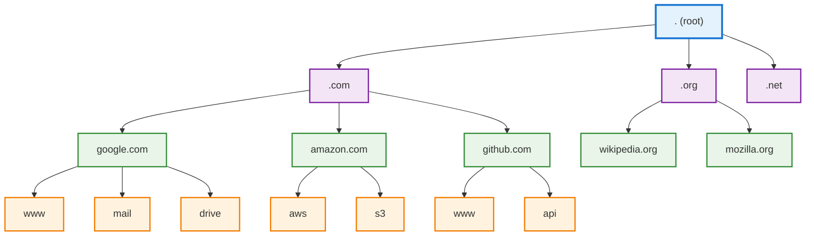

_The hierarchical structure of DNS from root servers down to subdomains_

---

## 🏢 DNS Core Components

### 1. DNS Nameservers

#### Types of Nameservers:

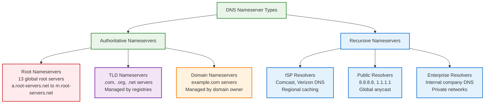

_DNS nameserver hierarchy showing authoritative and recursive server types_

#### Authoritative Nameservers:

**Root Nameservers:**

```
Global Root Server Distribution:
├── a.root-servers.net (VeriSign, Global Anycast)
├── b.root-servers.net (USC-ISI, Global Anycast)
├── c.root-servers.net (Cogent, Global Anycast)
├── d.root-servers.net (University of Maryland, Global)
├── e.root-servers.net (NASA Ames, Global Anycast)
├── f.root-servers.net (Internet Systems Consortium, Global)
├── g.root-servers.net (US DoD Network Info Center, Global)
├── h.root-servers.net (US Army Research Lab, Global Anycast)
├── i.root-servers.net (Netnod, Global Anycast)
├── j.root-servers.net (VeriSign, Global Anycast)
├── k.root-servers.net (RIPE NCC, Global Anycast)
├── l.root-servers.net (ICANN, Global Anycast)
└── m.root-servers.net (WIDE Project, Global Anycast)

Responsibilities:
├── Maintain root zone file
├── Delegate to TLD nameservers
├── Handle root zone queries
└── Provide TLD nameserver referrals
```

**TLD Nameservers:**

```
TLD Server Examples:
├── .com: Managed by VeriSign
│   ├── a.gtld-servers.net
│   ├── b.gtld-servers.net
│   └── ... (13 servers total)
├── .org: Managed by Public Interest Registry
│   ├── a0.org.afilias-nst.info
│   ├── a2.org.afilias-nst.info
│   └── ... (6 servers total)
└── .net: Managed by VeriSign
    ├── a.gtld-servers.net
    └── ... (shared with .com)

Responsibilities:
├── Maintain TLD zone data
├── Delegate to domain nameservers
├── Handle domain registration info
└── Provide domain nameserver referrals
```

**Domain Nameservers:**

```
Domain Nameserver Configuration:
example.com Zone:
├── Primary Nameserver: ns1.example.com
├── Secondary Nameserver: ns2.example.com
├── Backup Nameserver: ns3.example.com (optional)
└── Geographic Distribution: Multi-region setup

Responsibilities:
├── Store domain's DNS records
├── Respond to queries for the domain
├── Handle subdomain delegation
└── Maintain zone file integrity
```

### 2. DNS Resolvers (Recursive Nameservers)

#### Resolver Types & Architecture:

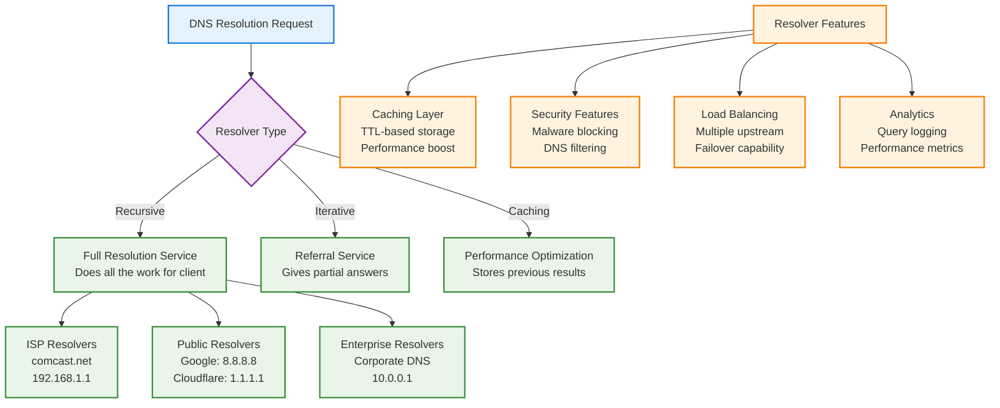

_DNS resolver architecture showing different types and key features_

#### Popular Public DNS Resolvers:

```
Public DNS Resolver Comparison:
┌─────────────────┬──────────────┬─────────────┬─────────────┐
│ Provider        │ Primary IP   │ Secondary   │ Features    │
├─────────────────┼──────────────┼─────────────┼─────────────┤
│ Google          │ 8.8.8.8      │ 8.8.4.4     │ Fast, reliable│
│ Cloudflare      │ 1.1.1.1      │ 1.0.0.1     │ Privacy-focused│
│ Quad9           │ 9.9.9.9      │ 149.112.112.112│ Security │
│ OpenDNS         │ 208.67.222.222│ 208.67.220.220│ Filtering │
│ Level3          │ 4.2.2.1      │ 4.2.2.2     │ Legacy ISP  │
└─────────────────┴──────────────┴─────────────┴─────────────┘

Resolver Selection Criteria:
├── Performance: Query response time
├── Reliability: Uptime and availability
├── Security: Malware/phishing protection
├── Privacy: Query logging policies
├── Features: Filtering, parental controls
└── Geographic presence: Edge locations
```

#### Resolver Configuration & Behavior:

```
Recursive Resolver Process:
1. Receive client query
2. Check local cache for answer
3. If cached: Return result immediately
4. If not cached: Start iterative process
   ├── Query root nameserver
   ├── Query TLD nameserver
   ├── Query authoritative nameserver
   └── Cache result with TTL
5. Return final answer to client
6. Monitor cache for expiration

Cache Management:
├── Positive Caching: Cache successful responses
├── Negative Caching: Cache NXDOMAIN responses
├── TTL Enforcement: Respect authoritative TTL
├── Cache Warming: Proactive refresh
└── Cache Flushing: Manual invalidation
```

### 3. DNS Records Deep Dive

#### Complete DNS Record Reference:

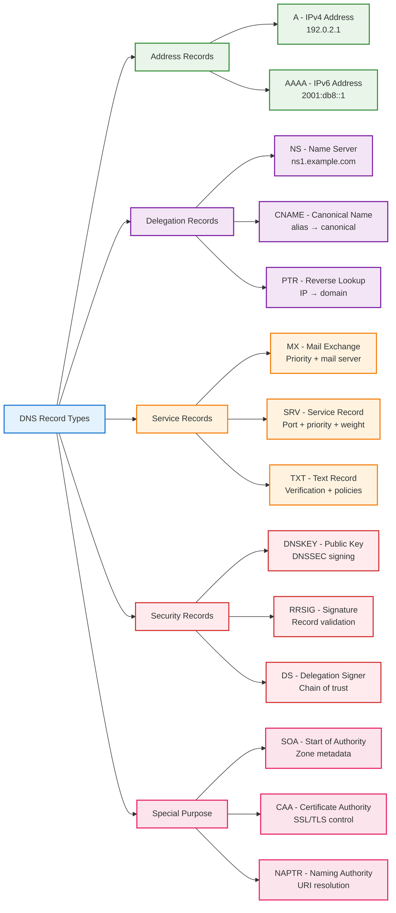

_Comprehensive DNS record types categorized by function_

#### Advanced DNS Record Examples:

**SOA (Start of Authority) Record:**

```
example.com.  IN  SOA  ns1.example.com. admin.example.com. (
    2024110601  ; Serial number (YYYYMMDDNN)
    3600        ; Refresh (1 hour)
    1800        ; Retry (30 minutes)
    1209600     ; Expire (2 weeks)
    86400       ; Minimum TTL (1 day)
)

Fields Explanation:
├── Primary NS: ns1.example.com (primary nameserver)
├── Admin Email: admin.example.com (admin@example.com)
├── Serial: 2024110601 (change tracking)
├── Refresh: 3600s (secondary checks primary)
├── Retry: 1800s (retry if refresh fails)
├── Expire: 1209600s (discard if unreachable)
└── Minimum: 86400s (negative cache TTL)
```

**SRV (Service) Record:**

```
_http._tcp.example.com.  IN  SRV  10 60 80 server1.example.com.
_https._tcp.example.com. IN  SRV  10 40 443 server2.example.com.
_sip._udp.example.com.   IN  SRV  5  30 5060 sip1.example.com.

Format: _service._protocol.domain
Fields: Priority Weight Port Target

Service Discovery Usage:
├── Web services: _http._tcp, _https._tcp
├── Email: _smtp._tcp, _imap._tcp, _pop3._tcp
├── VoIP: _sip._tcp, _sip._udp
├── LDAP: _ldap._tcp
└── Kubernetes: Custom service discovery
```

**TXT Record Advanced Usage:**

```
Domain Verification:
├── google-site-verification=abc123...
├── facebook-domain-verification=xyz789...
└── MS=ms12345... (Microsoft verification)

Email Authentication:
├── SPF: "v=spf1 include:_spf.google.com ~all"
├── DKIM: "v=DKIM1; k=rsa; p=MIGfMA0GCSqGSIb3..."
└── DMARC: "v=DMARC1; p=quarantine; rua=mailto:reports@example.com"

Security Policies:
├── CAA: "0 issue letsencrypt.org"
└── Security.txt: "Contact: security@example.com"
```

**CAA (Certificate Authority Authorization) Record:**

```
example.com.      IN  CAA  0 issue "letsencrypt.org"
example.com.      IN  CAA  0 issue "digicert.com"
example.com.      IN  CAA  0 iodef "mailto:security@example.com"
subdomain.example.com. IN CAA 128 issue ";"

CAA Flags:
├── 0: Non-critical (advisory)
├── 128: Critical (must be processed)

CAA Tags:
├── issue: Authorize certificate issuance
├── issuewild: Authorize wildcard certificates
├── iodef: Incident reporting contact
└── Semicolon (;): Prohibit all issuance
```

#### DNS Zone File Structure:

```
Complete Zone File Example (example.com):

$TTL 3600                                   ; Default TTL
$ORIGIN example.com.                        ; Zone origin

; SOA Record
@               IN  SOA     ns1.example.com. admin.example.com. (
                            2024110601      ; Serial
                            3600           ; Refresh
                            1800           ; Retry
                            1209600        ; Expire
                            86400          ; Minimum
                            )

; Name Server Records
@               IN  NS      ns1.example.com.
@               IN  NS      ns2.example.com.
@               IN  NS      ns3.example.com.

; A Records (IPv4)
@               IN  A       192.0.2.1
www             IN  A       192.0.2.1
mail            IN  A       192.0.2.10
ftp             IN  A       192.0.2.20

; AAAA Records (IPv6)
@               IN  AAAA    2001:db8:85a3::1
www             IN  AAAA    2001:db8:85a3::1

; CNAME Records
blog            IN  CNAME   www.example.com.
shop            IN  CNAME   www.example.com.
cdn             IN  CNAME   d123.cloudfront.net.

; MX Records
@               IN  MX  10  mail.example.com.
@               IN  MX  20  backup-mail.example.com.

; TXT Records
@               IN  TXT     "v=spf1 mx include:_spf.google.com ~all"
_dmarc          IN  TXT     "v=DMARC1; p=quarantine; rua=mailto:dmarc@example.com"
google._domainkey IN TXT   "v=DKIM1; k=rsa; p=MIGfMA0GCSqGSIb3..."

; SRV Records
_http._tcp      IN  SRV     10 60 80 www.example.com.
_https._tcp     IN  SRV     10 40 443 www.example.com.
_sip._udp       IN  SRV     10 30 5060 sip.example.com.

; CAA Records
@               IN  CAA     0 issue "letsencrypt.org"
@               IN  CAA     0 iodef "mailto:security@example.com"

; Subdomain Delegation
sub             IN  NS      ns1.subdomain-provider.com.
sub             IN  NS      ns2.subdomain-provider.com.

; Wildcard Record
*               IN  A       192.0.2.100

Zone File Best Practices:
├── Use consistent formatting and spacing
├── Group records by type for readability
├── Include comments for complex configurations
├── Use relative names within the zone
├── Implement proper TTL values per record type
├── Regular zone file validation
└── Version control for zone file changes
```

---

## 🔍 How DNS Works (Step-by-Step)

### Complete DNS Resolution Process:

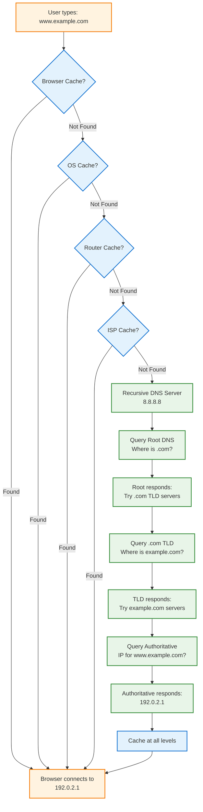

_Step-by-step DNS resolution from browser cache to authoritative servers_

### Detailed Query Flow:

```
Browser Query: www.example.com
        │
        ▼
┌─────────────────┐    ┌─────────────────┐
│ Recursive DNS   │───▶│ Root DNS        │
│ (8.8.8.8)       │◀───│ (.)             │
└─────────────────┘    └─────────────────┘
        │                       │
        │               "Try .com servers"
        ▼
┌─────────────────┐    ┌─────────────────┐
│ Recursive DNS   │───▶│ .com TLD        │
│ (8.8.8.8)       │◀───│ Server          │
└─────────────────┘    └─────────────────┘
        │                       │
        │           "Try example.com servers"
        ▼
┌─────────────────┐    ┌─────────────────┐
│ Recursive DNS   │───▶│ example.com     │
│ (8.8.8.8)       │◀───│ Authoritative   │
└─────────────────┘    └─────────────────┘
        │                       │
        │              "IP: 192.0.2.1"
        ▼
    Browser gets IP
```

---

## 📄 DNS Record Types

### Core DNS Record Types:

#### 1. A Record (Address):

```
Domain: www.example.com
Type: A
Value: 192.0.2.1
TTL: 3600 seconds

Purpose: Maps domain to IPv4 address
```

#### 2. AAAA Record (IPv6 Address):

```
Domain: www.example.com
Type: AAAA
Value: 2001:db8:85a3::8a2e:370:7334
TTL: 3600 seconds

Purpose: Maps domain to IPv6 address
```

#### 3. CNAME Record (Canonical Name):

```
Domain: blog.example.com
Type: CNAME
Value: www.example.com
TTL: 3600 seconds

Chain: blog.example.com → www.example.com → 192.0.2.1
```

#### 4. MX Record (Mail Exchange):

```
Domain: example.com
Type: MX
Priority: 10
Value: mail.example.com
TTL: 3600 seconds

Email routing: user@example.com → mail.example.com
```

#### 5. NS Record (Name Server):

```
Domain: example.com
Type: NS
Value: ns1.example.com
TTL: 86400 seconds

Purpose: Delegates subdomain to specific DNS servers
```

#### 6. TXT Record (Text):

```
Domain: example.com
Type: TXT
Value: "v=spf1 include:_spf.google.com ~all"
TTL: 3600 seconds

Use cases: SPF, DKIM, domain verification
```

#### 7. SRV Record (Service):

```
Domain: _http._tcp.example.com
Type: SRV
Priority: 10
Weight: 60
Port: 80
Target: server1.example.com
TTL: 3600 seconds

Purpose: Service discovery (port + hostname)
```

### DNS Record Hierarchy Example:

```
example.com Zone File:
├── example.com.        IN  A      192.0.2.1
├── www.example.com.    IN  A      192.0.2.1
├── blog.example.com.   IN  CNAME  www.example.com.
├── api.example.com.    IN  A      192.0.2.10
├── cdn.example.com.    IN  CNAME  d123.cloudfront.net.
├── example.com.        IN  MX 10  mail.example.com.
├── mail.example.com.   IN  A      192.0.2.20
└── example.com.        IN  TXT    "v=spf1 mx ~all"
```

---

## 🔄 DNS Resolution Process

### DNS Query Types:

#### 1. Recursive Query:

```
Client → Recursive Server: "Give me the IP for www.example.com"
Recursive Server: "I'll find it for you"

Process:
├── Recursive server does all the work
├── Queries root, TLD, authoritative servers
├── Returns final answer to client
└── Client gets complete resolution
```

#### 2. Iterative Query:

```
Client → Server: "Where is www.example.com?"
Server: "I don't know, but try these root servers"
Client → Root: "Where is www.example.com?"
Root: "I don't know, but try these .com servers"
Client → .com: "Where is www.example.com?"
.com: "Try these example.com servers"
Client → example.com: "Where is www.example.com?"
example.com: "It's at 192.0.2.1"
```

### DNS Resolution Algorithms:

#### 1. Round Robin DNS:

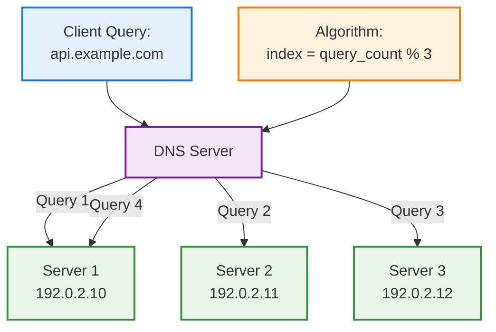

_Round robin distributes queries evenly across all available servers_

#### 2. Weighted DNS:

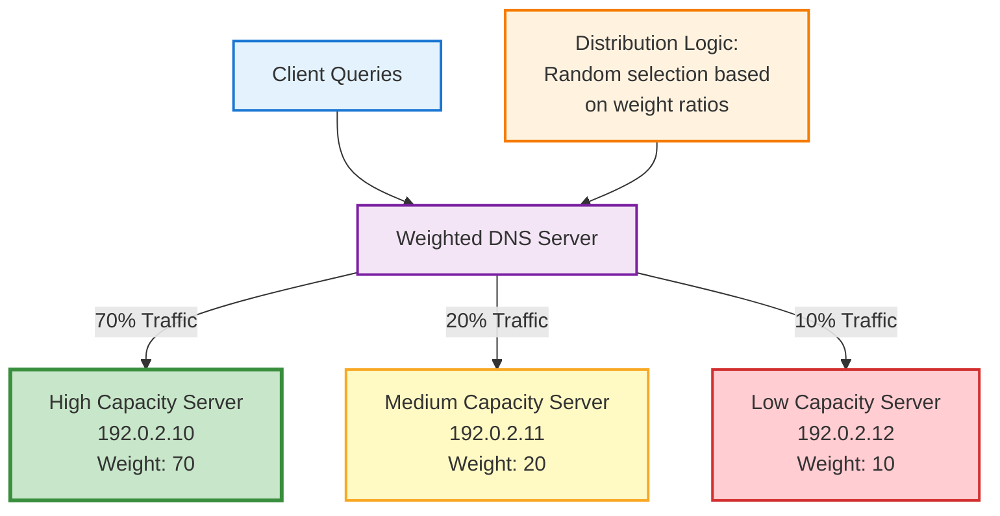

_Weighted DNS distributes traffic based on server capacity and performance_

#### 3. Geolocation DNS:

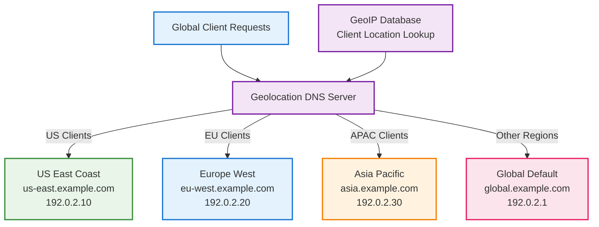

_Geolocation DNS routes users to the closest regional server for optimal performance_

---

## 💾 DNS Caching Mechanisms

### DNS Cache Hierarchy:

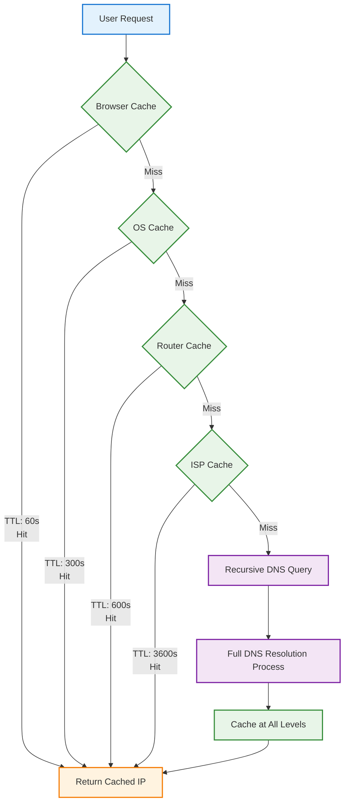

_Multi-layer caching reduces DNS query latency and server load_

### TTL (Time To Live) Strategy:

#### TTL Values by Record Type:

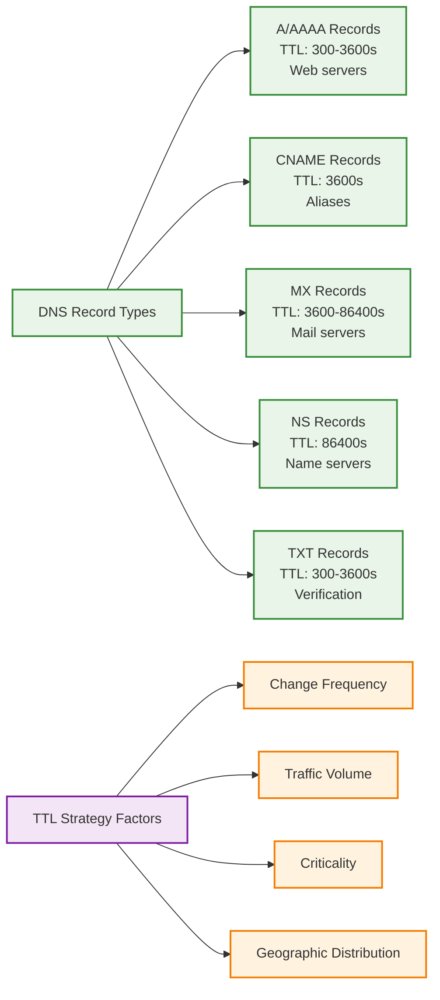

_TTL values balance between performance and flexibility for different DNS record types_

#### Dynamic TTL Management:

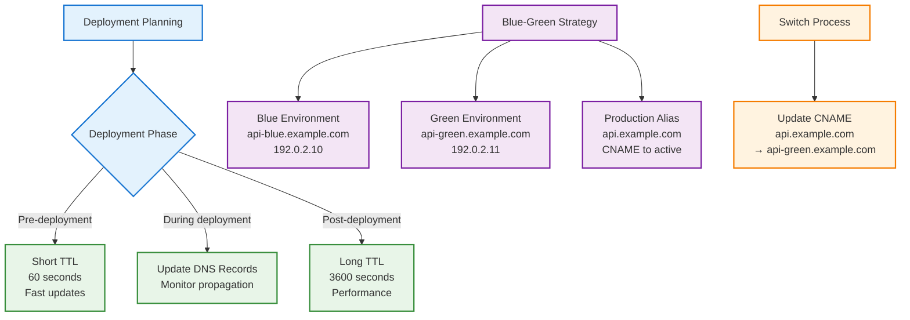

_Dynamic TTL management enables safe deployments with minimal downtime_

### Cache Invalidation Strategies:

#### 1. TTL Expiration & Cache Protection:

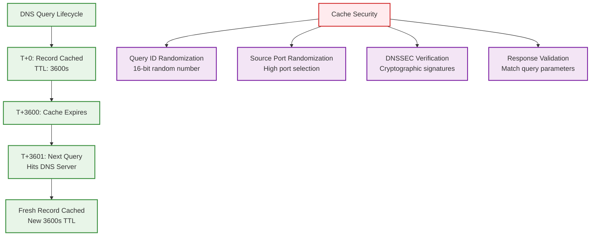

_Natural cache expiration and security measures protect against DNS attacks_

---

## 🏗️ DNS in System Design

### 1. Microservices Service Discovery:

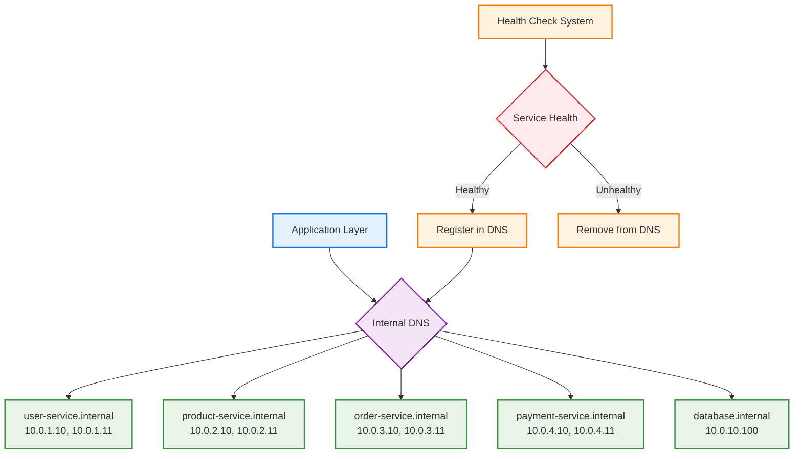

_DNS-based service discovery enables dynamic microservices communication_

### 2. Multi-Region DNS Setup:

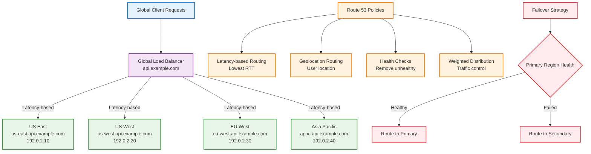

_Multi-region DNS setup provides global load distribution and disaster recovery_

### 3. CDN DNS Integration:

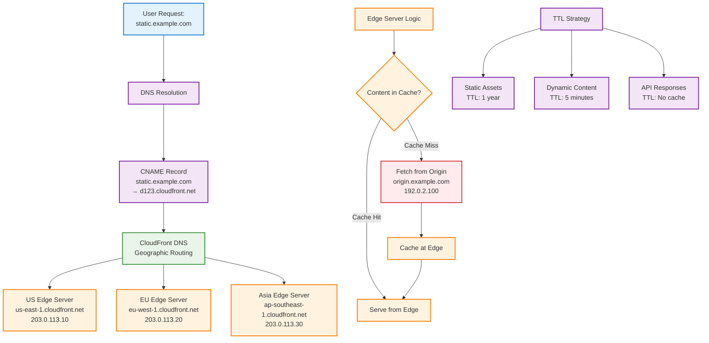

_DNS-CDN integration provides global content delivery with intelligent edge routing_

### 4. Database DNS Patterns:

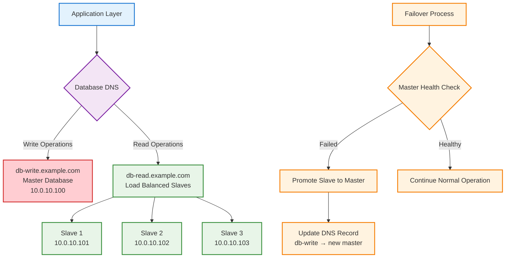

_DNS-based database routing separates read and write operations for optimal performance_

---

## ⚖️ DNS Load Balancing

### DNS-Based Load Balancing Methods:

#### 1. Round Robin:

```mermaid
graph TD
    A[DNS Zone Configuration] --> B[Multiple A Records<br/>www.example.com]

    B --> C[192.0.2.10<br/>Server 1]
    B --> D[192.0.2.11<br/>Server 2]
    B --> E[192.0.2.12<br/>Server 3]

    F[Query Rotation] --> G[Query 1: Return<br/>[192.0.2.10, 192.0.2.11, 192.0.2.12]]
    F --> H[Query 2: Return<br/>[192.0.2.11, 192.0.2.12, 192.0.2.10]]
    F --> I[Query 3: Return<br/>[192.0.2.12, 192.0.2.10, 192.0.2.11]]

    classDef config fill:#e3f2fd,stroke:#1976d2,stroke-width:2px
    classDef records fill:#f3e5f5,stroke:#7b1fa2,stroke-width:2px
    classDef servers fill:#e8f5e8,stroke:#388e3c,stroke-width:2px
    classDef rotation fill:#fff3e0,stroke:#f57c00,stroke-width:2px

    class A config
    class B records
    class C,D,E servers
    class F,G,H,I rotation
```

_DNS round robin rotates server order to distribute load evenly_

#### 2. Geographic Load Balancing:

```mermaid
graph TD
    A[Global DNS Request] --> B[Route 53 Geolocation]

    B -->|North America| C[us-servers.example.com<br/>192.0.2.10]
    B -->|Europe| D[eu-servers.example.com<br/>192.0.2.20]
    B -->|Asia Pacific| E[asia-servers.example.com<br/>192.0.2.30]
    B -->|Default/Other| F[global-servers.example.com<br/>192.0.2.1]

    G[Geographic Logic] --> H{Client Location}
    H -->|client_continent == "NA"| I[Return 192.0.2.10]
    H -->|client_continent == "EU"| J[Return 192.0.2.20]
    H -->|client_continent == "APAC"| K[Return 192.0.2.30]
    H -->|Other regions| L[Return 192.0.2.1]

    classDef global fill:#e3f2fd,stroke:#1976d2,stroke-width:2px
    classDef dns fill:#f3e5f5,stroke:#7b1fa2,stroke-width:2px
    classDef regional fill:#e8f5e8,stroke:#388e3c,stroke-width:2px
    classDef logic fill:#fff3e0,stroke:#f57c00,stroke-width:2px
    classDef decision fill:#ffebee,stroke:#d32f2f,stroke-width:2px

    class A global
    class B dns
    class C,D,E,F regional
    class G logic
    class H,I,J,K,L decision
```

_Geographic DNS routing directs users to their nearest regional servers_

#### 3. Health Check Integration:

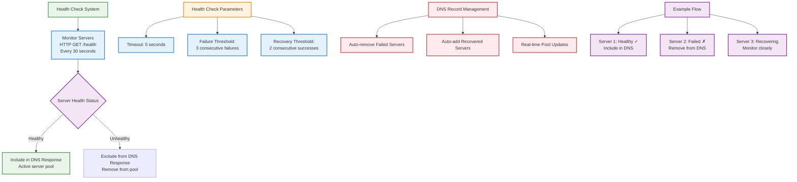

_Automated health checks ensure only healthy servers receive traffic_

#### 4. Weighted Traffic Distribution:

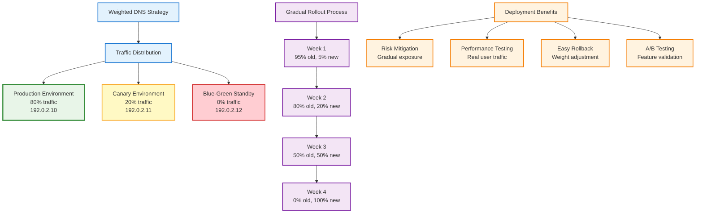

_Weighted DNS enables safe, gradual deployments with controlled traffic distribution_

### DNS Load Balancing Limitations:

#### 1. Caching Issues:

```mermaid
graph TD
    A[DNS Caching Problem] --> B[DNS Response Cached<br/>at Multiple Levels]

    B --> C[Client Cache<br/>TTL: 60s]
    B --> D[ISP Cache<br/>TTL: 3600s]
    B --> E[Router Cache<br/>TTL: 600s]

    F[Impact on Load Balancing] --> G[Load Distribution<br/>Not Real-time]
    F --> H[Server Changes<br/>Slow Propagation]
    F --> I[Failover Delays<br/>Cached stale data]

    J[TTL Trade-offs] --> K[TTL: 3600s<br/>Changes take 1 hour<br/>Low DNS load]
    J --> L[TTL: 60s<br/>Changes take 1 minute<br/>Medium DNS load]
    J --> M[TTL: 0s<br/>No caching<br/>High DNS load]

    N[Solutions] --> O[Dynamic TTL Management]
    N --> P[Health Check Integration]
    N --> Q[Application Load Balancing]
    N --> R[Multiple DNS Providers]

    classDef problem fill:#ffebee,stroke:#d32f2f,stroke-width:2px
    classDef cache fill:#e3f2fd,stroke:#1976d2,stroke-width:2px
    classDef impact fill:#fff3e0,stroke:#f57c00,stroke-width:2px
    classDef ttl fill:#f3e5f5,stroke:#7b1fa2,stroke-width:2px
    classDef solution fill:#e8f5e8,stroke:#388e3c,stroke-width:2px

    class A,F problem
    class B,C,D,E cache
    class G,H,I impact
    class J,K,L,M ttl
    class N,O,P,Q,R solution
```

_DNS caching creates challenges for real-time load balancing and failover_

#### 2. Client Behavior:

```mermaid
graph TD
    A[Client DNS Behavior Variations] --> B[Different Client Types]

    B --> C[Desktop Browsers<br/>Use first IP only<br/>Basic failover]
    B --> D[Mobile Apps<br/>Try all IPs on failure<br/>Aggressive retry]
    B --> E[Enterprise Clients<br/>Cache aggressively<br/>Slow DNS updates]
    B --> F[IoT Devices<br/>Limited DNS support<br/>Simple resolution]

    G[Behavioral Challenges] --> H[Uneven Load Distribution<br/>Some servers overloaded]
    G --> I[Inconsistent Failover<br/>Different retry patterns]
    G --> J[Cache Behavior<br/>Varied TTL respect]
    G --> K[Network Conditions<br/>DNS timeout handling]

    L[Solutions & Mitigations] --> M[Application Load Balancing<br/>Layer 7 distribution]
    L --> N[Health Check Monitoring<br/>Remove failed endpoints]
    L --> O[Multiple DNS Providers<br/>Redundancy and performance]
    L --> P[Client Configuration<br/>Optimal DNS settings]
    L --> Q[Hybrid Approach<br/>DNS + Application LB]

    classDef client fill:#e3f2fd,stroke:#1976d2,stroke-width:2px
    classDef browser fill:#e8f5e8,stroke:#388e3c,stroke-width:2px
    classDef mobile fill:#fff9c4,stroke:#f9a825,stroke-width:2px
    classDef enterprise fill:#f3e5f5,stroke:#7b1fa2,stroke-width:2px
    classDef iot fill:#ffcdd2,stroke:#d32f2f,stroke-width:2px
    classDef challenge fill:#ffebee,stroke:#d32f2f,stroke-width:2px
    classDef solution fill:#c8e6c9,stroke:#388e3c,stroke-width:2px

    class A,B client
    class C browser
    class D mobile
    class E enterprise
    class F iot
    class G,H,I,J,K challenge
    class L,M,N,O,P,Q solution
```

_Different client behaviors require hybrid approaches for effective load balancing_

---

## 🔒 DNS Security & Performance

### DNS Security Threats:

#### 1. DNS Spoofing/Cache Poisoning:

```mermaid
graph TD
    A[DNS Cache Poisoning Attack] --> B[Attack Flow]

    B --> C[1. Attacker sends<br/>fake DNS response]
    C --> D[2. Response arrives before<br/>legitimate response]
    D --> E[3. Fake response cached<br/>by DNS server]
    E --> F[4. Future queries return<br/>malicious IP]

    G[Attack Example] --> H[Legitimate:<br/>bank.com → 192.0.2.100]
    G --> I[Poisoned:<br/>bank.com → 203.0.113.66<br/>attacker's server]

    J[Protection Mechanisms] --> K[DNSSEC<br/>Cryptographic verification]
    J --> L[Query Randomization<br/>Random query IDs]
    J --> M[Source Port Randomization<br/>Random high ports]
    J --> N[Response Validation<br/>Match query parameters]

    O[Attack Impact] --> P[Data Theft<br/>Stolen credentials]
    O --> Q[Malware Distribution<br/>Infected downloads]
    O --> R[Man-in-the-Middle<br/>Traffic interception]

    classDef attack fill:#ffebee,stroke:#d32f2f,stroke-width:2px
    classDef flow fill:#fff3e0,stroke:#f57c00,stroke-width:2px
    classDef example fill:#f3e5f5,stroke:#7b1fa2,stroke-width:2px
    classDef protection fill:#e8f5e8,stroke:#388e3c,stroke-width:2px
    classDef impact fill:#ffcdd2,stroke:#d32f2f,stroke-width:2px

    class A attack
    class B,C,D,E,F flow
    class G,H,I example
    class J,K,L,M,N protection
    class O,P,Q,R impact
```

_DNS cache poisoning redirects users to malicious servers by corrupting DNS responses_

#### 2. DNS Amplification DDoS:

```mermaid
graph TD
    A[DNS Amplification Attack] --> B[Attack Mechanism]

    B --> C[1. Attacker sends small<br/>DNS query: 60 bytes]
    C --> D[2. Spoofs source IP<br/>as victim's IP]
    D --> E[3. DNS server sends large<br/>response: 3000+ bytes]
    E --> F[4. Victim receives<br/>massive traffic]

    G[Amplification Factor] --> H[Input: 60 bytes query]
    G --> I[Output: 3000+ bytes response]
    G --> J[Amplification: 50x-100x]

    K[Attack Scale] --> L[Multiple DNS Servers<br/>Distributed attack]
    K --> M[Thousands of Queries<br/>Simultaneous requests]
    K --> N[Victim Overwhelmed<br/>Service disruption]

    O[Mitigation Strategies] --> P[Rate Limiting<br/>Queries per source]
    O --> Q[Response Rate Limiting<br/>RRL implementation]
    O --> R[BCP38<br/>Prevent IP spoofing]
    O --> S[Anycast<br/>Distribute attack load]
    O --> T[DDoS Protection<br/>Cloud-based filtering]

    classDef attack fill:#ffebee,stroke:#d32f2f,stroke-width:2px
    classDef mechanism fill:#fff3e0,stroke:#f57c00,stroke-width:2px
    classDef amplification fill:#f3e5f5,stroke:#7b1fa2,stroke-width:2px
    classDef scale fill:#ffcdd2,stroke:#d32f2f,stroke-width:2px
    classDef mitigation fill:#e8f5e8,stroke:#388e3c,stroke-width:2px

    class A attack
    class B,C,D,E,F mechanism
    class G,H,I,J amplification
    class K,L,M,N scale
    class O,P,Q,R,S,T mitigation
```

_DNS amplification attacks exploit the size difference between queries and responses for DDoS_

### DNSSEC (DNS Security Extensions):

#### How DNSSEC Works:

```mermaid
graph TD
    A[DNSSEC Chain of Trust] --> B[Hierarchical Signing]

    B --> C[Root Zone<br/>Signed by root key<br/>Trust anchor]
    C --> D[.com TLD Zone<br/>Signed by root<br/>Verified by root key]
    D --> E[example.com Zone<br/>Signed by .com<br/>Verified by .com key]
    E --> F[DNS Records<br/>Signed by example.com<br/>Verified by domain key]

    G[DNSSEC Record Types] --> H[RRSIG<br/>Resource record signature]
    G --> I[DNSKEY<br/>Public key for verification]
    G --> J[DS<br/>Delegation signer]
    G --> K[NSEC/NSEC3<br/>Authenticated denial]

    L[Verification Process] --> M[Client DNS Query<br/>example.com A?]
    M --> N[Response + RRSIG<br/>192.0.2.1 + signature]
    N --> O[Signature Verification<br/>Chain back to root]
    O --> P[Trust Validation<br/>Cryptographic proof]

    Q[Security Benefits] --> R[Prevents Cache Poisoning<br/>Cryptographic integrity]
    Q --> S[Authenticates Responses<br/>Verified origin]
    Q --> T[Prevents Man-in-Middle<br/>End-to-end security]

    classDef chain fill:#e3f2fd,stroke:#1976d2,stroke-width:2px
    classDef hierarchy fill:#e8f5e8,stroke:#388e3c,stroke-width:2px
    classDef records fill:#f3e5f5,stroke:#7b1fa2,stroke-width:2px
    classDef verification fill:#fff3e0,stroke:#f57c00,stroke-width:2px
    classDef security fill:#c8e6c9,stroke:#388e3c,stroke-width:2px

    class A,B chain
    class C,D,E,F hierarchy
    class G,H,I,J,K records
    class L,M,N,O,P verification
    class Q,R,S,T security
```

_DNSSEC provides cryptographic verification through a hierarchical chain of trust_

#### DNSSEC Record Types:

```
DNSSEC Records:
├── RRSIG: Digital signature of record set
├── DNSKEY: Public key for zone
├── DS: Hash of child zone's public key
├── NSEC: Proves non-existence of records
└── NSEC3: Hashed version of NSEC

Example:
example.com.  IN  A      192.0.2.1
example.com.  IN  RRSIG  A 8 2 3600 20241130000000...
```

### DNS Performance Optimization:

#### 1. Anycast DNS:

```
Anycast Implementation:
├── Same IP announced from multiple locations
├── BGP routes to closest server
├── Reduces latency and improves reliability
└── Load distribution across servers

Global Anycast Network:
8.8.8.8 announced from:
├── US-East, US-West, US-Central
├── Europe-West, Europe-East
├── Asia-Pacific locations
└── 50+ edge locations worldwide
```

#### 2. DNS Caching Strategy:

```
Multi-Layer Caching:
Browser (60s) → OS (300s) → Router (600s) → ISP (3600s)

Cache Optimization:
├── Prefetch: Load DNS before needed
├── Keep-alive: Refresh before expiry
├── Negative caching: Cache NXDOMAIN responses
└── Intelligent TTL: Dynamic based on change frequency
```

#### 3. DNS Query Optimization:

```
Query Optimization Techniques:
├── DNS over HTTPS (DoH): Encrypted queries
├── DNS over TLS (DoT): Encrypted transport
├── Parallel queries: Query multiple servers
├── Happy Eyeballs: IPv4/IPv6 dual stack
└── Connection pooling: Reuse connections

Performance Metrics:
├── Query latency: < 50ms target
├── Cache hit ratio: > 80% target
├── Availability: 99.99% uptime
└── Resolution success rate: > 99.9%
```

---

## ❓ Common Interview Questions

### Q1: "How would you design a global DNS system for a social media platform?"

**Answer Framework:**

```
Requirements Analysis:
├── Global scale: Billions of users
├── Low latency: < 100ms DNS resolution
├── High availability: 99.99% uptime
├── Geographic distribution: Multi-region
└── Security: DDoS protection, DNSSEC

Nameserver Architecture:
┌─────────────────────────────────────────────────────────┐
│              Global DNS Nameserver Design              │
├─────────────────────────────────────────────────────────┤
│ Authoritative Nameservers:                             │
│ ├── Primary: ns1.social.com (us-east-1)               │
│ ├── Secondary: ns2.social.com (us-west-2)             │
│ ├── Geographic: ns3.social.com (eu-west-1)            │
│ ├── Anycast: ns4.social.com (20+ locations)           │
│ └── Hidden Master: internal.ns.social.com             │
│                                                         │
│ Resolver Strategy:                                      │
│ ├── Public Resolvers: 8.8.8.8, 1.1.1.1 integration   │
│ ├── ISP Resolvers: Regional performance optimization   │
│ ├── Enterprise: Custom resolvers for large clients    │
│ └── Mobile: Optimized for cellular networks           │
│                                                         │
│ DNS Record Structure:                                   │
│ ├── A/AAAA: api.social.com → Geographic IPs           │
│ ├── CNAME: cdn.social.com → CloudFront                │
│ ├── SRV: _websocket._tcp → Real-time services         │
│ ├── MX: mail.social.com → Email infrastructure        │
│ ├── TXT: SPF/DKIM/DMARC + domain verification         │
│ ├── CAA: Certificate authority restrictions            │
│ └── NS: Subdomain delegation to services              │
└─────────────────────────────────────────────────────────┘

Nameserver Configuration:
Primary Zone (social.com):
├── SOA: ns1.social.com admin.social.com 2024110601...
├── NS Records: ns1-4.social.com (authoritative servers)
├── A Records: Load-balanced application servers
├── AAAA Records: IPv6 support for global reach
├── CNAME Records: Service aliases and CDN integration
├── MX Records: Email service routing
├── SRV Records: Service discovery for microservices
├── TXT Records: Security policies and verification
└── CAA Records: SSL certificate authority control

Resolver Integration:
├── Anycast deployment for global resolver presence
├── Recursive resolver partnerships with major ISPs
├── Custom resolver APIs for mobile applications
├── DNS-over-HTTPS support for privacy
├── DNSSEC validation for security
└── Geographic resolver distribution
```

```

### Q2: "Explain DNS caching and its impact on system design"

**Answer:**

```

DNS Caching Levels:

1. Browser: 60s TTL, immediate response
2. OS: 300s TTL, system-wide cache
3. Router: 600s TTL, network cache
4. ISP: 3600s TTL, regional cache

Impact on System Design:
├── Positive: Reduced latency, lower DNS load
├── Negative: Stale data, slow failover
├── Solution: TTL tuning, health checks
└── Monitoring: Cache hit rates, resolution time

Deployment Considerations:
├── Pre-deployment: Lower TTL (60s)
├── During deployment: Quick DNS updates
├── Post-deployment: Normal TTL (3600s)
└── Emergency: DNS-based traffic shifting

```

### Q3: "How do you handle DNS failover in a multi-region setup?"

**Answer:**

```

DNS Failover Strategy:
Primary Region: us-east-1 (192.0.2.10)
Secondary Region: us-west-2 (192.0.2.20)
Tertiary Region: eu-west-1 (192.0.2.30)

Health Check Configuration:
├── HTTP health checks every 30s
├── Multiple check locations (5+ regions)
├── Failure threshold: 3 consecutive failures
├── Recovery threshold: 2 consecutive successes
└── Automatic DNS record updates

Failover Flow:

1. Primary region fails health checks
2. DNS automatically removes primary from rotation
3. Traffic routes to healthy secondary region
4. Application maintains state via database replication
5. When primary recovers, gradually shift traffic back

```

### Q4: "Design DNS for a microservices architecture"

**Answer:**

```

Service Discovery DNS Pattern:
Internal DNS Zone: services.internal

Service Registration:
├── user-service.services.internal → 10.0.1.{10,11,12}
├── order-service.services.internal → 10.0.2.{10,11,12}
├── payment-service.services.internal → 10.0.3.{10,11,12}
└── notification-service.services.internal → 10.0.4.{10,11,12}

Implementation:

1. Service mesh (Consul/Istio) manages DNS records
2. Health checks auto-register/deregister services
3. Load balancing via DNS round-robin
4. Circuit breakers handle service failures
5. Canary deployments via weighted DNS

External DNS:
├── api.example.com → API Gateway (public)
├── app.example.com → Frontend (CDN)
└── admin.example.com → Admin interface (restricted)

```

### Q5: "Walk me through what happens when you type 'google.com' in your browser"

**Answer Framework:**

```

Step-by-Step DNS Resolution:

1. Browser Cache Check:
   ├── Browser checks internal DNS cache
   ├── If found: Use cached IP (google.com → 142.250.185.14)
   └── If not: Proceed to step 2

2. Operating System Cache:
   ├── OS checks system DNS cache (/etc/hosts, DNS cache)
   ├── If found: Return cached result
   └── If not: Query configured DNS server

3. Router DNS Query:
   ├── Query home router's DNS cache
   ├── Router may have cached result from previous queries
   └── If not: Forward to ISP's DNS server

4. ISP Recursive DNS Server:
   ├── Query ISP's DNS server (e.g., 8.8.8.8)
   ├── Server checks its cache first
   └── If not cached: Start recursive resolution

5. Root DNS Server Query:
   ├── Query: "Where can I find .com domains?"
   ├── Root server responds with .com TLD server IPs
   └── 13 root servers worldwide (a.root-servers.net, etc.)

6. TLD (.com) Server Query:
   ├── Query: "Where can I find google.com?"
   ├── .com server responds with Google's authoritative DNS servers
   └── Returns: ns1.google.com, ns2.google.com, etc.

7. Authoritative DNS Query:
   ├── Query Google's DNS: "What's the IP for google.com?"
   ├── Google's DNS responds: "142.250.185.14"
   └── Includes TTL information for caching

8. Response Propagation:
   ├── ISP caches result (TTL: 300s)
   ├── Router caches result
   ├── OS caches result
   ├── Browser caches result
   └── Browser initiates HTTP connection to 142.250.185.14

Total Time: ~20-100ms for DNS resolution

```

### Q6: "How would you implement DNS-based load balancing for a video streaming service?"

**Answer:**

```

Video Streaming DNS Strategy:

Requirements:
├── Global CDN distribution
├── Low latency for video delivery
├── High availability (99.99%)
├── Bandwidth optimization
└── Regional content compliance

DNS Architecture:
┌─────────────────────────────────────────────────────────┐
│ video.netflix.com DNS Resolution Strategy │
├─────────────────────────────────────────────────────────┤
│ Geographic Routing: │
│ ├── US-East: us-east.video.netflix.com │
│ ├── US-West: us-west.video.netflix.com │
│ ├── EU: eu.video.netflix.com │
│ ├── Asia: asia.video.netflix.com │
│ └── Latin America: latam.video.netflix.com │
│ │
│ CDN Integration: │
│ ├── Edge servers return nearest CDN node │
│ ├── Health checks remove overloaded nodes │
│ ├── Weighted routing for A/B testing │
│ └── Low TTL (60s) for quick failover │
└─────────────────────────────────────────────────────────┘

Implementation Details:

1. Geolocation-based routing to nearest region
2. Health checks every 10s for video servers
3. Weighted routing: 70% primary CDN, 30% backup
4. Anycast for DNS servers themselves
5. DNSSEC for security against hijacking

```

### Q7: "Explain the difference between recursive and iterative DNS queries with examples"

**Answer:**

```

Recursive DNS Query:
Client: "Hey DNS server, give me the IP for example.com"
DNS Server: "Sure, I'll find it for you and return the final answer"

Process:
├── Client sends one query
├── DNS server does all the work
├── Server queries root, TLD, authoritative servers
├── Server returns final IP to client
└── Client gets complete answer

Example Flow:
Client → Recursive DNS → Root → TLD → Authoritative
Client ← Recursive DNS ← ← ← ← (Final answer)

Iterative DNS Query:
Client: "Where can I find example.com?"
DNS Server: "I don't know, but try these root servers"

Process:
├── Client sends multiple queries
├── Each server gives partial answer or referral
├── Client follows referrals step by step
├── Client eventually gets final answer
└── More network overhead for client

Example Flow:
Client → Root DNS: "example.com?" → "Try .com servers"
Client → .com TLD: "example.com?" → "Try example.com servers"
Client → Authoritative: "example.com?" → "192.0.2.1"

When to Use:
├── Recursive: End-user devices, simpler implementation
├── Iterative: DNS servers talking to each other
├── Hybrid: Most real-world implementations
└── Performance: Recursive reduces client complexity

````

### Q8: "Design a DNS infrastructure with proper nameserver and resolver architecture for a financial services company"

**Answer:**

```mermaid
graph TD
    A[Financial Services DNS Architecture] --> B[Authoritative Nameserver Layer]
    A --> C[Recursive Resolver Layer]
    A --> D[Security & Compliance Layer]

    B --> E[Primary Nameserver<br/>ns1.finbank.com<br/>On-premises master]
    B --> F[Secondary Nameservers<br/>ns2-4.finbank.com<br/>Multi-region slaves]
    B --> G[Hidden Master<br/>internal.ns.finbank.com<br/>Stealth configuration]
    B --> H[External Hosting<br/>Route 53 backup<br/>Disaster recovery]

    C --> I[Internal Resolvers<br/>10.0.0.53<br/>Corporate network]
    C --> J[DMZ Resolvers<br/>192.168.1.53<br/>Public-facing services]
    C --> K[Branch Office<br/>Site-specific resolvers<br/>WAN optimization]
    C --> L[Cloud Resolvers<br/>AWS/Azure DNS<br/>Hybrid cloud support]

    D --> M[DNSSEC Implementation<br/>Full chain validation<br/>Zone signing]
    D --> N[DNS Filtering<br/>Malware protection<br/>Policy enforcement]
    D --> O[Audit Logging<br/>Compliance tracking<br/>Query analytics]
    D --> P[Redundancy<br/>99.99% availability<br/>Disaster recovery]

    classDef nameserver fill:#e8f5e8,stroke:#388e3c,stroke-width:2px
    classDef resolver fill:#e3f2fd,stroke:#1976d2,stroke-width:2px
    classDef security fill:#ffebee,stroke:#d32f2f,stroke-width:2px
    classDef main fill:#f3e5f5,stroke:#7b1fa2,stroke-width:2px

    class A main
    class B,E,F,G,H nameserver
    class C,I,J,K,L resolver
    class D,M,N,O,P security
````

**Architecture Components:**

**Authoritative Nameserver Design:**

```
Zone Configuration (finbank.com):
├── SOA Record:
│   ├── Primary: ns1.finbank.com
│   ├── Admin: dns-admin@finbank.com
│   ├── Serial: 2024110601 (automated increment)
│   ├── Refresh: 3600s (1 hour)
│   ├── Retry: 900s (15 minutes)
│   ├── Expire: 604800s (1 week)
│   └── Minimum: 300s (5 minutes)
│
├── NS Records:
│   ├── ns1.finbank.com (192.0.2.10) - Primary
│   ├── ns2.finbank.com (198.51.100.10) - Secondary
│   ├── ns3.finbank.com (203.0.113.10) - Geographic
│   └── ns4.finbank.com (AWS Route 53) - Cloud backup
│
├── Critical Service Records:
│   ├── www.finbank.com → Load-balanced web servers
│   ├── api.finbank.com → API gateway cluster
│   ├── mobile.finbank.com → Mobile app backends
│   ├── portal.finbank.com → Customer portal
│   └── admin.finbank.com → Internal management
│
├── Security Records:
│   ├── TXT: SPF, DKIM, DMARC for email security
│   ├── CAA: Certificate authority authorization
│   ├── TXT: Domain ownership verification
│   └── DNSSEC: Complete chain of trust
│
└── Compliance Records:
    ├── Audit trails for all DNS changes
    ├── Change management integration
    ├── Regulatory reporting automation
    └── Disaster recovery procedures
```

**Recursive Resolver Strategy:**

```
Internal Resolver Configuration:
├── Primary Function: Corporate name resolution
├── Forwarders: Conditional forwarding setup
│   ├── Internal domains: Local authoritative servers
│   ├── Partner domains: Direct authoritative queries
│   ├── Public domains: Secure public resolvers
│   └── Blocked domains: Security policy enforcement
│
├── Security Features:
│   ├── DNS filtering: Malware/phishing protection
│   ├── Policy enforcement: Content category blocking
│   ├── Threat intelligence: Real-time feed integration
│   └── Query logging: Full audit trail
│
├── Performance Optimization:
│   ├── Caching strategy: Intelligent TTL management
│   ├── Prefetching: Proactive cache warming
│   ├── Load balancing: Multiple resolver instances
│   └── Geographic distribution: Branch office support
│
└── High Availability:
    ├── Redundant resolver pairs
    ├── Health monitoring and failover
    ├── Cross-site replication
    └── Disaster recovery procedures

External Resolver Integration:
├── Public DNS Services:
│   ├── Primary: Cloudflare (1.1.1.1) - Privacy focused
│   ├── Secondary: Quad9 (9.9.9.9) - Security focused
│   ├── Tertiary: Google (8.8.8.8) - Performance
│   └── Enterprise: Custom enterprise resolvers
│
├── DNS over HTTPS/TLS:
│   ├── Encrypted queries for sensitive lookups
│   ├── Certificate validation
│   ├── Performance monitoring
│   └── Fallback to traditional DNS
│
└── Cloud Integration:
    ├── AWS Route 53 Resolver
    ├── Azure Private DNS
    ├── Hybrid cloud DNS routing
    └── Multi-cloud disaster recovery
```

**Implementation Strategy:**

```
Phase 1: Infrastructure Setup
├── Deploy primary authoritative nameserver
├── Configure secondary nameservers
├── Implement DNSSEC signing
├── Set up monitoring and alerting
└── Establish change management process

Phase 2: Resolver Deployment
├── Install internal recursive resolvers
├── Configure security policies
├── Implement DNS filtering
├── Set up query logging
└── Test failover scenarios

Phase 3: Integration & Testing
├── Integrate with Active Directory
├── Configure conditional forwarding
├── Implement split-horizon DNS
├── Conduct disaster recovery tests
└── Train operations team

Phase 4: Monitoring & Optimization
├── Implement comprehensive monitoring
├── Set up performance analytics
├── Configure automated alerts
├── Optimize cache hit ratios
└── Regular security assessments

Compliance Requirements:
├── PCI DSS: Secure DNS infrastructure
├── SOX: Change control and audit trails
├── GDPR: Privacy-compliant DNS logging
├── SOC 2: Security monitoring and controls
└── Industry standards: Best practice implementation
```

### Q9: "How do you handle DNS during a zero-downtime deployment?"

**Answer:**

```
Zero-Downtime DNS Strategy:

Pre-Deployment Phase:
1. Lower TTL values from 3600s to 60s
2. Wait for TTL expiration (up to 1 hour)
3. Prepare new infrastructure in parallel
4. Set up health checks for new servers

Deployment Phase:
├── Blue-Green Deployment:
│   ├── Blue: api-blue.example.com (current)
│   ├── Green: api-green.example.com (new)
│   ├── Alias: api.example.com → api-blue.example.com
│   └── Switch: Update alias to api-green.example.com
│
├── Weighted Routing:
│   ├── Week 1: 95% old, 5% new (canary)
│   ├── Week 2: 80% old, 20% new
│   ├── Week 3: 50% old, 50% new
│   └── Week 4: 0% old, 100% new
│
└── Health Check Integration:
    ├── Continuous monitoring of all endpoints
    ├── Automatic removal of unhealthy servers
    ├── Gradual traffic shifting based on metrics
    └── Instant rollback capability

Post-Deployment:
1. Monitor metrics for 24-48 hours
2. Gradually increase TTL back to 3600s
3. Decommission old infrastructure
4. Update documentation and runbooks

Emergency Rollback:
├── Instant DNS switch back to previous version
├── TTL of 60s enables quick propagation
├── Health checks detect issues automatically
└── Automated alerts and notifications
```

### Q9: "Design DNS infrastructure for a global e-commerce platform like Amazon"

**Answer:**

```
Global E-commerce DNS Architecture:

Requirements:
├── 99.99% availability SLA
├── < 50ms DNS resolution globally
├── Handle 1M+ queries per second
├── Support seasonal traffic spikes (Black Friday)
├── Multi-region disaster recovery
└── Security against DNS attacks

Architecture Design:
┌─────────────────────────────────────────────────────────┐
│              Global DNS Infrastructure                  │
├─────────────────────────────────────────────────────────┤
│ Anycast DNS Network:                                    │
│ ├── 50+ edge locations worldwide                       │
│ ├── Route 53 + CloudFlare redundancy                   │
│ ├── DNSSEC enabled for all zones                       │
│ └── DDoS protection (10+ Tbps capacity)                │
│                                                         │
│ Domain Structure:                                       │
│ ├── www.amazon.com → Geographic load balancing         │
│ ├── api.amazon.com → Service-specific routing          │
│ ├── cdn.amazon.com → CloudFront integration            │
│ ├── m.amazon.com → Mobile-optimized servers            │
│ └── payments.amazon.com → PCI-compliant infrastructure │
│                                                         │
│ Traffic Management:                                     │
│ ├── Latency-based routing for optimal performance      │
│ ├── Weighted routing for gradual deployments           │
│ ├── Health checks with 5-second intervals              │
│ ├── Geolocation routing for compliance                 │
│ └── Failover routing for disaster recovery             │
└─────────────────────────────────────────────────────────┘

Implementation Strategy:
1. Multi-provider DNS (Route 53 + CloudFlare)
2. Separate zones for different services
3. Progressive deployment with DNS weighting
4. Real-time monitoring and alerting
5. Automated failover with health checks
6. CDN integration for static assets
7. Database read replica routing via DNS
8. API versioning through DNS subdomains
```

### Q10: "How do you troubleshoot DNS performance issues in production?"

**Answer:**

```
DNS Performance Troubleshooting Methodology:

1. Identify the Problem:
├── Symptoms: Slow page loads, timeouts, connection errors
├── Scope: Specific regions, all users, certain domains
├── Timing: When did it start, frequency, patterns
└── Impact: User experience, business metrics

2. Initial Investigation:
Commands to run:
├── dig +trace example.com (full resolution path)
├── dig @8.8.8.8 example.com (test specific DNS server)
├── nslookup example.com (basic lookup)
├── host -t any example.com (all record types)
└── ping example.com (basic connectivity)

3. Performance Analysis:
├── Query Response Time:
│   ├── < 50ms: Good
│   ├── 50-200ms: Acceptable
│   ├── > 200ms: Investigate
│   └── > 1000ms: Critical issue
│
├── Cache Hit Ratio:
│   ├── > 90%: Excellent
│   ├── 80-90%: Good
│   ├── < 80%: Needs optimization
│   └── TTL tuning required
│
└── Geographic Performance:
    ├── Test from multiple regions
    ├── Check anycast routing
    ├── Verify edge server health
    └── Analyze traffic patterns

4. Common Issues & Solutions:
├── High Query Latency:
│   ├── Check DNS server load
│   ├── Verify anycast routing
│   ├── Optimize DNS record structure
│   └── Consider additional DNS providers
│
├── DNS Resolution Failures:
│   ├── Check authoritative servers
│   ├── Verify DNS delegation
│   ├── Test DNSSEC validation
│   └── Check firewall rules
│
├── Cache Misses:
│   ├── Analyze TTL values
│   ├── Check for record changes
│   ├── Verify cache configuration
│   └── Monitor cache statistics
│
└── Regional Issues:
    ├── Test from affected regions
    ├── Check BGP routing
    ├── Verify local DNS servers
    └── Analyze ISP-specific issues

5. Monitoring & Alerting:
├── Set up synthetic monitoring
├── Track DNS resolution times
├── Monitor cache hit ratios
├── Alert on resolution failures
├── Geographic performance tracking
└── Real user monitoring (RUM)

Tools & Services:
├── DNS Monitoring: Pingdom, DataDog, New Relic
├── Analysis Tools: dig, nslookup, host, dnsperf
├── Global Testing: whatsmydns.net, dnschecker.org
├── Performance Testing: dnsperf, queryperf
└── Visualization: Grafana dashboards
```

### Q11: "Explain DNS security threats and how to mitigate them"

**Answer:**

```
DNS Security Threats & Mitigations:

1. DNS Cache Poisoning:
Threat:
├── Attacker injects false DNS responses
├── Malicious IP cached by DNS servers
├── Users redirected to attacker's servers
└── Data theft, malware distribution

Attack Example:
└── bank.com → 192.0.2.100 (legitimate)
└── bank.com → 203.0.113.66 (attacker's fake server)

Mitigation:
├── DNSSEC: Cryptographic signatures
├── Source port randomization
├── Query ID randomization
├── Response validation
└── Use trusted DNS resolvers

2. DNS Amplification DDoS:
Threat:
├── Small query (60 bytes) → Large response (3000+ bytes)
├── Attacker spoofs victim's IP as source
├── DNS servers flood victim with responses
└── 50x-100x amplification factor

Mitigation:
├── Rate limiting on DNS servers
├── Response Rate Limiting (RRL)
├── BCP38 implementation (prevent IP spoofing)
├── Anycast distribution
├── DDoS protection services
└── Monitor for unusual query patterns

3. DNS Tunneling:
Threat:
├── Malware uses DNS queries to exfiltrate data
├── Encodes data in DNS query names
├── Bypasses firewall restrictions
└── Command & control communication

Example:
└── secretdata.malware.com (data hidden in subdomain)

Mitigation:
├── Monitor DNS query patterns
├── Block suspicious domain patterns
├── DNS filtering solutions
├── Network behavior analysis
├── Restrict DNS servers
└── Monitor query volume per client

4. Domain Hijacking:
Threat:
├── Attacker gains control of domain registration
├── Changes DNS records to malicious servers
├── Complete control over domain traffic
└── Brand damage, data theft

Mitigation:
├── Domain registrar security (2FA, registry lock)
├── Monitor DNS record changes
├── DNSSEC implementation
├── Regular security audits
├── Backup DNS providers
└── Emergency response procedures

Security Implementation:
┌─────────────────────────────────────────────────────────┐
│                DNS Security Architecture                │
├─────────────────────────────────────────────────────────┤
│ DNSSEC Chain of Trust:                                  │
│ ├── Root zone signed with root key                     │
│ ├── TLD zones signed and verified                      │
│ ├── Domain zones signed with domain keys               │
│ └── Records signed with zone keys                      │
│                                                         │
│ Protection Layers:                                      │
│ ├── Authoritative DNS: DNSSEC, rate limiting           │
│ ├── Recursive DNS: Validation, filtering               │
│ ├── Network: DDoS protection, monitoring               │
│ ├── Client: Trusted resolvers, HTTPS/TLS               │
│ └── Monitoring: Anomaly detection, alerting            │
└─────────────────────────────────────────────────────────┘
```

### Q12: "How does DNS work with CDN for global content delivery?"

**Answer:**

```
DNS + CDN Integration Architecture:

Content Delivery Flow:
1. User requests: video.netflix.com
2. DNS resolution process begins
3. Geographic routing determines user location
4. DNS returns nearest CDN edge server IP
5. User connects to optimal edge server
6. Content served from cache or fetched from origin

DNS-CDN Integration Pattern:
┌─────────────────────────────────────────────────────────┐
│              DNS-CDN Integration                        │
├─────────────────────────────────────────────────────────┤
│ 1. Origin Configuration:                                │
│    ├── origin.example.com → 192.0.2.100               │
│    └── Primary content servers                         │
│                                                         │
│ 2. CDN CNAME Setup:                                     │
│    ├── static.example.com → d123.cloudfront.net       │
│    ├── images.example.com → img-cdn.example.com       │
│    └── videos.example.com → video-cdn.example.com     │
│                                                         │
│ 3. Geographic DNS Routing:                              │
│    ├── US users → us-cdn.example.com                  │
│    ├── EU users → eu-cdn.example.com                  │
│    ├── Asia users → asia-cdn.example.com              │
│    └── Default → global-cdn.example.com               │
│                                                         │
│ 4. Edge Server Selection:                               │
│    ├── Latency-based routing                           │
│    ├── Server load balancing                           │
│    ├── Health check integration                        │
│    └── Real-time optimization                          │
└─────────────────────────────────────────────────────────┘

Advanced CDN-DNS Strategies:

1. Multi-CDN Setup:
├── Primary CDN: CloudFront (70% traffic)
├── Secondary CDN: CloudFlare (30% traffic)
├── DNS health checks monitor CDN performance
├── Automatic failover between CDN providers
└── Geographic optimization per CDN

2. Content-Type Routing:
├── Static assets: static-cdn.example.com
├── Video content: video-cdn.example.com
├── API requests: api.example.com (no CDN)
├── User uploads: upload.example.com
└── Different CDN optimizations per content type

3. Performance Optimization:
├── DNS prefetch hints in HTML
├── HTTP/2 push for critical resources
├── Edge DNS servers co-located with CDN
├── Anycast DNS for fastest resolution
└── Real-time performance monitoring

4. Cache Strategy Integration:
├── DNS TTL aligns with CDN cache TTL
├── Purge both DNS and CDN caches together
├── Gradual cache warming strategies
├── Geographic cache distribution
└── Cache invalidation coordination

Real-World Example (Netflix):
1. netflix.com resolves to geographic load balancer
2. Load balancer returns nearest CDN cluster
3. CDN cluster has local DNS resolver
4. Content request routed to optimal server
5. Fallback to other CDN providers if needed
6. Real-time optimization based on performance
```

---

## 🔍 Troubleshooting & Monitoring

### DNS Monitoring Metrics:

#### Key Performance Indicators:

```
Response Time Metrics:
├── Query latency: Average DNS resolution time
├── Recursive resolution: Full resolution time
├── Cache hit ratio: Percentage of cached responses
└── Timeout rate: Failed resolution percentage

Availability Metrics:
├── Uptime: DNS server availability
├── Resolution success rate: Successful queries
├── Geographic performance: Regional latency
└── Error rates: NXDOMAIN, SERVFAIL responses
```

#### DNS Troubleshooting Commands:

```bash
# Basic DNS lookup
dig example.com A
nslookup example.com

# Trace DNS resolution path
dig +trace example.com

# Check specific record types
dig example.com MX
dig example.com AAAA
dig example.com TXT

# Test DNS server directly
dig @8.8.8.8 example.com
dig @1.1.1.1 example.com

# Reverse DNS lookup
dig -x 192.0.2.1

# Check DNSSEC validation
dig +dnssec example.com
```

### Common DNS Issues:

#### 1. DNS Propagation Delays:

```
Problem: DNS changes not visible globally
Cause: TTL values, caching at various levels
Solution:
├── Lower TTL before changes (pre-deployment)
├── Check propagation: whatsmydns.net
├── Clear local caches: ipconfig /flushdns
└── Wait for global propagation (up to 48 hours)
```

#### 2. Split-Brain DNS:

```
Problem: Different DNS responses internally vs externally
Example:
├── Internal: api.example.com → 10.0.1.100 (private)
├── External: api.example.com → 203.0.113.10 (public)
└── Cause: Misconfigured internal DNS zones

Solution: Consistent DNS zones or proper split-horizon
```

#### 3. DNS Load Balancing Issues:

```
Problem: Uneven traffic distribution
Causes:
├── Client DNS caching behavior
├── ISP DNS server caching
├── Some clients use only first IP
└── Geographic DNS server selection

Solutions:
├── Application-layer load balancing
├── Lower TTL values
├── Health check monitoring
└── Traffic analytics and adjustment
```

---

## 📚 Best Practices & Tools

### DNS Best Practices:

#### 1. TTL Strategy:

```
Record Type Guidelines:
├── A/AAAA: 300-3600s (web servers)
├── CNAME: 3600s (aliases, stable)
├── MX: 86400s (mail servers, rarely change)
├── NS: 86400s (name servers, very stable)
├── TXT: 300-3600s (verification, variable)
└── SRV: 600s (service discovery)

Deployment Strategy:
1. Pre-deployment: Reduce TTL to 300s
2. Make changes: Update DNS records
3. Monitor: Check propagation and health
4. Post-deployment: Restore normal TTL
```

#### 2. Security Hardening:

```
Security Checklist:
├── Enable DNSSEC for all zones
├── Use DDoS-resistant DNS providers
├── Implement DNS filtering (malware protection)
├── Monitor for DNS anomalies
├── Regular DNS audit and cleanup
├── Separate internal/external DNS zones
└── DNS over HTTPS/TLS for clients
```

#### 3. Performance Optimization:

```
Optimization Techniques:
├── Use anycast DNS providers
├── Implement intelligent DNS routing
├── Optimize record structure (avoid deep CNAMEs)
├── Pre-warm DNS caches
├── Monitor resolution performance
├── Use multiple DNS providers (redundancy)
└── Implement DNS prefetching
```

### DNS Tools & Services:

#### Cloud DNS Providers:

```
AWS Route 53:
├── Anycast network (edge locations)
├── Health checks and failover
├── Geographic and latency-based routing
├── Integration with AWS services
└── 100% SLA

Cloudflare DNS:
├── Global anycast network
├── DDoS protection included
├── DNS analytics and monitoring
├── Fast propagation (seconds)
└── Free tier available

Google Cloud DNS:
├── Global network infrastructure
├── DNSSEC support
├── High availability (100% SLA)
├── Integration with GCP
└── Competitive pricing
```

---

## 💡 Key Takeaways for Interviews

> **Remember for System Design Interviews:**
>
> 1. **DNS is critical infrastructure** - Design for high availability
> 2. **Understand nameserver hierarchy** - Root, TLD, authoritative, recursive
> 3. **Resolver strategy matters** - Public vs private, caching, security
> 4. **Record types serve different purposes** - A, AAAA, CNAME, MX, SRV, TXT, NS
> 5. **Caching implications** - TTL affects system behavior and performance
> 6. **Geographic distribution** - DNS routing affects user experience
> 7. **Security is paramount** - DNSSEC, DDoS protection, monitoring
> 8. **Service discovery** - DNS enables microservices communication
> 9. **Performance optimization** - Anycast, caching, health checks
> 10. **Monitoring & troubleshooting** - Essential for production systems

### Core DNS Components Summary:

```mermaid
graph TD
    A[DNS Infrastructure] --> B[Nameservers]
    A --> C[Resolvers]
    A --> D[Records]

    B --> E[Root Nameservers<br/>13 global servers<br/>Foundation of DNS]
    B --> F[TLD Nameservers<br/>.com, .org, .net<br/>Domain delegation]
    B --> G[Authoritative Nameservers<br/>Domain-specific<br/>Definitive answers]

    C --> H[Recursive Resolvers<br/>Full resolution service<br/>Client-facing]
    C --> I[Caching Resolvers<br/>Performance optimization<br/>TTL management]
    C --> J[Forwarding Resolvers<br/>Policy enforcement<br/>Security filtering]

    D --> K[Address Records<br/>A, AAAA<br/>IP mappings]
    D --> L[Delegation Records<br/>NS, CNAME<br/>Authority transfer]
    D --> M[Service Records<br/>MX, SRV, TXT<br/>Application support]

    classDef main fill:#f3e5f5,stroke:#7b1fa2,stroke-width:2px
    classDef nameserver fill:#e8f5e8,stroke:#388e3c,stroke-width:2px
    classDef resolver fill:#e3f2fd,stroke:#1976d2,stroke-width:2px
    classDef records fill:#fff3e0,stroke:#f57c00,stroke-width:2px

    class A main
    class B,E,F,G nameserver
    class C,H,I,J resolver
    class D,K,L,M records
```

### Architecture Integration Points:

```
DNS components integrate with:
├── Nameservers:
│   ├── Load Balancers: Health check integration
│   ├── CDN: Geographic server selection
│   ├── Cloud Providers: Managed DNS services
│   └── Monitoring: Uptime and performance tracking
├── Resolvers:
│   ├── Firewalls: Security policy enforcement
│   ├── Cache Systems: Performance optimization
│   ├── VPN: Split-tunnel DNS routing
│   └── Applications: Custom resolution logic
└── Records:
    ├── Microservices: Service discovery via SRV
    ├── Email Systems: MX record routing
    ├── Security: TXT records for verification
    └── SSL/TLS: CAA records for certificate control
```

### Interview Success Framework:

```
When designing DNS solutions, always consider:
1. Nameserver Architecture:
   ├── Primary/secondary configuration
   ├── Geographic distribution
   ├── Hidden master setup
   └── Disaster recovery planning

2. Resolver Strategy:
   ├── Internal vs external resolution
   ├── Caching and performance
   ├── Security and filtering
   └── High availability design

3. Record Management:
   ├── Appropriate record types
   ├── TTL optimization
   ├── Zone file organization
   └── DNSSEC implementation

4. Operational Excellence:
   ├── Monitoring and alerting
   ├── Change management
   ├── Disaster recovery
   └── Performance optimization
```

---
