# Load Balancer - Complete Guide

## 📋 Table of Contents

1. [What is a Load Balancer?](#what-is-a-load-balancer)
2. [Why Do We Need Load Balancers?](#why-do-we-need-load-balancers)
3. [How Load Balancers Work](#how-load-balancers-work)
4. [Types of Load Balancers](#types-of-load-balancers)
5. [Load Balancing Algorithms](#load-balancing-algorithms)
6. [Health Checks](#health-checks)
7. [Load Balancer Layers (OSI Model)](#load-balancer-layers)
8. [Session Persistence (Sticky Sessions)](#session-persistence)
9. [Real-World Examples](#real-world-examples)
10. [Advantages and Disadvantages](#advantages-and-disadvantages)
11. [Common Load Balancer Solutions](#common-load-balancer-solutions)
12. [Key Takeaways](#key-takeaways)

---

## 1. What is a Load Balancer?

A **load balancer** is a device or software application that distributes incoming network traffic across multiple servers. Think of it like a traffic cop directing cars to different lanes to prevent congestion.

### 🔹 Simple Analogy

Imagine a busy restaurant with multiple cashiers:

- Without load balancing: All customers line up at one cashier while others are idle
- With load balancing: A host directs customers evenly to all available cashiers


---

## 2. Why Do We Need Load Balancers?

### 🔹 High Availability

- If one server fails, the load balancer redirects traffic to healthy servers
- System remains operational even during server failures

### 🔹 Scalability

- Easily add or remove servers based on demand
- Handle traffic spikes during peak hours

### 🔹 Performance

- Distribute workload evenly prevents any single server from becoming a bottleneck
- Reduces response time for users

### 🔹 Maintenance

- Take servers offline for updates without downtime
- Gradual rollout of new features

### 🔹 Geographic Distribution

- Route users to nearest server for faster response
- Reduce latency

---

## 3. How Load Balancers Work

### 🔹 Basic Flow

1. **Client sends request** → Goes to load balancer (not directly to server)
2. **Load balancer evaluates** → Checks which servers are healthy
3. **Algorithm decides** → Selects best server using configured algorithm
4. **Request forwarded** → Sends request to chosen server
5. **Server responds** → Response goes back through load balancer to client

### 🔹 Example Scenario

**User wants to access <www.example.com>**

1. DNS resolves to load balancer IP: 203.0.113.10
2. Load balancer receives request
3. Checks: Server1 (healthy, 20% load), Server2 (healthy, 30% load), Server3 (unhealthy)
4. Forwards request to Server1 (lowest load)
5. Server1 processes and returns data
6. Load balancer sends response to user


---

## 4. Types of Load Balancers

### 🔹 Hardware Load Balancers

- Physical devices (e.g., F5, Citrix ADC)
- **Pros**: High performance, dedicated hardware
- **Cons**: Expensive, less flexible, requires physical space
- **Use case**: Large enterprises with high traffic

### 🔹 Software Load Balancers

- Applications running on standard servers (e.g., NGINX, HAProxy)
- **Pros**: Cost-effective, flexible, easy to scale
- **Cons**: Limited by server resources
- **Use case**: Startups, cloud-native applications

### 🔹 Cloud Load Balancers

- Managed services by cloud providers (e.g., AWS ELB, Google Cloud Load Balancer, Azure Load Balancer)
- **Pros**: Fully managed, auto-scaling, pay-as-you-go
- **Cons**: Vendor lock-in, recurring costs
- **Use case**: Cloud-based applications

### 🔹 Global Load Balancers (DNS Load Balancers)

- Route traffic based on geographic location
- Distribute load across data centers worldwide
- **Example**: Cloudflare, AWS Route 53

---

## 5. Load Balancing Algorithms

### 🔹 Round Robin

Distributes requests sequentially to each server in turn.


**When to use**: All servers have similar capacity
**Pros**: Simple, fair distribution  
**Cons**: Doesn't consider server load or capacity

### 🔹 Weighted Round Robin

Similar to Round Robin, but servers with higher weights receive more requests.


**When to use**: Servers have different capacities  
**Example**: New powerful server (weight 5), old server (weight 2)

### 🔹 Least Connections

Sends requests to the server with the fewest active connections.

```mermaid
graph TD
    NR[New Request] --> LB[Load Balancer]
    LB --> S1[Server 1<br/>10 connections]
    LB --> S2[Server 2<br/>5 connections ✓]
    LB --> S3[Server 3<br/>8 connections]

    style S2 fill:#90EE90
```



**When to use**: Long-lived connections (WebSockets, database connections)
**Pros**: Better for variable request duration  
**Cons**: Slightly more complex

### 🔹 Weighted Least Connections

Considers both connection count and server capacity.

### 🔹 IP Hash

Uses client's IP address to determine which server receives the request.

**Formula**: `hash(client_ip) % number_of_servers = server_index`

```mermaid
graph LR
    C1[Client<br/>IP: 192.168.1.10] -->|hash → Server 2| LB[Load Balancer]
    C2[Client<br/>IP: 192.168.1.25] -->|hash → Server 1| LB
    C3[Client<br/>IP: 192.168.1.50] -->|hash → Server 3| LB

    LB --> S1[Server 1]
    LB --> S2[Server 2]
    LB --> S3[Server 3]
```



**When to use**: Need session persistence
**Pros**: Same client always goes to same server  
**Cons**: Uneven distribution if few clients

### 🔹 Least Response Time

Routes to server with fastest response time and fewest connections.

**When to use**: Performance-critical applications
**Pros**: Optimizes user experience  
**Cons**: Requires monitoring overhead

### 🔹 Random

Selects a random server for each request.

**When to use**: Quick and simple setup
**Pros**: Easy to implement  
**Cons**: May not distribute evenly

---

## 6. Health Checks

Load balancers continuously monitor server health to avoid routing traffic to failed servers.

### 🔹 Types of Health Checks

#### Passive Health Checks

- Monitor actual traffic and mark server as unhealthy after consecutive failures
- No additional overhead
- Example: After 3 failed requests, mark server as down

#### Active Health Checks

- Load balancer actively sends test requests to servers
- Common checks:
  - **HTTP/HTTPS**: Request specific URL (e.g., `/health`)
  - **TCP**: Check if port is accepting connections
  - **Ping**: ICMP ping to check network connectivity

### 🔹 Configuration Example

```yaml
health_check:
  interval: 10s # Check every 10 seconds
  timeout: 3s # Wait 3 seconds for response
  healthy_threshold: 2 # 2 successful checks = healthy
  unhealthy_threshold: 3 # 3 failed checks = unhealthy
  path: /health # Endpoint to check
```

### 🔹 What Happens When Server Fails

1. Health check fails multiple times
2. Load balancer marks server as "unhealthy"
3. No new traffic sent to that server
4. Existing connections may be drained gracefully
5. Server continues being monitored
6. Once healthy again, traffic resumes

---

## 7. Load Balancer Layers (OSI Model)

### 🔹 Layer 4 (Transport Layer) Load Balancing

- Operates at TCP/UDP level
- Routes based on IP address and port
- **Faster** but less intelligent
- Cannot inspect HTTP headers or content


**Example Use Case**:

- Database load balancing
- General TCP/UDP traffic distribution

### 🔹 Layer 7 (Application Layer) Load Balancing

- Operates at HTTP/HTTPS level
- Can inspect request content (URLs, headers, cookies)
- **Slower** but more flexible


**Example Use Case**:


**Advanced Features**:

- SSL termination
- URL-based routing
- Header-based routing
- Content caching

### 🔹 Comparison

| Feature         | Layer 4      | Layer 7       |
| --------------- | ------------ | ------------- |
| Speed           | Faster       | Slower        |
| Cost            | Lower        | Higher        |
| Routing         | IP/Port only | Content-aware |
| SSL Termination | No           | Yes           |
| Caching         | No           | Yes           |

---

## 8. Session Persistence (Sticky Sessions)

### 🔹 The Problem

User logs in → Request 1 goes to Server 1 (session stored)  
Next request → Goes to Server 2 (no session data) → User appears logged out ❌


### 🔹 The Solution: Sticky Sessions

Ensure all requests from the same user go to the same server.

### 🔹 Implementation Methods

#### Cookie-Based

Load balancer inserts a cookie with server identifier.

```
Set-Cookie: SERVER_ID=server2
```

#### IP-Based

Use IP hash algorithm (same IP → same server)

#### Session ID Based

Parse application session ID and route accordingly

### 🔹 Trade-offs

**Pros**: Simpler application design, works with local session storage  
**Cons**: Reduces load balancing effectiveness, if server dies, sessions lost

### 🔹 Better Alternative: Centralized Session Storage

- Store sessions in Redis/Memcached
- Any server can handle any request
- Better for scalability


---

## 9. Real-World Examples

### 🔹 Example 1: E-commerce Website (Black Friday Sale)

**Scenario**: 1 million users shopping simultaneously

**Without Load Balancer**:

- Single server crashes due to overload
- Website goes down
- Revenue loss

**With Load Balancer**:


- Traffic distributed across 4 servers
- Each handles 250K users
- System remains stable

### 🔹 Example 2: Netflix Architecture


- **Layer 1**: DNS/Global load balancing (route to nearest region)
- **Layer 2**: Regional load balancing (distribute within region)
- **Layer 3**: Service-level load balancing (for microservices)

### 🔹 Example 3: WhatsApp Message Delivery


---

## 10. Advantages and Disadvantages

### ✅ Advantages

1. **High Availability**: System continues running even if servers fail
2. **Scalability**: Easy to add/remove servers
3. **Performance**: Better response times through distribution
4. **Flexibility**: Perform maintenance without downtime
5. **Security**:
   - Hide backend server IPs
   - DDoS protection
   - SSL termination centralized
6. **Resource Optimization**: Efficient use of server capacity

### ❌ Disadvantages

1. **Single Point of Failure**: Load balancer itself can fail
   - **Solution**: Use multiple load balancers in HA configuration
2. **Complexity**: Additional component to configure and maintain
3. **Cost**: Hardware/software licenses or cloud service fees
4. **Latency**: Additional hop adds slight delay
5. **Session Management**: Sticky sessions can complicate scaling

---

## 11. Common Load Balancer Solutions

### 🔹 Open Source

- **NGINX**: Popular, fast, Layer 7
- **HAProxy**: High performance, Layer 4 & 7
- **Traefik**: Modern, cloud-native, Docker-friendly

### 🔹 Cloud Services

- **AWS**: Elastic Load Balancer (ELB), Application Load Balancer (ALB)
- **Google Cloud**: Cloud Load Balancing
- **Azure**: Azure Load Balancer

### 🔹 Hardware

- **F5 BIG-IP**: Enterprise-grade
- **Citrix ADC**: Advanced features

---

## 12. Key Takeaways

### 🎯 For System Design Interviews

1. **Always mention load balancers** when designing scalable systems
2. **Explain the algorithm choice**: Why Round Robin vs Least Connections?
3. **Discuss health checks**: How do you handle server failures?
4. **Consider layers**: Do you need Layer 4 or Layer 7?
5. **Address session management**: Sticky sessions or centralized storage?
6. **Think about redundancy**: Multiple load balancers for HA
7. **Mention specific tools**: "I would use NGINX" or "AWS ALB"

### 💡 Core Concepts to Remember

- **Distribution**: Traffic is distributed across multiple servers
- **Availability**: System continues running even if servers fail
- **Scalability**: Easy to add/remove servers based on demand
- **Algorithms**: Different algorithms for different use cases
- **Health Monitoring**: Continuous checks to route traffic to healthy servers only
- **Session Management**: Consider sticky sessions vs centralized storage
- **Layers**: Layer 4 (fast, simple) vs Layer 7 (flexible, content-aware)

---

## 📝 Practice Questions

1. How would you design load balancing for a video streaming service?
2. What algorithm would you choose for a chat application with long-lived WebSocket connections?
3. How do you handle load balancing when deploying a new version of your application?
4. Design a load balancing strategy for a global application with users in multiple continents.

---

## 📚 Additional Resources

- NGINX Documentation: <https://nginx.org/en/docs/>
- HAProxy Docs: <http://www.haproxy.org/>
- AWS Load Balancer Types: <https://aws.amazon.com/elasticloadbalancing/>
- System Design Primer (Load Balancing): <https://github.com/donnemartin/system-design-primer#load-balancer>

---
