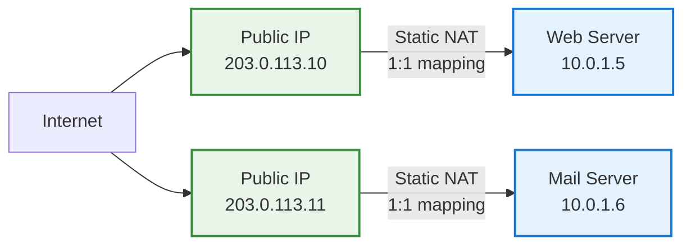
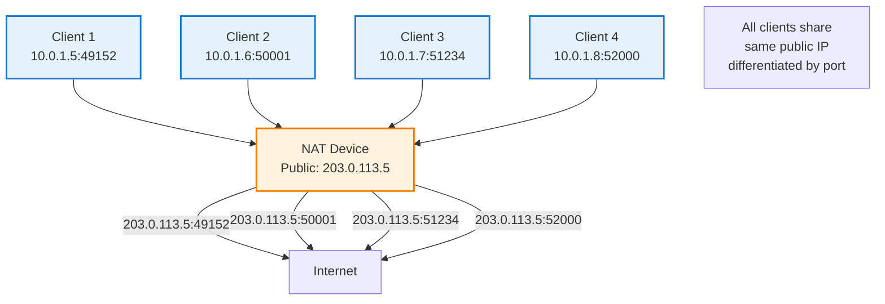
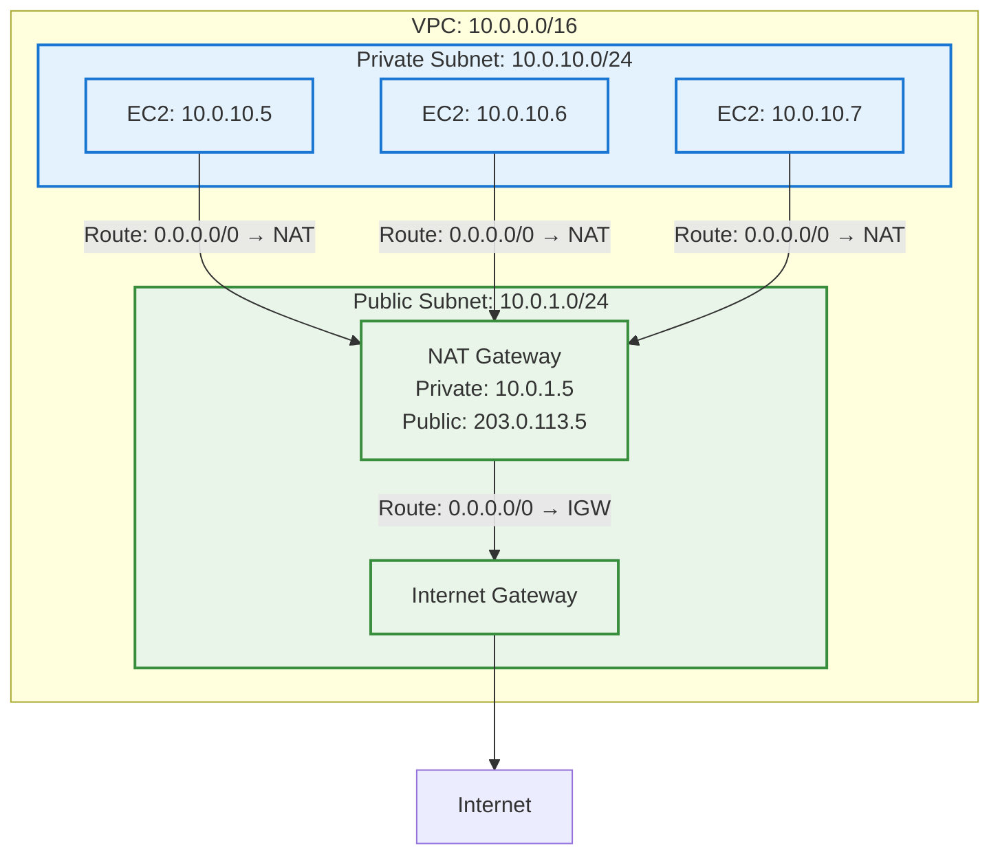
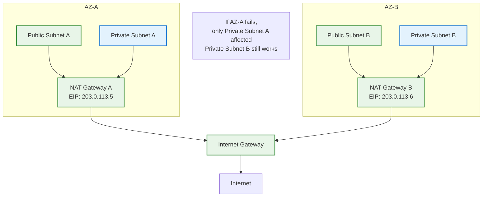

# NAT (Network Address Translation) for System Design Interviews

## 📋 Table of Contents

1. [NAT Fundamentals](#nat-fundamentals)
2. [How NAT Works](#how-nat-works)
3. [Types of NAT](#types-of-nat)
4. [NAT in Cloud (AWS NAT Gateway)](#nat-in-cloud-aws-nat-gateway)
5. [NAT Gateway vs NAT Instance](#nat-gateway-vs-nat-instance)
6. [Port Address Translation (PAT)](#port-address-translation-pat)
7. [NAT in System Design](#nat-in-system-design)
8. [Performance and Scaling](#performance-and-scaling)
9. [Cost, Limits, and Trade-offs](#cost-limits-and-trade-offs)
10. [Common Interview Questions](#common-interview-questions)

---

## 🔧 NAT Fundamentals

### What is NAT?

- **Network Address Translation**: Technique to modify IP addresses in packet headers while in transit
- **Purpose**: Allow multiple devices with private IPs to share a single public IP for internet access
- **Analogy**: Like a company receptionist who routes external calls to internal extensions

### Why NAT Exists

```text
Problem: IPv4 address exhaustion
├── Only 4.3 billion IPv4 addresses available
├── Billions of devices need internet access
├── Private networks use non-routable IPs (10.x.x.x, 192.168.x.x)
└── Private IPs cannot communicate directly with internet

Solution: NAT enables private-to-public translation
├── Private network uses private IP space (10.0.0.0/8)
├── NAT device translates private IPs to public IP
├── Thousands of devices share single public IP
├── Conserves public IP addresses
└── Provides security (hides internal network)

Additional benefits:
├── Security: Internal IPs hidden from internet
├── Flexibility: Change internal IPs without affecting external
├── Cost: Fewer public IPs needed
└── IPv6 transition: Allows gradual migration
```

### NAT Architecture Overview

```mermaid
sequenceDiagram
    participant PC as Private Client<br/>10.0.1.5
    participant NAT as NAT Device<br/>Private: 10.0.1.1<br/>Public: 203.0.113.5
    participant Web as Web Server<br/>172.217.14.206

    Note over PC: Wants to access<br/>google.com
    PC->>NAT: SRC: 10.0.1.5:49152<br/>DST: 172.217.14.206:80
    Note over NAT: Translate source<br/>10.0.1.5:49152 → 203.0.113.5:49152
    NAT->>Web: SRC: 203.0.113.5:49152<br/>DST: 172.217.14.206:80
    Web-->>NAT: SRC: 172.217.14.206:80<br/>DST: 203.0.113.5:49152
    Note over NAT: Translate destination<br/>203.0.113.5:49152 → 10.0.1.5:49152
    NAT-->>PC: SRC: 172.217.14.206:80<br/>DST: 10.0.1.5:49152
    Note over PC: Receives response

    classDef private fill:#e3f2fd,stroke:#1976d2,stroke-width:2px
    classDef nat fill:#fff3e0,stroke:#f57c00,stroke-width:2px
    classDef public fill:#e8f5e8,stroke:#388e3c,stroke-width:2px

    class PC private
    class NAT nat
    class Web public
```

> NAT translates private IP addresses to public IP addresses, enabling private networks to access the internet

---

## 🔍 How NAT Works

### NAT Translation Process

```text
Outbound (Private → Internet):

Step 1: Client sends packet
├── Source IP: 10.0.1.5 (private)
├── Source Port: 49152
├── Destination IP: 172.217.14.206 (google.com)
└── Destination Port: 80 (HTTP)

Step 2: NAT device receives packet
├── Looks up translation table
├── Creates new entry if not exists
└── Records: 10.0.1.5:49152 ↔ 203.0.113.5:49152

Step 3: NAT translates source
├── Replace source IP: 10.0.1.5 → 203.0.113.5
├── Keep or change source port: 49152 → 49152
├── Recalculate checksum
└── Forward to internet

Step 4: Web server receives packet
├── Source IP: 203.0.113.5 (NAT public IP)
├── Source Port: 49152
├── Destination IP: 172.217.14.206
└── Destination Port: 80

Inbound (Internet → Private):

Step 5: Web server sends response
├── Source IP: 172.217.14.206
├── Source Port: 80
├── Destination IP: 203.0.113.5 (NAT public IP)
└── Destination Port: 49152

Step 6: NAT device receives response
├── Looks up translation table
├── Finds: 203.0.113.5:49152 ↔ 10.0.1.5:49152
└── Translates destination

Step 7: NAT translates destination
├── Replace destination IP: 203.0.113.5 → 10.0.1.5
├── Keep destination port: 49152
├── Recalculate checksum
└── Forward to private client

Step 8: Client receives response
├── Source IP: 172.217.14.206
├── Source Port: 80
├── Destination IP: 10.0.1.5 (original private IP)
└── Destination Port: 49152
```

### NAT Translation Table

```text
NAT maintains a translation table (state table):

┌─────────────────┬──────────────┬─────────────────┬──────────────┬─────────┐
│ Private IP      │ Private Port │ Public IP       │ Public Port  │ Timeout │
├─────────────────┼──────────────┼─────────────────┼──────────────┼─────────┤
│ 10.0.1.5        │ 49152        │ 203.0.113.5     │ 49152        │ 300s    │
│ 10.0.1.5        │ 49153        │ 203.0.113.5     │ 49153        │ 300s    │
│ 10.0.1.10       │ 50001        │ 203.0.113.5     │ 50001        │ 300s    │
│ 10.0.1.15       │ 51234        │ 203.0.113.5     │ 51234        │ 300s    │
└─────────────────┴──────────────┴─────────────────┴──────────────┴─────────┘

Key points:
├── Each connection gets unique entry
├── Timeout: Entry removed after inactivity (typically 5 minutes)
├── Port uniqueness: Public IP:Port combination must be unique
└── Capacity: Limited by available ports (65,535 per public IP)

Port exhaustion:
├── Single public IP: ~65,000 concurrent connections
├── Each connection uses one port
├── Long-lived connections (WebSocket) consume ports longer
└── Solution: Multiple public IPs or connection pooling
```

### NAT and Connection State

```text
Stateful NAT (most common):
├── Tracks connection state (TCP handshake, established, closed)
├── Automatically allows return traffic
├── More secure (only established connections allowed)
└── Example: Home routers, AWS NAT Gateway

Stateless NAT (rare):
├── No connection tracking
├── Translates based on rules only
├── Requires explicit rules for return traffic
└── Example: Some enterprise firewalls

TCP Connection Tracking:
1. SYN: Client → Server (create NAT entry)
2. SYN-ACK: Server → Client (NAT translates using entry)
3. ACK: Client → Server (connection established)
4. Data transfer (NAT translates bidirectionally)
5. FIN: Connection close (NAT entry timeout starts)
6. Timeout: NAT entry removed after inactivity
```

---

## 🔀 Types of NAT

### 1. Static NAT (One-to-One)

```text
Definition: Permanent mapping between private and public IP

Mapping:
├── Private IP 10.0.1.5 → Public IP 203.0.113.10 (always)
├── Private IP 10.0.1.6 → Public IP 203.0.113.11 (always)
└── One public IP per private IP

Characteristics:
├── Bidirectional: Inbound and outbound
├── Permanent: Mapping doesn't change
├── Predictable: Same public IP always
└── Expensive: Requires many public IPs

Use cases:
├── Web servers (need consistent public IP)
├── Mail servers (DNS points to public IP)
├── VPN endpoints
└── Services requiring inbound connections

Example:
├── Internal web server: 10.0.1.5
├── Static NAT: 10.0.1.5 ↔ 203.0.113.10
├── DNS: www.example.com → 203.0.113.10
└── Internet users access 203.0.113.10, NAT forwards to 10.0.1.5
```



### 2. Dynamic NAT (Pool-based)

```text
Definition: Temporary mapping from pool of public IPs

Mapping:
├── Pool: 203.0.113.10 - 203.0.113.20 (11 public IPs)
├── Private clients get public IP from pool when needed
├── Released back to pool when connection closes
└── First-come, first-served

Characteristics:
├── Temporary: Mapping changes per session
├── Pool exhaustion: If all public IPs in use, new connections fail
├── Outbound only: No inbound connections (no permanent mapping)
└── More efficient than static NAT

Use cases:
├── Enterprise networks (limited public IPs)
├── Temporary internet access
└── When static mapping not required

Example:
├── Pool: 203.0.113.10-20 (11 IPs)
├── 100 internal clients
├── At most 11 can access internet simultaneously
└── If 12th client tries, connection fails (pool exhausted)

Limitation: Pool exhaustion
├── More private clients than public IPs
├── Solution: PAT/NAPT (next section)
```

### 3. PAT/NAPT (Port Address Translation)

```text
Definition: Many-to-one NAT using port numbers
Also called: NAT Overload, NAPT (Network Address Port Translation)

Mapping:
├── Multiple private IPs → Single public IP
├── Differentiated by port numbers
└── Most common type of NAT

How it works:
├── Private 10.0.1.5:49152 → Public 203.0.113.5:49152
├── Private 10.0.1.6:50001 → Public 203.0.113.5:50001
├── Private 10.0.1.7:51234 → Public 203.0.113.5:51234
└── Same public IP, different ports

Capacity:
├── Single public IP: ~65,000 concurrent connections
├── Ports: 1024-65535 (ephemeral ports)
└── Sufficient for most home/small business networks

Use cases:
├── Home routers (most common)
├── Small business networks
├── AWS NAT Gateway
└── Any scenario with limited public IPs

Advantages:
├── Maximum IP conservation (thousands share one IP)
├── Cost-effective (only one public IP needed)
├── Security (internal IPs completely hidden)
└── Scalable (up to 65k connections per IP)

Disadvantages:
├── Port exhaustion possible (high-traffic scenarios)
├── Breaks some protocols (FTP, SIP, IPsec)
├── No inbound connections (unless port forwarding)
└── Complicates peer-to-peer applications
```



### NAT Type Comparison

```text
┌──────────────┬─────────────┬──────────────┬──────────────┬─────────────┐
│ Type         │ Mapping     │ Public IPs   │ Inbound      │ Use Case    │
├──────────────┼─────────────┼──────────────┼──────────────┼─────────────┤
│ Static NAT   │ 1:1         │ Many         │ Yes          │ Servers     │
│ Dynamic NAT  │ N:M (pool)  │ Multiple     │ No           │ Enterprise  │
│ PAT/NAPT     │ N:1 (port)  │ One          │ No*          │ Most common │
└──────────────┴─────────────┴──────────────┴──────────────┴─────────────┘

* PAT can support inbound with port forwarding
```

---

## ☁️ NAT in Cloud (AWS NAT Gateway)

### AWS NAT Gateway Overview

```text
Definition: Managed NAT service for AWS VPCs

Purpose: Allow private subnet resources to access internet (outbound only)

Characteristics:
├── Fully managed (AWS handles availability, scaling)
├── Deployed in public subnet
├── Requires Elastic IP (static public IP)
├── Highly available within single AZ
├── Auto-scaling (5 Gbps → 45 Gbps)
└── Stateful (tracks connections)

Type: PAT/NAPT (many private IPs → one public IP)

Cost:
├── $0.045/hour (~$32.40/month)
├── $0.045/GB data processed
└── Example: 1 TB/month = $32.40 + $45 = $77.40/month
```

### NAT Gateway Architecture



### NAT Gateway Setup

```text
Step 1: Create NAT Gateway
├── Choose public subnet (has IGW route)
├── Allocate Elastic IP
├── Create NAT Gateway
└── Wait for status: Available

Step 2: Update Private Subnet Route Table
├── Add route: 0.0.0.0/0 → NAT Gateway
├── This routes all internet traffic to NAT
└── VPC local traffic (10.0.0.0/16) still uses local route

Step 3: Test Connectivity
├── SSH to private instance (via bastion or Session Manager)
├── Test: curl https://www.google.com
├── Should work (outbound via NAT)
└── Inbound from internet: NOT possible (NAT is outbound-only)

Route Table Example:

Private Subnet Route Table:
├── 10.0.0.0/16 → local (VPC traffic)
└── 0.0.0.0/0 → nat-xxx (internet traffic)

Public Subnet Route Table:
├── 10.0.0.0/16 → local (VPC traffic)
└── 0.0.0.0/0 → igw-xxx (internet traffic)
```

### High Availability NAT Gateway

```text
Problem: NAT Gateway is AZ-specific
├── If AZ fails, NAT Gateway unavailable
├── Private subnets in that AZ lose internet access
└── Single point of failure per AZ

Solution: NAT Gateway per AZ

Architecture:
├── AZ-A: NAT Gateway A in Public Subnet A
├── AZ-B: NAT Gateway B in Public Subnet B
├── Private Subnet A routes to NAT Gateway A
├── Private Subnet B routes to NAT Gateway B
└── If AZ-A fails, only AZ-A private subnets affected

Cost:
├── 2 NAT Gateways: 2 × $32.40 = $64.80/month
├── 2 Elastic IPs: Free (when attached)
├── Data processing: 2 × $0.045/GB
└── Total: ~$65/month + data transfer

Best practice: Always deploy NAT Gateway per AZ for HA
```



---

## ⚖️ NAT Gateway vs NAT Instance

### Comparison

```text
┌──────────────────┬────────────────────────┬────────────────────────┐
│ Aspect           │ NAT Gateway            │ NAT Instance           │
├──────────────────┼────────────────────────┼────────────────────────┤
│ Management       │ Fully managed by AWS   │ Self-managed EC2       │
│ Availability     │ HA within AZ           │ Single point of failure│
│ Bandwidth        │ 5-45 Gbps (auto-scale) │ Instance type dependent│
│ Maintenance      │ None                   │ OS patches, updates    │
│ Security Groups  │ Not supported          │ Supported              │
│ Bastion          │ Cannot use as bastion  │ Can use as bastion     │
│ Port Forwarding  │ Not supported          │ Supported              │
│ Cost             │ $0.045/hour + data     │ EC2 cost (cheaper)     │
│ Performance      │ Better (dedicated)     │ Limited by instance    │
└──────────────────┴────────────────────────┴────────────────────────┘
```

### NAT Gateway (Recommended)

```text
Advantages:
├── Fully managed (no maintenance)
├── Highly available within AZ
├── Auto-scaling bandwidth (5-45 Gbps)
├── Better performance
├── No security group management
└── Predictable performance

Disadvantages:
├── More expensive ($32.40/month + data)
├── Cannot use as bastion host
├── No port forwarding
├── No security group filtering
└── Cannot customize

Use when:
├── Production workloads
├── High bandwidth requirements
├── Want managed service
├── Need predictable performance
└── Willing to pay for convenience

Cost example (1 NAT Gateway):
├── Hourly: $0.045/hour × 730 hours = $32.40/month
├── Data: $0.045/GB × 1000 GB = $45/month
└── Total: $77.40/month for 1 TB data transfer
```

### NAT Instance (Cost-Optimized)

```text
Setup:
1. Launch EC2 instance in public subnet
2. Disable source/destination check (important!)
3. Configure security group (allow traffic from private subnet)
4. Update private subnet route: 0.0.0.0/0 → NAT instance
5. Enable IP forwarding in OS

Advantages:
├── Cheaper (t3.micro: ~$7.50/month)
├── Can use as bastion host
├── Supports port forwarding
├── Security group filtering
└── Full control and customization

Disadvantages:
├── Self-managed (OS patches, updates)
├── Single point of failure (unless HA setup)
├── Limited bandwidth (instance type)
├── Requires monitoring and maintenance
└── More complex setup

Use when:
├── Dev/test environments
├── Cost-sensitive
├── Low bandwidth requirements
├── Need port forwarding or bastion
└── Have ops team for management

Cost example (t3.micro NAT Instance):
├── EC2: $0.0104/hour × 730 hours = $7.59/month
├── Data: $0.09/GB × 1000 GB = $90/month (EC2 data out)
└── Total: $97.59/month for 1 TB (but instance is cheaper)

High Availability NAT Instance:
├── Deploy in multiple AZs
├── Use Auto Scaling Group (min=1, max=1 per AZ)
├── Elastic IP per instance
├── Health checks and automatic failover
└── More complex, but achieves HA
```

### Decision Matrix

```text
Choose NAT Gateway when:
├── Production environment
├── High availability required
├── High bandwidth (>1 Gbps)
├── Want managed service
├── Team lacks ops expertise
└── Cost is not primary concern

Choose NAT Instance when:
├── Dev/test environment
├── Low bandwidth (<100 Mbps)
├── Cost-sensitive
├── Need bastion host functionality
├── Need port forwarding
├── Have ops team for management
└── Want full control

Hybrid approach:
├── NAT Gateway for production
├── NAT Instance for dev/test
└── Best of both worlds (cost + reliability)
```

---

## 🔌 Port Address Translation (PAT)

### PAT Deep Dive

```text
PAT is the most common form of NAT used today

How PAT works:
├── Translates both IP address and port number
├── Allows many private IPs to share one public IP
├── Uses port numbers to track connections
└── Also called NAT Overload or NAPT

Translation example:

Private Network:
├── Client A: 10.0.1.5:49152 → google.com:80
├── Client B: 10.0.1.6:49152 → facebook.com:443
└── Client C: 10.0.1.7:49152 → twitter.com:443

After PAT:
├── Client A: 203.0.113.5:50001 → google.com:80
├── Client B: 203.0.113.5:50002 → facebook.com:443
└── Client C: 203.0.113.5:50003 → twitter.com:443

Key point: Same public IP (203.0.113.5), different ports
```

### PAT Translation Table

```text
Detailed PAT table with destination tracking:

┌──────────────┬──────────┬──────────────┬──────────┬───────────────────┬──────────┬─────────┐
│ Private IP   │ Priv Port│ Public IP    │ Pub Port │ Destination IP    │ Dest Port│ Protocol│
├──────────────┼──────────┼──────────────┼──────────┼───────────────────┼──────────┼─────────┤
│ 10.0.1.5     │ 49152    │ 203.0.113.5  │ 50001    │ 172.217.14.206    │ 80       │ TCP     │
│ 10.0.1.5     │ 49153    │ 203.0.113.5  │ 50002    │ 151.101.1.140     │ 443      │ TCP     │
│ 10.0.1.6     │ 49152    │ 203.0.113.5  │ 50003    │ 157.240.2.35      │ 443      │ TCP     │
│ 10.0.1.7     │ 51234    │ 203.0.113.5  │ 50004    │ 104.244.42.129    │ 443      │ TCP     │
└──────────────┴──────────┴──────────────┴──────────┴───────────────────┴──────────┴─────────┘

Note: Each unique combination gets unique public port
```

### Port Exhaustion Problem

```text
Problem: Limited ports per public IP

Available ports:
├── Total ports: 65,536 (0-65535)
├── Reserved: 0-1023 (well-known ports)
├── Ephemeral: 1024-65535 (64,512 ports)
└── Practical limit: ~60,000 concurrent connections per IP

When port exhaustion occurs:
├── All available ports in use
├── New connections fail
├── Error: "Cannot assign requested address"
└── Clients cannot access internet

Scenarios causing exhaustion:
├── High-traffic applications (>60k concurrent connections)
├── Long-lived connections (WebSocket, streaming)
├── Connection leaks (app doesn't close connections)
└── Many clients behind single NAT

Solutions:

1. Multiple Public IPs:
   ├── Add more Elastic IPs to NAT
   ├── Each IP provides 60k ports
   └── Example: 3 IPs = 180k concurrent connections

2. Connection Pooling:
   ├── Reuse connections at application level
   ├── HTTP keep-alive
   └── Reduces number of connections

3. Shorter Timeouts:
   ├── Reduce NAT timeout (default: 5 minutes)
   ├── Faster port recycling
   └── Trade-off: May break long-lived connections

4. Load Balancing:
   ├── Distribute across multiple NAT Gateways
   ├── Each NAT has own public IP
   └── Horizontal scaling

5. VPC Endpoints:
   ├── Direct connection to AWS services
   ├── Bypass NAT Gateway
   └── Reduces NAT load
```

### Port Forwarding (Inbound NAT)

```text
Purpose: Allow inbound connections to private resources

How it works:
├── Map public IP:port to private IP:port
├── Example: 203.0.113.5:8080 → 10.0.1.5:80
└── Enables hosting services behind NAT

Configuration:
├── Public: 203.0.113.5:8080
├── Private: 10.0.1.5:80
└── Internet users access 203.0.113.5:8080, forwarded to 10.0.1.5:80

Use cases:
├── Host web server behind NAT
├── Remote desktop (RDP, VNC)
├── Game servers
└── IoT device access

Limitations:
├── AWS NAT Gateway: Does NOT support port forwarding
├── NAT Instance: Supports port forwarding
├── Alternative: Use Elastic Load Balancer or public subnet
└── Security: Exposing internal services increases risk

Example (NAT Instance with iptables):
```

```bash
# Port forwarding on NAT Instance
# Forward public port 8080 to private 10.0.1.5:80
iptables -t nat -A PREROUTING -p tcp --dport 8080 -j DNAT --to-destination 10.0.1.5:80
iptables -t nat -A POSTROUTING -j MASQUERADE
```

---

## 🏗️ NAT in System Design

### Pattern 1: Standard VPC with NAT Gateway

```text
Use case: Private application servers need internet access

Architecture:
Internet ← IGW ← NAT Gateway (Public Subnet) ← App Servers (Private Subnet)

Components:
├── Public Subnet: NAT Gateway, Load Balancer
├── Private Subnet: Application servers, databases
├── Internet Gateway: Public internet access
└── Route Tables: Private routes to NAT, Public routes to IGW

Benefits:
├── Private servers hidden from internet
├── Outbound internet access for updates, APIs
├── Inbound via Load Balancer only
└── Security through network isolation

Cost: $65/month (2 NAT Gateways for HA) + data transfer
```

### Pattern 2: Centralized NAT with Transit Gateway

```text
Use case: Multiple VPCs need internet access, cost optimization

Architecture:
[VPC 1, VPC 2, VPC 3] → Transit Gateway → Egress VPC → NAT Gateway → Internet

Benefits:
├── Single NAT Gateway shared across VPCs
├── Cost savings: $65 vs $195 (3 VPCs × $65)
├── Centralized egress control
└── Simplified management

Trade-offs:
├── Transit Gateway cost: $36/month + data
├── Single point of egress
├── Slightly higher latency (extra hop)
└── More complex routing

Cost comparison:
├── Without TGW: 3 VPCs × $65 = $195/month
├── With TGW: $36 (TGW) + $65 (NAT) = $101/month
└── Savings: $94/month (48% reduction)
```

### Pattern 3: VPC Endpoints to Avoid NAT

```text
Use case: Private resources access AWS services (S3, DynamoDB)

Problem:
├── Private subnet → NAT Gateway → Internet → S3
├── Costs: NAT Gateway data processing ($0.045/GB)
├── Security: Traffic leaves AWS network
└── Latency: Extra hops

Solution: VPC Endpoints
├── Private subnet → VPC Endpoint → S3 (private connection)
├── No NAT Gateway needed for AWS services
├── Free for S3/DynamoDB (Gateway Endpoints)
└── Traffic stays in AWS network

Cost savings:
├── Without endpoint: 1 TB to S3 via NAT = $45
├── With endpoint: 1 TB to S3 = $0
└── Savings: $45/month per TB

Architecture:
├── Gateway Endpoints: S3, DynamoDB (free, route table entry)
├── Interface Endpoints: Other AWS services ($0.01/hour + $0.01/GB)
└── Hybrid: Endpoints for AWS, NAT for internet
```

### Pattern 4: NAT Instance for Dev/Test

```text
Use case: Cost-optimized dev/test environment

Architecture:
Dev/Test VPC → NAT Instance (t3.micro) → Internet

Setup:
├── NAT Instance: t3.micro in public subnet
├── Cost: $7.59/month (vs $32.40 for NAT Gateway)
├── Sufficient for low-traffic dev/test
└── Can also use as bastion host

Benefits:
├── 77% cost reduction ($7.59 vs $32.40)
├── Dual-purpose (NAT + bastion)
├── Good for learning/experimentation
└── Acceptable for non-production

Limitations:
├── Single point of failure
├── Limited bandwidth
├── Requires maintenance
└── Not recommended for production
```

---

## ⚡ Performance and Scaling

### NAT Gateway Performance

```text
Bandwidth:
├── Baseline: 5 Gbps
├── Burst: Up to 45 Gbps
├── Auto-scaling (no configuration needed)
└── Per-AZ limit: 45 Gbps

Connections:
├── Concurrent connections: 55,000 per NAT Gateway
├── New connections: 900/second
├── Port exhaustion: ~60,000 ports per Elastic IP
└── Idle timeout: 350 seconds (5 minutes 50 seconds)

Latency:
├── Typical: <1 ms (within same AZ)
├── Cross-AZ: 1-2 ms
└── Minimal overhead

Scaling strategies:

1. Vertical (single NAT Gateway):
   ├── Automatic up to 45 Gbps
   ├── No configuration needed
   └── Sufficient for most workloads

2. Horizontal (multiple NAT Gateways):
   ├── Deploy NAT Gateway per AZ (HA)
   ├── Or multiple NAT Gateways per AZ (>45 Gbps)
   └── Distribute load across NAT Gateways

3. Multiple Elastic IPs:
   ├── Each NAT Gateway supports multiple IPs
   ├── Increases port capacity
   └── Useful for port exhaustion scenarios
```

### Monitoring NAT Gateway

```text
CloudWatch Metrics:

1. BytesInFromDestination:
   ├── Bytes received from internet
   ├── Indicates inbound traffic volume
   └── Alert: Sudden spike (potential attack)

2. BytesOutToDestination:
   ├── Bytes sent to internet
   ├── Indicates outbound traffic volume
   └── Alert: Unexpected increase (data exfiltration?)

3. BytesInFromSource:
   ├── Bytes received from VPC
   └── Tracks private subnet usage

4. BytesOutToSource:
   ├── Bytes sent to VPC
   └── Tracks response traffic

5. ConnectionAttemptCount:
   ├── New connection attempts
   └── Alert: High rate (>800/sec approaching limit)

6. ConnectionEstablishedCount:
   ├── Successful connections
   └── Monitor: Approaching 55k limit

7. ErrorPortAllocation:
   ├── Port allocation failures
   ├── Indicates port exhaustion
   └── Alert: Any occurrence (critical issue)

8. PacketsDropCount:
   ├── Dropped packets
   ├── Indicates congestion or errors
   └── Alert: >1% packet loss

Recommended Alarms:
├── ErrorPortAllocation > 0 (critical)
├── ConnectionEstablishedCount > 50,000 (warning)
├── PacketsDropCount > 1000 (warning)
└── BytesOutToDestination sudden spike (security)
```

### Troubleshooting NAT Issues

```text
Issue 1: Private instance cannot reach internet

Diagnosis:
├── Check route table: 0.0.0.0/0 → NAT Gateway?
├── Check NAT Gateway status: Available?
├── Check security group: Allows outbound traffic?
├── Check NACL: Allows outbound and return traffic?
└── Check NAT Gateway subnet: Has IGW route?

Issue 2: Port exhaustion

Symptoms:
├── ErrorPortAllocation metric > 0
├── New connections fail
└── Error: "Cannot assign requested address"

Solutions:
├── Add more Elastic IPs to NAT Gateway
├── Deploy additional NAT Gateways
├── Reduce connection timeout
├── Fix connection leaks in application
└── Use VPC Endpoints for AWS services

Issue 3: High data transfer costs

Diagnosis:
├── Check BytesOutToDestination metric
├── Identify top talkers (VPC Flow Logs)
└── Analyze traffic patterns

Solutions:
├── Use VPC Endpoints for S3/DynamoDB
├── Cache data locally (reduce external calls)
├── Compress data before transfer
└── Review application efficiency

Issue 4: Slow internet access from private subnet

Diagnosis:
├── Check NAT Gateway bandwidth utilization
├── Check latency (CloudWatch metrics)
├── Test from multiple instances
└── Compare with public subnet performance

Solutions:
├── Deploy NAT Gateway per AZ (reduce cross-AZ traffic)
├── Add more NAT Gateways (horizontal scaling)
├── Check for bandwidth bottlenecks in application
└── Consider Direct Connect for high bandwidth needs
```

---

## 💰 Cost, Limits, and Trade-offs

### NAT Gateway Costs

```text
Pricing (US East):
├── Hourly: $0.045/hour
├── Data processing: $0.045/GB
└── Elastic IP: Free (when attached)

Monthly cost examples:

1. Low traffic (100 GB/month):
   ├── Hourly: $0.045 × 730 = $32.85
   ├── Data: $0.045 × 100 = $4.50
   └── Total: $37.35/month

2. Medium traffic (1 TB/month):
   ├── Hourly: $0.045 × 730 = $32.85
   ├── Data: $0.045 × 1000 = $45.00
   └── Total: $77.85/month

3. High traffic (10 TB/month):
   ├── Hourly: $0.045 × 730 = $32.85
   ├── Data: $0.045 × 10000 = $450.00
   └── Total: $482.85/month

4. High Availability (2 AZs, 1 TB each):
   ├── 2 NAT Gateways: 2 × $32.85 = $65.70
   ├── Data: 2 × $45.00 = $90.00
   └── Total: $155.70/month

Data transfer is the largest cost component for high-traffic scenarios
```

### Cost Optimization Strategies

```text
1. VPC Endpoints:
   ├── Use Gateway Endpoints for S3/DynamoDB (free)
   ├── Avoid NAT Gateway for AWS service traffic
   └── Savings: $0.045/GB

2. Centralized NAT (Transit Gateway):
   ├── Share NAT Gateway across multiple VPCs
   ├── Savings: $65/month per VPC (minus TGW cost)
   └── Best for: 3+ VPCs

3. NAT Instance for Dev/Test:
   ├── Use t3.micro ($7.59/month) instead of NAT Gateway
   ├── Savings: $25/month per environment
   └── Acceptable for non-production

4. Data Transfer Optimization:
   ├── Cache frequently accessed data
   ├── Compress data before transfer
   ├── Use CloudFront for static content
   └── Batch API calls

5. Right-sizing:
   ├── Monitor actual usage (CloudWatch)
   ├── Remove unused NAT Gateways
   ├── Consolidate where possible
   └── Review monthly AWS Cost Explorer

6. Reserved Capacity:
   ├── NAT Gateway has no reserved pricing
   ├── But can reserve EC2 for NAT Instance
   └── Savings Plans don't apply to NAT Gateway
```

### NAT Gateway Limits

```text
Soft limits (per region):
├── NAT Gateways: 5 (can be increased)
├── Elastic IPs: 5 (can be increased)
└── Request increase via AWS Support

Hard limits (per NAT Gateway):
├── Bandwidth: 45 Gbps (cannot be increased)
├── Concurrent connections: 55,000
├── New connections: 900/second
├── Idle timeout: 350 seconds (cannot be changed)
└── Ports per Elastic IP: ~60,000

Workarounds for limits:
├── Bandwidth: Deploy multiple NAT Gateways
├── Connections: Use multiple NAT Gateways or Elastic IPs
├── Timeout: Use application-level keep-alive
└── Ports: Add more Elastic IPs or NAT Gateways
```

### Trade-offs

```text
NAT Gateway vs Direct Internet Access:
├── NAT: Secure (private IPs), but costs money
├── Direct: Free, but exposes instances
└── Recommendation: NAT for private, public subnet for LB

NAT Gateway vs VPC Endpoints:
├── NAT: Works for all internet traffic
├── Endpoints: Only for specific AWS services, but free (S3/DynamoDB)
└── Recommendation: Endpoints for AWS, NAT for internet

NAT Gateway vs NAT Instance:
├── NAT Gateway: Managed, HA, expensive
├── NAT Instance: Self-managed, cheaper, less reliable
└── Recommendation: Gateway for prod, instance for dev/test

Single AZ vs Multi-AZ NAT:
├── Single: Cheaper ($33/month), but single point of failure
├── Multi: HA ($66/month), but costs 2x
└── Recommendation: Multi-AZ for production

Centralized vs Distributed NAT:
├── Centralized: Cheaper (shared NAT), but single egress point
├── Distributed: More expensive, but better performance/isolation
└── Recommendation: Distributed for prod, centralized for cost savings
```

---

## ❓ Common Interview Questions

### Q1. What is NAT and why is it needed?

**Answer:**

```text
Definition: Network Address Translation modifies IP addresses in packet headers

Why needed:
├── IPv4 address exhaustion (only 4.3 billion addresses)
├── Billions of devices need internet access
├── Private IPs (10.x.x.x, 192.168.x.x) not routable on internet
└── NAT allows many private IPs to share one public IP

How it works:
1. Private device sends packet (SRC: 10.0.1.5:49152)
2. NAT translates source IP to public IP (SRC: 203.0.113.5:49152)
3. Internet server responds to public IP
4. NAT translates back to private IP
5. Private device receives response

Benefits:
├── IP conservation: Thousands share one public IP
├── Security: Internal IPs hidden from internet
├── Flexibility: Change internal IPs without affecting external
└── Cost: Fewer public IPs needed

Types:
├── Static NAT: 1:1 mapping (for servers)
├── Dynamic NAT: Pool of public IPs
└── PAT/NAPT: Many:1 using ports (most common)
```

### Q2. Explain the difference between NAT Gateway and NAT Instance

**Answer:**

```text
NAT Gateway (Managed):
├── Fully managed by AWS
├── Highly available within AZ
├── Auto-scaling (5-45 Gbps)
├── No maintenance required
├── Cost: $0.045/hour + $0.045/GB
├── Cannot use as bastion
└── Recommended for production

NAT Instance (Self-managed):
├── EC2 instance you manage
├── Single point of failure (unless HA setup)
├── Bandwidth limited by instance type
├── Requires OS patches and updates
├── Cost: EC2 pricing (~$7.59/month for t3.micro)
├── Can use as bastion host
└── Good for dev/test

When to use each:
├── NAT Gateway: Production, high availability, managed service
├── NAT Instance: Dev/test, cost-sensitive, need bastion
└── Hybrid: Gateway for prod, instance for dev/test
```

### Q3. How does a NAT Gateway work in AWS?

**Answer:**

```text
Architecture:
Private Subnet → NAT Gateway (Public Subnet) → Internet Gateway → Internet

Step-by-step flow:

1. Setup:
   ├── NAT Gateway deployed in public subnet
   ├── Assigned Elastic IP (public IP)
   ├── Private subnet route: 0.0.0.0/0 → NAT Gateway
   └── Public subnet route: 0.0.0.0/0 → Internet Gateway

2. Outbound request:
   ├── Private instance (10.0.10.5) sends packet to google.com
   ├── Packet routed to NAT Gateway (via route table)
   ├── NAT translates: 10.0.10.5:49152 → 203.0.113.5:49152
   ├── NAT forwards to Internet Gateway
   └── Internet Gateway forwards to internet

3. Inbound response:
   ├── Google responds to 203.0.113.5:49152
   ├── Internet Gateway forwards to NAT Gateway
   ├── NAT translates: 203.0.113.5:49152 → 10.0.10.5:49152
   └── NAT forwards to private instance

Key points:
├── Outbound only (no inbound from internet)
├── Stateful (tracks connections)
├── Type: PAT/NAPT (port-based)
├── Highly available within single AZ
└── Requires NAT Gateway per AZ for HA
```

### Q4. What is port exhaustion and how do you prevent it?

**Answer:**

```text
Problem: Limited ports per public IP

Cause:
├── Each connection uses one port
├── Available ports: ~60,000 (1024-65535)
├── If all ports in use, new connections fail
└── Error: "Cannot assign requested address"

When it occurs:
├── High-traffic applications (>60k concurrent connections)
├── Long-lived connections (WebSocket, streaming)
├── Connection leaks (app doesn't close connections)
└── Many clients behind single NAT

Prevention strategies:

1. Multiple Elastic IPs:
   ├── Each IP provides 60k ports
   ├── 3 IPs = 180k concurrent connections
   └── Configure on NAT Gateway

2. Multiple NAT Gateways:
   ├── Deploy multiple NAT Gateways per AZ
   ├── Distribute load across NAT Gateways
   └── Horizontal scaling

3. Connection Pooling:
   ├── Reuse connections at application level
   ├── HTTP keep-alive
   └── Reduces number of connections

4. Shorter Timeouts:
   ├── Reduce idle timeout (if possible)
   ├── Faster port recycling
   └── Trade-off: May break long-lived connections

5. VPC Endpoints:
   ├── Direct connection to AWS services
   ├── Bypass NAT Gateway
   └── Reduces NAT load

Monitoring:
├── CloudWatch metric: ErrorPortAllocation
├── Alert when > 0 (indicates port exhaustion)
└── Monitor ConnectionEstablishedCount (approaching 55k limit)
```

### Q5. How do you design high availability NAT?

**Answer:**

```text
Problem: NAT Gateway is AZ-specific
├── If AZ fails, NAT Gateway unavailable
├── Private subnets in that AZ lose internet access
└── Single point of failure per AZ

Solution: NAT Gateway per AZ

Architecture:
├── Deploy NAT Gateway in each AZ
├── Each private subnet routes to NAT in same AZ
├── If AZ fails, only that AZ's private subnets affected
└── Other AZs continue working

Setup:
1. Create public subnet in each AZ
2. Create NAT Gateway in each public subnet
3. Allocate Elastic IP for each NAT Gateway
4. Create route table per AZ
5. Associate private subnets with appropriate route table
6. Add route: 0.0.0.0/0 → NAT Gateway (in same AZ)

Example (2 AZs):
├── AZ-A: NAT Gateway A (EIP: 203.0.113.5)
├── AZ-B: NAT Gateway B (EIP: 203.0.113.6)
├── Private Subnet A routes to NAT Gateway A
├── Private Subnet B routes to NAT Gateway B
└── If AZ-A fails, Private Subnet B still has internet access

Cost:
├── 2 NAT Gateways: 2 × $32.40 = $64.80/month
├── 2 Elastic IPs: Free (when attached)
├── Data processing: 2 × $0.045/GB
└── Total: ~$65/month + data transfer

Best practice: Always deploy NAT Gateway per AZ for production
```

### Q6. What are VPC Endpoints and how do they relate to NAT?

**Answer:**

```text
Problem: Private resources need to access AWS services (S3, DynamoDB)

Without VPC Endpoints:
├── Private subnet → NAT Gateway → Internet → S3
├── Costs: NAT Gateway data processing ($0.045/GB)
├── Security: Traffic leaves AWS network (goes to internet)
└── Latency: Extra hops through NAT and internet

With VPC Endpoints:
├── Private subnet → VPC Endpoint → S3 (private connection)
├── No NAT Gateway needed for AWS services
├── Traffic stays in AWS network
└── Better security and performance

Types:

1. Gateway Endpoints (Free):
   ├── S3 and DynamoDB only
   ├── Route table entry (no ENI)
   ├── No hourly or data transfer charges
   └── Preferred for S3/DynamoDB access

2. Interface Endpoints (PrivateLink):
   ├── Most other AWS services
   ├── Elastic Network Interface (ENI) in subnet
   ├── Cost: $0.01/hour + $0.01/GB
   └── Uses private IP from VPC

Cost savings example:
├── Without endpoint: 1 TB to S3 via NAT = $45
├── With Gateway endpoint: 1 TB to S3 = $0
└── Savings: $45/month per TB

Recommendation:
├── Use Gateway Endpoints for S3/DynamoDB (free)
├── Use Interface Endpoints for other AWS services
├── Use NAT Gateway only for internet access
└── Hybrid approach minimizes costs
```

### Q7. How do you troubleshoot NAT connectivity issues?

**Answer:**

```text
Issue: Private instance cannot reach internet

Troubleshooting steps:

1. Check Route Table:
   ├── Private subnet route table has 0.0.0.0/0 → NAT Gateway?
   ├── Correct NAT Gateway ID?
   └── Command: aws ec2 describe-route-tables

2. Check NAT Gateway Status:
   ├── Status: Available?
   ├── State: Active?
   └── Console: VPC → NAT Gateways

3. Check NAT Gateway Subnet:
   ├── NAT in public subnet?
   ├── Public subnet has route: 0.0.0.0/0 → Internet Gateway?
   └── NAT Gateway has Elastic IP?

4. Check Security Group:
   ├── Private instance security group allows outbound traffic?
   ├── Default: Allow all outbound
   └── Note: NAT Gateway doesn't use security groups

5. Check Network ACL:
   ├── Private subnet NACL allows outbound traffic?
   ├── NACL allows return traffic (ephemeral ports 1024-65535)?
   └── Stateless: Must allow both directions

6. Test Connectivity:
   ├── SSH to private instance (via bastion or Session Manager)
   ├── Test: curl -v https://www.google.com
   ├── Check DNS: nslookup google.com
   └── Check routing: traceroute 8.8.8.8

7. Check CloudWatch Metrics:
   ├── BytesOutToDestination: Traffic leaving NAT?
   ├── ErrorPortAllocation: Port exhaustion?
   └── PacketsDropCount: Packet loss?

Common issues:
├── Missing route to NAT Gateway
├── NAT Gateway in wrong subnet (not public)
├── NACL blocking return traffic
└── Security group blocking outbound
```

### Q8. When would you NOT use NAT?

**Answer:**

```text
Avoid NAT when:

1. Resources need public IP:
   ├── Web servers accepting inbound connections
   ├── Load balancers
   ├── Bastion hosts
   └── Solution: Deploy in public subnet with Elastic IP

2. Cost-sensitive with AWS services:
   ├── High data transfer to S3/DynamoDB
   ├── NAT Gateway costs $0.045/GB
   └── Solution: Use VPC Endpoints (free for S3/DynamoDB)

3. Ultra-low latency required:
   ├── NAT adds network hop (1-2ms)
   ├── Financial trading, gaming
   └── Solution: Direct connection or public subnet

4. Need inbound connections:
   ├── NAT is outbound-only
   ├── Cannot accept connections from internet
   └── Solution: Load balancer or public subnet

5. IPv6 network:
   ├── IPv6 has enough addresses (no NAT needed)
   ├── All devices can have public IPv6
   └── Solution: Egress-only Internet Gateway for IPv6

6. Simple dev/test with low security:
   ├── NAT adds cost and complexity
   ├── Dev/test may not need private subnets
   └── Solution: Public subnet (if acceptable)

Use NAT when:
├── Private resources need outbound internet
├── Security requirement (hide internal IPs)
├── Production workloads
└── Benefits outweigh costs
```

---

> NAT is essential for allowing private subnet resources to access the internet while maintaining security. Understanding NAT types, AWS NAT Gateway, cost optimization, and troubleshooting is critical for system design interviews.
