# TCP & UDP (Transport Layer Protocols) for System Design Interviews

## 📋 Table of Contents

1. [Transport Layer Fundamentals](#transport-layer-fundamentals)
2. [TCP (Transmission Control Protocol)](#tcp-transmission-control-protocol)
3. [UDP (User Datagram Protocol)](#udp-user-datagram-protocol)
4. [TCP vs UDP Comparison](#tcp-vs-udp-comparison)
5. [Protocol Headers & Packet Structure](#protocol-headers--packet-structure)
6. [Connection Management (TCP)](#connection-management-tcp)
7. [Flow Control & Congestion Control](#flow-control--congestion-control)
8. [Use Cases & System Design Applications](#use-cases--system-design-applications)
9. [Performance Considerations](#performance-considerations)
10. [Common Interview Questions](#common-interview-questions)

---

## 🔧 Transport Layer Fundamentals

### What is the Transport Layer?

- **Layer 4 in OSI Model**: Provides end-to-end communication between applications
- **Purpose**: Reliable data transfer, multiplexing, flow control, error detection
- **Analogy**: The postal service that ensures your package gets delivered correctly

### Key Responsibilities:

```
Transport Layer Functions:
├── Multiplexing/Demultiplexing: Multiple apps sharing network
├── Error Detection: Checksums and validation
├── Flow Control: Manage data transmission rate
├── Congestion Control: Prevent network overload
├── Segmentation: Break data into manageable chunks
└── Reassembly: Reconstruct original data at destination
```

### Transport Layer Architecture:

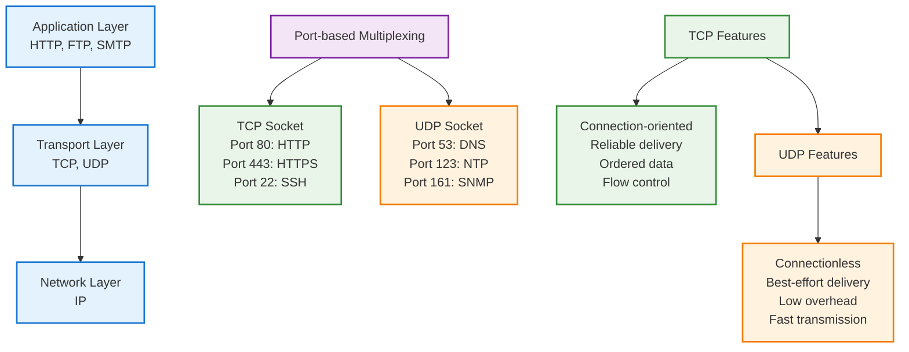

_Transport layer provides end-to-end communication with different reliability guarantees_

---

## 🔗 TCP (Transmission Control Protocol)

### TCP Fundamentals:

**Core Characteristics:**

```
TCP Properties:
├── Connection-oriented: Establish connection before data transfer
├── Reliable: Guaranteed delivery with acknowledgments
├── Ordered: Data arrives in sequence
├── Full-duplex: Bidirectional communication
├── Flow control: Prevent receiver overflow
├── Congestion control: Adapt to network conditions
└── Error recovery: Automatic retransmission
```

### TCP Connection Lifecycle:

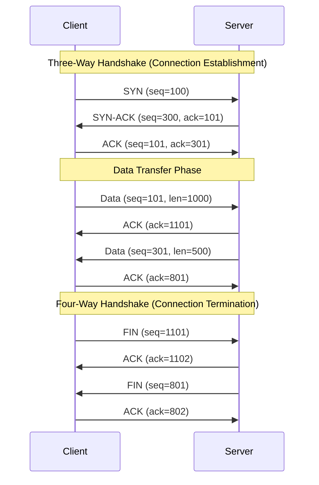

_TCP connection establishment, data transfer, and termination sequence_

### TCP Header Structure:

```
TCP Header (20 bytes minimum):
┌────────────────┬────────────────┐
│  Source Port   │ Destination Port│  (4 bytes)
├────────────────┴────────────────┤
│         Sequence Number         │  (4 bytes)
├─────────────────────────────────┤
│      Acknowledgment Number      │  (4 bytes)
├─────┬───┬─────┬─────────────────┤
│Hdr  │Res│Flags│   Window Size   │  (4 bytes)
│Len  │   │     │                 │
├─────┴───┴─────┼─────────────────┤
│   Checksum    │  Urgent Pointer │  (4 bytes)
├───────────────┴─────────────────┤
│            Options              │  (0-40 bytes)
└─────────────────────────────────┘

Key Fields:
├── Sequence Number: Position of data in stream
├── Acknowledgment: Next expected sequence number
├── Window Size: Flow control (receiver buffer space)
├── Flags: SYN, ACK, FIN, RST, PSH, URG
├── Checksum: Error detection
└── Options: MSS, Window scaling, SACK, etc.
```

### TCP Flow Control (Sliding Window):

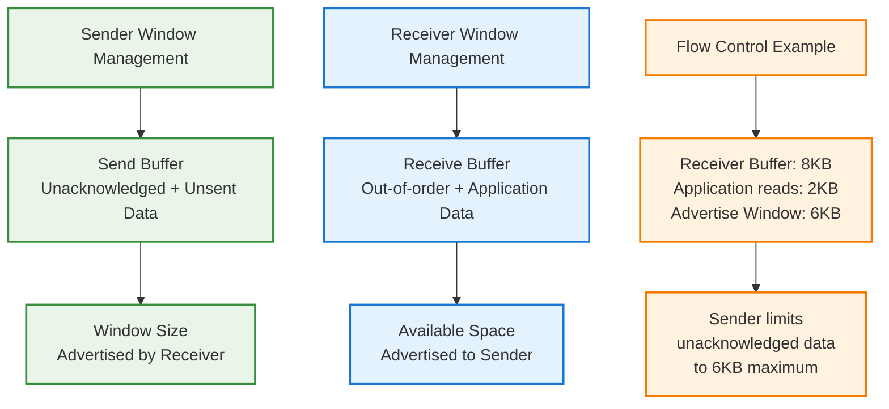

_TCP flow control prevents receiver buffer overflow using advertised window size_

### TCP Congestion Control:

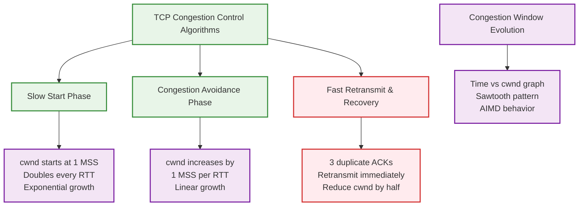

_TCP congestion control adapts sending rate based on network conditions_

---

## 📦 UDP (User Datagram Protocol)

### UDP Fundamentals:

**Core Characteristics:**

```
UDP Properties:
├── Connectionless: No connection establishment
├── Unreliable: Best-effort delivery (no guarantees)
├── Unordered: Packets may arrive out of sequence
├── No flow control: Send at any rate
├── No congestion control: Application responsibility
├── Low overhead: Minimal header size
└── Fast: No connection setup or reliability mechanisms
```

### UDP Header Structure:

```
UDP Header (8 bytes only):
┌────────────────┬────────────────┐
│  Source Port   │ Destination Port│  (4 bytes)
├────────────────┼────────────────┤
│     Length     │   Checksum     │  (4 bytes)
└────────────────┴────────────────┘
│            Data                  │
└─────────────────────────────────┘

Simplicity Benefits:
├── Minimal overhead: Only 8 bytes
├── No state tracking: Stateless protocol
├── Fast transmission: No handshakes
├── Multicast support: One-to-many delivery
└── Application control: Custom reliability if needed
```

### UDP Communication Pattern:

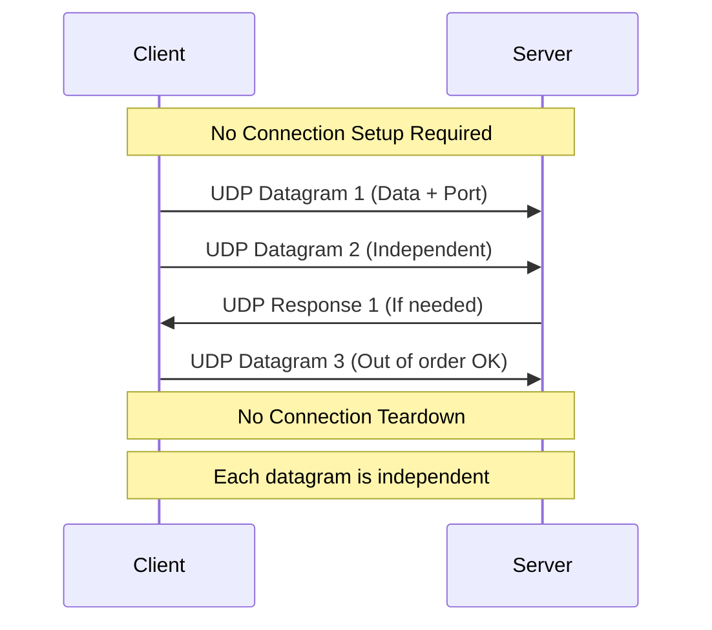

_UDP provides simple, connectionless datagram delivery_

---

## ⚖️ TCP vs UDP Comparison

### Feature Comparison Matrix:

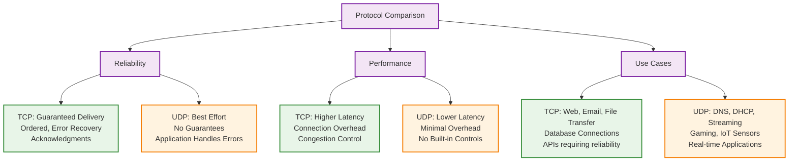

_TCP provides reliability while UDP provides performance for different use cases_

### Detailed Comparison Table:

```
┌─────────────────┬──────────────────┬──────────────────┐
│ Feature         │ TCP              │ UDP              │
├─────────────────┼──────────────────┼──────────────────┤
│ Connection      │ Connection-based │ Connectionless   │
│ Reliability     │ Guaranteed       │ Best effort      │
│ Ordering        │ Ordered delivery │ No ordering      │
│ Speed           │ Slower           │ Faster           │
│ Header Size     │ 20+ bytes        │ 8 bytes          │
│ Error Recovery  │ Automatic        │ None             │
│ Flow Control    │ Built-in         │ None             │
│ Congestion Ctrl │ Built-in         │ None             │
│ Broadcast       │ No               │ Yes              │
│ Streaming       │ Byte stream      │ Discrete packets │
│ State Tracking  │ Stateful         │ Stateless        │
│ Resource Usage  │ Higher           │ Lower            │
└─────────────────┴──────────────────┴──────────────────┘

Performance Characteristics:
├── TCP: 20-100ms additional latency for reliability
├── UDP: Near wire-speed with minimal processing
├── Bandwidth: TCP ~95% efficiency, UDP ~99% efficiency
└── Memory: TCP requires connection state, UDP minimal
```

---

## 📊 Protocol Headers & Packet Structure

### TCP Packet Anatomy:

```mermaid
graph TD
    A[Complete TCP Packet] --> B[Ethernet Header<br/>14 bytes]
    A --> C[IP Header<br/>20 bytes (IPv4)]
    A --> D[TCP Header<br/>20-60 bytes]
    A --> E[Application Data<br/>Variable size]

    F[TCP Header Details] --> G[Control Information<br/>Ports, Sequence, ACK]
    F --> H[Flags<br/>SYN, ACK, FIN, RST]
    F --> I[Flow Control<br/>Window size]
    F --> J[Options<br/>MSS, SACK, Timestamps]

    K[Maximum Segment Size] --> L[Ethernet MTU: 1500 bytes<br/>IP Header: 20 bytes<br/>TCP Header: 20 bytes<br/>TCP Data: 1460 bytes max]

    classDef packet fill:#e3f2fd,stroke:#1976d2,stroke-width:2px
    classDef header fill:#e8f5e8,stroke:#388e3c,stroke-width:2px
    classDef details fill:#fff3e0,stroke:#f57c00,stroke-width:2px

    class A packet
    class B,C,D,E header
    class F,G,H,I,J,K,L details
```

_TCP packet structure with all protocol layers and maximum segment size calculation_

### UDP Packet Anatomy:

```mermaid
graph TD
    A[Complete UDP Packet] --> B[Ethernet Header<br/>14 bytes]
    A --> C[IP Header<br/>20 bytes (IPv4)]
    A --> D[UDP Header<br/>8 bytes]
    A --> E[Application Data<br/>Variable size]

    F[UDP Header Simplicity] --> G[Source Port: 16 bits]
    F --> H[Destination Port: 16 bits]
    F --> I[Length: 16 bits]
    F --> J[Checksum: 16 bits]

    K[Maximum UDP Datagram] --> L[Ethernet MTU: 1500 bytes<br/>IP Header: 20 bytes<br/>UDP Header: 8 bytes<br/>UDP Data: 1472 bytes max]

    classDef packet fill:#e3f2fd,stroke:#1976d2,stroke-width:2px
    classDef header fill:#fff3e0,stroke:#f57c00,stroke-width:2px
    classDef simple fill:#f3e5f5,stroke:#7b1fa2,stroke-width:2px

    class A packet
    class B,C,D,E header
    class F,G,H,I,J,K,L simple
```

_UDP packet structure showing minimal overhead compared to TCP_

---

## 🔄 Connection Management (TCP)

### Three-Way Handshake Details:

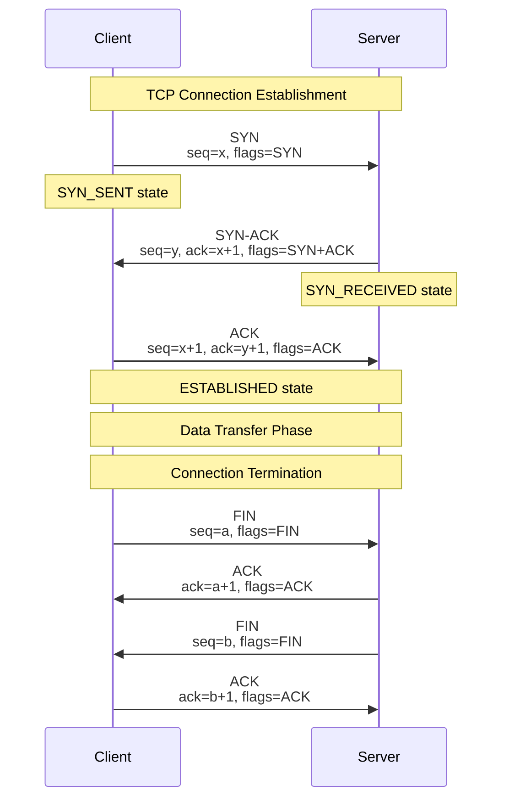

_Complete TCP connection lifecycle with state transitions_

### TCP State Machine:

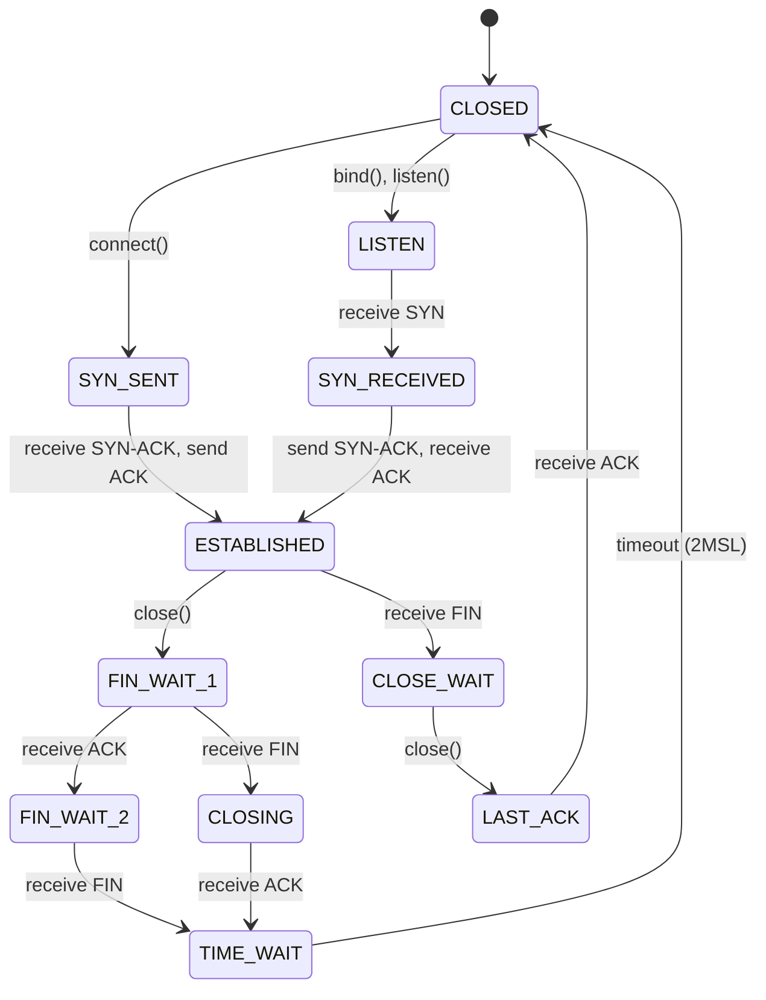

_TCP state machine showing all possible connection states and transitions_

### Connection Pool Management:

````
TCP Connection Pooling Strategy:
├── Pool Size: 10-100 connections per destination
├── Keep-Alive: TCP keep-alive packets every 2 hours
├── Idle Timeout: Close unused connections after 30s
├── Max Lifetime: Recreate connections every 24h
├── Health Check: Validate connections before use
└── Load Balancing: Distribute across available connections

Benefits:
├── Reduced latency: Avoid 3-way handshake overhead
├── Resource efficiency: Reuse established connections
├── Better throughput: Persistent connections for HTTP/2
└── Congestion window: Maintain optimized TCP state

Implementation Example:
```python
class TCPConnectionPool:
    def __init__(self, host, port, pool_size=20):
        self.connections = Queue(maxsize=pool_size)
        self.host = host
        self.port = port

    def get_connection(self):
        if self.connections.empty():
            return self._create_connection()
        return self.connections.get()

    def return_connection(self, conn):
        if self._is_healthy(conn):
            self.connections.put(conn)
        else:
            conn.close()
````

````

---

## 🚦 Flow Control & Congestion Control

### TCP Flow Control (Sliding Window):

```mermaid
graph TD
    A[TCP Flow Control Mechanism] --> B[Sender Side]
    A --> C[Receiver Side]

    B --> D[Send Window<br/>Size limited by receiver]
    B --> E[Unacknowledged Data<br/>Cannot exceed window]
    B --> F[Send Buffer<br/>Application + Network data]

    C --> G[Receive Window<br/>Available buffer space]
    C --> H[Receive Buffer<br/>Out-of-order assembly]
    C --> I[Window Advertisement<br/>Tell sender available space]

    J[Flow Control Example] --> K[Receiver advertises 16KB window<br/>Sender can have max 16KB unacknowledged<br/>Receiver processes data, advertises more space]

    classDef sender fill:#e8f5e8,stroke:#388e3c,stroke-width:2px
    classDef receiver fill:#e3f2fd,stroke:#1976d2,stroke-width:2px
    classDef mechanism fill:#fff3e0,stroke:#f57c00,stroke-width:2px

    class A,B,D,E,F sender
    class C,G,H,I receiver
    class J,K mechanism
````

_TCP flow control prevents receiver buffer overflow using sliding window protocol_

### TCP Congestion Control Algorithms:

```mermaid
graph TD
    A[Congestion Control Phases] --> B[Slow Start<br/>Exponential Growth]
    A --> C[Congestion Avoidance<br/>Linear Growth]
    A --> D[Fast Recovery<br/>Quick Adaptation]

    E[Congestion Window Timeline] --> F[Phase 1: Slow Start<br/>cwnd = 1, 2, 4, 8, 16...]
    E --> G[Phase 2: Congestion Avoidance<br/>cwnd = ssthresh + 1/cwnd per ACK]
    E --> H[Phase 3: Fast Recovery<br/>cwnd = ssthresh/2, quick recovery]

    I[Modern Algorithms] --> J[Cubic: Default in Linux<br/>More aggressive in high-bandwidth]
    I --> K[BBR: Google's algorithm<br/>Bandwidth and RTT based]
    I --> L[Reno: Classic algorithm<br/>AIMD behavior]

    classDef phase fill:#e8f5e8,stroke:#388e3c,stroke-width:2px
    classDef timeline fill:#e3f2fd,stroke:#1976d2,stroke-width:2px
    classDef modern fill:#fff3e0,stroke:#f57c00,stroke-width:2px

    class A,B,C,D phase
    class E,F,G,H timeline
    class I,J,K,L modern
```

_TCP congestion control adapts to network conditions through different phases_

### Congestion Control Detailed Behavior:

```
TCP Congestion Control States:
┌─────────────────┬────────────────────┬─────────────────┐
│ Phase           │ cwnd Behavior      │ Trigger         │
├─────────────────┼────────────────────┼─────────────────┤
│ Slow Start      │ Exponential growth │ Connection start│
│                 │ cwnd *= 2 per RTT  │ or timeout      │
├─────────────────┼────────────────────┼─────────────────┤
│ Congestion      │ Linear growth      │ cwnd >= ssthresh│
│ Avoidance       │ cwnd += 1/cwnd     │                 │
├─────────────────┼────────────────────┼─────────────────┤
│ Fast Retransmit │ Immediate resend   │ 3 duplicate ACKs│
├─────────────────┼────────────────────┼─────────────────┤
│ Fast Recovery   │ cwnd = ssthresh/2  │ After fast      │
│                 │ Inflate for dupACKs│ retransmit      │
└─────────────────┴────────────────────┴─────────────────┘

Key Parameters:
├── cwnd: Congestion window (sender's limit)
├── ssthresh: Slow start threshold
├── MSS: Maximum segment size
├── RTT: Round trip time
└── RTO: Retransmission timeout

AIMD (Additive Increase, Multiplicative Decrease):
├── Increase: cwnd += 1 MSS per RTT (linear)
├── Decrease: cwnd = cwnd/2 on loss (exponential)
└── Result: Sawtooth pattern in throughput
```

---

## 🎯 Use Cases & System Design Applications

### When to Use TCP:

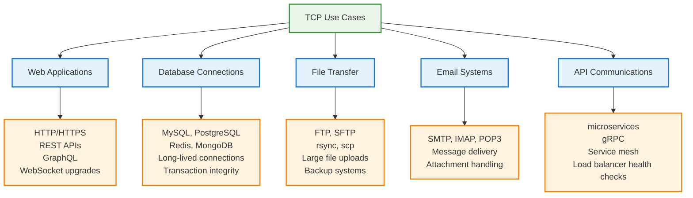

_TCP is ideal for applications requiring reliability and ordered delivery_

### When to Use UDP:

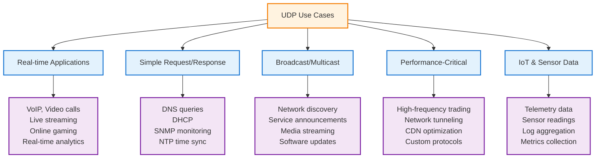

_UDP is ideal for applications prioritizing speed over reliability_

### System Design Examples:

#### 1. Video Streaming Architecture:

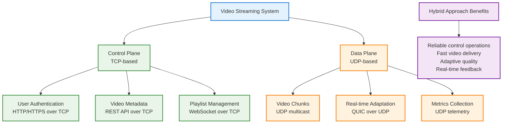

_Video streaming uses both TCP for control and UDP for data delivery_

#### 2. Gaming Backend Architecture:

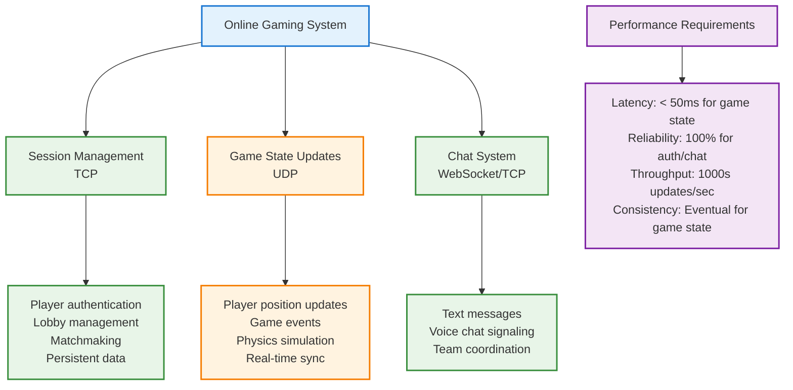

_Gaming systems use TCP for reliable operations and UDP for real-time updates_

#### 3. IoT Data Collection Platform:

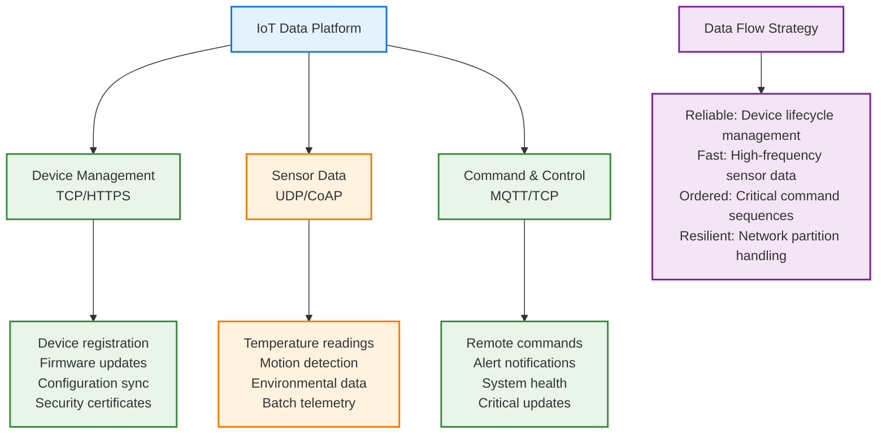

_IoT platforms combine both protocols based on data criticality and frequency_

---

## ⚡ Performance Considerations

### Latency Comparison:

```mermaid
graph TD
    A[Latency Analysis] --> B[TCP Overhead]
    A --> C[UDP Minimal Latency]

    B --> D[Connection Setup<br/>1.5 RTT (3-way handshake)]
    B --> E[Data Transfer<br/>0.5-1 RTT per request]
    B --> F[Connection Teardown<br/>2 RTT (4-way handshake)]

    C --> G[No Setup<br/>0 RTT overhead]
    C --> H[Immediate Send<br/>0.5 RTT for request/response]
    C --> I[No Teardown<br/>0 RTT overhead]

    J[Latency Example] --> K[TCP: 3 RTT setup + 1 RTT data = 4 RTT total<br/>UDP: 0 RTT setup + 1 RTT data = 1 RTT total<br/>Improvement: 75% latency reduction]

    classDef analysis fill:#e3f2fd,stroke:#1976d2,stroke-width:2px
    classDef tcp fill:#e8f5e8,stroke:#388e3c,stroke-width:2px
    classDef udp fill:#fff3e0,stroke:#f57c00,stroke-width:2px
    classDef example fill:#f3e5f5,stroke:#7b1fa2,stroke-width:2px

    class A analysis
    class B,D,E,F tcp
    class C,G,H,I udp
    class J,K example
```

_UDP provides significant latency advantages for simple request/response patterns_

### Throughput Characteristics:

```
Protocol Throughput Analysis:
┌─────────────────┬──────────────┬─────────────────┐
│ Metric          │ TCP          │ UDP             │
├─────────────────┼──────────────┼─────────────────┤
│ Header Overhead │ 20+ bytes    │ 8 bytes         │
│ Connection State│ High memory  │ Minimal memory  │
│ CPU Processing  │ High         │ Low             │
│ Bandwidth Util  │ 95-98%       │ 99%+            │
│ Packet Rate     │ Limited by   │ Limited by      │
│                 │ window size  │ application     │
│ Burst Handling  │ Smoothed by  │ Direct to app   │
│                 │ flow control │                 │
└─────────────────┴──────────────┴─────────────────┘

Performance Optimization Strategies:
TCP Optimizations:
├── TCP_NODELAY: Disable Nagle algorithm
├── SO_REUSEADDR: Reuse socket addresses
├── Larger buffers: Increase send/receive buffers
├── Window scaling: Support larger windows
├── SACK: Selective acknowledgments
└── Connection pooling: Reuse connections

UDP Optimizations:
├── Large buffers: Minimize packet loss
├── SO_REUSEPORT: Load balance across threads
├── Batching: Combine multiple operations
├── Zero-copy: Minimize memory copies
├── Application-level flow control
└── Custom reliability if needed
```

### Memory and CPU Usage:

```mermaid
graph TD
    A[Resource Usage Comparison] --> B[TCP Resource Requirements]
    A --> C[UDP Resource Requirements]

    B --> D[Per-Connection State<br/>~4KB per connection]
    B --> E[Send/Receive Buffers<br/>64KB-512KB per connection]
    B --> F[Congestion Control<br/>CPU cycles for algorithms]
    B --> G[Retransmission Timers<br/>Memory and CPU overhead]

    C --> H[Minimal State<br/>No per-connection tracking]
    C --> I[Simple Buffers<br/>Packet-level buffering only]
    C --> J[No Algorithms<br/>Minimal CPU processing]
    C --> K[No Timers<br/>No retransmission overhead]

    L[Scalability Impact] --> M[TCP: ~10K-100K connections per server<br/>UDP: Millions of packets per second<br/>Memory: TCP 100x more per "connection"<br/>CPU: UDP 10x less processing overhead]

    classDef comparison fill:#e3f2fd,stroke:#1976d2,stroke-width:2px
    classDef tcp fill:#e8f5e8,stroke:#388e3c,stroke-width:2px
    classDef udp fill:#fff3e0,stroke:#f57c00,stroke-width:2px
    classDef impact fill:#f3e5f5,stroke:#7b1fa2,stroke-width:2px

    class A comparison
    class B,D,E,F,G tcp
    class C,H,I,J,K udp
    class L,M impact
```

_UDP uses significantly fewer resources than TCP for high-scale applications_

---

## ❓ Common Interview Questions

### Q1: "When would you choose UDP over TCP for a chat application?"

**Answer Framework:**

```
Chat Application Protocol Analysis:

Requirements Assessment:
├── Message Delivery: Critical for chat history
├── Message Ordering: Important for conversation flow
├── Real-time Delivery: Important for user experience
├── Offline Support: Messages when user returns
└── Scalability: Handle millions of concurrent users

TCP for Chat Messages:
✅ Pros:
├── Guaranteed delivery: No lost messages
├── Ordered delivery: Messages arrive in sequence
├── Built-in reliability: Automatic retransmission
├── Easier implementation: No custom reliability logic
└── WebSocket support: Real-time over HTTP

❌ Cons:
├── Connection overhead: Per-user connection state
├── Head-of-line blocking: One slow message blocks others
├── Resource usage: Memory per connection
└── Latency: 3-way handshake for new connections

UDP for Chat (with custom reliability):
✅ Pros:
├── Lower latency: No connection setup
├── Better scalability: Less server resources
├── No head-of-line blocking: Independent message delivery
├── Multicast support: Group chat efficiency
└── Custom reliability: Implement only what's needed

❌ Cons:
├── Complex implementation: Custom reliability protocol
├── Message ordering: Application must handle sequence
├── Duplicate detection: Prevent message duplication
├── Flow control: Prevent receiver overload
└── Firewall issues: UDP often blocked

Recommended Approach:
Hybrid Architecture:
├── TCP for critical operations (authentication, message history)
├── UDP for real-time typing indicators and presence
├── WebSocket over TCP for main chat messages
├── UDP multicast for group chat optimizations
└── Fallback to TCP when UDP fails
```

### Q2: "Explain the TCP three-way handshake and why it's needed"

**Answer:**

```
TCP Three-Way Handshake Purpose:
├── Establish bidirectional communication
├── Synchronize sequence numbers
├── Negotiate connection parameters
├── Confirm both sides can send/receive
└── Prevent old duplicate connections

Detailed Handshake Process:

Step 1: Client → Server (SYN)
├── Client sends SYN packet
├── Initial sequence number (ISN): Random value
├── Client state: SYN_SENT
├── Purpose: "I want to connect"

Step 2: Server → Client (SYN-ACK)
├── Server responds with SYN-ACK
├── ACK number: Client ISN + 1
├── Server ISN: Random value
├── Server state: SYN_RECEIVED
├── Purpose: "I accept, here's my ISN"

Step 3: Client → Server (ACK)
├── Client sends ACK
├── ACK number: Server ISN + 1
├── Client state: ESTABLISHED
├── Server state: ESTABLISHED (when received)
├── Purpose: "Confirmed, let's communicate"

Why Three Steps (Not Two):
├── Two-way confirmation needed
├── Both sides must agree on sequence numbers
├── Prevents half-open connections
├── Protects against replay attacks
└── Ensures full-duplex capability

Security Implications:
├── SYN flood attacks: Exhaust server resources
├── Sequence number prediction: Old attack vector
├── Connection hijacking: Predict sequence numbers
└── Modern mitigations: SYN cookies, random ISNs
```

### Q3: "How does TCP handle packet loss and retransmission?"

**Answer:**

```
TCP Reliability Mechanisms:

1. Acknowledgment-Based Detection:
├── Every byte has a sequence number
├── Receiver sends ACK for successfully received data
├── ACK number indicates next expected byte
├── Cumulative ACKs: Acknowledge all data up to point
└── Selective ACKs (SACK): Acknowledge specific ranges

2. Timeout-Based Retransmission:
├── Retransmission Timeout (RTO) calculation
├── RTT measurement and smoothing
├── Exponential backoff on timeout
├── Karn's algorithm: Ignore RTT for retransmitted packets
└── Timestamp option: Better RTT measurement

3. Fast Retransmit Algorithm:
├── Monitor for duplicate ACKs
├── 3 duplicate ACKs = packet loss indication
├── Immediately retransmit without waiting for timeout
├── Faster recovery than RTO-based retransmission
└── Triggers fast recovery phase

4. Fast Recovery:
├── Avoid slow start after fast retransmit
├── Inflate congestion window for each duplicate ACK
├── Maintain higher throughput during recovery
├── Exit when new ACK received
└── Resume congestion avoidance

RTO Calculation Example:
├── Measured RTT: 100ms
├── Smoothed RTT: 0.875 * old + 0.125 * new
├── RTT Variation: Track deviation
├── RTO = smoothed RTT + 4 * variation
└── Minimum RTO: 1 second (RFC requirement)

Performance Impact:
├── Timeout retransmission: Significant delay (1s+)
├── Fast retransmit: Quick recovery (~1 RTT)
├── Modern algorithms: SACK, NewReno, Cubic
└── Application visibility: Monitor retransmission rates
```

### Q4: "Design a system for real-time multiplayer gaming. TCP or UDP?"

**Answer:**

```
Real-time Gaming System Design:

Requirements Analysis:
├── Latency: < 50ms for competitive games
├── Packet Loss Tolerance: 1-5% acceptable for position updates
├── Cheat Prevention: Authoritative server validation
├── Scale: 1000+ concurrent players per server
├── Reliability Needs: Critical for game events, optional for state
└── Bandwidth: Optimize for mobile/poor connections

Protocol Selection Strategy:

UDP for Game State Updates:
✅ Use Cases:
├── Player position updates (30-60 FPS)
├── Animation state synchronization
├── Physics simulation data
├── Audio/voice chat packets
└── High-frequency sensor data

✅ Benefits:
├── Low latency: No connection setup
├── No head-of-line blocking: Independent packets
├── Predictable performance: No automatic retransmission
├── Bandwidth efficient: Minimal headers
└── Custom reliability: Only where needed

Implementation Details:
├── Sequence numbers: Track packet ordering
├── Delta compression: Send only changes
├── Interpolation/extrapolation: Smooth movement
├── Lag compensation: Server-side rewind
└── Anti-cheat: Server validation of all inputs

TCP for Critical Operations:
✅ Use Cases:
├── Player authentication and login
├── Game session management
├── Chat messages and social features
├── Inventory and item transactions
├── Achievement/progression data
└── Critical game events (kills, wins)

✅ Benefits:
├── Guaranteed delivery: No lost critical data
├── Built-in reliability: Automatic retransmission
├── Ordered delivery: Maintain event sequence
├── Security: Harder to spoof/manipulate
└── Firewall friendly: Standard port 80/443

Hybrid Architecture:
┌─────────────────────────────────────────────────────────┐
│                Gaming System Architecture               │
├─────────────────────────────────────────────────────────┤
│ TCP Channel:                                            │
│ ├── WebSocket for lobby/chat                           │
│ ├── HTTPS for authentication                           │
│ ├── Reliable messaging for game events                 │
│ └── Persistent connection for session management       │
│                                                         │
│ UDP Channel:                                            │
│ ├── High-frequency position updates                    │
│ ├── Real-time input synchronization                    │
│ ├── Voice/audio streaming                              │
│ └── Custom reliability for critical state              │
│                                                         │
│ Optimization Techniques:                                │
│ ├── Client-side prediction                             │
│ ├── Server reconciliation                              │
│ ├── Lag compensation                                    │
│ ├── Interest management (send only relevant updates)   │
│ └── Adaptive quality based on network conditions       │
└─────────────────────────────────────────────────────────┘

Performance Targets:
├── UDP packet rate: 20-60 packets/second per player
├── TCP message rate: 1-10 messages/second per player
├── Total bandwidth: 10-50 KB/s per player
├── Server capacity: 1000+ concurrent players
└── Latency budget: 16ms client + 16ms network + 16ms server
```

### Q5: "Explain TCP congestion control and its impact on application performance"

**Answer:**

```
TCP Congestion Control Impact Analysis:

Core Algorithms and Behavior:

1. Slow Start Phase:
├── Purpose: Probe network capacity safely
├── Behavior: Exponential growth (cwnd doubles per RTT)
├── Duration: Until cwnd reaches ssthresh or packet loss
├── Impact: Gradual ramp-up of throughput
└── Application effect: Initial lower performance

2. Congestion Avoidance:
├── Purpose: Maintain stable throughput near capacity
├── Behavior: Linear growth (cwnd += 1 per RTT)
├── Steady state: Sawtooth pattern around optimal point
├── Impact: Consistent but variable throughput
└── Application effect: Predictable performance

3. Loss Recovery:
├── Fast Retransmit: Immediate resend on 3 dup ACKs
├── Fast Recovery: Maintain higher cwnd during recovery
├── Timeout: Reset to slow start (severe performance drop)
├── Impact: Temporary throughput reduction
└── Application effect: Latency spikes

Modern Algorithms:

Cubic (Linux Default):
├── More aggressive in high-bandwidth networks
├── Faster recovery after packet loss
├── Better performance for long-distance connections
├── Cubic growth function instead of linear
└── Application benefit: Higher throughput

BBR (Google's Algorithm):
├── Model-based: Estimates bandwidth and RTT
├── Maintains optimal inflight data
├── Reduces bufferbloat
├── More consistent latency
└── Application benefit: Predictable performance

Application Performance Impact:

Web Applications:
├── Slow start affects page load times
├── Multiple TCP connections for HTTP/1.1
├── HTTP/2 multiplexing reduces impact
├── Keep-alive connections amortize slow start
└── CDN edge connections optimize first mile

Database Connections:
├── Long-lived connections benefit from optimization
├── Connection pooling essential for performance
├── Large query results affected by congestion control
├── Batch operations more efficient than individual queries
└── Monitor for retransmission and timeout events

API Services:
├── Small requests/responses less affected
├── Streaming responses benefit from stable cwnd
├── gRPC uses HTTP/2 multiplexing
├── Circuit breakers help during congestion
└── Timeouts should account for TCP behavior

Optimization Strategies:

Application Level:
├── Connection reuse and pooling
├── Batch operations when possible
├── Implement proper timeouts
├── Monitor TCP metrics (retransmissions, RTT)
├── Use HTTP/2 or HTTP/3 (QUIC)
└── Consider application-level flow control

System Level:
├── Tune TCP buffer sizes
├── Enable TCP window scaling
├── Use appropriate congestion control algorithm
├── Monitor network utilization
├── Implement proper load balancing
└── Consider kernel bypass for high-performance apps

Monitoring and Debugging:
├── Track retransmission rates
├── Monitor RTT and jitter
├── Observe congestion window evolution
├── Measure application-level latency
├── Use tools like ss, netstat, tcpdump
└── Correlate TCP metrics with application performance
```

### Q6: "How would you implement reliable UDP for a critical system?"

**Answer:**

````
Reliable UDP Implementation Strategy:

Why Reliable UDP?:
├── Custom reliability: Only implement what's needed
├── Lower latency: No TCP's built-in delays
├── Better control: Application-specific optimizations
├── Scalability: Reduce per-connection state
└── Flexibility: Adapt to specific use case requirements

Core Reliability Components:

1. Sequence Numbers:
├── 32-bit sequence number per packet
├── Monotonically increasing
├── Wrap-around handling (modular arithmetic)
├── Duplicate detection using sequence numbers
└── Reordering detection and buffering

2. Acknowledgments:
├── Selective ACKs (SACK) for efficient feedback
├── Cumulative ACKs for simplicity
├── ACK batching to reduce overhead
├── Timestamp in ACKs for RTT measurement
└── Heartbeat ACKs for connection liveness

3. Retransmission:
├── Timeout-based retransmission
├── RTT estimation and RTO calculation
├── Exponential backoff for timeouts
├── Fast retransmit on NACK or duplicate detection
└── Configurable retry limits

4. Flow Control:
├── Sliding window protocol
├── Receiver advertises available buffer space
├── Sender respects window size limits
├── Window update mechanism
└── Zero window probing

Implementation Example:

```python
class ReliableUDP:
    def __init__(self, local_port, remote_addr):
        self.socket = socket.socket(socket.AF_INET, socket.SOCK_DGRAM)
        self.socket.bind(('localhost', local_port))
        self.remote_addr = remote_addr

        # Reliability state
        self.send_seq = 0
        self.recv_seq = 0
        self.send_window = {}  # seq -> (data, timestamp, retries)
        self.recv_buffer = {}  # seq -> data
        self.window_size = 1024  # Flow control window
        self.rto = 1.0  # Retransmission timeout

    def send_reliable(self, data):
        # Fragment large data if needed
        fragments = self._fragment(data)

        for fragment in fragments:
            packet = self._create_packet(
                seq=self.send_seq,
                data=fragment,
                flags=['DATA']
            )

            # Store for retransmission
            self.send_window[self.send_seq] = {
                'packet': packet,
                'timestamp': time.time(),
                'retries': 0
            }

            self._send_packet(packet)
            self.send_seq += 1

    def _handle_ack(self, ack_packet):
        ack_num = ack_packet.ack_number

        # Remove acknowledged packets
        if ack_num in self.send_window:
            del self.send_window[ack_num]

        # Update RTT estimate
        if 'timestamp' in ack_packet:
            rtt = time.time() - ack_packet.timestamp
            self._update_rto(rtt)

    def _retransmission_timer(self):
        current_time = time.time()

        for seq, packet_info in list(self.send_window.items()):
            if current_time - packet_info['timestamp'] > self.rto:
                if packet_info['retries'] < MAX_RETRIES:
                    # Retransmit
                    self._send_packet(packet_info['packet'])
                    packet_info['timestamp'] = current_time
                    packet_info['retries'] += 1

                    # Exponential backoff
                    self.rto *= 2
                else:
                    # Give up
                    del self.send_window[seq]
                    self._handle_timeout(seq)
````

Advanced Features:

5. Congestion Control:
   ├── AIMD (Additive Increase, Multiplicative Decrease)
   ├── Slow start for initial capacity probing
   ├── Bandwidth estimation
   ├── Congestion window management
   └── Packet pacing to reduce bursts

6. Error Recovery:
   ├── Forward Error Correction (FEC)
   ├── Redundant packet transmission
   ├── Checksum validation
   ├── Corrupt packet handling
   └── Network partition detection

Performance Optimizations:

Batching and Pipelining:
├── Send multiple packets without waiting for ACKs
├── Batch ACKs to reduce overhead
├── Pipeline operations for better throughput
├── Adaptive window sizing based on network conditions
└── Zero-copy operations where possible

Network-Aware Features:
├── Path MTU discovery
├── Differentiated Services (DSCP) marking
├── Multi-path support
├── Network condition adaptation
└── Bandwidth probing

Use Case Examples:

File Transfer Protocol:
├── Large sliding window for high throughput
├── Block-based acknowledgments
├── Resume capability for interrupted transfers
├── Integrity checking with checksums
└── Progress reporting

Real-time Communication:
├── Small window for low latency
├── Selective reliability (some packets can be dropped)
├── Out-of-order delivery for time-sensitive data
├── Jitter buffer management
└── Adaptive quality based on network conditions

Testing and Validation:
├── Packet loss simulation
├── Network delay injection
├── Bandwidth limiting
├── Reordering scenarios
├── Stress testing with high load
└── Edge case handling (network partitions, etc.)

````

---

## 🛠️ Troubleshooting & Tools

### Network Analysis Tools:

```mermaid
graph TD
    A[TCP/UDP Troubleshooting Tools] --> B[Packet Capture]
    A --> C[System Statistics]
    A --> D[Performance Testing]
    A --> E[Application Monitoring]

    B --> F[tcpdump<br/>Packet-level analysis<br/>Command line capture]
    B --> G[Wireshark<br/>GUI analysis<br/>Protocol decoding]
    B --> H[tshark<br/>Command line Wireshark<br/>Scripted analysis]

    C --> I[netstat/ss<br/>Connection states<br/>Socket statistics]
    C --> J[sar/iostat<br/>System performance<br/>Network utilization]
    C --> K[/proc/net/*<br/>Kernel network stats<br/>TCP/UDP counters]

    D --> L[iperf3<br/>Bandwidth testing<br/>TCP/UDP performance]
    D --> M[nload/iftop<br/>Real-time bandwidth<br/>Interface monitoring]
    D --> N[mtr/traceroute<br/>Path analysis<br/>Latency measurement]

    E --> O[Application logs<br/>Connection errors<br/>Timeout events]
    E --> P[APM tools<br/>Datadog, NewRelic<br/>End-to-end monitoring]
    E --> Q[Custom metrics<br/>Connection pools<br/>Response times]

    classDef tools fill:#e3f2fd,stroke:#1976d2,stroke-width:2px
    classDef capture fill:#e8f5e8,stroke:#388e3c,stroke-width:2px
    classDef stats fill:#fff3e0,stroke:#f57c00,stroke-width:2px
    classDef testing fill:#f3e5f5,stroke:#7b1fa2,stroke-width:2px
    classDef monitoring fill:#ffebee,stroke:#d32f2f,stroke-width:2px

    class A tools
    class B,F,G,H capture
    class C,I,J,K stats
    class D,L,M,N testing
    class E,O,P,Q monitoring
````

_Comprehensive toolkit for diagnosing TCP and UDP issues at different layers_

### Diagnostic Command Examples:

```bash
# TCP Connection Analysis
ss -tuln                    # List all TCP/UDP listeners
ss -t -o state established  # Show established TCP connections with timers
netstat -anp | grep :80     # Find processes using port 80

# Packet Capture and Analysis
tcpdump -i eth0 tcp port 80 -w capture.pcap  # Capture HTTP traffic
tcpdump -i any udp port 53  # Monitor DNS queries
wireshark -i eth0 -f "tcp.flags.syn == 1"    # Capture SYN packets

# Performance Testing
iperf3 -s                   # Start iperf3 server
iperf3 -c server -t 30      # TCP bandwidth test for 30 seconds
iperf3 -c server -u -b 100M # UDP test at 100 Mbps

# System Performance
sar -n DEV 1 10            # Network interface statistics
sar -n TCP 1 10            # TCP statistics
iostat -x 1                # I/O and CPU usage

# Advanced TCP Analysis
ss -i                      # Show internal TCP information
cat /proc/net/tcp          # Raw TCP connection data
cat /proc/net/snmp         # SNMP statistics including TCP/UDP counters

# Application-level Debugging
strace -e trace=network -p <pid>  # Trace network system calls
lsof -i                    # List open network connections
netstat -s                 # Network protocol statistics
```

### Common Issues and Solutions:

```
TCP Issues:
┌─────────────────────┬──────────────────┬─────────────────────┐
│ Problem             │ Symptoms         │ Solutions           │
├─────────────────────┼──────────────────┼─────────────────────┤
│ Connection timeout  │ Long connect()   │ Check firewalls,    │
│                     │ calls            │ routing, MTU        │
├─────────────────────┼──────────────────┼─────────────────────┤
│ High retransmissions│ Poor throughput  │ Check packet loss,  │
│                     │                  │ tune buffers        │
├─────────────────────┼──────────────────┼─────────────────────┤
│ Socket exhaustion   │ "Cannot assign   │ Increase ulimits,   │
│                     │ requested addr"  │ use connection pools│
├─────────────────────┼──────────────────┼─────────────────────┤
│ TIME_WAIT buildup   │ Port exhaustion  │ SO_REUSEADDR,       │
│                     │                  │ shorter TIME_WAIT   │
├─────────────────────┼──────────────────┼─────────────────────┤
│ Nagle algorithm     │ Small packet     │ TCP_NODELAY,        │
│                     │ latency          │ message batching    │
└─────────────────────┴──────────────────┴─────────────────────┘

UDP Issues:
┌─────────────────────┬──────────────────┬─────────────────────┐
│ Problem             │ Symptoms         │ Solutions           │
├─────────────────────┼──────────────────┼─────────────────────┤
│ Packet loss         │ Missing data     │ Increase buffers,   │
│                     │                  │ reduce send rate    │
├─────────────────────┼──────────────────┼─────────────────────┤
│ Buffer overflow     │ ENOBUFS errors   │ SO_RCVBUF,          │
│                     │                  │ faster processing   │
├─────────────────────┼──────────────────┼─────────────────────┤
│ Firewall blocking   │ No response      │ Check NAT,          │
│                     │                  │ stateful firewalls  │
├─────────────────────┼──────────────────┼─────────────────────┤
│ Fragmentation       │ Packet loss      │ Reduce packet size, │
│                     │                  │ Path MTU discovery  │
├─────────────────────┼──────────────────┼─────────────────────┤
│ Out of order        │ Application      │ Sequence numbers,   │
│                     │ confusion        │ reorder buffers     │
└─────────────────────┴──────────────────┴─────────────────────┘
```

---

## ✅ Quick Summary

### Key Takeaways for System Design Interviews:

```
Protocol Selection Decision Tree:
├── Need guaranteed delivery? → TCP
├── Need ordered data? → TCP
├── Latency critical (< 50ms)? → UDP
├── High packet rate (> 1000/s)? → UDP
├── Simple request/response? → UDP
├── Complex state management? → TCP
├── Firewall traversal important? → TCP
└── Custom reliability needed? → UDP + application logic

TCP Best Practices:
├── Use connection pooling for efficiency
├── Enable TCP_NODELAY for low latency
├── Tune socket buffers for throughput
├── Monitor retransmission rates
├── Implement proper timeouts
└── Consider HTTP/2 for multiplexing

UDP Best Practices:
├── Implement application-level reliability if needed
├── Use sequence numbers for ordering
├── Limit packet size to avoid fragmentation
├── Implement flow control for high-rate data
├── Add checksums for data integrity
└── Handle network partitions gracefully

Performance Guidelines:
├── TCP: Optimize for connection reuse and batching
├── UDP: Optimize for packet rate and processing efficiency
├── Both: Monitor network utilization and packet loss
├── Tools: Use tcpdump, iperf3, and ss for analysis
└── Scaling: Consider QUIC for modern applications
```

---
