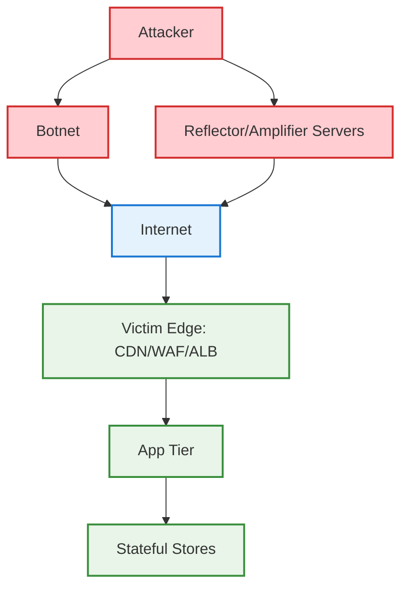
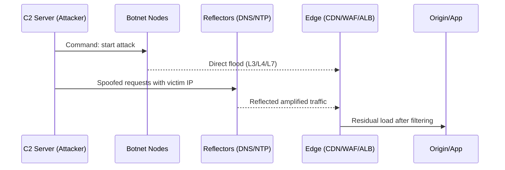
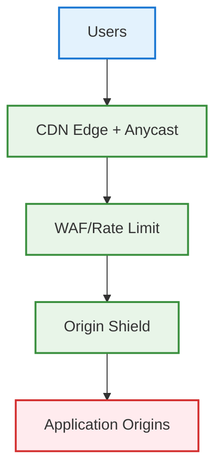
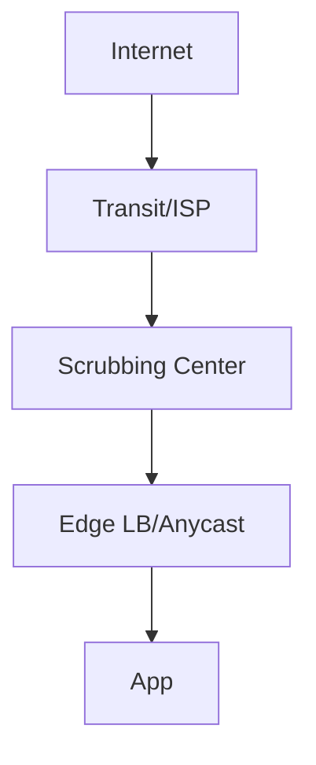
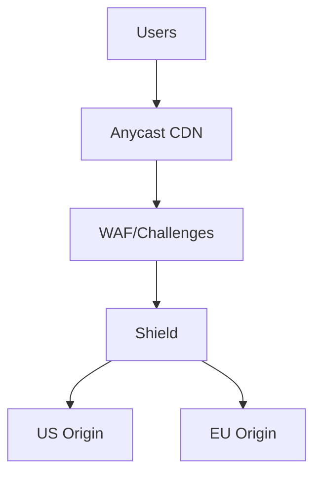

# DDoS (Distributed Denial of Service)

## 📋 Table of Contents

1. [DDoS Fundamentals](#ddos-fundamentals)
2. [Attack Taxonomy](#attack-taxonomy)
3. [How DDoS Attacks Work](#how-ddos-attacks-work)
4. [Detection and Telemetry](#detection-and-telemetry)
5. [Mitigation Strategies](#mitigation-strategies)
6. [Reference Architectures](#reference-architectures)
7. [Operational Playbook](#operational-playbook)
8. [Cost, Limits, and Trade-offs](#cost-limits-and-trade-offs)
9. [Common Interview Questions](#common-interview-questions)

---

## 🔧 DDoS Fundamentals

### What is DDoS?

- **Distributed Denial of Service**: Coordinated flood of traffic from many sources to exhaust a target's resources and render it unavailable
- **Targets**: Network links, firewalls/LB, application servers, stateful services (DB, caches)
- **Goal**: Availability impact, collateral cost, or extortion

### Why DDoS is effective

```text
Asymmetry:
├── Attacker cost low (botnets, reflectors)
├── Victim cost high (egress, scale-up, human time)
└── Protocol quirks (amplification) magnify small effort into large impact
```

### Threat Landscape Overview



> DDoS paths include direct botnets and reflection/amplification via misconfigured servers

---

## 🧭 Attack Taxonomy

### 1) Network/Volumetric (L3/L4)

```text
Examples: UDP floods, TCP SYN floods, ICMP floods, reflection/amplification (NTP, DNS, Memcached)
Impact: Link saturation, state exhaustion on LB/firewall, connection backlog overflow
Signals: High PPS/Gbps, skewed proto/port distribution, spoofed IPs
```

### 2) Protocol/State Exhaustion (L4/L7 overlap)

```text
Examples: TCP SYN/ACK imbalance, TLS handshake floods (CPU-heavy), connection table exhaustion
Impact: Device state depletion (firewalls, proxies)
Signals: Many half-open connections, high handshake rate, low successful completes
```

### 3) Application Layer (L7)

```text
Examples: HTTP GET/POST floods, cache-busting (unique query strings), heavy endpoints (search, export)
Impact: CPU/db load, cache miss storms, thread pool exhaustion
Signals: High RPS from diverse IPs, low cache hit, elevated 5xx/latency
```

---

## 🔍 How DDoS Attacks Work



```text
Amplification factors (approx):
├── DNS (~28x), NTP monlist (~556x), SSDP (~30x), Memcached (up to >10,000x)
└── Spoofed source IP makes blocking harder without BCP38 at ISPs
```

---

## 📈 Detection and Telemetry

```text
Data sources:
├── NetFlow/sFlow/IPFIX (L3/L4 volume, top talkers)
├── CDN/WAF logs (L7 paths, status, user-agents)
├── LB metrics (SYN backlog, TLS handshakes, RPS)
├── Host metrics (CPU, worker concurrency, GC pauses)
└── Synthetic monitoring & RUM (latency/availability)

Signals & thresholds:
├── Sudden PPS/Gbps surge beyond 95th baseline
├── Cache hit drops sharply while RPS spikes
├── Handshake errors increase; 5xx/latency climb
└── Geographic skew or new ASNs dominate traffic
```

---

## 🛡️ Mitigation Strategies

### Network/L4 Mitigations

```text
├── Anycast + CDN fronting to absorb/deflect volumetric
├── Upstream scrubbing centers / provider DDoS protection
├── Rate limiting at edge (PPS/RPS caps) and connection limits
├── SYN cookies, reduce timeouts; drop invalid/fragmented packets
└── Geo/ASN-based filtering for attack hotspots
```

### L7/Application Mitigations

```text
├── WAF managed rules (bot signatures, anomaly scoring)
├── Challenge/JS/CAPTCHA for suspicious clients
├── Cache everything safe; serve stale on revalidate/error
├── Request shaping: circuit breakers, queue limits, token buckets
└── Endpoint hardening: avoid heavy N+1 endpoints, paginate/search caps
```

### Architectural Techniques

```text
├── CDN in front of app; high TTL for static, short TTL + SWR for HTML
├── Origin shield and tiered cache to prevent stampedes
├── Auto-scaling with sane upper bounds; load-shed gracefully
├── Multi-region active-active; failover with health/latency routing
└── Backpressure: 429s, exponential retry hints
```

---

## 🧱 Reference Architectures

### 1) CDN + WAF + Origin Shield



### 2) Scrubbing Center in-Path



> Scrubbing centers divert/clean traffic before it reaches the edge

---

## 🧰 Operational Playbook

```text
Preparation:
├── Subscribe to provider DDoS/WAF managed protections
├── Run game-days; document runbooks and escalation
├── Set rate limits, circuit breakers, and quotas
└── Pre-provision scrubbing/Anycast/CDN and test failover

During attack:
├── Identify layer(s) impacted (L3/4 vs L7)
├── Enable stricter WAF/challenges; raise rate limits cautiously
├── Adjust cache policies (serve stale, cache-bust protections)
├── Geo/ASN blocks if clear hotspots; prioritize false-positive review
└── Communicate status; protect control-plane access

After attack:
├── Forensics: top IPs/ASNs, methods, effectiveness of rules
├── Update signatures, automate detections, tune thresholds
└── Postmortem with action items and verification dates
```

---

## 💸 Cost, Limits, and Trade-offs

```text
Costs:
├── DDoS protection tiers, scrubbing bandwidth, WAF/edge request fees
├── Scale-out infra and cross-region data transfer
└── Human time for triage and hardening

Limits/Trade-offs:
├── Aggressive rules → false positives (lost revenue/UX)
├── CAPTCHA/challenges → UX friction, accessibility concerns
├── Over-scaling → runaway cost; under-scaling → outage
└── Geo/ASN blocks → collateral damage for roaming users/VPNs
```

---

## ❓ Common Interview Questions

### Q1. How do you distinguish L3/4 from L7 DDoS quickly?

```text
Check: PPS/Gbps vs RPS, SYN backlog, handshake errors, cache hit, path skew.
If infra shows saturation before app metrics move → L3/4. If specific routes 5xx/slow → L7.
```

### Q2. Design a DDoS-resilient edge for a global web app

```text
Use Anycast CDN + WAF + origin shield. Cache static long, HTML short with SWR. Apply rate limits and bot management.
Provision provider DDoS protection/scrubbing. Multi-region origins with health-based routing.
```



### Q3. What’s your approach to HTTP flood on a cache-busting route?

```text
Actions:
├── Add cache key normalization (ignore irrelevant query params)
├── Increase TTL; enable SWR/SIE; edge redirect spammy patterns
├── Rate limit per IP/token; challenge suspicious agents
└── Optimize endpoint (pagination, index, precompute)
```

### Q4. How do SYN cookies help against SYN floods?

```text
They avoid allocating state on SYN; state is only created after valid ACK including the cookie.
Reduces half-open connection table exhaustion on L4 devices.
```

### Q5. What signals trigger automatic mitigation?

```text
Sudden PPS spike + low cache hit + handshake failures; abnormal UA/ASNs; region-specific surges.
Automation flips stricter WAF modes, tightens rate limits, and enables scrubbing.
```

### Q6. How to prevent origin stampede during L7 attack?

```text
Tiered cache + shield; serve-stale; collapse forwarding (dedupe concurrent misses); queue length caps; shed load early with 429 + Retry-After.
```

### Q7. Trade-offs of CAPTCHA/JS challenges?

```text
Pros: blocks basic bots cheaply. Cons: UX friction, accessibility issues, bypassable by farms.
Use risk scoring to minimize exposure (only challenge medium/high risk).
```

### Q8. How do you protect APIs and auth endpoints?

```text
JWT-based rate limits, device fingerprinting, IP/ASN reputation, strict WAF on /login,/signup.
Separate pools/LB for auth to isolate impact; exponential backoff on failed attempts.
```

---

> This page focuses on patterns you can bring up in interviews: classify the attack, show layered defenses, justify trade-offs, and include operational steps.
