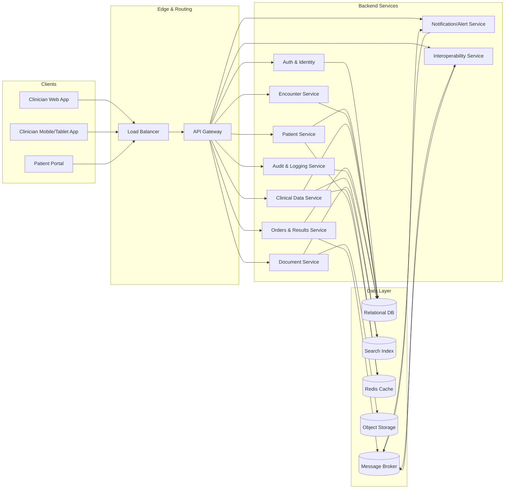
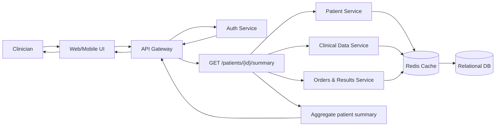
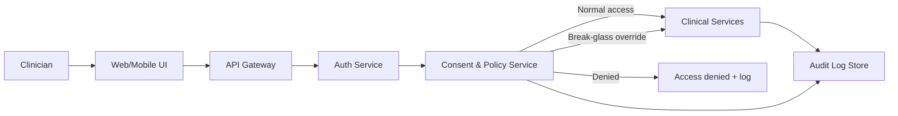
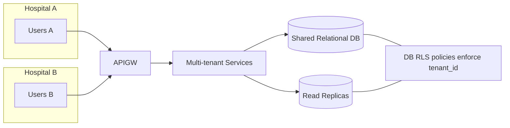
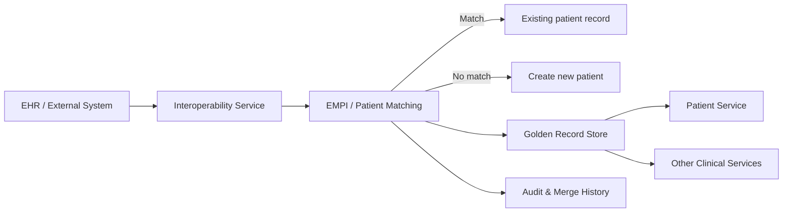

# High-Level Design: Electronic Health Record (EHR) System

## 1. Problem Statement & Goals

Design an EHR (Electronic Health Record) system for hospitals/clinics that:

- Stores and manages patient medical records over time.
- Supports clinicians (doctors, nurses, staff) in viewing and updating patient data.
- Ensures safety and compliance (privacy, security, auditability).
- Scales to multiple hospitals/clinics and millions of patients.

Assume a multi-tenant, cloud-hosted system serving multiple mid-sized hospitals.

---

## 2. Requirements

### 2.1 Functional Requirements

- **Patient management**
  - Create/update patient demographics.
  - Search patients by name, MRN, identifiers.
  - View longitudinal patient chart.

- **Clinical data**
  - Record and view: diagnoses/problems, allergies, medications, vitals, lab results, imaging reports, clinical notes.
  - Maintain encounter/visit history (inpatient/outpatient/ER).

- **Orders and results**
  - Place orders for labs, imaging, and medications.
  - Track order status and show results when available.

- **Access control**
  - Different views and permissions for doctors, nurses, admins, billing, etc.

- **Auditability**
  - Log who accessed or modified which patient record, when, and what changed.

- **Nice-to-have**
  - Clinical decision support (alerts for allergies/drug interactions).
  - Patient portal for viewing own records.
  - Interoperability via healthcare standards (e.g., HL7/FHIR).

### 2.2 Non-Functional Requirements

- **Availability:** ≥ 99.9%.
- **Consistency:** Strong consistency for core clinical data (orders, meds, notes).
- **Performance:**
  - View patient chart: p95 < 500–800 ms.
  - Save orders/notes: < 1–2 seconds.
- **Security & compliance:**
  - Encryption at rest and in transit.
  - Fine-grained authorization and detailed audit logs.
  - HIPAA-like compliance.
- **Scalability:**
  - Millions of patients, tens of thousands of concurrent users.
- **Reliability:**
  - Regular backups, DR, multi-AZ deployment.

---

## 3. High-Level Architecture

### 3.1 Components

- **Clients**
  - Web app for clinicians.
  - Mobile/tablet app.
  - (Optional) Patient portal.

- **API Gateway**
  - Single entry point for all clients.
  - Handles authentication, authorization, rate limiting, request routing.

- **Backend Services**
  - **Auth & Identity Service**
  - **Patient Service** – demographics, identifiers.
  - **Encounter Service** – admissions, visits.
  - **Clinical Data Service** – problems, allergies, medications, notes.
  - **Orders & Results Service** – lab/imaging/medication orders and results.
  - **Document Service** – scanned documents, images, PDFs.
  - **Audit & Logging Service** – access and change logs.
  - **Notification/Alert Service** – clinical alerts, reminders.
  - **Interoperability Service** – FHIR/HL7 integration.

- **Datastores**
  - **Primary relational DB** (Postgres/MySQL)
    - Strongly consistent store for core EHR data.
  - **Search index** (Elasticsearch/OpenSearch)
    - Full-text search over notes and documents.
  - **Object storage** (S3/GCS)
    - Large files: imaging reports, scanned documents.
  - **Cache** (Redis)
    - Frequently accessed data (patient summaries, recent labs).

- **Messaging & Async Processing**
  - **Message broker** (Kafka/RabbitMQ)
    - Async tasks: indexing, audit events, notifications, interoperability.

- **Infrastructure**
  - Load balancers, API gateway.
  - Container orchestration (e.g., Kubernetes).
  - Monitoring, logging, metrics.

### 3.2 High-Level Architecture Diagram

---

## 4. Conceptual Data Model

- **Patient**
  - `patient_id`, name, DOB, gender, contact info.
  - Identifiers: MRN, national ID, insurance ID, `tenant_id`.

- **User / Provider**
  - `user_id`, name, role (doctor/nurse/admin/billing), specialty, `tenant_id`.

- **Encounter**
  - `encounter_id`, `patient_id`, `tenant_id`, type (inpatient/outpatient/ER), start/end, location.

- **Problem / Diagnosis**
  - `problem_id`, `patient_id`, code (ICD/SNOMED), status (active/resolved), onset date.

- **Allergy**
  - `allergy_id`, `patient_id`, allergen, reaction, severity, status.

- **Medication / Prescription**
  - `med_id`, `patient_id`, drug code (RxNorm), dosage, route, frequency, start/end, prescribing provider.

- **Order**
  - `order_id`, `patient_id`, `encounter_id`, type (lab/imaging/med), status.

- **Result / Observation**
  - `result_id`, `order_id`, test code (LOINC), value, units, reference range, status.

- **Clinical Note**
  - `note_id`, `patient_id`, `encounter_id`, author, timestamp, note type, text.

Use coding standards (ICD/SNOMED, LOINC, RxNorm) and optionally map to FHIR resources (Patient, Encounter, Condition, MedicationRequest, Observation, AllergyIntolerance, etc.).

---

## 5. Key APIs & Workflows

### 5.1 Example APIs

- **Patient**
  - `GET /v1/patients/{id}`
  - `GET /v1/patients?name=&dob=&mrn=`
  - `POST /v1/patients`
  - `PUT /v1/patients/{id}`

- **Encounter**
  - `GET /v1/patients/{id}/encounters`
  - `POST /v1/patients/{id}/encounters`

- **Clinical Data**
  - `GET /v1/patients/{id}/summary`
  - `GET /v1/patients/{id}/problems`
  - `GET /v1/patients/{id}/medications`
  - `GET /v1/patients/{id}/labs`
  - `POST /v1/patients/{id}/notes`

- **Orders & Results**
  - `POST /v1/patients/{id}/orders`
  - `GET /v1/orders/{id}`
  - `GET /v1/patients/{id}/results`

### 5.2 Key Flows

- View chart: `GET /patients/{id}/summary` + tabbed detailed calls.
- Place order: `POST /patients/{id}/orders` + async updates from lab.
- Write note: auto-save drafts, version final notes.

### 5.3 View Patient Chart Flow

---

## 6. Security, Privacy & Compliance

- **Auth**
  - OAuth2/OIDC, SSO with hospital IdP.

- **AuthZ**
  - RBAC (doctor, nurse, admin, billing), tenant scoping.

- **Data protection**
  - Encryption at rest and in transit.
  - Least privilege; no PHI/PII in plaintext logs.

- **Audit & compliance**
  - Append-only audit logs for every access/change.
  - Break-glass (emergency access) with extra logging.
  - Data retention policies and regular backups.

### 6.1 Consent & Break-Glass Flow

---

## 7. Scalability, Performance & Reliability

- **Scalability**
  - Read replicas and caching (Redis).
  - Search index for full-text.
  - Sharding by tenant or patient when needed.
  - Async processing for heavy tasks (indexing, notifications, integration).

- **Reliability & Ops**
  - Multi-AZ deployment, automated failover.
  - Snapshots, PITR for DB.
  - Monitoring/alerting on latency, error rates, SLAs.

### 7.1 Tenant Isolation & RLS Overview

---

## 8. Interoperability & Edge Cases

- **Interoperability**
  - FHIR APIs (Patient, Observation, Condition, MedicationRequest, etc.).
  - HL7 v2 for ADT, lab, radiology interfaces.
  - Integration service/interface engine for mapping and retries.

- **Edge cases**
  - Concurrent edits: optimistic locking & conflict resolution.
  - Offline/poor connectivity: secure local cache + sync.
  - Data migration from legacy EHRs.

- **Identity & patient matching**
  - Enterprise Master Patient Index (EMPI) / patient matching (deterministic + probabilistic).
  - De-duplication, identity reconciliation, golden record, linking of external identifiers.

### 8.1 EMPI / Patient Matching Flow

- **Consent & access control**
  - Per-patient consent and consent granularity (what/when/who).
  - Proxy/guardian access rules, emergency "break-glass" flows, and detailed consent/audit logging.

- **Tenancy, isolation & data partitioning**
  - Data residency and tenant isolation model (schema vs DB vs cluster).
  - Row Level Security (RLS) enforcing `tenant_id` on primaries and read replicas.
  - Cross-tenant blast radius mitigation and key separation.

- **Crypto & key management**
  - KMS/HSM-backed keys, BYOK support, key rotation policies.
  - Optional per-tenant CMKs for high-isolation tenants.

- **Schema, versioning & migrations**
  - Strategy for evolving FHIR/resource mappings with backward compatibility.
  - Online schema migrations, feature flags, and data backfill flows.

- **Idempotency & concurrency**
  - Idempotent write APIs (idempotency keys) for orders, notes, and medications.
  - Optimistic locking and conflict resolution for concurrent edits.

- **Retention, legal holds & deletion**
  - Record retention policies, archival strategy, and purge flows.
  - Legal/forensic holds that override normal deletion/retention paths.

- **Audit logging & access to audits**
  - Centralized, append-only audit log store with defined retention.
  - Fine-grained access controls for viewing/exporting audit logs and tamper-evidence.

- **Monitoring, telemetry & security analytics**
  - Metrics, logs, and traces for clinical and infra paths.
  - Security telemetry, anomaly detection, SIEM integration, and automated alerting.

- **Testing & validation**
  - Contract tests for FHIR/HL7 interfaces.
  - Integration tests with labs/Rx, performance tests, and capacity planning.

- **Disaster recovery**
  - RTO/RPO targets per component, backup and restore strategy.
  - DR runbooks, periodic DR drills, warm/cold standby design.

- **Billing & financial integration**
  - Interfaces to billing/claims systems (e.g., X12, FHIR Billing resources).
  - Reconciliation flows between clinical and financial events.

- **Clinical workflow & UX considerations**
  - Order sets, favorites, medication reconciliation, MAR workflows.
  - Templates, smart text, and how UX patterns affect data model and performance.

- **Terminology management**
  - Terminology server, mapping updates, and code system versioning (LOINC, SNOMED, RxNorm).
  - Strategy for rolling out new terminology versions and handling historical codes.

- **Access & session management**
  - Session timeout and inactivity policies; device/session registry.
  - Session revocation, SSO/IdP integration details, and SCIM provisioning.

- **Data export, analytics & de-identification**
  - Pipelines for exporting de-identified datasets for analytics/research.
  - Provenance, governance, and re-identification risk controls.

- **Cost & capacity modelling**
  - Estimates for storage growth (clinical data, imaging, audit logs).
  - QPS and latency targets to guide capacity planning and autoscaling.

- **API governance & rate limits**
  - Per-tenant rate limiting, quotas, and throttling behavior.
  - Backoff strategies and API lifecycle/versioning policies.

- **Legal/compliance mapping**
  - Mapping of controls to HIPAA/GDPR and regional regulations.
  - BAAs, Data Processing Agreements, breach notification and reporting timelines.

