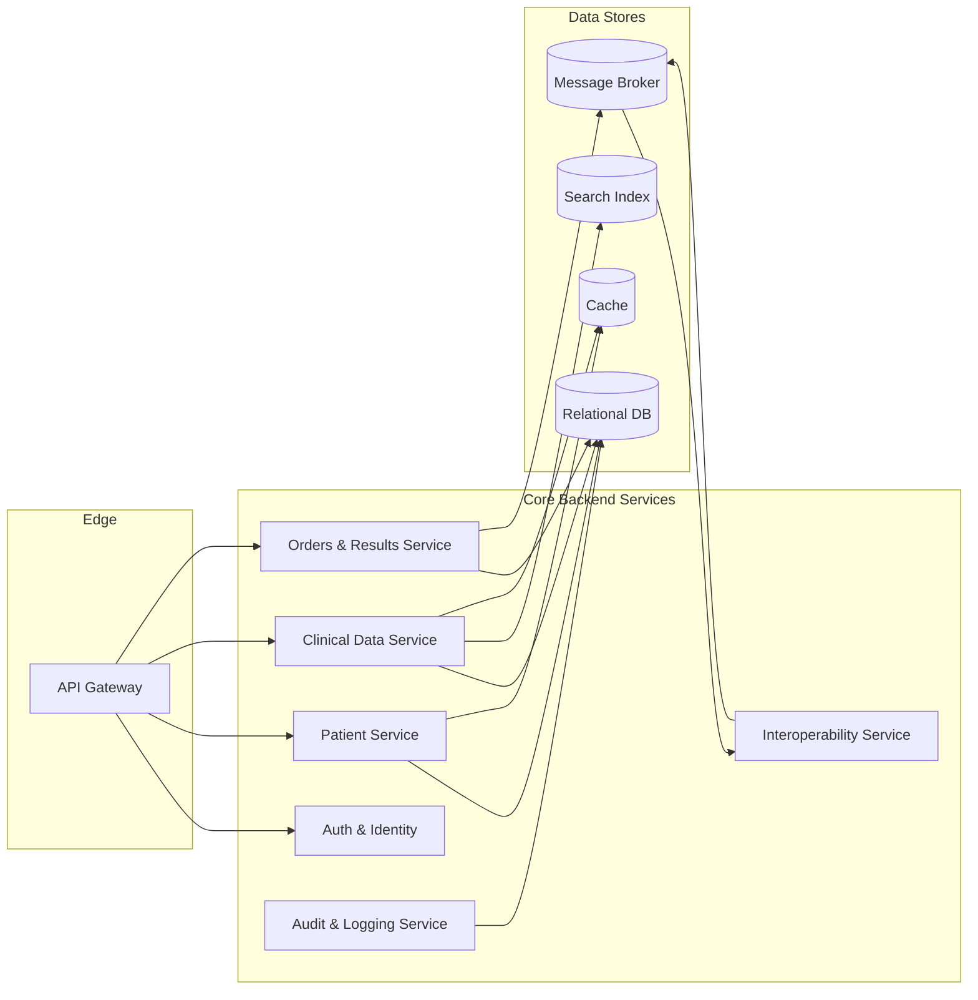
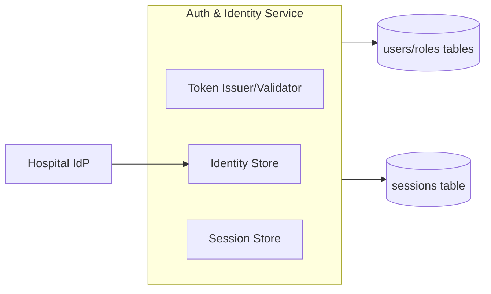
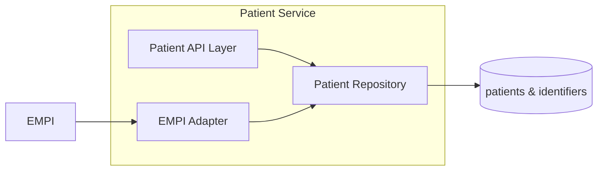
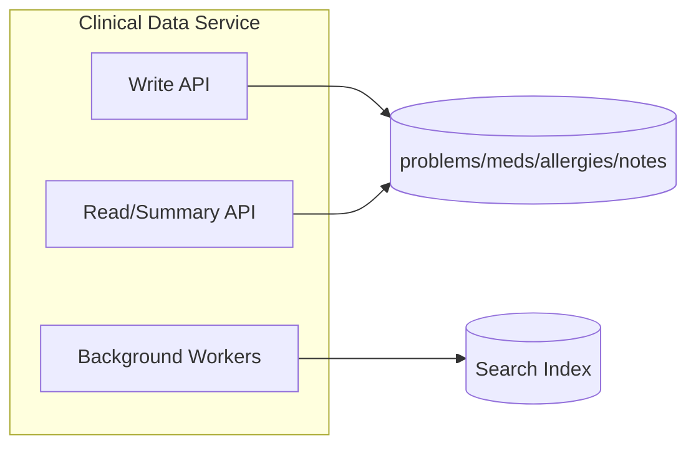
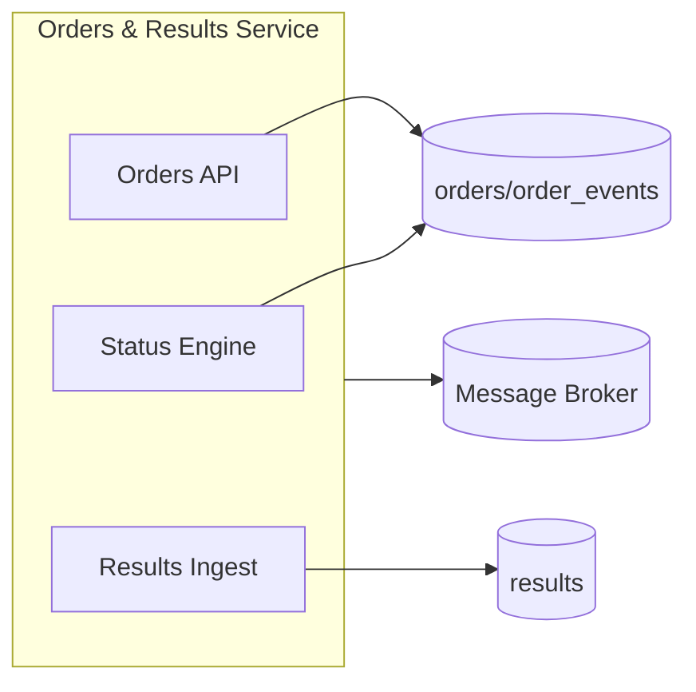
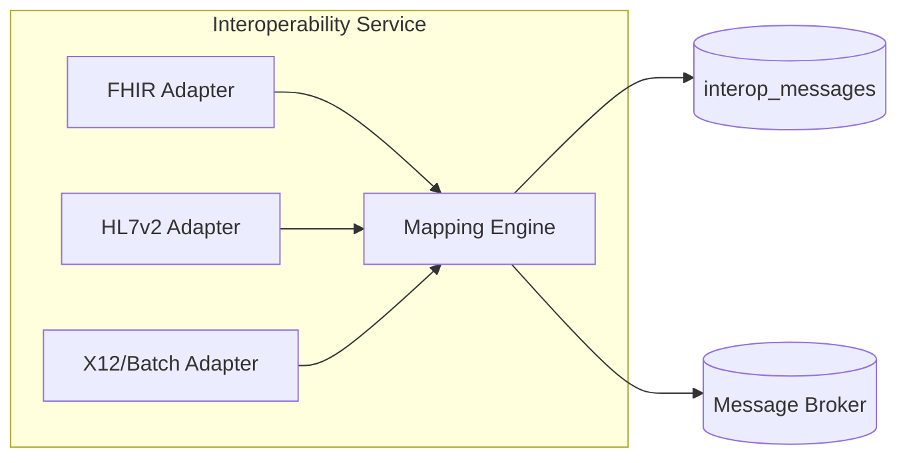
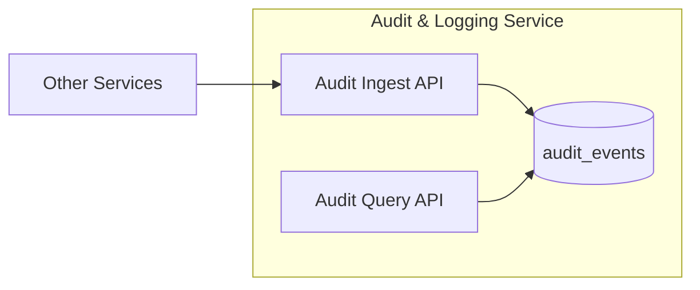
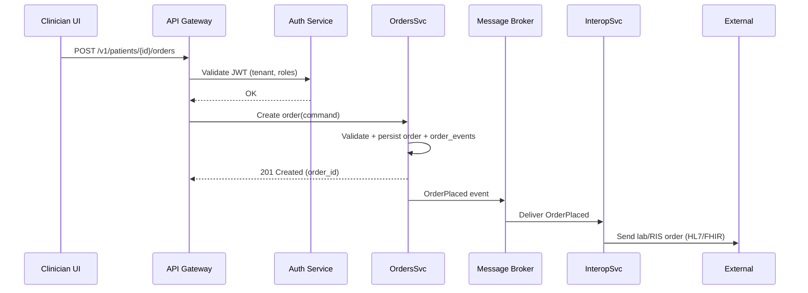
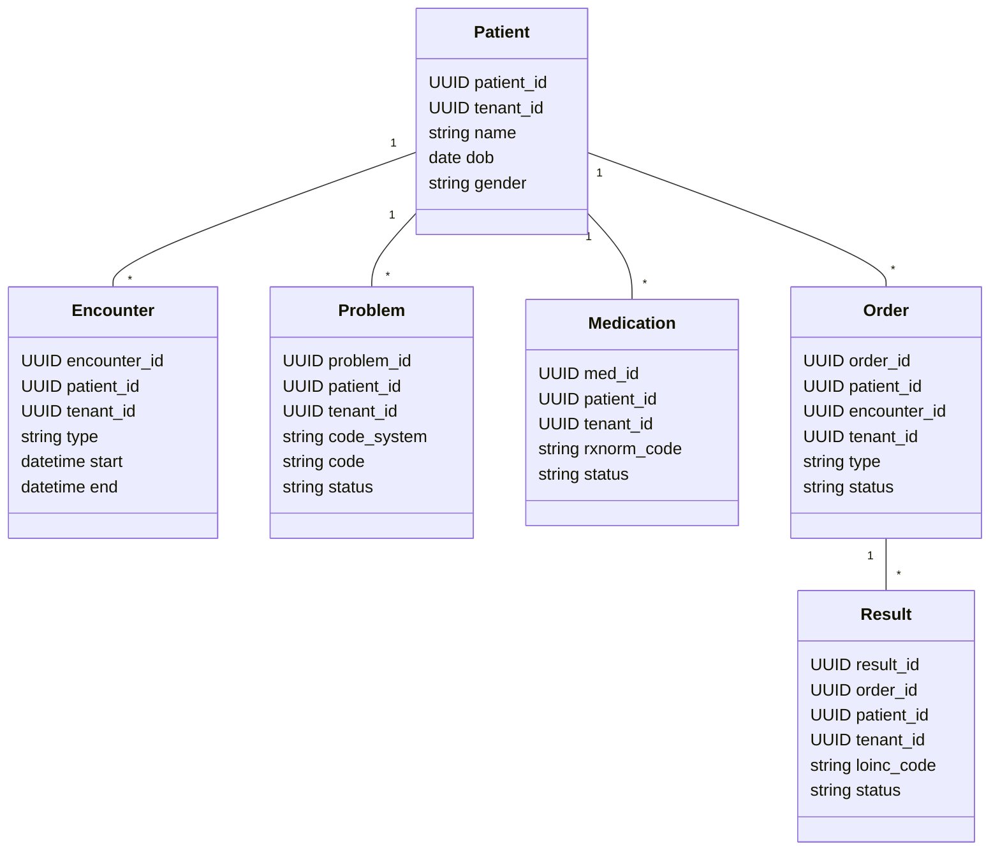

# Low-Level Design: EHR System (Selected Services)

## 0. Core Backend Components Overview



## 1. Auth & Identity Service

- **Responsibilities**
  - Authenticate users (clinicians, admins, service accounts).
  - Issue and validate JWT/OIDC tokens with tenant and role claims.
  - Manage user directory (local or via IdP) and session lifecycle.

- **Internal components**
  - Token issuer/validator.
  - Identity store (link to hospital IdP / LDAP / SSO).
  - Session store (for refresh tokens, device/session registry).

- **Key tables (simplified)**
  - `users(user_id, username, hashed_password, status, tenant_id, created_at, updated_at)`.
  - `roles(role_id, name, description)`.
  - `user_roles(user_id, role_id, tenant_id)`.
  - `sessions(session_id, user_id, device_id, refresh_token_hash, expires_at, revoked_at)`.



## 2. Patient Service

- **Responsibilities**
  - CRUD for patient demographics and identifiers.
  - Provide a canonical patient record per tenant, linked to EMPI golden record.

- **Internal components**
  - Patient API layer (REST/FHIR Patient).
  - Patient repository (relational DB).
  - EMPI adapter (syncs external IDs/golden record from EMPI).

- **Key tables (simplified)**
  - `patients(patient_id, tenant_id, name, dob, gender, contact_info, status, created_at, updated_at)`.
  - `patient_identifiers(id, patient_id, tenant_id, system, value, is_primary)`.
  - `patient_empi_link(patient_id, tenant_id, empi_id, linkage_confidence)`.



## 3. Clinical Data Service

- **Responsibilities**
  - Manage problems, allergies, medications, vitals, notes.
  - Expose APIs for summary view and detailed clinical data.

- **Internal components**
  - Write API (commands) for creating/updating clinical data.
  - Read API for patient summary view (aggregated from multiple tables).
  - Background workers for search indexing and decision support hooks.

- **Key tables (examples)**
  - `problems(problem_id, patient_id, tenant_id, code_system, code, status, onset_date, resolved_date)`.
  - `medications(med_id, patient_id, tenant_id, rxnorm_code, dose, route, frequency, start_date, end_date, status)`.
  - `allergies(allergy_id, patient_id, tenant_id, allergen_code, reaction, severity, status)`.
  - `notes(note_id, patient_id, encounter_id, tenant_id, author_id, note_type, body, created_at, updated_at, version)`.



## 4. Orders & Results Service

- **Responsibilities**
  - Accept and manage orders (lab, imaging, medication) and track lifecycle.
  - Receive results from external systems and attach to orders/patient chart.

- **Internal components**
  - Orders API (place/cancel/modify orders).
  - Results ingest pipeline (from Interoperability Service via broker).
  - Status engine (updates order state machine, notifies clinicians).

- **Key tables (simplified)**
  - `orders(order_id, patient_id, encounter_id, tenant_id, type, status, placer_id, order_code, created_at, updated_at)`.
  - `order_events(id, order_id, tenant_id, from_status, to_status, event_type, event_payload, created_at)`.
  - `results(result_id, order_id, patient_id, tenant_id, loinc_code, value, units, reference_range, status, observed_at, received_at)`.



## 5. Interoperability Service

- **Responsibilities**
  - Translate between internal models and external standards (FHIR, HL7 v2, X12).
  - Handle inbound/outbound messages for labs, imaging, billing, other EHRs.

- **Internal components**
  - Protocol adapters: FHIR REST, HL7 v2 (over MLLP), batch file/X12.
  - Mapping engine (field mappings, code translations, validation).
  - Retry & dead-letter handling using the message broker.

- **Key data artifacts**
  - Mapping configs (e.g., JSON/YAML) for each trading partner.
  - Message logs: `interop_messages(message_id, direction, partner_id, protocol, status, retries, payload_location, created_at)`.
  - Error DLQ topics/queues for failed messages.



## 6. Audit & Logging Service

- **Responsibilities**
  - Centralize audit events from all services (access and change logs).
  - Provide query interface for compliance and investigations.

- **Internal components**
  - Ingest API (sync or via broker) for structured audit events.
  - Storage layer (append-only store in DB or log-optimized store).
  - Reporting/query layer with strict access control.

- **Audit event schema (logical)**
  - `audit_events(event_id, tenant_id, actor_id, actor_role, patient_id, resource_type, resource_id, action, context, created_at, ip, user_agent, break_glass_flag)`.



## 7. Low-Level View of "Place Order" Flow



## 8. Domain Model Overview (Key Entities)



## 9. Low-Level View of "View Patient Summary" Flow

```mermaid
sequenceDiagram
    participant UI as Clinician UI
    participant APIGW as API Gateway
    participant Auth as Auth Service
    participant Patient as PatientSvc
    participant Clinical as ClinicalSvc
    participant Cache as Cache

    UI->>APIGW: GET /v1/patients/{id}/summary
    APIGW->>Auth: Validate JWT (tenant, roles)
    Auth-->>APIGW: OK

    APIGW->>Cache: Lookup patient summary
    alt cache hit
        Cache-->>APIGW: Summary payload
        APIGW-->>UI: 200 OK (cached summary)
    else cache miss
        APIGW->>Patient: Get patient demographics
        APIGW->>Clinical: Get problems/meds/labs/notes
        Patient-->>APIGW: Patient core data
        Clinical-->>APIGW: Clinical data
        APIGW->>Cache: Store assembled summary
        APIGW-->>UI: 200 OK (fresh summary)
    end
