# How React Works Behind the Browser (React + Vite)

This note explains what actually happens from:

- writing JSX/TSX in a Vite React project
- to the browser loading modules
- to React rendering/updating the DOM efficiently

---

## 1) Big Picture

There are two layers:

- **Vite (tooling layer)**: serves/builds your code so the browser can run it.
- **React + ReactDOM (runtime layer)**: computes UI changes and applies them to the DOM.

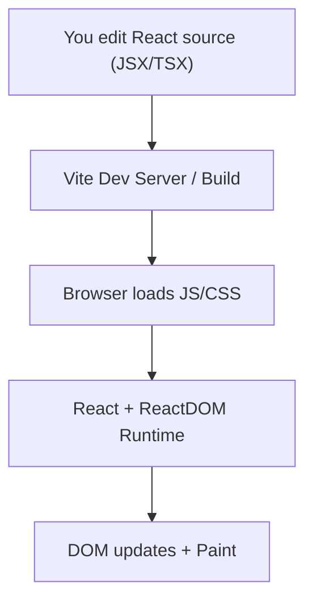

---

## 2) Vite: What the Browser Loads (Dev Mode)

### 2.1 `index.html` is the entry point

In Vite, the browser loads `index.html` first, and it typically includes:

- a root DOM node like `#root`
- a module script like `/src/main.jsx` or `/src/main.tsx`

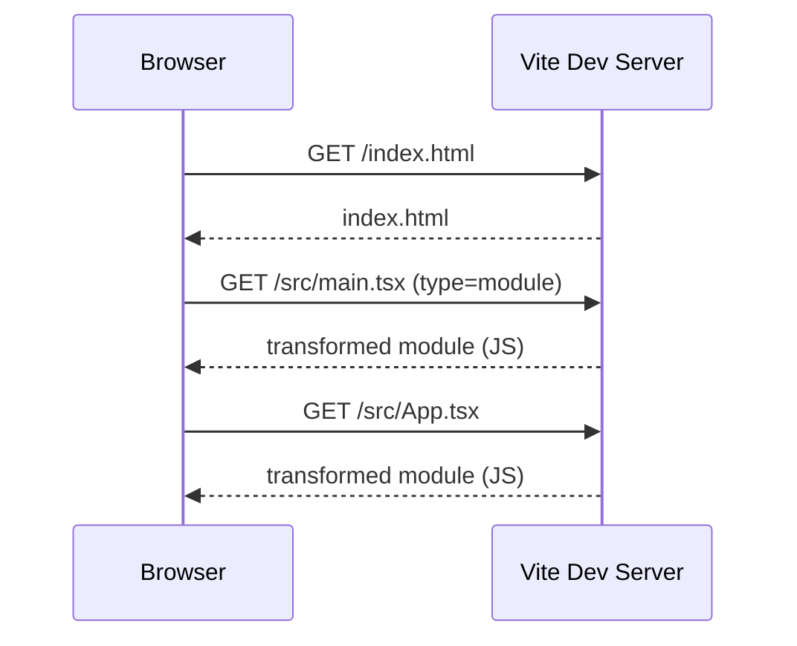

### 2.2 JSX/TSX transform

The browser can’t execute JSX/TSX directly. Vite (with the React plugin) transforms it to JS.

- JSX becomes `React.createElement(...)` (classic) or the **automatic JSX runtime** calls.
- TypeScript types are removed.

### 2.3 Dependency optimization (pre-bundling)

Vite pre-bundles dependencies (like `react`, `react-dom`) so dev startup and reloads are fast.

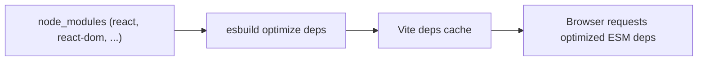

---

## 3) Production Build (What Changes)

In production, Vite builds optimized assets:

- bundles/chunks
- minification
- tree-shaking
- hashed filenames for caching

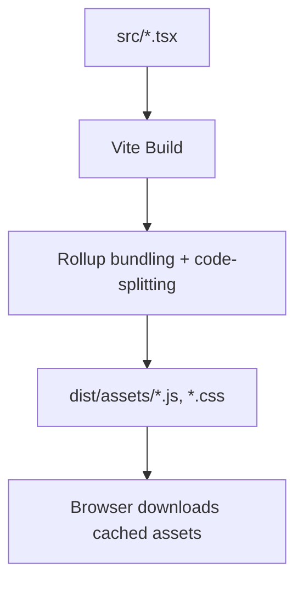

---

## 4) React Runtime: From Components to DOM

### 4.1 Bootstrapping

In React 19, a Vite React app typically starts with:

- `createRoot(document.getElementById('root')).render(<App />)`

This connects:

- **a DOM container** (`#root`)
- **a React element tree** (root element `<App />`)

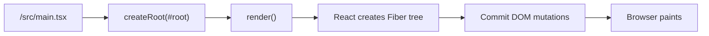

Notes:

- React 19 continues to use the React 18 root API (`createRoot`) in client-rendered apps.
- Frameworks may additionally use server rendering/streaming, but the client bootstrapping pattern is the same.

### 4.2 React Element vs DOM vs Fiber

- **DOM**: real browser objects (`document.createElement`, etc.)
- **React elements**: lightweight JS objects describing what you want
- **Fiber tree**: React’s internal data structure that tracks component state, hooks, and work scheduling

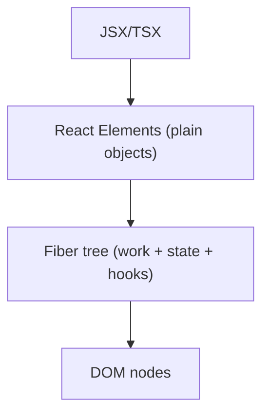

---

## 5) Render Phase vs Commit Phase

React updates happen in two broad phases:

### 5.1 Render phase (compute)

- React calls function components
- evaluates hooks (`useState`, `useMemo`, etc.)
- computes “next UI”
- decides what needs to change (reconciliation)

**No DOM mutations should happen here.**

### 5.2 Commit phase (apply)

- ReactDOM applies DOM mutations (create/update/remove nodes)
- refs are attached
- effects run (timing matters)

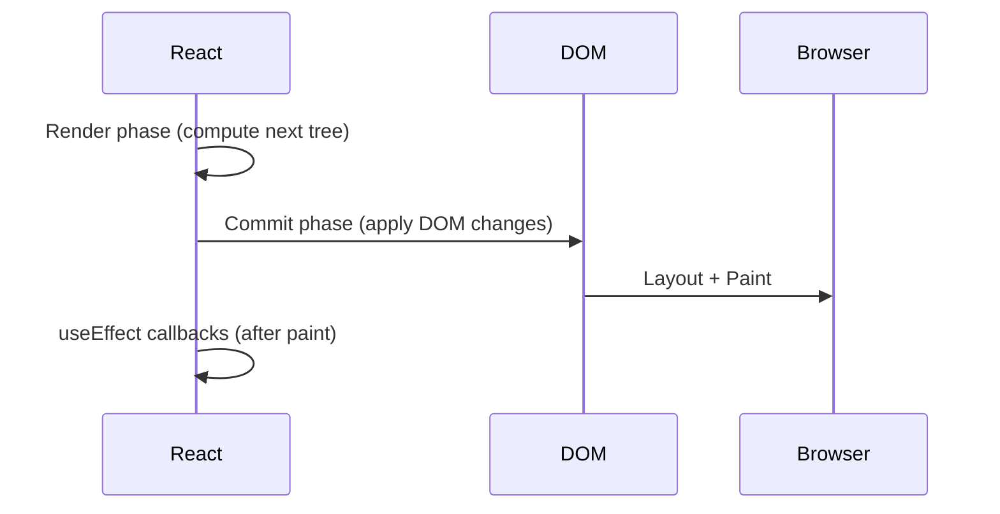

Effect timing (useful mental model):

- `useLayoutEffect`: after DOM mutations, before paint (can block paint)
- `useEffect`: after paint (non-blocking for first paint)

---

## 6) Reconciliation: How React Decides What Changed

React does not do a naive “deep diff” of the entire UI.

Common rules:

- **Same component type at the same position**: React tries to reuse it (state preserved).
- **Lists need stable `key`** so React can match items across renders.

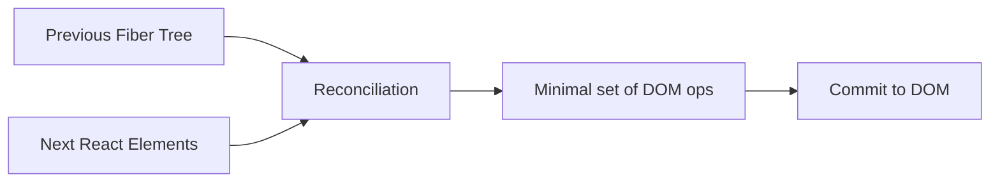

---

## 7) State Updates: What Happens When You Call `setState`

Example:

- user clicks a button
- your handler calls `setCount(c => c + 1)`

What happens conceptually:

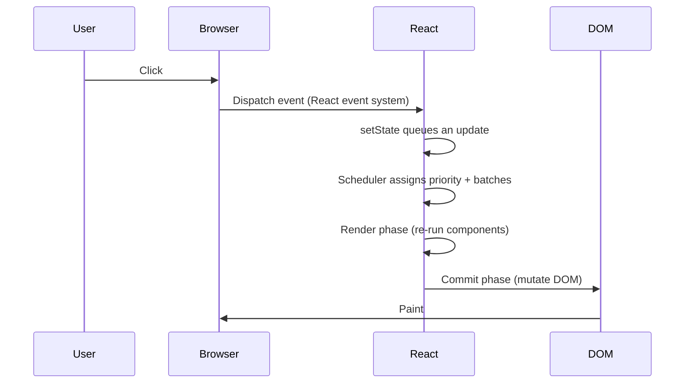

Notes:

- React (including React 19) often **batches** multiple updates in the same tick/event.
- Updates may have different priorities (especially with concurrent rendering).

---

## 7.1 React 19: Actions, `use()`, and Suspense (What’s New)

React 19 adds/standardizes patterns that impact how “work behind the browser” is scheduled and how data flows into UI:

- **Actions**: a first-class way to handle async mutations from UI (commonly used with forms). React can track pending state and coordinate updates more naturally.
- **`use()`**: allows consuming a Promise/context-like value in render and integrates tightly with **Suspense** (render can “wait” by suspending).
- **Suspense-first data flow**: instead of manual loading flags everywhere, React can suspend rendering of a subtree until data is ready and then commit the result.

Conceptual flow when rendering needs async data:

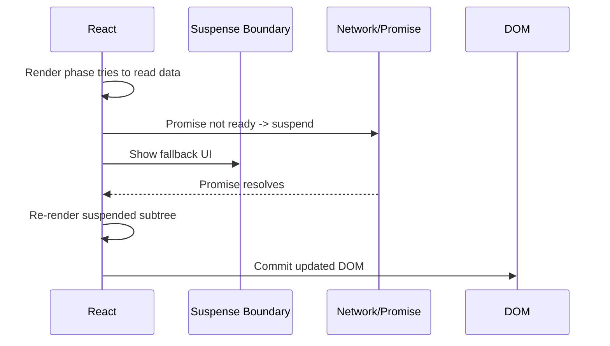

---

## 7.2 React 19 and the React Compiler (How It Relates)

React 19 aligns with a direction where a compiler can reduce the need for manual memoization (`useMemo`, `useCallback`) in many cases.

Practical mental model:

- The **render/commit model does not change**.
- The compiler (when used) can help React avoid unnecessary re-renders by understanding which values actually changed.

---

## 8) Events: Why React Events Feel Different

React generally uses **event delegation**:

- fewer event listeners at the root/container
- React dispatches to your component handlers

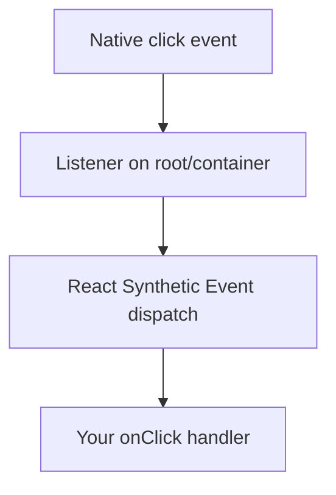

---

## 9) React 18 Concurrency (High Level)

With the modern root API, React (including React 19) can render in a way that keeps the UI responsive:

- split rendering work
- pause/continue work
- prioritize urgent updates

Important invariant:

- React still only mutates the DOM during the **commit phase**.

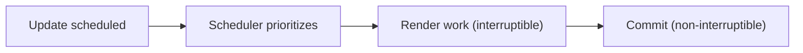

---

## 10) Vite HMR + React Fast Refresh

When you edit a component file in dev:

- Vite detects file change
- sends an HMR update to the browser
- the module is replaced without full reload
- React Fast Refresh re-renders boundaries and often preserves component state

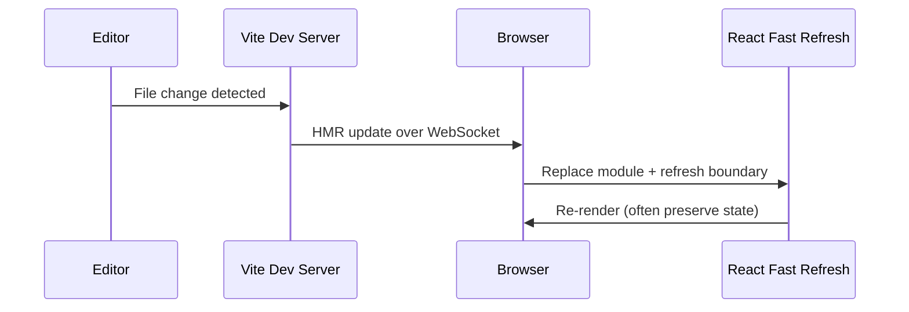

---

## 11) Mental Model Summary

- **Vite** makes the browser able to load your app fast (ESM dev, optimized deps, HMR; bundled production).
- **React** computes UI as a function of state/props.
- **ReactDOM** applies minimal DOM mutations in the commit phase.
- **Fiber** is the internal structure that enables scheduling, state tracking, and efficient updates.
