# Next.js Server Components (RSC) Internals + Flight Protocol

This note explains **how Next.js App Router implements React Server Components (RSC)** and the **Flight protocol**

---

## Glossary

- **RSC (React Server Components)**
  - Components that execute on the server and are **serialized** into a stream the client can understand.
  - Server component code does **not** ship to the browser.
- **Flight**
  - React’s protocol / wire-format for Server Components.
  - The payload is a **structured stream**, not HTML.
- **Fizz**
  - React DOM’s streaming HTML renderer (SSR streaming).
  - Next.js often streams HTML while also streaming/inlining Flight.

> **Fizz vs Flight — key distinction:**
> | | Fizz | Flight |
> |---|------|--------|
> | **Output** | DOM bytes (`<div>...</div>`) | React element graph + module references |
> | **Purpose** | Fast first paint (browser can render immediately) | Reconstruct React tree on client, hydrate client components |
> | **Consumer** | Browser's HTML parser | `react-server-dom-webpack/client` decoder |
>
> *"SSR streaming"* = Fizz (HTML chunks)  
> *"RSC streaming"* = Flight (serialized component tree)

---

## Simplified High-Level Diagram


**Key Takeaways:**
- Server Components run **only on server** — code never ships to browser
- Initial load: **HTML (Fizz) + Flight data** for fast paint + hydration
- SPA navigation: **Flight only** — no HTML, just component tree updates

---

## What Next.js actually sends over the wire

In the App Router, Next.js typically delivers:

- **HTML stream** (Fizz) for immediate paint
- **RSC payload** (Flight) so the client can reconstruct the React tree and hydrate client components

### RSC content-type in Next.js

Next.js uses a dedicated content type so the browser/router can tell “this is Flight, not HTML”.

See:

- `packages/next/src/server/app-render/flight-render-result.ts`
  - `FlightRenderResult` sets `contentType: RSC_CONTENT_TYPE_HEADER`

---

## Core internal flow (server): “HTML + inlined Flight”

The combined render pipeline is easiest to see in:

- `packages/next/src/server/app-render/app-render.tsx`

It does three conceptual things:

1) Starts an **RSC render** (Flight stream)
2) Starts an **HTML render** (Fizz stream)
3) **Inlines** the Flight stream into the HTML response

### Important internal function: `createInlinedDataReadableStream`

See:

- `packages/next/src/server/app-render/use-flight-response.tsx`

What it does:

- Takes the binary Flight stream (`ReadableStream<Uint8Array>`)
- Emits extra `<script>` chunks that push payload pieces into a global array:
  - `self.__next_f = self.__next_f || []`
  - then `.push([type, chunk])`

In the file you can see constants like:

- `INLINE_FLIGHT_PAYLOAD_BOOTSTRAP`
- `INLINE_FLIGHT_PAYLOAD_DATA`
- `INLINE_FLIGHT_PAYLOAD_FORM_STATE`
- `INLINE_FLIGHT_PAYLOAD_BINARY`

This is the concrete “how Flight bytes become something the browser runtime can consume during HTML streaming” mechanism.

---

## Core internal flow (client navigation): “fetch Flight, decode, update router state”

Client-side navigation in the App Router fetches Flight using special headers.

See:

- `packages/next/src/client/components/router-reducer/fetch-server-response.ts`

Key things to notice:

- It enables Flight response by sending:
  - header: `RSC_HEADER: '1'`
- It sends the **current router state tree** so the server can render “from the right place”:
  - header: `NEXT_ROUTER_STATE_TREE_HEADER: prepareFlightRouterStateForRequest(...)`

Decoding:

- It uses the React Flight client:
  - `createFromFetch` / `createFromReadableStream` from `react-server-dom-webpack/client`
- It checks response `content-type` starts with `RSC_CONTENT_TYPE_HEADER`.

Meaning: during SPA navigations, the client is mostly not “parsing HTML”; it’s **decoding Flight**.

---

## Flow diagrams

### 0a) Simplified architecture overview


| Flow | What happens |
|------|--------------|
| **Initial Load** | Server sends HTML + Flight → Browser paints, decodes, hydrates |
| **SPA Navigation** | Browser fetches Flight only → Decodes → Updates UI (no reload) |

---

### 0b) Detailed: Initial Page Load


| Step | From → To | Description |
|------|-----------|-------------|
| 1 | NextServer → Route | Incoming HTTP request hits Next.js server |
| 2 | Route → AppRender | Route matcher finds app route, invokes render pipeline |
| 3 | AppRender → RSC | Execute Server Components (async, can fetch data) |
| 4a | RSC → Flight | Serialize RSC output to Flight stream |
| 4b | RSC → Fizz | Render HTML stream (parallel with Flight) |
| 5 | Flight/Fizz → UseFlightResp | Both streams fed to `createInlinedDataReadableStream()` |
| 6 | UseFlightResp → FlightResult | Combined into `FlightRenderResult` |
| 7 | FlightResult → HTTP | Response sent over network |
| 8 | HTTP → HTML | Browser receives and paints HTML |
| 9 | HTML → NextF | Inline `<script>` tags push chunks to `self.__next_f[]` |
| 10 | NextF → FlightDecode | Flight decoder reads chunks |
| 11 | FlightDecode → ClientComp | Client components hydrated with decoded props |

---

### 0c) Detailed: SPA Navigation (Client-side)


| Step | From → To | Description |
|------|-----------|-------------|
| A | AppRouter → FetchServer | User clicks `<Link />`, triggers `fetchServerResponse()` |
| B | FetchServer → HTTP_RSC | Fetch with headers: `RSC: 1`, `Next-Router-State-Tree` |
| C | HTTP_RSC → FetchServer | Server returns Flight payload (`text/x-component`) |
| D | FetchServer → FlightDecode | Pass response to `createFromFetch()` |
| E | FlightDecode → RouterReducer | Decoded flight data sent to router reducer |
| F | RouterReducer → AppRouter | `normalizeFlightData()` updates router state/cache |
| G | AppRouter → ClientComp | UI re-renders with new data (no full page reload) |

### 1) Initial request (SSR HTML + inline Flight)

```mermaid
%%{init: {'theme': 'base', 'themeVariables': { 'primaryColor': '#bbdefb', 'secondaryColor': '#c8e6c9', 'tertiaryColor': '#ffe0b2', 'noteBkgColor': '#fff9c4', 'noteTextColor': '#333'}}}%%
sequenceDiagram
    participant Browser
    participant NextServer as Next.js Server
    participant AppRender as app-render.tsx
    participant UseFlightResponse as use-flight-response.tsx

    Browser->>NextServer: GET /users
    NextServer->>AppRender: Route match + build loader tree
    
    rect rgba(100, 181, 246, 0.3)
        Note over AppRender: (A) RSC Render (Flight)
        AppRender->>AppRender: serverRenderToReadableStream(RSCPayload, clientModules)
        AppRender-->>AppRender: reactServerResult (Flight stream)
    end
    
    rect rgba(255, 183, 77, 0.3)
        Note over AppRender: (B) HTML Render (Fizz)
        AppRender->>AppRender: react-dom/server.renderToReadableStream(<App />)
        AppRender-->>AppRender: htmlStream
    end
    
    rect rgba(129, 199, 132, 0.3)
        Note over UseFlightResponse: (C) Inline Flight into HTML
        AppRender->>UseFlightResponse: createInlinedDataReadableStream(reactServerResult)
        UseFlightResponse-->>AppRender: inlinedDataStream
    end
    
    NextServer-->>Browser: Streamed HTML + <script> chunks (self.__next_f)
    
    Note over Browser: Paint HTML
    Note over Browser: Read self.__next_f → reconstruct RSC tree
    Note over Browser: Hydrate client components
```



### 2) Client-side navigation (Flight-only fetch)


### 3) Data serialization flow


### 4) What CAN and CANNOT cross the server→client boundary

```mermaid
%%{init: {'theme': 'base', 'themeVariables': { 'primaryColor': '#c8e6c9', 'primaryTextColor': '#1b5e20', 'primaryBorderColor': '#4caf50', 'secondaryColor': '#ffcdd2', 'tertiaryColor': '#fff'}}}%%
flowchart TB
    subgraph Allowed["✅ Serializable (OK)"]
        A1["string, number, boolean, null"]
        A2["Plain objects / arrays"]
        A3["Date (via toISOString)"]
        A4["undefined"]
        A5["React elements from Server Components"]
    end
    
    subgraph NotAllowed["❌ Non-serializable (ERROR)"]
        B1["Functions / callbacks"]
        B2["Class instances"]
        B3["Map, Set, WeakMap"]
        B4["Symbols"]
        B5["DB connections / streams"]
        B6["Circular references"]
    end
```



---

## "How is data parsed?" (the boundary that matters)

There are two different "parsing/serialization" moments:

1) **Server serialization (RSC → Flight)**
   - Server executes server components and produces a Flight stream.
   - Values crossing from Server Components → Client Components must be **serializable**.
2) **Client decoding (Flight → JS values + React elements)**
   - Client uses `react-server-dom-webpack/client` (`createFromFetch` / `createFromReadableStream`).
   - The decoded result contains:
     - server-rendered element structure
     - "client component references" + their props

If you try to pass non-serializable values (functions, class instances, DB handles) as props from server to client, you'll get an RSC serialization error.

---

## Sample example mapped to the internals

### App code

Server component (default in App Router):

```tsx
// app/users/page.tsx
import UsersClient from './UsersClient'

async function getUsers() {
  return [
    { id: 'u1', name: 'Ada' },
    { id: 'u2', name: 'Linus' },
  ]
}

export default async function UsersPage() {
  const users = await getUsers()
  return <UsersClient users={users} />
}
```

Client component:

```tsx
// app/users/UsersClient.tsx
"use client"

export default function UsersClient({
  users,
}: {
  users: { id: string; name: string }[]
}) {
  return (
    <ul>
      {users.map((u) => (
        <li key={u.id}>{u.name}</li>
      ))}
    </ul>
  )
}
```

### What happens internally

- **Server render**
  - `app-render.tsx` builds an `RSCPayload` (the input model for the RSC render) and starts an RSC render stream.
  - That Flight stream includes:
    - a reference to the client module `UsersClient`
    - serialized props `{ users: [...] }`

- **Inlining into HTML (initial load)**
  - `use-flight-response.tsx:createInlinedDataReadableStream(...)` wraps Flight chunks into `<script>` pushes:
    - `self.__next_f.push([INLINE_FLIGHT_PAYLOAD_DATA, chunk])`
    - or base64 for binary chunks

- **Client-side navigation**
  - `fetch-server-response.ts` issues an RSC request (`RSC_HEADER: 1`) and decodes via `createFromFetch`.
  - The decoded Flight response is normalized and applied to the router state.

---

## Key source files to read (Next.js canary)

- **Server: main App Router render pipeline**
  - `packages/next/src/server/app-render/app-render.tsx`
- **Server: inlining Flight into HTML**
  - `packages/next/src/server/app-render/use-flight-response.tsx`
- **Server: response wrapper for Flight**
  - `packages/next/src/server/app-render/flight-render-result.ts`
- **Client: fetching + decoding Flight for navigation**
  - `packages/next/src/client/components/router-reducer/fetch-server-response.ts`
- **Client: App Router component**
  - `packages/next/src/client/components/app-router.tsx`

---


